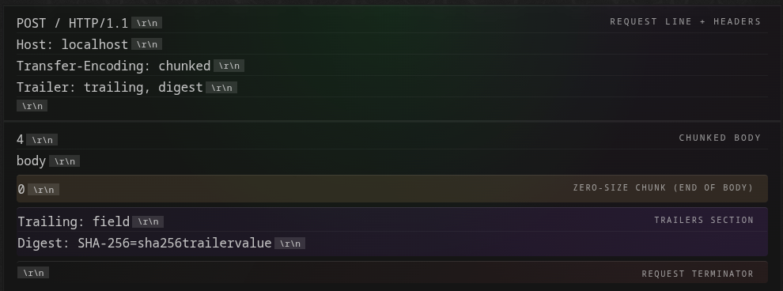
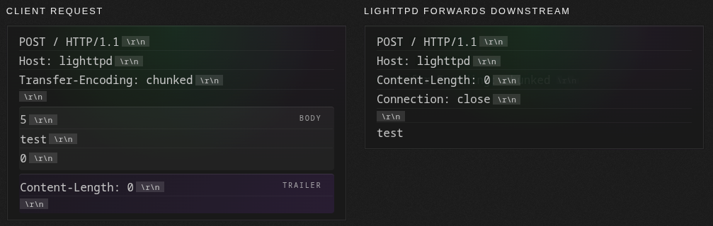
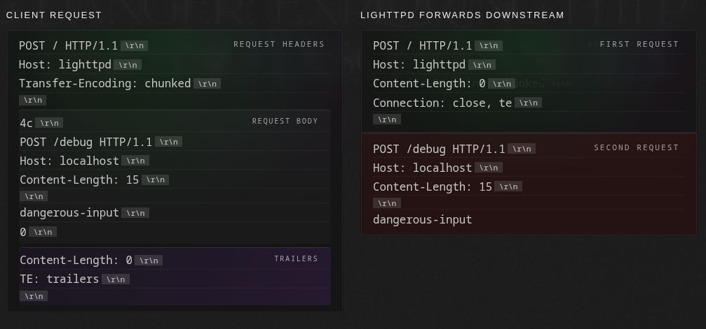
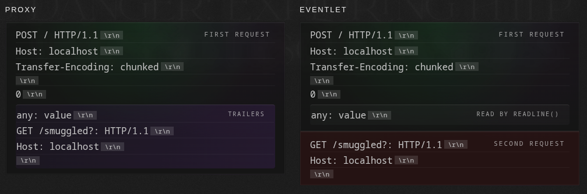
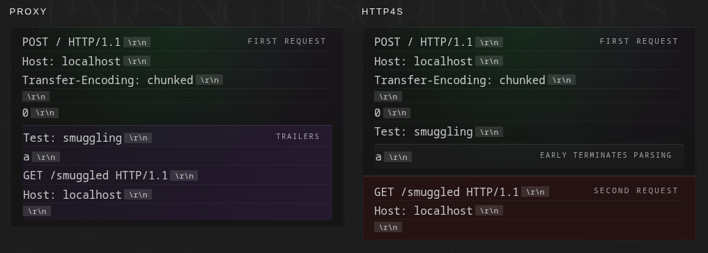
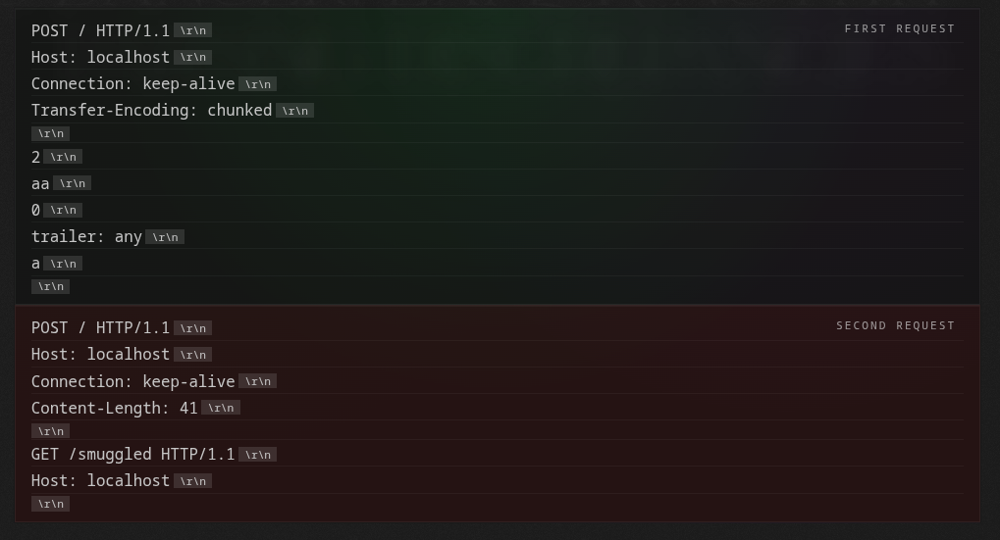
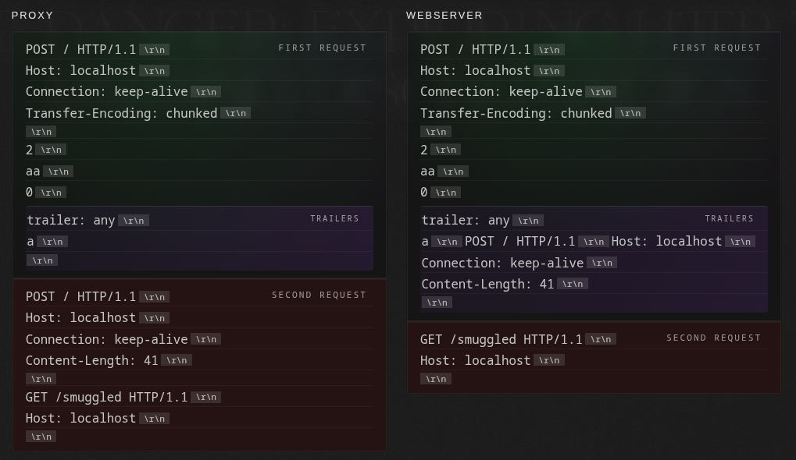

# Trailing Danger: exploring HTTP Trailer parsing discrepancies

> [!summary]+
> > The article \"Trailing Danger\" explores security implications of inconsistent HTTP trailer parsing across various implementations.
> 
> HTTP trailers are additional headers sent after the body in chunked transfer encoding (HTTP/1.1) or as a final HEADERS frame (HTTP/2, HTTP/3). While rarely used, RFC 9112 allows recipients to \"merge\" trailers into the main header section, but warns against unsafe merging of security-sensitive fields.
> 
> Improper trailer merging leads to **HTTP Header Smuggling via Trailer Merge (TR.MRG)**, where attacker-controlled headers from the trailer section are merged into the main headers, overriding or injecting values. This can occur in:
> - **Downstream components**: Allowing access control bypass, injection of unsafe inputs, or cache poisoning, as seen with `X-Forwarded-For` or `Host` header spoofing.
> - **Upstream components**: More severe, as it can manipulate request boundaries by overriding `Content-Length` or `Transfer-Encoding` after initial parsing, enabling **Request Smuggling**.
> 
> Specific vulnerabilities identified include:
> - **TR.MRG in lighttpd1.4**: Overrode `Content-Length` with `0` from trailers, combined with a `Connection` header parsing bug, enabling request smuggling.
> - **Unparsed Trailers**: Some implementations (e.g., Eventlet) completely skipped trailer parsing, treating subsequent lines as new requests.
> - **Early Parsing Termination**: Parsers (e.g., http4s) prematurely stopped, treating subsequent data as a new request.
> - **Hide-Merge-Smuggle**: Exploited ambiguities where invalid trailer headers (missing colon) or malformed line endings could hide the start of a new request within the trailer section.
> 
> The research tested ~70 open-source implementations, finding numerous vulnerabilities, some patched (e.g., fasthttp, lighttpd1.4, http4s) and others pending or deemed \"won't fix\". The author also developed tools `riphttp` (for sending requests with trailers) and `riphttplib` (for protocol security testing) to aid in this research.

With the introduction of chunked transfer encoding in HTTP/1.1, agents gained the ability to send additional headers after the request body, known as trailers or trailer fields. Although rarely used in modern applications, these are defined in the standard and handled inconsistently across HTTP implementations.

With the introduction of chunked transfer encoding in HTTP/1.1, agents gained the ability to send **additional headers after the request body, known as trailers or trailer fields**. Although rarely used in modern applications, these are defined in the standard and handled inconsistently across HTTP implementations.

This post explores the security implications of improper trailer parsing.

The inspiration for this research came from a curious allowance in RFC 9112: the merging of trailer fields into the main header section under certain circumstances.

### Trailers

HTTP trailers are **extra header fields transmitted after the body in chunked transfer encoding** in HTTP/1.1, **or as a trailing `HEADERS` frame** sent after the final `DATA` frame on the same stream in HTTP/2 and HTTP/3. They allow metadata that is available only after the body has been generated, such as checksums, digital signatures, or post-processing results, to be sent without buffering the entire payload in memory.

In HTTP/1.1, trailers can be sent only in chunked encoded requests and responses. The complete format consists of:



The zero-size chunk (`0\r\n`) signals the end of the body, **after which trailer headers appear**, terminated by a blank line.

The `Trailer` header provides a **list of field names** that the sender anticipates sending as trailer fields. A sender that intends to generate trailer fields **should** include `Trailer` in the header section, but the list is only a hint and there is **no guarantee** that the named fields will be present.

Although HTTP trailers are formally defined in the specifications, they are rarely used in practice.
In practice, many intermediaries discard or ignore trailers, but some well-known implementations, such as HAProxy and Envoy, forward them by default across all protocol versions.

According to RFC [9112 §7.1.2](https://www.rfc-editor.org/rfc/rfc9112.html#name-chunked-trailer-section), recipients may selectively retain or discard trailer fields. The same section, however, permits implementations to **merge** trailer fields into the header section

And it explicitly warns against unsafe merging:
> A recipient MUST NOT merge a received trailer field into the header section unless its corresponding header field definition explicitly permits and instructs how the trailer field value can be safely merged. 

Merging stateful or security-sensitive fields such as `Host`, `Content-Length`, or authentication-related headers can fundamentally change how downstream components interpret the message.

### HTTP Header Smuggling via Trailer Merge

Header smuggling exploits **inconsistencies between two HTTP parsers to inject or conceal headers**. Improper **trailer merging** introduces a variant of **HTTP Header Smuggling**, where header fields originating from the request trailer section are merged into the headers, causing downstream components to interpret and act on attacker-controlled headers that were never visible to the initial request parser.

This discrepancy can be used to **inject, override**, or modify headers and effectively smuggle attacker-controlled data past intermediary layers that believed the header section was already finalized.

#### Downstream components

Downstream components are servers or applications positioned after intermediaries in the request processing chain. These are typically backend services that receive requests after they have passed through one or more intermediaries.

Unsafe merging at this level can cause trailer data to override or modify original request headers **before application-level processing**. This may allow attackers to:

- [Access control bypass](../Dev,%20ICT%20&%20Cybersec/Web%20&%20Network%20Hacking/Access%20control%20vulnerabilities.md)

- Inject unsafe inputs into backend logic that trusts request headers

- [Web Cache Poisoning](../Dev,%20ICT%20&%20Cybersec/Web%20&%20Network%20Hacking/Web%20Cache%20Poisoning.md): headers smuggled through trailers can poison cached responses under legitimate cache keys, causing the cache to serve malicious content to subsequent users requesting the same resource.

##### Access control bypass

```http
GET / HTTP/1.1\r\n
Host: localhost\r\n
x-forwarded-for: 127.0.0.1\r\n
\r\n
```

```http
HTTP/1.1 403 Forbidden\r\n
content-length: 93\r\n
cache-control: no-cache\r\n
content-type: text/html\r\n
\r\n
<html><body><h1>403 Forbidden</h1>Request forbidden by administrative rules.</body></html>
```

The backend application **merges** trailer fields into the headers **before the application-level processing**

Consequently, the ACL can be bypassed with the following simple request:

```http
GET / HTTP/1.1\r\n
Host: localhost\r\n
transfer-encoding: chunked\r\n
\r\n
0\r\n
x-forwarded-for: 127.0.0.1\r\n
\r\n
```

```http
HTTP/1.1 200 OK\r\n
server: fasthttp\r\n
date: Mon, 27 Oct 2025 00:22:27 GMT\r\n
content-type: text/plain; charset=utf-8\r\n
content-length: 18\r\n
\r\n
You are localhost!
```

##### Host header spoofing

Imagine a web application that constructs a password reset link using the Host header value:

`reset_link = "https://#{host}/password/update?token=#{token}"`

However, if the backend server merges headers from the trailers section, an attacker can bypass the vhost check by including a `host: attacker.com` header **in the trailers** and perform a [Host Header attacks](../Dev,%20ICT%20&%20Cybersec/Web%20&%20Network%20Hacking/Host%20Header%20attacks.md). 

The backend then uses this attacker-supplied value when generating password reset links, allowing the attacker to send malicious links to victims, such as `https://attacker.com/password/update?token=#{token}`, possibly leading to account takeover.

##### Theoretical attack - Response header injection via trailer merge

Some implementations merge response trailers to make them directly available to clients. Conceptually, this could allow response [Header Fixation](../Dev,%20ICT%20&%20Cybersec/Web%20&%20Network%20Hacking/Header%20Fixation.md) if an attacker can influence response trailers.

#### Upstream components

When trailer merging occurs upstream, the impact can be **more severe**, as attackers may also be able to manipulate request boundaries by [Smuggling](../Dev,%20ICT%20&%20Cybersec/Web%20&%20Network%20Hacking/HTTP%20Request%20Smuggling.md) `Content-Length` or `Transfer-Encoding` headers.

- The attacker sends a request with a trailer section containing `Content-Length: 0`.

- The front-end proxy receives the request and parses the header section. It uses those headers for request delimitation, routing, authorization, and caching decisions.

- The proxy later parses trailers and **unsafely merges** them into the headers. Values already parsed are **overwritten** or modified, creating a **state mismatch** between what the proxy decided and what it forwards.

- The proxy forwards the request to the backend with the merged headers.

- The backend receives the forwarded request with the attacker-supplied `Content-Length: 0` and treats the remaining bytes on the connection as belonging to subsequent requests, potentially enabling request smuggling.

### Trailer Merge (TR.MRG) HTTP Request Smuggling

Trailer Merge (TR.MRG) HTTP Request Smuggling occurs when intermediaries unsafely merge trailers, allowing the override or injection of headers such as `content-length` or `transfer-encoding` **after initial parsing**. This alters downstream request boundaries, enabling injection of additional requests.

#### TR.MRG in lighttpd1.4



This issue is not directly exploitable for smuggling requests on its own, as it adds a `connection: close` header that blocks the parsing of subsequent requests.

#### Connection header parsing bug

Many web servers (about 30% of those tested) only close a connection when they see the **literal** header `connection: close`.

However, [RFC 9110](https://www.rfc-editor.org/rfc/rfc9110#name-connection) allows the `connection` header to carry **multiple**, comma-separated options, which must be parsed as independent tokens.

If the token `close` appears anywhere in that list, the connection **must not persist** (see [RFC 9112](https://www.rfc-editor.org/rfc/rfc9112.html#name-persistence)).

When lighttpd encounters the `TE` or `Upgrade` header, it returns an "ambiguous" `Connection` header with multiple tokens (e.g., `connection: close, te`). If the subsequent server has a flawed connection header parser, the proxy's connection header **won't be interpreted as `close`**, leaving the connection open and **enabling request smuggling**.



In other words, the client sends a single HTTP request to lighttpd, but the downstream server interprets two separate requests on the same connection, with attacker-controlled content in the second one.

### Trailer parsing discrepancies

Beyond trailer merging, other parsing discrepancies can arise in how trailers are parsed.
#### Unparsed Trailers

Eventlet, after reading the chunked body of an HTTP request, completely skipped trailer parsing, only reading the line following the last chunk.

This can create a parsing discrepancy where the front-end server sees only one request with trailers, while eventlet effectively parses two requests on the same connection:



#### Early parsing termination

A bug in http4s caused the trailer parsing to terminate prematurely. The parser would stop if it encountered a line without a colon, failing to wait for the blank line that officially marks the end of the trailer section and the request.


#### Hide-Merge-Smuggle

The following technique exploits a parsing ambiguity that causes parsers to misinterpret the boundaries between separate HTTP requests. It requires two requests: the first one has a trailer section with an invalid header that lacks a colon, while the second one 'hides' another request in its body:



The parser has a bug that allows any character, including `\r\n`, in header names; it parses the header name until a colon is found.

The second request is mistakenly processed as if it were just another trailer field of the first, effectively merging the two requests. The sequence `a\r\nPOST / HTTP/1.1\r\n...` is treated as part of a header name until the colon is encountered, hiding the beginning of the second request inside the trailers. Then the second request’s body is 'revealed' and treated as a separate request.

