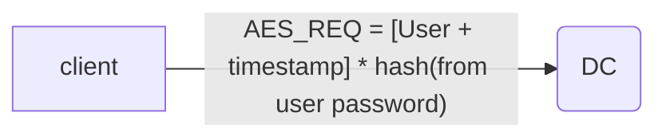
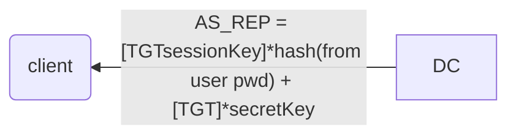

>[!summary]
>Microsoft [Active Directory Domain Services](https://docs.microsoft.com/en-us/windows-server/identity/ad-ds/get-started/virtual-dc/active-directory-domain-services-overview), often referred to as Active Directory (AD), is a service that allows system administrators to update and manage operating systems, applications, users, and data access on a large scale.

## AD Components

- **Domain Controller** (DC): is a Windows 2000-2019 server with the Active Directory Domain Services role installed. Is the core of AD because it stores all information about how the specific instance of Active Directory is configured.

>[!tip]
>There are three different versions of Windows server operating systems.
>1. desktop experience version
>2. [Server Core](https://msdn.microsoft.com/en-us/library/ee391626(v=vs.85).aspx), introduced with Windows Server 2008 R2, is a minimal server installation without a dedicated graphical interface.
>3. [Server Nano](https://docs.microsoft.com/en-us/windows-server/get-started/getting-started-with-nano-server), the most recent version, was introduced in Windows Server 2016 and is even more minimal than Server Core.
>
>The standard “desktop experience” and Server Core editions can function as domain controllers. The Nano edition can not.

- **Domain**: created when an instance of AD is configured. Domain has a name like *[corp.com](http://corp.com/)*, where *corp* is the name of the organization. Within this domain, we can add various types of objects, including computer and user objects.

- **Organizational Units** ([OU](https://technet.microsoft.com/en-us/library/cc978003.aspx)): are comparable to file system folders in that they are containers used to store and group other objects.
- **Objects**: Are the actual "active" elements within the domain. They contain:
→ Computer Objects: represent actual servers and workstations that are *domain-joined* (part of the domain)
→ User Objects: represent employees in the organization.
All AD objects contain attributes, which vary according to the type of object. For example, a user object may include attributes such as first name, last name, username, and password

Typically, client computers on an internal network are connected to the domain controller and to various other internal member servers such as database servers, file storage servers, etc.
In addition, many organizations provide content through Internet-connected web servers, which sometimes are also members of the internal domain.

>[!info]
>An Active Directory environment has a very critical dependency on a Domain Name System (DNS) service. As such, a typical domain controller in an AD will also host a DNS server that is authoritative for a given domain.

---

# Active Directory Authentication

Active Directory supports multiple authentication protocols and techniques and implements authentication to both Windows computers as well as those running Linux and macOS.

Active Directory supports several older protocols including [WDigest](https://technet.microsoft.com/en-us/library/cc778868(v=ws.10).aspx), however modern Active Directory uses either [Kerberos](../Services/Kerberos.md) [^1] or [NTLM authentication](https://msdn.microsoft.com/en-us/library/windows/desktop/aa378749(v=vs.85).aspx) protocols for most authentication attempts.

[^1]: https://technet.microsoft.com/en-us/library/cc780469(v=ws.10).aspx

### NTLM Authentication

NTLM authentication is used when a client authenticates to a server **by IP address** (instead of by [hostname](https://blogs.msdn.microsoft.com/chiranth/2013/09/20/ntlm-want-to-know-how-it-works/)), or if the user attempts to authenticate **to a hostname** that is **not registered** on the **Active Directory integrated DNS** server.
Likewise, third-party applications may choose to use NTLM authentication instead of Kerberos authentication.

Steps:
1. Client calculate a cryptographic hash called **NTLM Hash** *from the **User password***
2. Client sends the username to the server
3. Client receive as response the **Nonce** (also called *Challenge*)
4. Client *encrypts the nonce* using the *NTLM hash* (called **Response**) and sends it to the server
5. Server forward *Username*, *Nonce* and *Response* to the Domain Controller
6. Domain Controller *encrypt* the *Nonce* with the User's *NTLM hash* (DC has every NTLM hash) and **compares the result with the Response**.
7. If the two are equal, the authentication request is successful and it is approved.

### Kerberos Authentication [^2]

[^2]: [Kerberos](../Services/Kerberos.md)

It is the **default authentication protocol** in AD, used as default **from WinServer 2003**.
While NTLM authentication works through a principle of challenge and response, Windows-based Kerberos authentication uses a ticket system.

At a high level, Kerberos client authentication to a service in Active Directory involves the use of a **domain controller in the role of a key distribution center**, or [KDC](https://en.wikipedia.org/wiki/Key_distribution_center).

Steps:
1. Client sends to the DC (also known as **KDC**) an *Authentication Server Request* (**AS_REQ**) composed by the **username** and a **timestamp** *encrypted* using a hash derived from the password.

2. DC use the user's password hash to *decrypt the timestamp*. If it success and the timestamp is not a duplicate (potential reply attack), authentication is successful.
   DC replies with an *Authentication Server Reply* (**AS_REP**), containing a **session key**, *encrypted* using the *password hash*, and a **Ticket Granting Ticket** (*TGT*), which contains *info* about *user* (eg. group memberships, domain, time stamp, IP, session key) and is *encrypted* by a **secret key** known only to the KDC.

>[!tip]
>Once the client has received the session key and the TGT, the KDC considers the client authentication complete.
By default, the TGT will be valid for 10 hours, after which a renewal occurs. This renewal does not require the user to re-enter the password.

When the user wishes to *access resources of the domain* with a **registered service principal name** (SPN), it must again contact the KDC:

1. Client **constructs** a *Ticket Granting Service Request* (**TGS_REQ**), made up by the **current user** and **timestamp**, *encrypted* with* session key*, the **SPN** of the resource and the **TGT**.
   Client -->  `{ [User + timestamp]*TGTsessionKey + SPN + TGT } = TGS_REQ` --> KDC
2. DC checks if the *SPN* exists in the domain and the *TGT is decrypted* using the *secret key*. Session key is extracted and used to *decrypt the username* and the *timestamp*.
   Several checks:
   1. **TGT** must have a **valid timestamp** (no replay, no expired)
   2. **username** from the **TGS_REQ** must **match** the **user** from the **TGT**
   3. **Client IP** needs to **coincide** with the **TGT IP** address
      If every verification succeeds, DC responds with a *Ticket Granting Server Reply* (**TGS_REP**) composed by the **SPN** to which access has been granted, a **session key** to be used between the client and the SPN (*both* SPN and session key are *crypted with the TGT session key*) and a **service ticket** (*username* + *group memberships* + *SPN session key*), *crypted* with the *password hash of the service account* registered with the SPN.
    Client <--  `{ [SPN + SPNsessionKey]*TGTsessionKey + [ServiceTicket]*hash(from ServiceAccount pwd) } = TGS_REP` <-- KDC

Once the authentication process by the KDC is complete and the client has both a *session key* and a *service ticket*, the service authentication begins.

1. Clients sends to the Application Server an *Application Request* (**AP_REQ**), which includes **username** and **timestamp**, *encrypted with the SPN session key*, and the **service ticket**.
   Client -->  `{ [username + timestamp]*SPNsessionKey + ServiceTicket } = AP_REQ` --> Application Server
2. Application Server *decrypts* the *service ticket* using the *service account password hash* and extracts **username** and **session key**. It then uses the latter to decrypt the username from the AP_REQ and checks if the two users check. If they do, request is accepted.
   Before access is granted, the service inspects the supplied group memberships in the service ticket and assigns appropriate permissions to the user, after which the user may access the requested service.