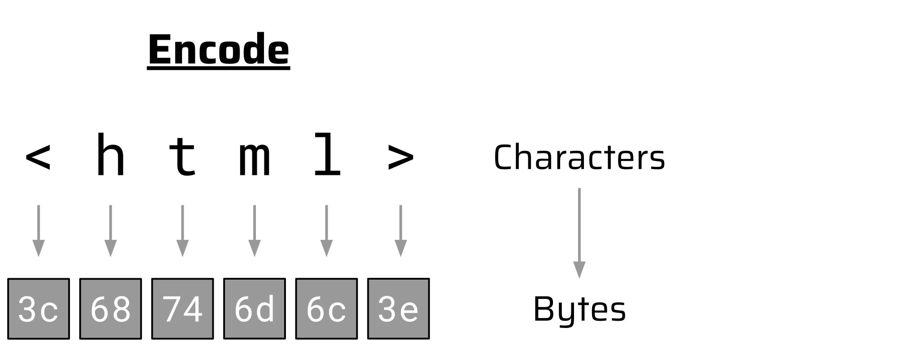

# Character Set vs Encodings

1. Charset is the set of characters you can use (eg. **Unicode**). It is an **abstract list** that matches a character to a number ("A" is the *code point* `U+0041`) 
2. Encoding is _a_ way these characters are stored into memory. It is an algorithm that tells how to translate that code point into bit and bytes.
	1. In UTF-8, `U+0041` is stored into 1 byte as `0x41`
	2. In UTF-16, `U+0041` is stored into 2 bytes as `0x0041`

The **Unicode Standard charset** has multiple encodings, _e.g._, UTF-8, UTF-16, UTF-32, UCS-4, UTF-EBCDIC, [Punycode](https://en.wikipedia.org/wiki/Punycode), and [GB18030](https://en.wikipedia.org/wiki/GB_18030).

**Every encoding has a particular charset associated** with it, **but there can be more than one encoding for a given charset**. A charset is simply what it sounds like, a set of characters. There are a large number of charsets, including many that are intended for particular scripts or languages.

However, we are well along the way in the transition to Unicode, which includes a character set capable of representing almost all the world's scripts. However, there are multiple encodings for Unicode. An encoding is a way of mapping a string of characters to a string of bytes. Examples of Unicode encodings include [UTF-8](http://en.wikipedia.org/wiki/UTF-8), [UTF-16 BE](http://en.wikipedia.org/wiki/UTF-16/UCS-2#Byte_order_encoding_schemes), and [UTF-16 LE](http://en.wikipedia.org/wiki/UTF-16/UCS-2#Byte_order_encoding_schemes) . Each of these has advantages for particular applications or machine architectures.

# The Browser ecosystem
## Content-Type and charset

A common `Content-Type` header in an HTTP response looks like this:
```http
HTTP/1.1 200 OK
Server: Some Server
Content-Type: text/html; charset=utf-8
...
```
 
The `charset` attribute tells the browser that **UTF-8 was used to encode the HTTP response body**. A character encoding like UTF-8 defines a **mapping between characters and bytes**. When a web server serves an HTML document, it maps the characters of the document to the corresponding bytes and transmits these in the HTTP response body. This process turns characters into bytes (*encode*):



When the browser receives these bytes in the HTTP response body, it can translate them back to the characters of the HTML document. This process turns bytes into characters (*decode*):


UTF-8 is only one of **many encodings** that a modern browser must support according to the [HTML spec](https://html.spec.whatwg.org/#character-encodings). There are plenty of others like `UTF-16`, `ISO-8859-xx`, `windows-125x`, `GBK`, `Big5`, etc. [](https://read.readwise.io/read/01j5xbas2wd3y1zn9hdqg85dxt)

## Charset in other places other then headers

>[!question]
>But what if there is no `charset` attribute in the `Content-Type` header or it is invalid?

In that case, the browser looks for a `<meta>` tag in the HTML document itself. This tag can also have a `charset` attribute that indicates the character encoding. [](https://read.readwise.io/read/01j5xbbeb6ehb6a6pmrbhhbya6)

```html
<meta charset="UTF-8">
```

Another, less common way to indicate the character encoding is the [Byte-Order Mark](https://en.wikipedia.org/wiki/Byte_order_mark). This is a specific Unicode character (`U+FEFF`) that can be placed in front of a string to indicate the byte endianness and character encoding [](https://read.readwise.io/read/01j5xbcgg9vv4f74t5qjw7518j). A Byte-Order Mark at the beginning of an HTML document even takes precedence over a `charset` attribute in the `Content-Type` header.[](https://read.readwise.io/read/01j5xbcvfcyypjvjapvnbdkafr)

In summary, there are three common ways that a browser uses to **determine the character encoding** of an HTML document, ordered by priority: [](https://read.readwise.io/read/01j5xbd3pdcymcxfadjhg7nsms)
 1. Byte-Order Mark at the beginning of the HTML document
 2. `charset` attribute in the `Content-Type` header
 3. `<meta>` tag in the HTML document

## Missing charset information

Similar to faulty [HTML](../../Dev,%20ICT%20&%20Cybersec/Dev,%20scripting%20&%20OS/HTML.md) syntax, browsers try to recover from missing character set information when parsing the content served from a web server and **make the best of it**. This non-strict behavior contributes to a good user experience, but it may also **open doors for exploitation techniques** like [mXSS](sonarsource.com%20-%20mXSS%20The%20Vulnerability%20Hiding%20in%20Your%20Code.md). [](https://read.readwise.io/read/01j5xbfcmvxfej8sj9j4zm67f4)

**For missing character information, browsers try to make an educated guess based on the content**, which is called [auto-detection](https://html.spec.whatwg.org/#encoding-sniffing-algorithm:~:text=The%20user%20agent%20may%20attempt%20to%20autodetect%20the%20character%20encoding%20from%20applying%20frequency%20analysis%20or%20other%20algorithms%20to%20the%20data%20stream.). This is similar to [MIME sniffing](../../Dev,%20ICT%20&%20Cybersec/Web%20&%20Network%20Hacking/MIME%20sniffing.md) and the in-famous Windows "Best Fit" (or Best-Fit) behaviour, but operates on a character encoding level. [](https://read.readwise.io/read/01j5xbg0we825xjqfyneas93hj)

# The Windows ecosystem
## The "Best-fit" behaviour

"Best Fit" refers to a specific behavior [^2] in how Windows handles **text encoding** (converting characters). 

When Windows tries to convert complex text (like Unicode) into an older format (like ASCII) [^3] that doesn't support all characters, it tries to find the "best fit" replacement rather than failing or showing an error. [^1]

Examples:
- If you type the infinity symbol (`∞`), Windows might convert it to the number `8`. 
- If you type a strictly accented letter that doesn't exist in the older format, it might replace it with the unaccented version.

If you are looking for the **actual list** of which character transforms into which (e.g., "Where is it written that `∞` becomes `8`?"), this is stored in binary NLS (National Language Support) files inside the Windows `System32` folder.

While there is no single reference listing every mapping, Microsoft publishes the **Code Page Mapping Tables** as text files: [Unicode.org Public Mappings (provided by Microsoft)](https://www.unicode.org/Public/MAPPINGS/VENDORS/MICSFT/)

These files (like `CP1252.TXT`) often contain the "Best Fit" mappings. You will see entries where a specific Unicode character maps to a standard ASCII character that isn't an exact match.
- https://www.unicode.org/Public/MAPPINGS/VENDORS/MICSFT/WINDOWS/CP1252.TXT
- https://www.unicode.org/Public/MAPPINGS/VENDORS/MICSFT/WindowsBestFit/bestfit1252.txt

# Encodings Exploitation

- [PortSwigger Research - Bypassing Character Blocklists With Unicode Overflows](../../Readwise/Articles/PortSwigger%20Research%20-%20Bypassing%20Character%20Blocklists%20With%20Unicode%20Overflows.md)
- [sonarsource.com - Encoding Differentials Why Charset Matters](../../Readwise/Articles/sonarsource.com%20-%20Encoding%20Differentials%20Why%20Charset%20Matters.md)
- [Unicode escaping](../Web%20&%20Network%20Hacking/Evading%20Restrictions.md#Unicode%20escaping)
- [Unicode normalization](../Web%20&%20Network%20Hacking/Evading%20Restrictions.md#Unicode%20normalization)
- [DEVCORE - WorstFit Unveiling Hidden Transformers in Windows ANSI](../../Clippings/DEVCORE%20-%20WorstFit%20Unveiling%20Hidden%20Transformers%20in%20Windows%20ANSI.md)


# Tools for finding encoding variants
- [Unicode Text Converter](../../Readwise/Articles/Intigriti%20-%20Intigriti%20Bug%20Bytes%20224%20-%20May%202025%20🚀.md#^c19e9c)
-  [WorstFit Mapping tool](https://worst.fit/mapping/) 
- https://appcheck-ng.com/wp-content/uploads/unicode_normalization.html
- https://0xacb.com/normalization_table


[^1]: https://learn.microsoft.com/en-us/windows/win32/api/stringapiset/nf-stringapiset-widechartomultibyte
[^2]: [Security Considerations for Character Conversion Functions](https://learn.microsoft.com/en-us/windows/win32/intl/security-considerations--international-features#security-considerations-for-character-conversion-functions)

[^3]: [Decoding the Windows Encodings](../../Clippings/DEVCORE%20-%20WorstFit%20Unveiling%20Hidden%20Transformers%20in%20Windows%20ANSI.md#Decoding%20the%20Windows%20Encodings)
