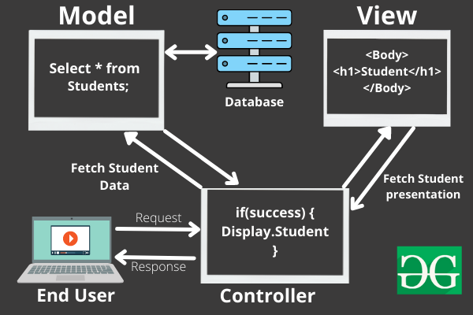

# Model-View-Controller (MVC)

MVC is a software design pattern which divides the source code in three components:
- **Model**: maps data to specific objects and define the logic to process the data
- **View**: is the final output provided to the user, like HTML, XML or other representation. Usually, they implement also templating engines.
- **Controller**: handles input received by the user using routes or parameters



1. The user interacts with a website’s view and the interaction is sent as a request to the controller.
2. The controller parses the user’s interaction and requests the data from the model.
3. The model provides the requested data.
4. The controller renders a view using the provided data and responds back to the user. 
 
This cycle continues as long as the user is interacting with the web application.

# Metadata-driven Design Patterns

A metadata-driven design pattern [^mddp] creates a layer of abstraction in which applications generate the necessary components to manage the data based on the metadata, including those necessary to perform Create, Read, Update, and Delete (CRUD) operations on the data.

[Salesforce](../Cloud/Salesforce.md) [^salesforce] is big proponent of a metadata-driven design.

[^mddp]: https://ebaas.github.io/blog/MetadataDrivenArchitecture/
[^salesforce]: https://www.salesforce.com/

# API conventions

- [Web Services & APIs](../Web%20&%20Network%20Hacking/Web%20Services%20&%20APIs.md)

# HTML attributes vs DOM properties

Attributes and properties are _fundamentally_ different things. You can have an attribute and property of the same name set to different values. 

```html
<div foo="bar">…</div>
<script>
  const div = document.querySelector('div[foo=bar]');

  console.log(div.getAttribute('foo')); // 'bar'
  console.log(div.foo); // undefined

  div.foo = 'hello world';

  console.log(div.getAttribute('foo')); // 'bar'
  console.log(div.foo); // 'hello world'
</script>
```

But there are many other variations and interesting stuff. Read [HTML attributes vs DOM properties](https://jakearchibald.com/2024/attributes-vs-properties/) for more details and examples.