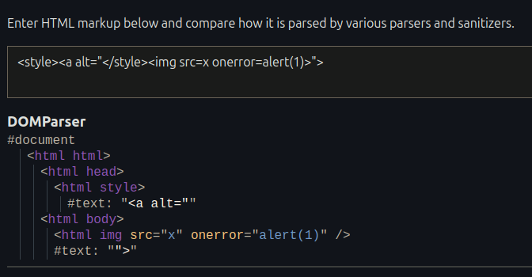

HTML is considered a tolerant language because of its forgiving nature when it encounters errors or unexpected code. Unlike some stricter programming languages, HTML prioritizes displaying content even if the code isn't perfectly written. 

When a broken markup is rendered, instead of crashing or displaying an error message, browsers attempt to interpret and fix the HTML as best as they can, even if it contains minor syntax errors or missing elements. 

>[!example]
>Opening the following markup in the browser `
test` will execute as expected despite missing a closing `p` tag. When looking at the final page’s HTML code we can see that the parser fixed our broken markup and closed the `p` element by itself: `
test
`. 

But how does our HTML parser know in which way to “fix” a broken markup? 
Should `<a><b>` become`<b></b>` or `<a><b></b></a>`? 

To answer this question there is a well-documented [HTML specification](https://html.spec.whatwg.org/), but unfortunately, there are still some ambiguities that result in different HTML parsing behaviors even between major browsers today. 

## Mutation

Mutation in HTML is any kind of change made to the markup for some reason or another.
 - When a parser fixes a broken markup (`
test` → `
test
`), that's a mutation. 
 - Normalizing attribute quotes (`<a alt=test>` → `<a alt=”test”>`), that's a mutation.
 - Rearranging elements (`<table><a>` → `<table></table>`), that's a mutation
 - And so on…

## HTML Parsing Background

### Different content parsing types

 HTML isn't a one-size-fits-all parsing environment. Elements handle their content differently, with seven distinct [parsing modes](https://html.spec.whatwg.org/#elements-2) at play: 

- [void elements](https://html.spec.whatwg.org/#void-elements)
	- `area`, `base`, `br`, `col`, `embed`, `hr`, `img`, `input`, `link`, `meta`, `source`, `track`, `wbr`
 - [the `template` element](https://html.spec.whatwg.org/#the-template-element-2)
	 - `template`
 - [Raw text elements](https://html.spec.whatwg.org/#raw-text-elements)
	 - `script`, `style`, `noscript`, `xmp`, `iframe`, `noembed`, `noframes`
 - [Escapable raw text elements](https://html.spec.whatwg.org/#escapable-raw-text-elements)
	 - `textarea`, `title`
 - [Foreign content elements](https://html.spec.whatwg.org/#foreign-elements)
	 - `svg`, `math`
 - [Plaintext state](https://html.spec.whatwg.org/#plaintext-state)
	 - `plaintext`
 - [Normal elements](https://html.spec.whatwg.org/#normal-elements)
	 - All other allowed HTML elements are normal elements.

We can fairly easily demonstrate a difference between parsing types using the following example:
 1. Our first input is a `div` element, which is a “normal element” element: 
	 `
<a alt="
">`
 2. On the other hand, the second input is a similar markup using the `style` element instead (which is a “raw text”): 
	 `">`
 
 Looking at the parsed markup we can clearly see the parsing differences:

#### Foreign content elements

HTML5 introduced new ways to integrate specialized content within web pages. Two key examples are the `<svg>` and `<math>` elements. These elements leverage distinct namespaces, meaning they follow different parsing rules compared to standard HTML.

Eg. `<svg>">`

In this case, we do see an `a` element being created. The `style` element doesn’t follow the “raw text” parsing rules, because it is inside a different namespace. When residing within an SVG or MathML namespace, the parsing rules change and no longer follow the HTML language. 