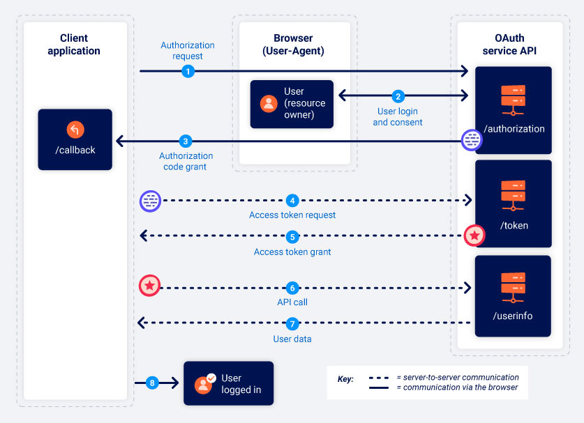
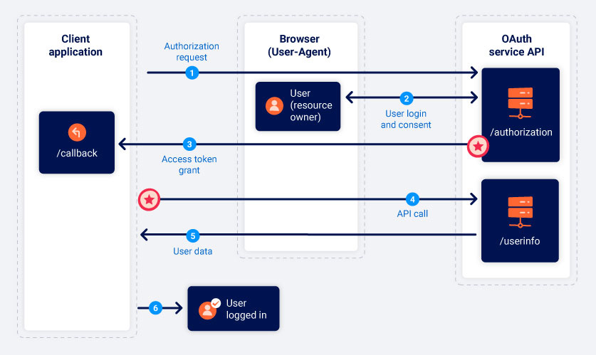

# OAuth 101

>[!question] What is OAuth
>OAuth is a commonly used authorization framework that enables websites and web applications to request limited access to a user's account on another application. Crucially, OAuth allows the user to grant this access without exposing their login credentials to the requesting application.

For example, an application might use OAuth to request access to your email contacts list so that it can suggest people to connect with. However, the same mechanism is also used to provide third-party authentication services, allowing users to log in with an account that they have with a different website. To overcome some common issues, it was invented [OpenID Connect](OpenID%20Connect.md), which extends the basic OAuth protocol to provide dedicated identity and authentication layer.

>[!warning]
>Although OAuth 2.0 is the current standard, some websites still use the legacy version 1a. OAuth 2.0 was written from scratch rather than being developed directly from OAuth 1.0. As a result, the two are very different. Please be aware that the term "OAuth" refers exclusively to OAuth 2.0 throughout these materials.

## OAuth 2.0 components

It works by defining a series of interactions between three distinct parties, namely a client application, a resource owner, and the OAuth service provider.

- **Client application** - The website or web application that wants to access the user's data.
- **Resource owner** - The user whose data the client application wants to access.
- **OAuth service provider** - The website or application that controls the user's data and access to it. They support OAuth by **providing an API** for interacting with both an authorization server and a resource server.

## OAuth 2.0 scopes

For any OAuth grant type, the client application has to specify which data it wants to access and what kind of operations it wants to perform. It does this using the `scope` parameter of the authorization request it sends to the OAuth service.

For basic OAuth, the scopes for which a client application can request access are unique to each OAuth service. As the name of the scope is just an arbitrary text string. When requesting read access to a user's contact list, the scope name might take any of the following forms depending on the OAuth service being used:

```http
scope=contacts
scope=contacts.read
scope=contact-list-r
scope=https://oauth-authorization-server.com/auth/scopes/user/contacts.readonly
```

When OAuth is used for authentication, however, the standardized OpenID Connect scopes are often used instead.

## OAuth 2.0 grant types

There are numerous different ways that the actual OAuth process can be implemented. These are known as OAuth "*flows*", "*grant types*", **response mode** [^response-mode] or **response types** [^grant-types]. 

[^response-mode]: [Response modes](../../Readwise/Articles/Detectify%20-%20Account%20Hijacking%20Using%20“Dirty%20Dancing”%20in%20Sign-in%20OAuth-flows.md#Response%20modes), Detectify

>[!summary] 
>OAuth grant type determines the exact sequence of steps that are involved in the OAuth process. The grant type also affects how the client application communicates with the OAuth service at each stage, including how the access token itself is sent.

There are several different grant types [^grant-types], each with varying levels of complexity and security considerations. We'll focus on the "authorization code" and "implicit" grant types as these are by far the most common. Broadly speaking, those two grant types involve the following stages:

1. The client application **requests access to a subset of the user's data**, specifying which grant type they want to use and what kind of access they want.
2. The **user is prompted to log in to the OAuth service** and explicitly give their consent for the requested access.
3. The **client application receives a unique access token** that proves they have permission from the user to access the requested data. Exactly how this happens varies significantly depending on the grant type.
4. The **client application uses this access token to make API calls** fetching the relevant data from the resource server.

[^grant-types]: [Response types](../../Readwise/Articles/Detectify%20-%20Account%20Hijacking%20Using%20“Dirty%20Dancing”%20in%20Sign-in%20OAuth-flows.md#Response%20types), Detectify
### Authorization code grant type

Process:



1. The client application and OAuth service first use redirects to exchange a series of browser-based HTTP requests that initiate the flow. 
```http
GET /authorization?client_id=12345&redirect_uri=https://client-app.com/callback&response_type=code&scope=openid%20profile&state=ae13d489bd00e3c24 HTTP/1.1
Host: oauth-authorization-server.com
```

This request contains the following noteworthy parameters, usually provided in the query string:
- `client_id`: unique identifier of the client application
- `redirect_uri`: URI to which the user's browser should be redirected when sending the authorization code to the client application. It is also called *callback URI* or *callback endpoint*
- `response_type`: determines which kind of response the client application is expecting and, therefore, which flow (grant type) it wants to initiate. In this case `response_type=code`
- `scope`: specify which subset of the user's data the client application wants to access
- `state`: Stores a unique, unguessable value that is tied to the current session on the client application. This parameter serves as a form of [CSRF token](Session%20Attacks%20and%20Session%20Prediction.md#CSRF%20tokens) for the client application by making sure that the request to its `/callback` endpoint is from the same person who initiated the OAuth flow.

2. Users are redirected to a login page, where they will be prompted to log in to their account with the OAuth provider. They will then be presented with a list of data that the client application wants to access.

>[!note]
>Once the user has approved a given scope for a client application, this step will be completed automatically as long as the user still has a valid session with the OAuth service. The first time the user selects "Log in with social media", they will need to manually log in and give their consent, but if they revisit the client application later, they will often be able to log back in with a single click.

3. If they accept, the client application is granted an "authorization code". Users' browser will be redirected to the` /callback` endpoint that was specified in the `redirect_uri` parameter. The resulting `GET` request will contain the authorization code and, depending on the configuration, it may also send the `state` parameter.

```http
GET /callback?code=a1b2c3d4e5f6g7h8&state=ae13d489bd00e3c24 HTTP/1.1
Host: client-app.com
```

4. The client application then exchanges this "authorization code" with the OAuth service to receive an "access token", which they can use to make API calls to fetch the relevant user data. All communication from this point on takes place in a secure back-channel and, therefore, cannot usually be observed or controlled by an attacker.

```http
POST /token HTTP/1.1
Host: oauth-authorization-server.com
…
client_id=12345&client_secret=SECRET&redirect_uri=https://client-app.com/callback&grant_type=authorization_code&code=a1b2c3d4e5f6g7h8
```

Two new parameters:
- `client_secret`: the client application must authenticate itself by including the secret key that it was assigned when registering with the OAuth service
- `grant_type`: used to make sure the new endpoint knows which grant type the client application wants to use

5. The OAuth service will validate the access token request. If everything is as expected, the server responds by granting the client application an access token with the requested scope.

```json
{
    "access_token": "z0y9x8w7v6u5",
    "token_type": "Bearer",
    "expires_in": 3600,
    "scope": "openid profile",
    …
}
```

6. Now the client application has the access code, it can finally fetch the user's data from the resource server using API call to the OAuth endpoints

```http
GET /userinfo HTTP/1.1
Host: oauth-resource-server.com
Authorization: Bearer z0y9x8w7v6u5
```

7. The resource server should verify that the token is valid and that it belongs to the current client application. If so, it will respond by sending the requested resource i.e. the user's data based on the scope of the access token.

```json
{
    "username":"carlos",
    "email":"carlos@carlos-montoya.net",
    …
}
```

### Implicit grant type

In the implicit grant type the client application receives the access token immediately after the user gives their consent. However, when using the implicit grant type, all communication happens via browser redirects - there is no secure back-channel like in the authorization code flow. This means that the sensitive access token and the user's data are more exposed to potential attacks.

Process:



1. The implicit flow starts in much the same way as the authorization code flow. The only major difference is that the `response_type` parameter must be set to `token`.

```http
GET /authorization?client_id=12345&redirect_uri=https://client-app.com/callback&response_type=token&scope=openid%20profile&state=ae13d489bd00e3c24 HTTP/1.1
Host: oauth-authorization-server.com
```

2. The user logs in and decides whether to consent to the requested permissions or not. This process is exactly the same as for the authorization code flow.

3. The OAuth service will redirect the user's browser to the `redirect_uri` specified in the authorization request. However, instead of sending a query parameter containing an authorization code, it will send the access token and other token-specific data **as a URL fragment** (never sent directly to the client application).

```http
GET /callback#access_token=z0y9x8w7v6u5&token_type=Bearer&expires_in=5000&scope=openid%20profile&state=ae13d489bd00e3c24 HTTP/1.1
Host: client-app.com
```

4. Once the client application has successfully extracted the access token from the URL fragment, it can use it to make API calls to the OAuth service's `/userinfo` endpoint. Unlike in the authorization code flow, this also happens via the browser.

```http
GET /userinfo HTTP/1.1
Host: oauth-resource-server.com
Authorization: Bearer z0y9x8w7v6u5
```

5. The resource server should verify that the token is valid and that it belongs to the current client application.

```json
{
    "username":"carlos",
    "email":"carlos@carlos-montoya.net"
}
```

### OAuth authentication

Although not originally intended for this purpose, OAuth has evolved into a means of authenticating users as well.

For OAuth authentication mechanisms, the basic OAuth flows remain largely the same; the main difference is how the client application uses the data that it receives. From an end-user perspective, the result of OAuth authentication is something that broadly resembles SAML-based single sign-on (SSO).

OAuth authentication is generally implemented as follows:

1.  The user chooses the option to log in with their social media account. The client application then uses the social media site's OAuth service to request access to some data that it can use to identify the user. This could be the email address that is registered with their account, for example.
2.  After receiving an access token, the client application requests this data from the resource server, typically from a dedicated `/userinfo` endpoint.
3.  Once it has received the data, the client application uses it in place of a username to log the user in. The access token that it received from the authorization server is often used instead of a traditional password.

Alternatively, [OpenID Connect](OpenID%20Connect.md) is used to provide authentication fetaures.

# OAuth tools and frameworks

- [oauch.io](https://oauch.io/): OAuch is a compliance testing framework for the OAuth 2.0 protocol. It takes an in-depth look at how an implementation of an OAuth 2.0 authorization server adheres to the standards and mitigates known threats. OAuch generates a report based on the analysis of the tests and identifies potential weaknesses.
- [EsPReSSO 🔝](../Tools/Burpsuite.md#EsPReSSO%20🔝)
- [*OAuth Scan](../Tools/Burpsuite.md#*OAuth%20Scan)

# OAuth vulnerabilities

- [Improper implementation of the implicit grant type](OAuth%202.0%20attacks.md#Improper%20implementation%20of%20the%20implicit%20grant%20type)
- [Flawed CSRF protection](OAuth%202.0%20attacks.md#Flawed%20CSRF%20protection)
- [Leaking authorization codes and access tokens](OAuth%202.0%20attacks.md#Leaking%20authorization%20codes%20and%20access%20tokens)
- [Flawed redirect_uri validation](OAuth%202.0%20attacks.md#Flawed%20redirect_uri%20validation)
- [Stealing secrets via a proxy page](OAuth%202.0%20attacks.md#Stealing%20secrets%20via%20a%20proxy%20page)
- [Scope upgrade](OAuth%202.0%20attacks.md#Scope%20upgrade)