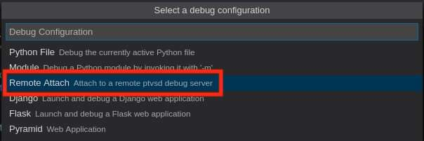

## Versions and environment management

>[!note]
>See also how to use **multiple isolated versions of Python** using [pyenv](../Tools/pyenv.md).

```bash
# create a virtual environemnt named .venv containing the python standalone environment
$ python3 -m venv .venv

# active the virtual environment
$ source .venv/bin/activate

# disable the environment
$ deactivate
```

# Python3 snippets

>[!tip] AWAE snippets
>Pre-built examples and trick available here: https://mlcsec.com/posts/python-awae-prep/

## Basic I/O

```python
input = ""

print("""
Print on
multiple lines!
""")

input = input("Please Subscribe!")
print(f"You replied with {input}")

print(f"You replied with {input}", flush=True) # Debug for web server

print("This is a {} using {}".format('formatter','format'))
```

## argv

```python
from sys import argv
script, param1, param2 = argv
arg2 = argv[2]
```

## argparse

>[!summary]
>- Parser for command-line options, arguments and sub-commands - Python 3.10.5 documentation [^1]
>- Argparse Tutorial - Python 3.10.5 documentation [^2]

[^1]: https://docs.python.org/3/library/argparse.html
[^2]: https://docs.python.org/3/howto/argparse.html

```python
#!/usr/bin/python3
import urllib.parse, argparse

argparser = argparse.ArgumentParser(description="Exploit for OpenCart (Admin) - Authenticated Remote Command Execution (RCE) known as CVE-foo-bar.")

argparser.add_argument("-u", "--url", help="Target URL (e.g. http://192.168.1.100/opencart)", required=True,  default="http://127.0.0.1/opencart")
argparser.add_argument("-path", "--admin_path", help="Path to the admin back-office panel", required=True, default="/admin")
argparser.add_argument("-usr","--username", help="Username having the common/security write-privilege enabled", required=True)
argparser.add_argument("-psw", "--password", help="Password", required=True)
argparser.add_argument("-v", "--verbose", action="store_true", required=False, default=False, help="Verbose mode")

args = argparser.parse_args()

...
$ python3 poc.py
usage: poc.py [-h] -u URL -path ADMIN_PATH -usr USERNAME -psw PASSWORD [-v]
poc.py: error: the following arguments are required: -u/--url, -path/--admin_path, -usr/--username, -psw/--password

$ python3 poc.py -h
usage: poc.py [-h] -u URL -path ADMIN_PATH -usr USERNAME -psw PASSWORD [-v]

Exploit for OpenCart (Admin) - Authenticated Remote Command Execution (RCE) known as CVE-foo-bar.

options:
  -h, --help            show this help message and exit
  -u URL, --url URL     Target URL (e.g. http://192.168.1.100/opencart)
  -path ADMIN_PATH, --admin_path ADMIN_PATH
                        Path to the admin back-office panel
  -usr USERNAME, --username USERNAME
                        Username having the common/security write-privilege enabled
  -psw PASSWORD, --password PASSWORD
                        Password
  -v, --verbose         Verbose mode
```

## Basic statements

```python
# If, else
if x > y:
	...
elif x = y:
	...
else:
	...

# Fuctions
def function(arg1, arg2):
	...
	return val
	
# While
while i < 10:
	...
	break		# Exit from the loop
	...
	continue	# Skip the current iteration
	...
	pass		# Skip the current condition (if)
	
# For
for i in range(1,10):
	...
	break		# Exit from the loop
	...
	continue	# Skip the current iteration
	...
	pass	
	
# Try wxcept
try:
	...
except NullPointer:
	...
```

## Lists, dictionaries and tuples

```python
list = [1,'str1',2,'str2',3,'str3']
element_2 = list[1]

dict = {
	'name' : 'maoutis', 
	'age' : 23, 
	'other' : 'hacking lover'
}
age = dict['age']
dict['isNew'] = 1 # Add new element to the dict
dict = {
	'name' : 'maoutis', 
	'age' : 23, 
	'other' : 'hacking lover',
	'isNew' : 1
}

tuple = (1,'str1',2,'str2',3,'str3')
```

## R/W files

```python
file = open("filename","w") # w or r for string; wb or rb for bytes
# "x" - Create - will create a file, returns an error if the file exist
# "a" - Append - will create a file if the specified file does not exist
# "w" - Write - will create a file if the specified file does not exist
data = file.read()
file.truncate()
file.write("Writing into the file!")
file.seek(0)		# Rewind to the first char
file.write("Writing into the file again from the start!")
file.close()
```

## Class and Objects

```python
class MyClass(object):
	def __init__(self):
		self.name = "MaOutis"
		
	def printName(self):
		print(self.name)

	def add(a,b):
		return a+b
		
person = MyClass()
person.printName()
print(person.name)
```

### `__class__`

The attribute points to the class that the object is an instance of:
>[!tip]
>You can think about `<instance>.__class__` in Python as `<instance>.constructor` in JavaScript.

```python
class Employee: pass # Creating an empty class

emp = Employee()
print(emp.__class__)
#> <class '__main__.Employee'>
```

#### `__class__` attributes

- `__qualname__` is an attribute that contains the class name:

```python
class Employee: pass # Creating an empty class
emp = Employee()

print(emp.__class__.__qualname__)
#> Employee
```

- `__getattribute__` and `__setattr__` are *getter* and *setter* for a class attribute and returns/overwrites the attribute value:

```python
class Employee: pass # Creating an empty class

emp = Employee()
emp.name = "test"
emp.__getattribute__('name')
#> 'test'
emp.name
#> 'test'
emp.__setattr__("name","new val")
emp.name
#> 'new val'
```

-  `__base__` points to the nearest parent class that it’s inheriting from, so if there is an inheritance chain, it will point to the last class that we inherit:

```python
class Employee: pass # Creating an empty class

emp = Employee()
emp
#> <__main__.Employee object at 0x7f9ff0e4f3d0>
emp.__class__
#> <class '__main__.Employee'>
emp.__class__.__base__
#> <class 'object'>
```


---

## Print raw bytes

Python2:

```python
$ python2 -c 'print("\xff")' | hexdump -C
00000000  ff 0a                                             |..|
00000002

$ python2 -c 'import sys;sys.stdout.write("\xff")' | hexdump -C
00000000  ff                                                |.|
00000001
```

Python3:

```python
$ python3 -c 'import sys;sys.stdout.buffer.write(b"\xff")' | hexdump -C
00000000  ff                                                |.|
00000001
```

## Mixing strings and byte-strings

```python
>>> "ABCD".encode("utf-8")
b'ABCD'

>>> b"\x41\x42\x43\x44".decode("ascii")
'ABCD'

# From python 3.5

>>> b'\xde\xad\xbe\xef'.hex()
'deadbeef'

>>> bytes.fromhex('deadbeef')
b'\xde\xad\xbe\xef'
```

## Number conversion

```python
# Define format statically
>>> binary = 0b1010
>>> hexadecimal = "0xa"

# String --> Dec
>>> int("10")
10

# String --> Hex
>>> int("0x12F", base=16)
303

# Int (dec/hex/bin) --> String
>>> str(10)
'10'
>>> str(0b11010010)
'210'

# int (dec) --> String (Hex)
>>> hex(240)
'0xf0'
```

## struct

This module performs conversions between Python values and C structs represented as Python `bytes` objects. This can be used in handling binary data stored in files or from network connections, among other sources. It uses [Format Strings](https://docs.python.org/3/library/struct.html#struct-format-strings) as compact descriptions of the layout of the C structs and the intended conversion to/from Python values [^3].

[^3]: https://docs.python.org/3/library/struct.html

```python
import struct

# pack into a x64 little endian string
struct.pack("<Q",0x1234)
b'4\x12\x00\x00\x00\x00\x00\x00'

# pack into a x64 big endian string
struct.pack(">Q",1234)
b'\x00\x00\x00\x00\x00\x00\x04\xd2'

# pack into a x86 little endian string
struct.pack("<I",0x1234)
b'4\x12\x00\x00'

# pack into a x86 big endian string
struct.pack(">I",0x1234)
b'\x00\x00\x124'

# unpack from a x86 big endian string
struct.unpack(">I",b'\x00\x00\x124')[0]
4660
hex(struct.unpack(">I",b'\x00\x00\x12\x34')[0])
'0x1234'
```

## socket

```python
import socket

host = 127.0.0.1
port = 10099

s = socket.socket(socket.AF_INET, socket.SOCK_STREAM)
connect = s.connect((host, port))
s.recv(1024)
s.send('Data')
s.recv(1024)
s.close()
```

## requests

>[!summary] Documentation
>https://requests.readthedocs.io/en/latest/

```python
import requests

cookies_dict = {"php-console-server":"5", "php-console-client":b64_php_console_client.decode()}
resp = requests.get(url, cookies=cookies_dict)

print(resp.headers["PHP-Console"])
print(resp.content)
print(resp.text)
print(resp.status_code)
print(resp.cookies)

# Multipart / File upload
files = {'file': ("image.jpg", exploit, 'image/jpg')}

url = f'http://{target}:{port}/api/upload'
print(f"Uploading file to {url}")

resp = requests.post(url, files=files, proxies={"http":"http://127.0.0.1:8080"})

# Send JSON data
url = 'http://' + args.ip + ':' + args.port + '/api/login'
payload = {
    "username":f"{args.username}",
    "password":{
        "password":1
    }
}
jsonData = json.dumps(payload)
print(jsonData)
headers = {'Content-type': 'application/json'}
resp = requests.post(url, data = jsonData, headers=headers)

# Manage cookies
s = requests.Session()
resp = s.post(url, data = jsonData, headers=headers)
session = s.cookies.get_dict()
print(session)
resp = s.post(url, data = jsonData, headers=headers, cookies=session)
```

## requirements

```sh
$ pipreqs . --force --ignore plugins,semgrep-rules,code
```
## pwntools

>[!summary]
>pwntools - pwntools 4.8.0 documentation [^4]

[^4]: https://docs.pwntools.com/en/stable/index.html

`pwntools` is a CTF framework and exploit development library. Written in Python, it is designed for rapid prototyping and development, and intended to make exploit writing as simple as possible [^5].

[^5]: https://docs.pwntools.com/en/stable/#

```python
from pwn import *

# Interact with local process
p = process('sp_going_deeper')
# or
elf = pwn.ELF('<nome>')
p = elf.process()

# Interact with remote process
p = remote("46.101.27.51",30934)

# Basic I/O
print(p.recvuntil(b">> ", timeout=1))
p.sendline(p40)
p.recvline()

# Keep session interactive
p.interactive()
```

## decorators

[Diving into Python Decorators](../../Readwise/Articles/Naveen%20Sunkavally%20-%20Unsafe%20at%20Any%20Speed%20Abusing%20Python%20Exec%20for%20Unauth%20RCE%20in%20Langflow%20AI.md#Diving%20into%20Python%20Decorators)

## builtins
<iframe width="1060" height="415" src="https://sadh.life/post/builtins/" title="Python buildins" frameborder="0" allow="accelerometer; autoplay; clipboard-write; encrypted-media; gyroscope; picture-in-picture" allowfullscreen></iframe>

>[!tldr] 
>Dunder methods (also known as magic methods) are special methods that are implicitly invoked by all objects in Python during various operations, such as 
`__str__()`, `__eq__()`, and `__call__()`. They are used to specify what objects of a class should do when used in various statements and with various operators.
>
>Dunder methods have their own default implementation for built-in classes, which we will be implicitly inheriting from when creating a new class, however, developers can override these methods and provide their own implementation when defining new classes.
>
>There are also other special attributes in every object in Python, such as `__class__`, `__doc__`, etc.

---

# Python quirks and tricks

- [`os.path.join`](../../Readwise/Tweets/@0xTib3rius%20on%20Twitter%20-%20Tweets%20From%20Tib3rius.md) [^6][^7]
- `ast` [^8]
- [Abusing Decorators for Remote Code Execution](../../Readwise/Articles/Naveen%20Sunkavally%20-%20Unsafe%20at%20Any%20Speed%20Abusing%20Python%20Exec%20for%20Unauth%20RCE%20in%20Langflow%20AI.md#Abusing%20Decorators%20for%20Remote%20Code%20Execution)
- [Another Path to RCE: Python Default Arguments](../../Readwise/Articles/Naveen%20Sunkavally%20-%20Unsafe%20at%20Any%20Speed%20Abusing%20Python%20Exec%20for%20Unauth%20RCE%20in%20Langflow%20AI.md#Another%20Path%20to%20RCE%20Python%20Default%20Arguments)
# Python 2 vs 3 for binary exploitation

<iframe width="660" height="415" src="https://www.youtube.com/embed/FxNS-zSS7MQ" title="YouTube video player" frameborder="0" allow="accelerometer; autoplay; clipboard-write; encrypted-media; gyroscope; picture-in-picture" allowfullscreen></iframe>

# Remote debug python application

>[!tip] ptvsd
>`ptvsd` [^ptvsd] is a Python debugger package for use with Visual Studio and [Visual Studio Code](../Tools/vscode.md).

[^ptvsd]: https://github.com/microsoft/ptvsd

```python
# By default, ptvsd will start the debugger on port 5678
import ptvsd
ptvsd.enable_attach(redirect_output=True)
print("Now ready for the IDE to connect to the debugger") 
ptvsd.wait_for_attach()
```

From VSCode: 
`debug panel > create a launch JSON file > Remote attach` :

Then fill `host`, `port` and `remoteRoot` with the root application folder on the server:
```json
{
	// Use IntelliSense to learn about possible attributes.
	// Hover to view descriptions of existing attributes.
	// For more information, visit: https://go.microsoft.com/fwlink/?linkid=830387
	"version": "0.2.0",
	"configurations": [
		{
			"name": "Python: Remote Attach",
			"type": "python",
			"request": "attach",
			"port": 5678,
			"host": "<Your_ERPNext_IP>",
			"pathMappings": [
				{
				"localRoot": "${workspaceFolder}",
				"remoteRoot": "/home/frappe/frappe-bench/"
				}
			]
		}
	]
}
```

# Sample python exploit

```python
#!/usr/bin/env python3

# Exploit Title: OpenCart (Admin) - Authenticated Remote Command Execution (RCE)
# Date: asd
# Exploit Author: 0xbro
# Discovery Date: 2023-10-11
# Vendor Homepage: asd
# Software Links : asd
# Version: asd
# Tested on:
# CVE: asd
# Category: WebApps
# Tested on OS: asd

# Writeup: 
# Advisory: 

import argparse
import logging
import validators

DEFAULT_LOGGING_LEVEL = logging.INFO

def parse_arguments():
    argparser = argparse.ArgumentParser(description="Exploit for OpenCart (Admin) - Authenticated Remote Command Execution (RCE) known as CVE-foo-bar.")

    argparser.add_argument("-u", "--url", help="Target URL (e.g. http://192.168.1.100/opencart)", required=True, default="http://127.0.0.1/opencart")
    argparser.add_argument("-path", "--admin_path", help="Path to the admin back-office panel", required=True, default="/admin")
    argparser.add_argument("-usr","--username", help="Username having the common/security write-privilege enabled", required=True)
    argparser.add_argument("-pwd", "--password", help="Password", required=True)
    argparser.add_argument("-v", "--verbose", action="store_true", required=False, default=False, help="Verbose mode")
    
    return argparser.parse_args()

def validate_input(args):
    if not validators.url(args.url):
        raise ValueError("Invalid target URL!")

    if not args.admin_path.strip().startswith("/"):
        raise ValueError("Invalid admin path!")

def exploit():
    pass

def main():
    args = parse_arguments()
    logging_level = DEFAULT_LOGGING_LEVEL
    
    if args.verbose:
        logging_level = logging.DEBUG
    logging.basicConfig(level=logging_level, format="%(asctime)s - %(levelname)s - %(message)s")

    validate_input(args)
    url = args.url.strip()
    admin_path = args.admin_path.strip()
    username = args.username.strip()
    password = args.password.strip()

    exploit()

if __name__ == "__main__":
    main()
```


# Sample Flask Web Server 

```python title:server.py
from flask import Flask, jsonify, send_file
import zipfile, io

app = Flask(__name__)

@app.route('/map.json')
def serve_map():
    # This is where you would define the JSON response or fetch it from a file or database
    response = {
        "maps-0.13.0_0-path": "maps",
        "maps-0.13.0_0":
        [
            { 
                "name": "hextree-android_continent", 
                "size": "812K", "time": "2024-02" },
        ]
    }
    return jsonify(response)

@app.route('/map.zip')
def map_archive():
    # TODO: create malicious ZIP file
    return "mock zip"

if __name__ == '__main__':
    app.run(debug=True, port=1234)
```

Flask snippet for exploiting SSRF and redirection tricks: [From Blind SSRF to Full Read](../../Readwise/Articles/assetnote.io%20-%20Digging%20for%20SSRF%20in%20NextJS%20Apps.md#From%20Blind%20SSRF%20to%20Full%20Read)

[^6]: [Path Traversal in OpenSource HTB box](../../Play%20ground/CTFs/OpenSource.md#Path%20Traversal)

[^7]: [Analysis of CVE-2023-37474 in CopyParty](../../Readwise/Articles/0xdf%20-%20Analysis%20of%20CVE-2023-37474%20in%20CopyParty.md)

[^8]: [Naveen Sunkavally - Unsafe at Any Speed Abusing Python Exec for Unauth RCE in Langflow AI](../../Readwise/Articles/Naveen%20Sunkavally%20-%20Unsafe%20at%20Any%20Speed%20Abusing%20Python%20Exec%20for%20Unauth%20RCE%20in%20Langflow%20AI.md)
