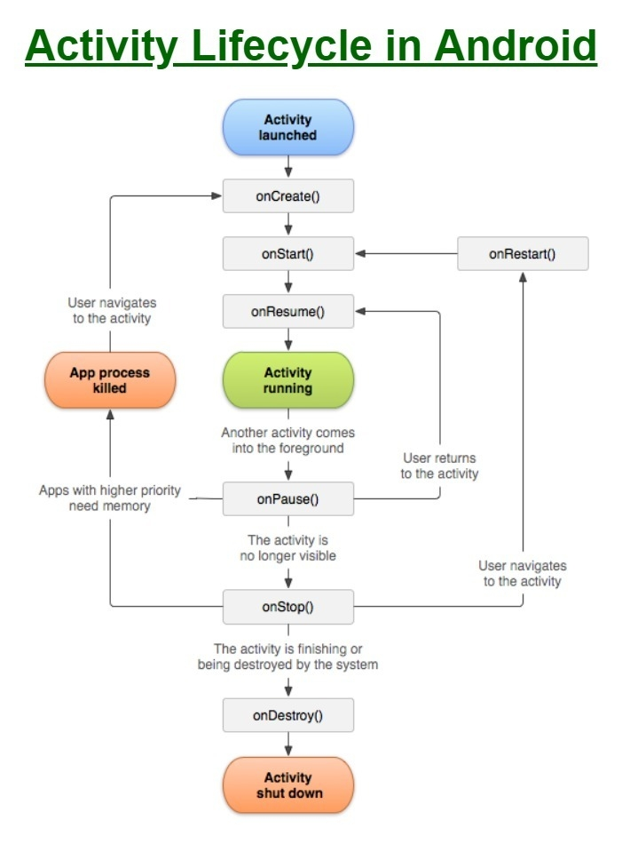

### Activity
An [activity](https://developer.android.com/reference/android/app/Activity)  s nothing more than a **representation of a single GUI screen** that a user can see and interact with. For example, an address book activity might be the screen that shows you the details of a number, while a second activity might be the one that allows you to search for a particular contact.

The activities are managed by the system through specific methods. Below the flow representing the life cycle of an activity.

