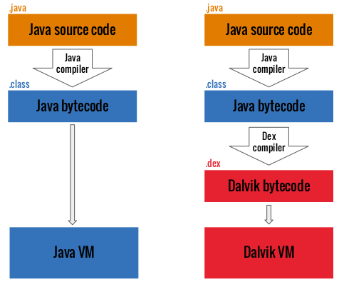
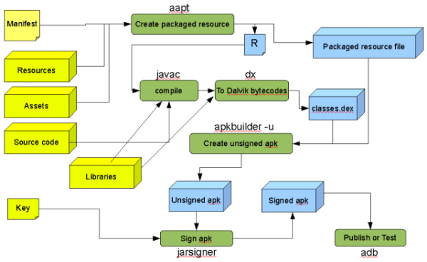
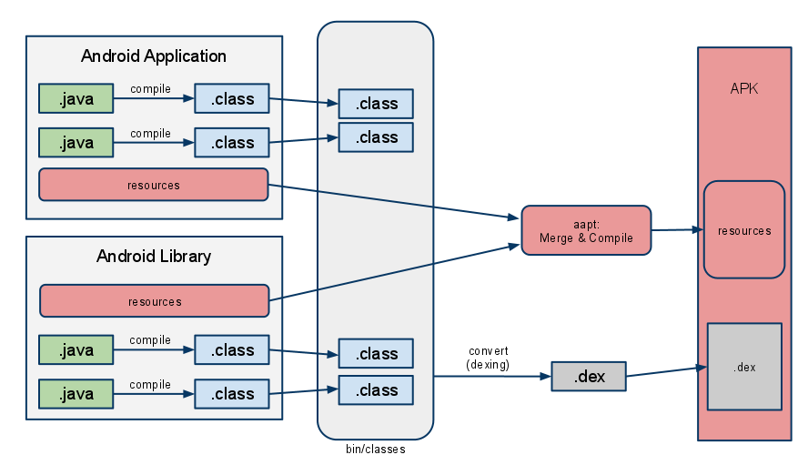
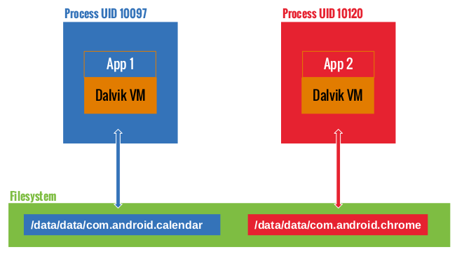
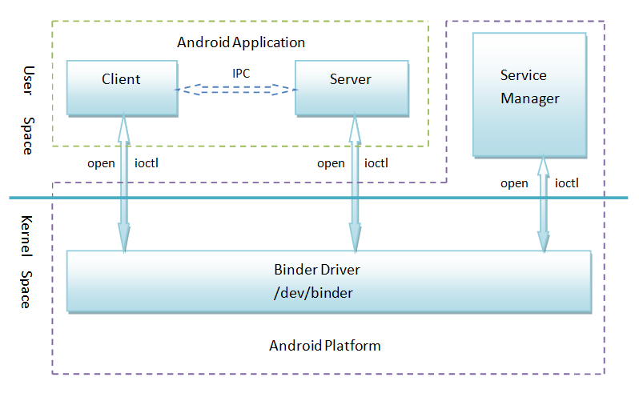
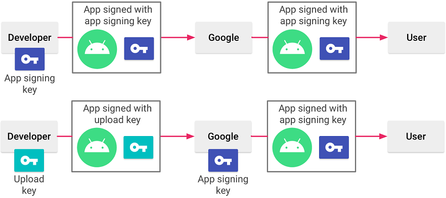
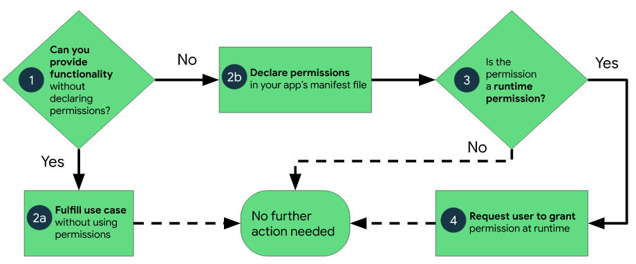

# Types of application

- **Native:** These are the "traditional" applications, developed with client-side programming languages (e.g. Java, Swift, Objective-C, etc.) and are often specific to the platform on which they are to run, with the aim of making the most of the hardware and APIs for which they were designed.
- **Mobile Web apps:** They are non-native applications, written in web languages (HTML, CSS, JavaScript, etc.) and imported into the app through specific components, such as *web-views*. Their functioning is practically identical to that of a traditional website, with the difference that they are optimized to work on mobile devices. Often the same code can be imported on different platforms, making integration easier.
- **Hybrid:** As the name implies, these are the applications that combine your aforementioned types.
- **Cross platform**: written with external libraries that made them run on multiple devices.

>[!warning]
>Correctly identifying the type of application is important because during testing you'll have to perform different checks based on what you'll be faced with.

# The system

The minimum recommended API for testing is **Android 6.0 Marshmallow** (API 23), while the **most popular and currently used** APIs are the ones **released in the last 4 years**. A **complete list** of all existing versions and APIs can be found on Wikipedia [^1].

Other important information to know:
- Android has numerous **different implementations**, based on specific hardware and software requirements
- The **kernel** is a **fork** of the **Linux kernel** version 2.6 / 3.0
- The file system is **Ext4**
- The operating system is based on **Linux**
- The executables are in **ELF** format
- It is **Open Source** (Apache SW License 2.0 with GPL components).

From a **security** perspective, the key points are:

- **Low-level security** is delegated to hardware **vendors**
- The os has several features for **exploit mitigation**
- **Unix filesystem** based controls
- **File-base encryption** (FBE) and **full-disk encryption** (FDE)
- **[SELinux](https://www.redhat.com/en/topics/linux/what-is-selinux)** support
- [Android Verified Boot](https://source.android.com/security/verifiedboot)
- Ability to install **self-signed applications**
- Google verification for publishing apps to the store (not as effective verification)

## Architecture

As mentioned earlier, the **architecture of the Android** system is based on the **Linux 2.x and 3.x Kernel**. However, it extends into **5 other different layers**, optimized and integrated with each other to provide the ideal environment for the development and execution of applications for mobile devices.

1. **Linux Kernel:** The first layer, as well as the foundation of the entire Android platform, is the Linux kernel. It allows Android to take advantage of [key security features](https://source.android.com/security/overview/kernel-security.html) and allows device manufacturers to develop hardware drivers for a well-known kernel.
2. **Hardware Abstraction Layer** ([HAL](https://source.android.com/devices/architecture/hal-types)): It is an abstraction layer that provides standard interfaces to interact with the hardware components of the system properly. Starting with Android 8.0 this layer has been completely rewritten, thus resulting in two different HALs: the [newer one](https://source.android.com/devices/architecture/hal-types) and the respective [legacy version](https://source.android.com/devices/architecture/hal).
3. **Middleware**: The layer commonly called middleware is actually composed of two sub-elements.
    - **Native Libraries:** These are native libraries, written in C and C++, that allow the correct functioning of various components such as ART and HAL. They can be invoked by applications through the Java API Frameworks or they can be accessed directly through native code in case you use the Android NDK during development.
    - **Android Runtime** (ART): is the key element that manages the execution of apps within the system. Until Android 5.0, code execution was managed by the [Dalvik Virtual Machine](https://en.wikipedia.org/wiki/Dalvik_(software)) (DVM), now obsolete. It was replaced by the [Android Runtime](https://source.android.com/devices/tech/dalvik/index.html) (ART), written to run multiple virtual machines on low-memory devices, executing DEX files, a byte code format designed specifically for Android and optimized to minimize memory footprint.
        The fundamental difference between Dalvik and ART is how the byte code is executed. In Dalvik, byte code is translated into machine code at run time, a process known as just-in-time (JIT) compilation. JIT compilation negatively affects performance because the must be executed each time the application runs. To improve performance, ART introduced ahead-of-time (AOT) compilation. As the name suggests, apps are precompiled before they run for the first time. The precompiled machine code is then used for all subsequent runs, aiding in timing and power consumption.

4. **Application Framework:** These are all those APIs that allow you to interact with the various features made available by the operating system. They are written in Java and together they form building blocks necessary to develop Android applications by facilitating the reuse of system components and services. Developers have full access to the same APIs used by Android system apps.
5. **Applications Layer:** These are the end-user apps, the ones installed on the device that we interact with every day to send text messages, make phone calls, browse the internet, etc. Special note for system apps: they function both as an end-user app and as an element to provide key functionality that developers can access from their app. For example, if the app wants to deliver an SMS message, you don't need to build that functionality from scratch. Instead, it is possible to invoke any SMS app that is already installed and deliver the message in question through it.

## APK and Android Application Components

The files that can be installed on Android are called [Android application packages](https://en.wikipedia.org/wiki/Android_application_package), abbreviated as **APK** files. This is the format that Google has decided to use to distribute and allow the installation of applications on the systems of their invention. APK files are nothing more than archives (like .zipper files) and as such they can be unpacked.

Within an APK file, the most common and important elements are:

- `/assets` and `/res`: are folders containing elements useful for the app to work, such as different languages, information about screen sizes, etc. `/res/values/public.xml` contains all the references between ids and files (like `resources.arsc`)
- `/META-INF`: This is the folder that contains the .MF files and certificates used by the app.
- `AndroidManifest.xml`: This is the file containing all the details about the application, its functionality and the permissions needed to make it work. When the APK archive is unpacked, this file is not readable as it has to be decompiled from the .jar
- `classes.dex`: is the compiled Delvik executable file
- `resources.arsc`: is the file containing all the precompiled resources needed by the app associated with the corresponding ids, such as the .xml files needed for the GUI or the certificate pinned within the code. Further info [here](https://stackoverflow.com/questions/6517151/how-does-the-mapping-between-android-resources-and-resources-id-work) and [here](https://stackoverflow.com/questions/27548810/android-compiled-resources-resources-arsc).
- `/lib`: is the folder containing all the compiled code specific to the processor

The main components that can be found in APKs are:

- [AndroidManifest.xml](AndroidManifest.xml.md)
- [Intent](Intent.md)
- [Activity](Activity.md)
- [Services](Services.md)
- [Broadcast Receivers](../../Broadcast%20Receivers.md)
- [Content Providers](../../Content%20Providers.md)

## Building process of an APK [^build]
[^build]: https://developer.android.com/studio/build

## Application Sandboxing and Secure inter-process communication

A very important peculiarity of the Android system is the **logic of app isolation**. Each application, when it is to be executed, is isolated from the others, obtaining its own id and its own process, inaccessible to anyone other than the application itself. This allows you to add an extra layer of security to the system and also makes it more stable: an application that crashes or freezes will never affect other running applications.

Due to this isolation, even **lawful communication between apps becomes impossible**. To solve this problem, a framework, called **inter-process communication** (IPC), has been implemented using the [Binder Framework](https://programmer.group/a-simple-example-of-binder.html). The whole implementation follows a Client-Server approach and can be illustrated with the following scheme:

By default, any external application installed on the system can directly interact with a component of another app if this component:
- is defined with the attribute `exported=true`
- is defined with an `intent-filter` in the component.

>[!warning]
> Actually, prior to Android 12, all components (activities, services, and broadcast receivers) with a declared intent-filter were automatically exported by default. In Android >= 12, all components must explicitly be declared with the _android:exported_ attribute.

## Application signing

Android apps bank on digital certificates to achieve entity and data origin authentication with the app developer. Usually, self-signed certificates (certificates signed by a certificate authority are valid as well) are used to digitally sign an app before its installation. As this is a form of asymmetric cryptography, the app developer holds a private key that can be used for pushing updates to the app. This diagram provides the list of steps performed post the application development:

## Permissions [^permissions]

[^permissions]: https://developer.android.com/guide/topics/permissions/overview

>[!summary]
> On Android, **every access is denied by default** (_Access to external storage, Telephony Stack.._). When an application needs a special access, it must ask for the permission.

From a high-level overview, we can distinguish 2 types of permissions: 
1. **Linux Permissions**: defined and managed by the Linux kernel through Group IDs.
   >[!example]
> When an application uses the camera; an `android.permission.CAMERA` permission is requested to the OS. The OS grants the permission by adding the application UID into the correct Linux group. Linux permissions and associated GIDs can be found in the [platform.xml file](https://android.googlesource.com/platform/frameworks/base/+/master/data/etc/platform.xml). These permissions are defined and fixed when the application is installed.
2. Other **Android Framework Permissions**: Other Android permissions are directly checked at the runtime during Inter Process Communication events (IPC) by the requested services with Android API primitives like `checkCallingPermission` or `enforceCallingPermission`.

If we look at the **permission documentation** [^permissions] we can see a lot of other permissions that are not present and mapped to a special GID. 

Looking at permissions from a deeper look, we can categorize them in the following categories:

1. **Install-time permissions**: Install-time permissions give your app limited access to restricted data, and they allow your app to perform restricted actions that minimally affect the system or other apps. When you declare install-time permissions in your app, the system automatically grants your app the permissions when the user installs your app. An app store presents an install-time permission notice to the user when they view an app's details page. Android includes several sub-types of install-time permissions, including normal permissions and signature permissions.

2. **Normal permissions**: These permissions allow access to data and actions that extend beyond your app's sandbox. However, the data and actions present very little risk to the user's privacy, and the operation of other apps. The system assigns the "normal" protection level to normal permissions, as shown on the [permissions API reference page](https://developer.android.com/reference/android/Manifest.permission).

3. **Signature permissions**: If the app declares a signature permission that another app has defined, and if the two apps are signed by the same certificate, then the system grants the permission to the first app at install time. Otherwise, that first app cannot be granted the permission.

4. **Runtime permissions**: Runtime permissions, also known as dangerous permissions, give your app additional access to restricted data, and they allow your app to perform restricted actions that more substantially affect the system and other apps. Therefore, you need to [request runtime permissions](https://developer.android.com/training/permissions/requesting) in your app before you can access the restricted data or perform restricted actions. When your app requests a runtime permission, the system presents a runtime permission prompt. Many runtime permissions access *private user data*, a special type of restricted data that includes potentially sensitive information. Examples of private user data include location and contact information. The microphone and camera provide access to particularly sensitive information. Therefore, the system helps you [explain why your app accesses this information](https://developer.android.com/training/permissions/explaining-access). The system assigns the "dangerous" protection level to runtime permissions, as shown on the [permissions API reference page](https://developer.android.com/reference/android/Manifest.permission).

5. **Special permissions**: Special permissions correspond to particular app operations. Only the platform and OEMs can define special permissions. Additionally, the platform and OEMs usually define special permissions when they want to protect access to particularly powerful actions, such as drawing over other apps. The **Special app access** page in system settings contains a set of user-toggleable operations. Many of these operations are implemented as special permissions. Each special permission has its own implementation details. The instructions for using each special permission appear on the [permissions API reference page](https://developer.android.com/reference/android/Manifest.permission). The system assigns the "appop" protection level to special permissions.

## Special directories

- `/system/bin` contains all binaries used to execute the **main commands** (e.g. ls, cd, etc.)
- `/system/xbin` has the same function as the directory above
- `/data/data` contains all the **data of the various applications** installed on the device, divided by package
- `/data/apk` contains **all the original APK files** of the apps installed on our device, divided by package
- `/storage/emulated/0/Download/` **default download** folder
- `/data/data` This directory contains all the **applications** that are **installed by the user**.
- `/data/user/0` This directory contains **data that only the app can access**.
- `/data/app` This directory stores the **APKs of the applications** that are **installed by the user**.
- `/system/app` This directory contains the **pre-installed applications** of the device.
- `/data/local/tmp` This is a **world writable directory**.
- `/data/system` This directory contains **system configuration files**.
- `/etc/apns-conf.xml` This file contains the default Access Point Name (APN) configurations. APN is used in order for the device to connect with our current carrier’s network.
- `/data/misc/wifi` This directory contains WiFi configuration files.
- `/data/misc/user/0/cacerts-added` User certificate store. This directory stores certificates added by the user.
- `/etc/security/cacerts/` System certificate store. Permission to non-root users is not permitted.
- `/sdcard` This directory contains a symbolic link of the directories DCIM, Downloads, Music, Pictures, etc.

[^1]: https://en.wikipedia.org/wiki/Android_version_history

## Deeplinks

The deeplink mechanism is a feature found on most operating systems such as Windows, iOS, Linux, and Android. It allows programs to associate specific URLs or protocols with the operating system, enabling seamless redirection or opening of other programs when users interact with those URLs.

On Android, installed apps can register deeplink URLs or protocols with the operating system. When a deeplink is triggered, the corresponding app handles it and determines the appropriate action to take.

>[!example] Deeplink examples
>- `samsungapps://MCSLaunch?action=each_event&url={{url}}`
>- `intent://foo?action=bar`