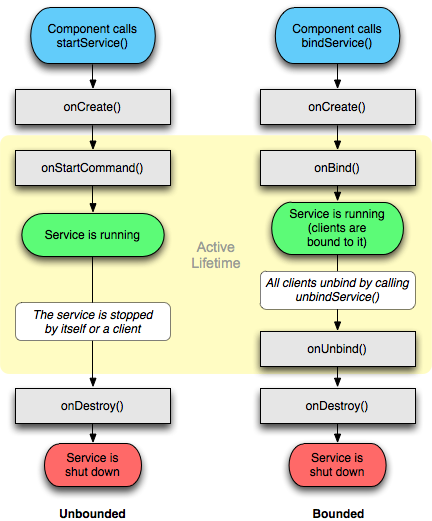

## Services
[Services](https://developer.android.com/reference/android/app/Service) `<service>` are components of an application that can **perform long-term operations in the background** and can be started and stopped without GUI interaction. 

```xml
<service android:name="io.example.services.MyService"
 android:enabled="true" android:exported="true">
    <intent-filter>
        <action android:name="io.example.START"/>
    </intent-filter>
</service>
```

Classic examples are upload/download of large data, Wi-Fi alerts, SMS notifications, etc. 

Services use intents to communicate with apps.



An application can register an `onStartCommand()` or `onBind()` function to receive a service [Intent](Intent.md) and perform actions.

Two types of services exist:
- **Unbound:** the process is launched from a component and continues to run in the background even after the original component that ran it is destroyed.
- **Bound**: The process is destroyed when the bound component ceases to exist

### Non-bindable services

After identifying an exposed Service in the android manifest, the next step should be looking at the `onBind()` method to determine if the service can be bound to or not.

When the `onBind()` method returns nothing or even throws an exception, then the service definetly cannot be bount to.

There are also services where the `onBind()` method returns something, but it's only an internally bindable service, thus from our perspective it's a non-bindable service. These kind of services can usually be recognized by naming convention of "`LocalBinder`".

### Bindable services

#### Message handler services

The "message handler" pattern is a typical kind of service implemented with the [`Messenger`](https://developer.android.com/reference/android/os/Messenger) class.

A messenger service can easily be recognised by looking at the `onBind()` method that returns a `IBinder` object created from the Messenger class.

```java
public class MyMessageService extends Service {
    public static final int MSG_SUCCESS = 42;
    final Messenger messenger = new Messenger(new IncomingHandler(Looper.getMainLooper()));

    @Override // android.app.Service
    public IBinder onBind(Intent intent) {
        return this.messenger.getBinder();
    }

    class IncomingHandler extends Handler {

        IncomingHandler(Looper looper) {
            super(looper);
        }

        @Override // android.os.Handler
        public void handleMessage(Message message) {
            if (message.what == 42) {
                // ...
            } else {
                super.handleMessage(message);
            }
        }
    }
}
```

The inline class extending [`Handler`](https://developer.android.com/reference/android/os/Handler) contains a `handleMessage()` method that implements the actual service logic. The attacker can control the `Message` coming in.

#### [AIDL services](AIDL%20services.md)


## Protection

Exported services can be protected with [Permissions](Android%20101.md#Permissions%20[%20permissions]) to avoid direct interaction from un-trusted parties.

A very common service you might see exposed is an [Android Job Scheduler](https://developer.android.com/reference/android/app/job/JobScheduler) service. However due to the `android.permission.BIND_JOB_SERVICE` permission this service cannot be directly interacted with and can usually be ignored when hunting for bugs.

```xml title:AndroidManifest.xml
<service android:name=".MyJobService" 
 android:permission="android.permission.BIND_JOB_SERVICE"
 android:exported="true"></service>
```