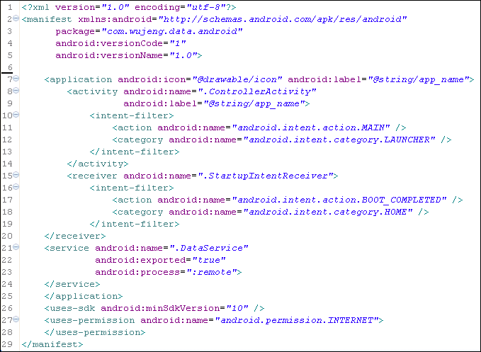

>[!tip]
>The `AndroidManifest.xml` [^1] defines all the application components, the required privileges and the main function of the application

[^1]: https://developer.android.com/guide/topics/manifest/manifest-intro

This file provides **complete information about an Android app**. Simply put, Android will read this particular file before and after installing an app to start the app properly and know how to handle it.

The file has several tasks:
- Determines the **package name** of the application
- Describes the **components** present (we'll see what they are shortly)
- Determines **which process is associated** with which component
- Declare **app permissions**
- List the **libraries** linked to the app
- Define the **minimum and maximum API** that can run the app

### Insecure Attributes
- `android:allowBackup`: If this attribute is set to false, no backup or restore of the application will ever be performed, even by a full-system backup that would otherwise cause all application data to be saved via [adb](../Tools/adb.md). The default value of this attribute is true even if not explicitly declared.
- `android:debuggable`: Whether or not the application can be debugged, even when running on a device in user mode. "true" if it can be, and "false" if not. The default value is "false".
- `android:sharedUserId`: Used to share the data,processes etc between two or more applications.

## Exported elements

Applications can also make some of their components available to other applications, bypassing the [sandbox](Android%20101.md#Application%20Sandboxing%20and%20Secure%20inter-process%20communication). These components are called "exported," and they can be implemented in a variety of ways:

- defining the component with the attribute `exported=true`
- defining the component with an `intent-filter` (if you do not explicitly set `exported=false`, then the component will be treated as exported by default)

## network_security_config

The Network Security Configuration feature lets you customize your app's network security settings in a safe, declarative [configuration file](https://developer.android.com/training/articles/security-config#FileFormat) without modifying app code.

Reference [Network Interception and Certificate Pinning Bypass](Dynamic%20application%20security%20testing%20(DAST).md#Network%20Interception%20and%20Certificate%20Pinning%20Bypass)