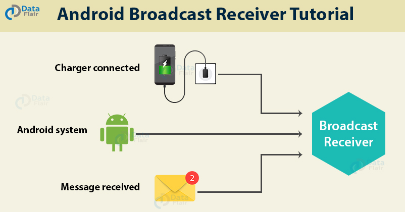

### Broadcast Receivers

A [broadcast receiver](https://developer.android.com/reference/android/content/BroadcastReceiver) is a component used to **respond to system or application events**. An example of a broadcast receiver is the component that alerts you when your phone is plugged in.

The permissions set on this component limit the apps that can send intents to it.

