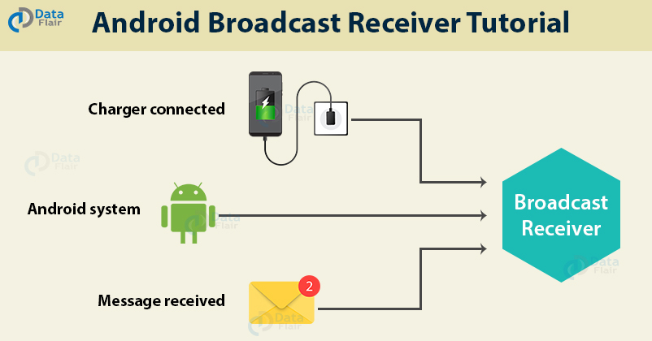

### Broadcast Receivers

A [broadcast receiver](https://developer.android.com/reference/android/content/BroadcastReceiver) is a component used to **respond to system or application events**. An example of a broadcast receiver is the component that alerts you when your phone is plugged in.

The permissions set on this component limit the apps that can send intents to it.

Broadcast receiver can be defined inside the [AndroidManifest.xml](AndroidManifest.xml.md) file with the `<receiver>` tag but can also defined at runtime using [`registerReceiver()`](https://developer.android.com/reference/android/content/Context#registerReceiver(android.content.BroadcastReceiver,%20android.content.IntentFilter)).

>[!warning]
>As part of the Android 8.0 (API level 26) [background execution limits](https://developer.android.com/about/versions/oreo/background#broadcasts), apps that target the API level 26 or higher can't register broadcast receivers for implicit broadcasts in their manifest unless the broadcast is sent specifically to them. 
>
>However, apps can continue to register listeners for the following broadcasts **dynamically at runtime**, no matter what API level the apps target.

# Widgets

Android allows applications creating widgets (`AppWidgetProvider` classes). Those widgets are under the hood broadcast receiver components, and so they can be analysed the same way as receivers. 

# Notification

Notifications can be easily [created](https://developer.android.com/develop/ui/views/notifications/build-notification) using the notification builder. Inside of notifications you can also add button actions by preparing a `PendingIntent`. The reason for that is because the notification is again handled by a different app.

# Broadcast Receivers Threat Surface
- Intent redirect
- Intercept intents
- Malicious return