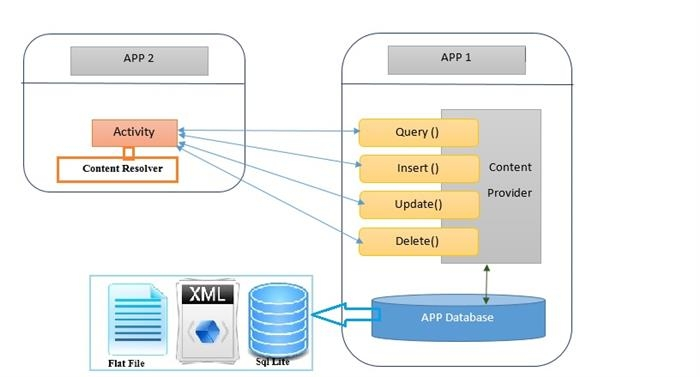

### Content Providers
[Content providers](https://developer.android.com/guide/topics/providers/content-providers) are components used to **store, manage and share data between multiple applications**. An example is WhatsApp accessing address book data. Due to the isolation between apps, in theory this would not be possible. However, the content provider in question allows one app to access the data of the other, thus allowing them to communicate and exchange data.

