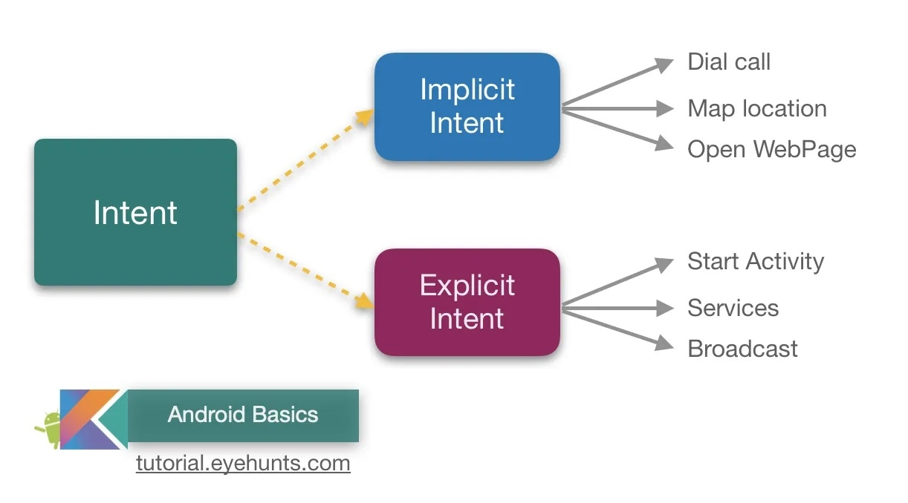
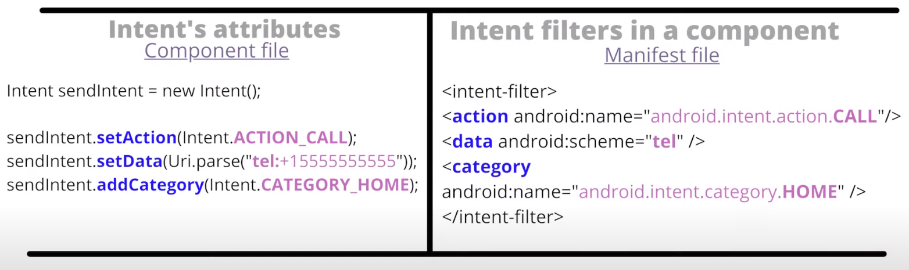

# Intent 101

[Intents](https://developer.android.com/reference/android/content/Intent) are the key of **internal communication** between the elements that make up an application. They are abstract descriptions containing information about the operation to be performed.

An intent is basically a data structure that embodies the full description of an operation, the data passed to that operation, and it is the main entity passed along between applications when launching or interacting with other components in the same application or in other applications installed on the device.

Two forms of intents exist:
- **Explicit**: they have specified a component that determines which exact class should be executed. In most cases they are intents that have the sole task of starting the various internal activities of the application, without interacting with external applications.
- **Implicit**: did not specify a component, but instead must include enough information for the system to determine which of the available components is best to use.

When using implicit intents, given such an arbitrary intent we need to know what to do with it. This is handled by the process of _Intent resolution._ The intent resolution mechanism basically revolves around matching an Intent against all of the `<intent-filter>` [^intentFilter] descriptions in the installed application packages. 

>[!warning] intent-filter exports the component by default!
>When defining an `intent-filter`, Android automatically exports the bounded components unless the developer explicitly set the `exported` attribute to `false`.

[^intentFilter]: https://developer.android.com/reference/android/content/IntentFilter

If multiple components can handle the same intent, a run-time menù will be presented to chose the desired component.

## Intent structure

The primary pieces of information in an intent are:

- `action` - The general action to be performed, such as `ACTION_VIEW`, `ACTION_EDIT`, `ACTION_MAIN`, etc.
- `data` - The data to operate on, such as a person record in the contacts database, expressed as a Uri.

>[!example]
>- `ACTION_VIEW content://contacts/people/1` -- Display information about the person whose identifier is "1".
>- `ACTION_DIAL content://contacts/people/1` -- Display the phone dialer with the person filled in.
>- `ACTION_VIEW tel:123` -- Display the phone dialer with the given number filled in. Note how the VIEW action does what is considered the most reasonable thing for a particular URI.
>- `ACTION_DIAL tel:123` -- Display the phone dialer with the given number filled in.

In addition to these primary attributes, there are a number of secondary attributes that you can also include with an intent:
- `category` - Gives additional information about the action to execute.
- `type` - Specifies an explicit type (a MIME type) of the intent data.
- `component` - Specifies an explicit name of a component class to use for the intent. Normally this is determined by looking at the other information in the intent (the action, data/type, and categories) and matching that with a component that can handle it. If this attribute is set then none of the evaluation is performed, and this component is used exactly as is.
- `extras` - This is a `Bundle` of any additional information. This can be used to provide extended information to the component.

>[!info]
>There are a variety of standard Intent action and category constants defined in the Intent class [^intent-list], but applications can also define their own. These strings use Java-style scoping, to ensure they are unique -- for example, the standard `ACTION_VIEW` is called "`android.intent.action.VIEW`".

[^intent-list]: https://cs.android.com/android/platform/superproject/main/+/main:frameworks/base/core/res/AndroidManifest.xml;l=29?q=SCHEDULE_EXACT_ALARM_PERMISSION_STATE_CHANGED&start=11

## Intent resolution

There are three pieces of information in the Intent that are used for resolution: the **action**, type, **and** **category**. Using this information, a query is done on the `PackageManager` for a component that can handle the intent. The appropriate component is determined based on the intent information supplied in the `AndroidManifest.xml` file:
- The **action**, if given, must be listed by the component as one it handles.
- The **type** is retrieved from the Intent's data, if not already supplied in the Intent. Like the action, if a type is included in the intent (either explicitly or implicitly in its data), then this must be listed by the component as one it handles.
- For data that is not a `content:` URI and where no explicit type is included in the Intent, instead the **scheme** of the intent data (such as `http:` or `mailto:`) is considered. Again like the action, if we are matching a scheme it must be listed by the component as one it can handle.
- The categories, if supplied, must all be listed by the activity as categories it handles. That is, if you include the categories `CATEGORY_LAUNCHER` and `CATEGORY_ALTERNATIVE`, then you will only resolve to components with an intent that lists both of those categories. Activities will very often need to support the `CATEGORY_DEFAULT` so that they can be found by `Context.startActivity()`.