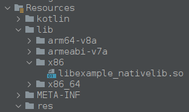

The Java Native Interface [^jni] is used to call into native code and is commonly used to embed C or C++ code or libraries into an application.
Some applications will use functions implemented in native shared objects. You can identify calls into such functions by the keyword `native`.

[^jni]: [Java Native Interface](https://en.wikipedia.org/wiki/Java_Native_Interface), wikipedia.org

>[!warning]
>Function defined inside native libraries MUST match the same package, class name and method defined in the source code:
>`Java_io_hextree_weatherusa_InternetUtil_getKey` is translated into
>```java
>package io.hextree.weatherusa;
>public class InternetUtil{
>	private static native String getKey(String str);
>}
>```



```java
public class NativeLib {  
    public native String secretFromJNI();  
  
    static {  
        System.loadLibrary("example_nativelib");  
    }  
}
```

```java
public void onClick(View view) {  
                String passwordText = SecondPasswordActivity.this.password.getText().toString();  
                NativeLib lib = new NativeLib();  
                if (passwordText.equals(lib.secretFromJNI())) {  
                    Intent intent = new Intent(SecondPasswordActivity.this.getBaseContext(), (Class<?>) ThirdPasswordActivity.class);  
                    SecondPasswordActivity.this.startActivity(intent);  
                }  
            }
```

