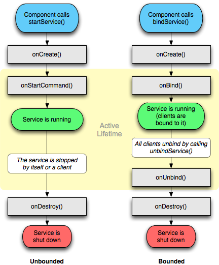

### Services
[Services](https://developer.android.com/reference/android/app/Service) are components of an application that can perform long-term operations in the background and can be started and stopped without GUI interaction. Classic examples are Wi-Fi alerts, SMS notifications, etc. Services use intents to communicate with apps.

Two types of services exist:
- **Unbound:** the process is launched from a component and continues to run in the background even after the original component that ran it is destroyed.
- **Bound**: The process is destroyed when the bound component ceases to exist