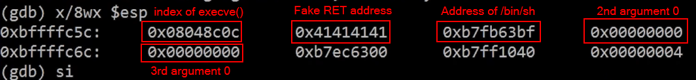

# Linux implementation

## W^X

**W^X**  is a security feature in operating systems and virtual machines. It is a memory protection policy whereby every page in a process's or kernel's address space may be either writable or executable, but not both. Without such protection, a program can write (as data "W") CPU instructions in an area of memory intended for data and then run (as executable "X"; or read-execute "RX") those instructions. This can be dangerous if the writer of the memory is malicious. W^X is the Unix-like terminology for a strict use of the general concept of executable space protection, controlled via the `mprotect` system call.

W^X has also been applied to file system write/execute permissions to mitigate file write vulnerabilities (as with in memory) and attacker persistence [^1]

[^1]: https://en.wikipedia.org/wiki/W%5EX)

## NX

The **NX** bit (no-execute) is a technology used in CPUs to segregate areas of memory for use by either storage of processor instructions (code) or for storage of data, a feature normally only found in Harvard architecture processors. However, the NX bit is being increasingly used in conventional von Neumann architecture processors for security reasons.

An operating system with support for the NX bit may mark certain areas of memory as non-executable. The processor will then refuse to execute any code residing in these areas of memory. The general technique, known as executable space protection, also called Write XOR Execute, is used to prevent certain types of malicious software from taking over computers by inserting their code into another program's data storage area and running their own code from within this section; one class of such attacks is known as the buffer overflow attack.

Intel markets the feature as the XD bit (execute disable). Advanced Micro Devices (AMD) uses the marketing term NX bit. The ARM architecture refers to the feature, which was introduced in ARMv6, as XN (execute never). The term NX bit itself is sometimes used to describe similar technologies in other processors [^2].

[^2]: https://en.wikipedia.org/wiki/NX_bit)

## Attacks

### ret2libc

When you do encounter a non-executable stack, you can use an exploitation method known as **Return to libc**.
Essentially, we will make use of the ever-popular and ever-present **libc** library to export our system calls to the **libc** library. This will make exploitation possible when the target stack is protected.

Instead of returning control to instructions on the stack, as in a traditional stack buffer overflow exploit, we will **force the program to return to an address that corresponds to a specific dynamic library function** (90% of the case is `libc`). This dynamic library function will not be on the stack, meaning we can circumvent any stack execution restrictions.

By nature, all the functions in the `libc` library are shared (this is the definition of a function library), meaning that any program that includes it will have access to these functions.

All we have to do is direct execution to the address of the library function we want to use (with the proper arguments to the function, of course), and it will be executed.

>[!example]
>The easiest libc function to use is `system()`; for the purposes of this example, all it does is take in an argument and then execute that argument with `/bin/sh` .
>
>So, we supply `system()` with `/bin/sh` as an argument, and we will get a shell. We aren’t going to execute any code on the stack; we will jump right out to the address of system() function with the C library.
>
>A point of interest is how to get the argument passed to `system()` . Essentially, what we do is pass a pointer to the string ( `bin/sh` ) we want executed. We know that normally when a program executes a function (in this example, we’ll use `the_function` as the name), the arguments get pushed onto the stack in reverse order. It is what happens next that is of interest to us and will allow us to pass parameters to `system()`.
>
>First, a `CALL the_function` instruction is executed. This `CALL` will push the address of the next instruction (where we want to return to) onto the stack. It will also decrement `ESP` by 4. When we return from `the_function` , `RET` (or `EIP` ) will be popped off the stack. `ESP` is then set to the address directly following `RET` .
>
>Now comes the actual return to `system()` .`the_function` assumes that `ESP` is already pointing to the address that should be returned to. It is going to also assume that the parameters are sitting there waiting for it on the stack, starting with the first argument following `RET` . This is normal stack behavior. We set the return to `system()` and the argument (in our example, this will be a pointer to `/bin/sh` ) in those 8 bytes. When `the_function` returns, it will return (or jump, depending on how you look at the situation) into system() , and `system()` has our values waiting for it on the stack.

#### Determine the address of a specific function

The address of `system()` can be found within libc by simply disassembling any C or C++ program. gcc will include libc by default when compiling.

```bash
[root@0day local]# gdb file
(gdb) break main
Breakpoint 1 at 0x804832e
(gdb) run
Starting program: /usr/local/book/file
Breakpoint 1, 0x0804832e in main ()
(gdb) p system
$1 = {<text variable, no debug info>} 0x4203f2c0 <system>
(gdb)
...
[root@0day local]# gdb file
(gdb) break main
Breakpoint 1 at 0x804832e
(gdb) run
Starting program: /usr/local/book/file
Breakpoint 1, 0x0804832e in main ()
(gdb) p exit
$1 = {<text variable, no debug info>} 0x42029bb0 <exit>
(gdb)
```

#### Determine all the functions used inside a binary

```bash
[root@0day local]# gdb file
(gdb) info functions @plt
...
0x08048c0c	execve@plt
0x08048c1c	malloc@plt
...
```

#### Determine the address of /bin/sh and preparing the stack

- Use the `memfetch` tool found at [http://lcamtuf.coredump.cx/](http://lcamtuf.coredump.cx/). `memfetch` will dump everything in memory for a specific process; simply look through the binary files for the address of `/bin/sh`.
- Store the `/bin/sh` in an environment variable, and then get the address of this variable.
- Find `/bin/sh` inside **libc** using `grep` and calculate the offset

```bash
$ ldd file.bin
	...
	libc.so.6 => /lib/libc.so.6 (0xb7e99000)	# start of libc
	...
	
$ grep -R -a -b -o /bin/sh /lib/libc.so.6
1176511:/bin/sh									# offset in libc

$ pidof process_name
1697
$ cat /proc/1697/maps
...
0xb7e97000-0xb7fd5000 r-xp 00000000 00:10 759	/lib/libc-2.11.2.so 	# base of libc for the current process
...

offset = 0xb7e97000 + 1176511
```

#### Align the stack with the right data

```c
int execve(const char *pathname, char *const argv[],
                  char *const envp[]);
```



### ROP

ROP stands for **return-oriented programming** and intends *exploitation performed using **only code fragments already present** in the trusted code* (known as `gadgets`).

>[!tip]
>No new executable code is introduced by the attacker.

<iframe width="660" height="415" src="https://www.youtube.com/embed/8Dcj19KGKWM?start=525" title="YouTube video player" frameborder="0" allow="accelerometer; autoplay; clipboard-write; encrypted-media; gyroscope; picture-in-picture" allowfullscreen></iframe>

<iframe width="660" height="415" src="https://www.youtube.com/embed/zaQVNM3or7k" title="YouTube video player" frameborder="0" allow="accelerometer; autoplay; clipboard-write; encrypted-media; gyroscope; picture-in-picture" allowfullscreen></iframe>

In order to find `gadgets` it is possible to use some specific tools:
- [ROPgadget](../Tools/ROPgadget.md)
- ...

---

# Windows implementation

## DEP

`DEP` is a set of hardware and software technologies that perform additional checks on memory to help prevent malicious code from running on a system. The primary benefit of DEP is to help prevent code execution from data pages by raising an exception when such attempts are made.