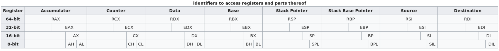
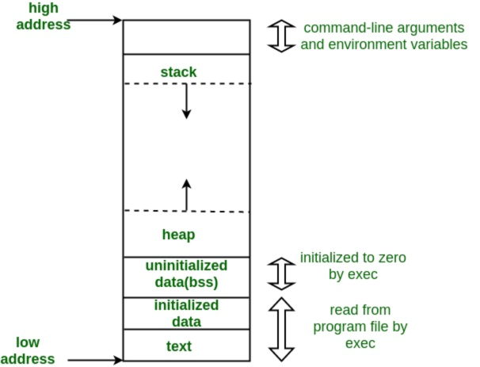
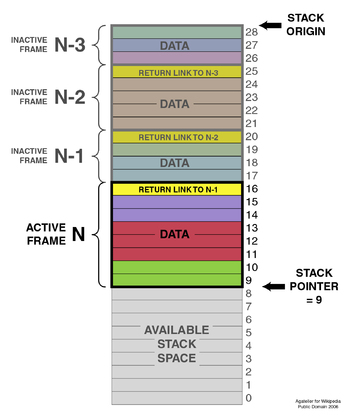
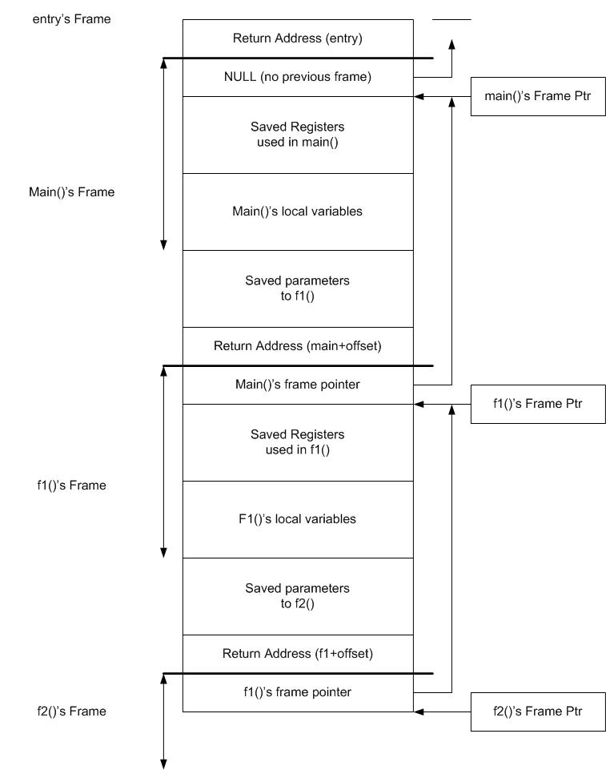

# The x86/x64 and the Assembly language



>[!note]
> In x64 there are also registers from r8 to r15. More information [here](https://en.wikibooks.org/wiki/X86_Assembly/X86_Architecture)

**EAX**, **ECX**, **EDX**, **EBX**: general-purpose registers
**ESP**, **EBP**: Point the top and the current function bottom of the stack
**ESI**, **EDI**: Point source and destination when data need to be read or written. Can also be used as general-purpose pointer
**EIP** (Instruction Pointer): Point the next instruction the processor will execute.

In details:
- `EAX` (accumulator): Arithmetical and logical instructions
- `EBX` (base): Base pointer for memory addresses
- `ECX` (counter): Loop, shift, and rotation counter
- `EDX` (data): I/O port addressing, multiplication, and division
- `ESI` (source index): Pointer addressing of data and source in string copy operations
- `EDI` (destination index): Pointer addressing of data and destination in string copy operations
- `ESP` (Stack Pointer): Points the top of the stack
- `EBP` (Base Pointer): Points the top of the stack when a function is called (reference to stack frames)
- `EIP` (Instruction Pointer): Points the next instruction to be executed

Respective x64 versions of every registry are named using r* instead of e* (eg. RAX, RIP, ecc.) 

## x64 vs x86

### Kernel interface:

In x86-32:
parameters for Linux system call are passed using **registers**. `%eax` for syscall_number. `%ebx`, `%ecx`, `%edx`, `%esi`, `%edi`, `%ebp` are used for passing 6 parameters to system calls.
The return value is in `%eax`. All other registers (including EFLAGS) are preserved across the `int $0x80`.

In x64: 
<mark style="background: #FFB86CA6;">1. **User-level applications** use as integer registers for passing the sequence `%rdi`, `%rsi`, `%rdx`, `%rcx`, `%r8` and `%r9`. 
2. The **kernel** interface uses `%rdi`, `%rsi`, `%rdx`, `%r10`, `%r8` and `%r9`.</mark>
3. A **system-call** is done via the **`syscall` instruction**. This clobbers `%rcx` and `%r11` as well as the `%rax` return value, but other registers are preserved.
4. The number of the syscall has to be passed in register `%rax`.
5. **System-calls are limited to six arguments**, no argument is passed directly on the stack.
6. Returning from the syscall, register `%rax` contains the result of the system-call. A value in the range between -4095 and -1 indicates an error, it is `errno`.
7. Only values of class INTEGER or class MEMORY are passed to the kernel.

### User interface:

**x86-32 Function Calling convention:**
<mark style="background: #FFB86CA6;">In x86-32 parameters were passed on stack</mark>. **Last parameter was pushed first on to the stack** until all parameters are done and then `call` instruction was executed. This is used for calling C library (libc) functions on Linux from assembly.

Modern versions of the i386 System V ABI (used on Linux) require 16-byte alignment of `%esp` before a `call`, like the x86-64 System V ABI has always required. Callees are allowed to assume that and use SSE 16-byte loads/stores that fault on unaligned. But historically, Linux only required 4-byte stack alignment, so it took extra work to reserve naturally-aligned space even for an 8-byte `double` or something.

Some other modern 32-bit systems still don't require more than 4 byte stack alignment.

**x64 Function Calling convention:**
Once arguments are classified, the registers get assigned (in left-to-right order) for passing as follows:
1. If the class is MEMORY, pass the argument on the stack.
2. If the class is INTEGER, the next available register of the sequence `%rdi`, `%rsi`, `%rdx`, `%rcx`, `%r8` and `%r9` is used

## x64 canonical addresses

> [!info]
> In 64-bit mode, an address is considered to be in **canonical form** if address bits 63 through to the most-significant implemented bit by the microarchitecture are set to either all ones or all zeros.

While 64-bit processors have 64-bit wide registers, systems generally do not implement all 64-bits for addressing (16 exabytes of theoretical physical memory).

Thus most architectures define an **unimplemented region of the address space which the processor will consider invalid for use**. x86-64 (...) define the most-significant valid bit of an address, which must then be sign-extended (...) to create a valid address. The result of this is that the **total address space is effectively divided into two parts**, an upper and a lower portion, with the addresses in-between considered invalid. (...) Valid addresses are termed canonical addresses (invalid addresses being non-canonical).

A 48-bit implementation would have 
- a high half canonical address starting at `0xFFFF800000000000`
- a lower half at `0x00007FFFFFFFFFFF`

## Assembly (Intel)

Assembly instructions in Intel syntax follow this style: `operation <destination>, <source>`
Destination and source could be registers, memory address or value.

Valid operations are:

| Operation | Action                                                  |
| --------- | ------------------------------------------------------- |
| mov       | move the value from source to destination               |
| sub       | subtract source to destination                          |
| cmp       | compare source and destination                          |
| jle       | jump to destination if the condition were less or equal |
| jmp       | jump to destination                                     |
| lea       | Load the effective address of source in destination     |

More information [here](https://www.tutorialspoint.com/assembly_programming/)

## Little endian system

>[!warning]
> Values are written in a reverse order because the **little endian** structure.

>[!example]
> "hello" is `0x6c6c6548` (“olleh”)

## two’s complement

Negative values are stored using a method called **two’s complement**: 

>[!info]
>when a negative value is added to a positive number of the same magnitude, the result will be 0

>[!example]
> 73\\10 --> 0y1001001
> -73\\10=183\\10 --> 0y10110111 (I flip all the bit and add 1 to the end)
> so 0y1001001 + 0y10110111 = 0y100000000 (256\\10=0\\10)

---

# Memory representation and management



## Memory Segmentation

A compiled program’s memory is divided into 5 segments:
1. **text/code segment**(.text): Is where the assembled machine language istructions are located. It has a fixed size and is in read-only
2. **data segment** (.data): Store global and static variables. Fixed size.
3. **bss segment** (.bss): Store uninitialized variables. Fixed size.
4. **heap segment**: Is a part of memory that can be directly controlled by the programmer to wrtie data in. Size is dynamic and the growth move downward toward higher memory addresses.
5. **stack segment**: Is used as a temporary scratch pad to store local function variables and context during function call. Size is dynamic

---

| `↑ Lower addresses (0x08000000)` |
| ------------------------------ |
| Shared libraries|
|.text|
|.bss|
|Heap (grows ↓)<br><br>|
|<br>Stack (grows ↑)|
|env pointer|
|Argc|
|`↓ Higher addresses (0xbfffffff)`|

Allocated memory for a particular process can be inspected from `/proc/<pid>/map`:

```bash
┌──(maoutis㉿kali)-[~/CTF/HTB/Pwn/batcomputer]
└─$ ps -aux | grep bat
maoutis     1411  0.0  0.4 245848 40024 ?        Sl   May19   0:00 /usr/lib/x86_64-linux-gnu/xfce4/panel/wrapper-2.0 /usr/lib/x86_64-linux-gnu/xfce4/panel/plugins/libxfce4powermanager.so 18 16777228 power-manager-plugin Power Manager Plugin Display the battery levels of your devices and control the brightness of your display
maoutis   117011  0.0  0.0   2292   744 pts/5    S+   10:24   0:00 ./batcomputer
maoutis   117164  0.0  0.0   6436   884 pts/6    S+   10:24   0:00 grep --color=auto bat

┌──(maoutis㉿kali)-[~/CTF/HTB/Pwn/batcomputer]
└─$ sudo cat /proc/117011/maps                                                                                                                                                                                                           1 ⨯
55e249c36000-55e249c37000 r--p 00000000 08:01 4849671                    /home/maoutis/CTF/HTB/Pwn/batcomputer/batcomputer
55e249c37000-55e249c38000 r-xp 00001000 08:01 4849671                    /home/maoutis/CTF/HTB/Pwn/batcomputer/batcomputer
55e249c38000-55e249c39000 r--p 00002000 08:01 4849671                    /home/maoutis/CTF/HTB/Pwn/batcomputer/batcomputer
55e249c39000-55e249c3a000 r--p 00002000 08:01 4849671                    /home/maoutis/CTF/HTB/Pwn/batcomputer/batcomputer
55e249c3a000-55e249c3b000 rw-p 00003000 08:01 4849671                    /home/maoutis/CTF/HTB/Pwn/batcomputer/batcomputer
7f38718bf000-7f38718c1000 rw-p 00000000 00:00 0
7f38718c1000-7f38718e7000 r--p 00000000 08:01 6322803                    /usr/lib/x86_64-linux-gnu/libc-2.33.so
7f38718e7000-7f3871a3f000 r-xp 00026000 08:01 6322803                    /usr/lib/x86_64-linux-gnu/libc-2.33.so
7f3871a3f000-7f3871a8b000 r--p 0017e000 08:01 6322803                    /usr/lib/x86_64-linux-gnu/libc-2.33.so
7f3871a8b000-7f3871a8c000 ---p 001ca000 08:01 6322803                    /usr/lib/x86_64-linux-gnu/libc-2.33.so
7f3871a8c000-7f3871a8f000 r--p 001ca000 08:01 6322803                    /usr/lib/x86_64-linux-gnu/libc-2.33.so
7f3871a8f000-7f3871a92000 rw-p 001cd000 08:01 6322803                    /usr/lib/x86_64-linux-gnu/libc-2.33.so
7f3871a92000-7f3871a9d000 rw-p 00000000 00:00 0
7f3871ab4000-7f3871ab5000 r--p 00000000 08:01 6315879                    /usr/lib/x86_64-linux-gnu/ld-2.33.so
7f3871ab5000-7f3871ad9000 r-xp 00001000 08:01 6315879                    /usr/lib/x86_64-linux-gnu/ld-2.33.so
7f3871ad9000-7f3871ae3000 r--p 00025000 08:01 6315879                    /usr/lib/x86_64-linux-gnu/ld-2.33.so
7f3871ae3000-7f3871ae5000 r--p 0002e000 08:01 6315879                    /usr/lib/x86_64-linux-gnu/ld-2.33.so
7f3871ae5000-7f3871ae7000 rw-p 00030000 08:01 6315879                    /usr/lib/x86_64-linux-gnu/ld-2.33.so
7ffe1b87b000-7ffe1b89c000 rwxp 00000000 00:00 0                          [stack]
7ffe1b914000-7ffe1b918000 r--p 00000000 00:00 0                          [vvar]
7ffe1b918000-7ffe1b91a000 r-xp 00000000 00:00 0                          [vdso]
```

or using specific debugging features, like `vmmap` or `info proc mappings` from [gdb](Dev,%20ICT%20&%20Cybersec/Tools/gdb.md):

```bash
pwndbg> vmmap
LEGEND: STACK | HEAP | CODE | DATA | RWX | RODATA
    0x555555554000     0x555555555000 r--p     1000 0      /home/maoutis/CTF/HTB/Pwn/batcomputer/batcomputer
    0x555555555000     0x555555556000 r-xp     1000 1000   /home/maoutis/CTF/HTB/Pwn/batcomputer/batcomputer
    0x555555556000     0x555555557000 r--p     1000 2000   /home/maoutis/CTF/HTB/Pwn/batcomputer/batcomputer
    0x555555557000     0x555555558000 r--p     1000 2000   /home/maoutis/CTF/HTB/Pwn/batcomputer/batcomputer
    0x555555558000     0x555555559000 rw-p     1000 3000   /home/maoutis/CTF/HTB/Pwn/batcomputer/batcomputer
    0x7ffff7dd1000     0x7ffff7dd3000 rw-p     2000 0      [anon_7ffff7dd1]
    0x7ffff7dd3000     0x7ffff7df9000 r--p    26000 0      /usr/lib/x86_64-linux-gnu/libc-2.33.so
    0x7ffff7df9000     0x7ffff7f51000 r-xp   158000 26000  /usr/lib/x86_64-linux-gnu/libc-2.33.so
    0x7ffff7f51000     0x7ffff7f9d000 r--p    4c000 17e000 /usr/lib/x86_64-linux-gnu/libc-2.33.so
    0x7ffff7f9d000     0x7ffff7f9e000 ---p     1000 1ca000 /usr/lib/x86_64-linux-gnu/libc-2.33.so
    0x7ffff7f9e000     0x7ffff7fa1000 r--p     3000 1ca000 /usr/lib/x86_64-linux-gnu/libc-2.33.so
    0x7ffff7fa1000     0x7ffff7fa4000 rw-p     3000 1cd000 /usr/lib/x86_64-linux-gnu/libc-2.33.so
    0x7ffff7fa4000     0x7ffff7faf000 rw-p     b000 0      [anon_7ffff7fa4]
    0x7ffff7fc6000     0x7ffff7fca000 r--p     4000 0      [vvar]
    0x7ffff7fca000     0x7ffff7fcc000 r-xp     2000 0      [vdso]
    0x7ffff7fcc000     0x7ffff7fcd000 r--p     1000 0      /usr/lib/x86_64-linux-gnu/ld-2.33.so
    0x7ffff7fcd000     0x7ffff7ff1000 r-xp    24000 1000   /usr/lib/x86_64-linux-gnu/ld-2.33.so
    0x7ffff7ff1000     0x7ffff7ffb000 r--p     a000 25000  /usr/lib/x86_64-linux-gnu/ld-2.33.so
    0x7ffff7ffb000     0x7ffff7ffd000 r--p     2000 2e000  /usr/lib/x86_64-linux-gnu/ld-2.33.so
    0x7ffff7ffd000     0x7ffff7fff000 rw-p     2000 30000  /usr/lib/x86_64-linux-gnu/ld-2.33.so
    0x7ffffffde000     0x7ffffffff000 rwxp    21000 0      [stack]

pwndbg> info proc mappings
process 117610
Mapped address spaces:

          Start Addr           End Addr       Size     Offset objfile
      0x555555554000     0x555555555000     0x1000        0x0 /home/maoutis/CTF/HTB/Pwn/batcomputer/batcomputer
      0x555555555000     0x555555556000     0x1000     0x1000 /home/maoutis/CTF/HTB/Pwn/batcomputer/batcomputer
      0x555555556000     0x555555557000     0x1000     0x2000 /home/maoutis/CTF/HTB/Pwn/batcomputer/batcomputer
      0x555555557000     0x555555558000     0x1000     0x2000 /home/maoutis/CTF/HTB/Pwn/batcomputer/batcomputer
      0x555555558000     0x555555559000     0x1000     0x3000 /home/maoutis/CTF/HTB/Pwn/batcomputer/batcomputer
      0x7ffff7dd1000     0x7ffff7dd3000     0x2000        0x0
      0x7ffff7dd3000     0x7ffff7df9000    0x26000        0x0 /usr/lib/x86_64-linux-gnu/libc-2.33.so
      0x7ffff7df9000     0x7ffff7f51000   0x158000    0x26000 /usr/lib/x86_64-linux-gnu/libc-2.33.so
      0x7ffff7f51000     0x7ffff7f9d000    0x4c000   0x17e000 /usr/lib/x86_64-linux-gnu/libc-2.33.so
      0x7ffff7f9d000     0x7ffff7f9e000     0x1000   0x1ca000 /usr/lib/x86_64-linux-gnu/libc-2.33.so
      0x7ffff7f9e000     0x7ffff7fa1000     0x3000   0x1ca000 /usr/lib/x86_64-linux-gnu/libc-2.33.so
      0x7ffff7fa1000     0x7ffff7fa4000     0x3000   0x1cd000 /usr/lib/x86_64-linux-gnu/libc-2.33.so
      0x7ffff7fa4000     0x7ffff7faf000     0xb000        0x0
      0x7ffff7fc6000     0x7ffff7fca000     0x4000        0x0 [vvar]
      0x7ffff7fca000     0x7ffff7fcc000     0x2000        0x0 [vdso]
      0x7ffff7fcc000     0x7ffff7fcd000     0x1000        0x0 /usr/lib/x86_64-linux-gnu/ld-2.33.so
      0x7ffff7fcd000     0x7ffff7ff1000    0x24000     0x1000 /usr/lib/x86_64-linux-gnu/ld-2.33.so
      0x7ffff7ff1000     0x7ffff7ffb000     0xa000    0x25000 /usr/lib/x86_64-linux-gnu/ld-2.33.so
      0x7ffff7ffb000     0x7ffff7ffd000     0x2000    0x2e000 /usr/lib/x86_64-linux-gnu/ld-2.33.so
      0x7ffff7ffd000     0x7ffff7fff000     0x2000    0x30000 /usr/lib/x86_64-linux-gnu/ld-2.33.so
      0x7ffffffde000     0x7ffffffff000    0x21000        0x0 [stack]
```

---

## Execution’s processes

Execution’s processes in memory to execute instructions:
1. Reads the instruction that EIP is pointing to
2. Adds the byte length of the instruction to EIP
3. Execute the instruction read in step 1
4. Goes back to step 1

## Stack

*As already said, stack is used as a temporary scratch pad to store local function variables and context during function call. The size is dynamic.*



Into the stack are **pushed** and **popped** **stack frame**, piece of stack containing `parameters of a function`, backupped `return value` (address to return after the end of the function), `SFP` (backupped EBP) and `local variables`.
The first few instruction of each function set up the stack frame: they are called function prologue. More details [here](https://www.cs.rutgers.edu/~pxk/419/notes/frames.html)

Example of the stack:

```c
int RandomCall(int val){
	return 0;
}

void test_function(int a, int b, int c, int d){
	int flag;
	char buffer[10];

	flag = 31337;
	buffer[0] = 'A';

	RandomCall(flag);
}

int main(){
	test_function(1, 2, 3, 4);
}
```

The stack after the `test_function` call will be like this:

| Top of the stack (**0x0ff00000**) |
| --------------------------------- |
| buffer                            |
| flag                              |
| Saved frame pointer (SFP)         |
| Return address (ret)              |
| a                                 |
| b |
| c |
| d |
| ... |

Where `d` is the first value pushed into the stack (parameters are pushed in reverse order).
After the execution of the function, the entire stack frame is popped out and the EIP is set to the  val of the ex stack-frame.



---

## Heap

The **heap** is the portion of memory where *dynamically allocated* memory resides (i.e. memory allocated via `malloc`). Memory allocated from the heap will remain allocated until one of the following occurs:
1. The memory is `free`'d
2. The program terminates

<iframe width="660" height="415" src="https://www.youtube.com/embed/HPDBOhiKaD8" title="YouTube video player" frameborder="0" allow="accelerometer; autoplay; clipboard-write; encrypted-media; gyroscope; picture-in-picture" allowfullscreen></iframe>

# Global Offset Table and Procedure Linkage Table

<iframe width="660" height="415" src="https://www.youtube.com/embed/kUk5pw4w0h4" title="YouTube video player" frameborder="0" allow="accelerometer; autoplay; clipboard-write; encrypted-media; gyroscope; picture-in-picture" allowfullscreen></iframe>

<iframe width="660" height="415" src="https://www.youtube.com/embed/NdlvRRUBG5Y" title="YouTube video player" frameborder="0" allow="accelerometer; autoplay; clipboard-write; encrypted-media; gyroscope; picture-in-picture" allowfullscreen></iframe>

## PLT

**PLT** stands for **Procedure Linkage Table** and it is used to call external procedures/functions whose address isn't known in the time of linking, and is left to be resolved by the dynamic linker at run time.


## GOT

**GOT** stands for **Global Offset Table** and it converts position-independent address calculations to absolute locations

