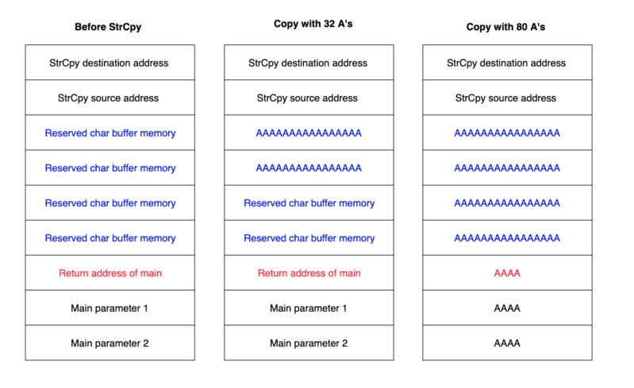
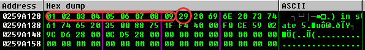
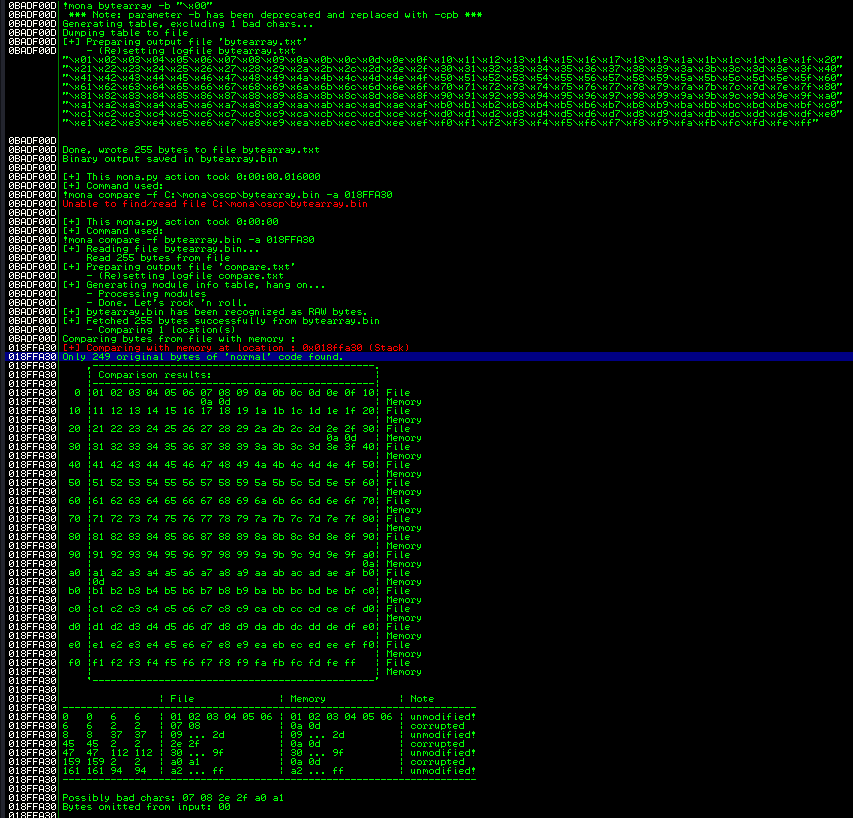

Basic steps to manually exploit a program:
1. [Reverse engineering and debugging the normal application workflow](Reversing%20and%20software%20memory%20101.md)
2. [Fuzzing](Fuzzing.md) in order to crash the app
3. [Controlling the EIP register](Stack-Based%20Buffer%20Overflow.md#Controlling%20the%20EIP%20register)
4. [Locating space for the Shellcode](Stack-Based%20Buffer%20Overflow.md#Locating%20space%20for%20the%20Shellcode)
5. [Checking for Bad Characters](Stack-Based%20Buffer%20Overflow.md#Checking%20for%20Bad%20Characters)
6. [Finding a Return Address](Stack-Based%20Buffer%20Overflow.md#Finding%20a%20Return%20Address)
7. [Generating the Shellcode](Stack-Based%20Buffer%20Overflow.md#Generating%20the%20Shellcode)
8. [Exploit!](Stack-Based%20Buffer%20Overflow.md#Exploit!)

---

## Controlling the EIP register

- **binary tree analysis**: Instead of a number of A’s, we send half number of A’s and half number of B’s. If EIP is overwritten by B’s, we know the four bytes reside in the second half of the buffer. We then change the 400 B’s to 200 B’s and 200 C’s, and send the buffer again.
- [Metasploit tools](../Tools/Metasploit%20tools.md) > Long string that consists of non-repeating 4-byte chunks as our fuzzing input (patterns).

## Locating space for the Shellcode

After having control of the EIP register is important to **locate a place with enough space where inject our shellcode**.
Depending on the application and the type of vulnerability, there may be restrictions on the length of our input. In some cases, **increasing the length of a buffer may result in a completely different crash** since the larger buffer overwrites additional data on the stack that is used by the target application. In this cases is it possible to inject the shellcode within the filler space instead as subsequently of the EIP address.

Enough space after RET: `Filler + RET + NOP Sled + Shellcode`
Not enough space: `NOP sled + Shellcode + Filler + RET + Staged Shell`
Still not enough space: `Shellcode inside the Environment` (which is part of the stack)

## Checking for Bad Characters

Depending on the application, vulnerability type, and protocols in use, there may be certain characters that are considered “bad” and should not be used in our buffer, return address, or shellcode.

In order to find them it is possible to send all characters from `0x00` to `0xFF` as part of the buffer and observe how the application deals with each one of them.

```python
badchars = (
"\x01\x02\x03\x04\x05\x06\x07\x08\x09\x0a\x0b\x0c\x0d\x0e\x0f\x10"
"\x11\x12\x13\x14\x15\x16\x17\x18\x19\x1a\x1b\x1c\x1d\x1e\x1f\x20"
"\x21\x22\x23\x24\x25\x26\x27\x28\x29\x2a\x2b\x2c\x2d\x2e\x2f\x30"
"\x31\x32\x33\x34\x35\x36\x37\x38\x39\x3a\x3b\x3c\x3d\x3e\x3f\x40"
"\x41\x42\x43\x44\x45\x46\x47\x48\x49\x4a\x4b\x4c\x4d\x4e\x4f\x50"
"\x51\x52\x53\x54\x55\x56\x57\x58\x59\x5a\x5b\x5c\x5d\x5e\x5f\x60"
"\x61\x62\x63\x64\x65\x66\x67\x68\x69\x6a\x6b\x6c\x6d\x6e\x6f\x70"
"\x71\x72\x73\x74\x75\x76\x77\x78\x79\x7a\x7b\x7c\x7d\x7e\x7f\x80"
"\x81\x82\x83\x84\x85\x86\x87\x88\x89\x8a\x8b\x8c\x8d\x8e\x8f\x90"
"\x91\x92\x93\x94\x95\x96\x97\x98\x99\x9a\x9b\x9c\x9d\x9e\x9f\xa0"
"\xa1\xa2\xa3\xa4\xa5\xa6\xa7\xa8\xa9\xaa\xab\xac\xad\xae\xaf\xb0"
"\xb1\xb2\xb3\xb4\xb5\xb6\xb7\xb8\xb9\xba\xbb\xbc\xbd\xbe\xbf\xc0"
"\xc1\xc2\xc3\xc4\xc5\xc6\xc7\xc8\xc9\xca\xcb\xcc\xcd\xce\xcf\xd0"
"\xd1\xd2\xd3\xd4\xd5\xd6\xd7\xd8\xd9\xda\xdb\xdc\xdd\xde\xdf\xe0"
"\xe1\xe2\xe3\xe4\xe5\xe6\xe7\xe8\xe9\xea\xeb\xec\xed\xee\xef\xf0"
"\xf1\xf2\xf3\xf4\xf5\xf6\xf7\xf8\xf9\xfa\xfb\xfc\xfd\xfe\xff" )
```

If there are any interruptions or truncation, the missing character is a bad-char. Performing these checks multiple times and removing every single new bad chars allows to find all the un-acceptable character for our shellcode.



It is also possible to use **mona** in order to achieve this results, using the `!mona bytearray -b "\x00"` to create an array of badchars and then comparing this array with the contents of the stack, though the `!mona compare -f bytearray.bin -a <address>` command.



## Finding a Return Address

Once we are in control of the EIP register and we have located where to place the shellcode and which character we can not use, we have to find valid Return Address value which allows to us to jump within our desired memory location.

An easy way, but not always possible, is to find an already specific instruction in the code which allow us to jump to the shell code. Alternatively we can use registry values and offsets to calculate ourself a possible jump.

Some of the possible methods are:

- **jump to shellcode**: the EIP will jump directly into the Shellcode or within the NOP sled
- **jump to address stored in a register**: the shellcode is not directly available, before to jump into it we need to modify/use values from some registry
- [Format String](Format%20String.md)
- [ret2libc](Non-Executable%20Stack%20(Ret2libc%20+%20ROP).md#ret2libc)
- ROP

ImmunityDBG allows to perform some useful inspection analysis though the usage of [Mona Script](../Tools/Immunity%20Debugger.md#Mona%20Script).  If necessary, [NASM Shell](../Tools/Metasploit%20tools.md#NASM%20Shell) can be used to rapidly convert Assembly instruction into op-code which will be search with mona.
`!mona modules`
`!mona find -s "\xff\xe4" -m slmfc.dll`
`!mona find -s "\xff\xe4" -m slmfc.dll -cpb '\x00\x0a\x0d'`

In unix environment [edb](../Tools/edb.md) offers some useful [Plugins](../Tools/edb.md#Plugins) which allow to search for specific opcode within the disassembled code.

## Generating the Shellcode

We can generate shellcode through [msfvenom](../Tools/msfvenom.md), avoiding bad chars and specifying our shell code parameters.

>[!warning]
>Because of the encoding, the shellcode is not directly executable and is therefore prepended by a decoder stub. The job of this stub is to iterate over the encoded shellcode bytes and decode them back to their original executable form. In order to perform this task, the decoder needs to gather its address in memory and from there, look a few bytes ahead to locate the encoded shellcode that it needs to decode.
>As part of the process of gathering the decoder stub’s location in memory, the code performs a sequence of assembly instructions, which are commonly referred to as a GetPC routine. This is essentially a short routine that moves the value of the EIP register (sometimes referred to as the Program Counter or PC) into another register.

As with other GetPC routines, those used by **shikata_ga_nai** have an unfortunate side-effect of writing some data at and around the top of the stack. This eventually mangles at least a couple of bytes close to the address pointed at by the ESP register. Unfortunately, this small change on the stack is a problem for us because the decoder starts exactly at the address pointed to by the ESP register. In short, the GetPC routine execution ends up changing a few bytes of the decoder itself (and potentially the encoded shellcode), which eventually fails the decoding process and crashes the target process.
The solution to this problem is to place a NOP Sled right before the payload, so even if the GetPC change some previous bytes, it is sure that the changed bytes are not vital to the correct execution of the program.

## Exploit!

See below some buffer overflow challenges to see applied the methodology explained above:
- [VulnServer](../../Play%20ground/CTFs/VulnServer.md)
- [oscp exe - OVERFLOW1](../../Play%20ground/CTFs/oscp%20exe%20-%20OVERFLOW1.md)
- [[reg]]
- [Buff](../../Play%20ground/CTFs/Buff.md)
