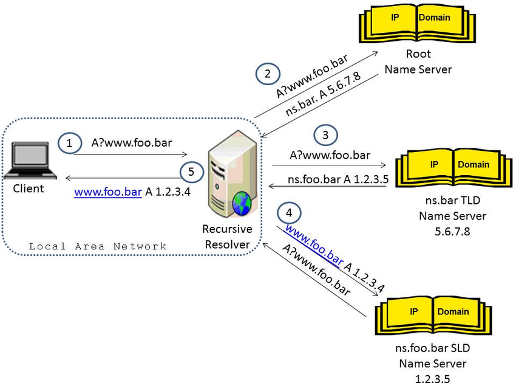

>[!info]
> The Domain Name Systems (DNS) is the phonebook of the Internet. Humans access information online through domain names, like nytimes.com or espn.com. Web browsers interact through Internet Protocol (IP) addresses. DNS translates domain names to ip addresses so browsers can load Internet resources.



# Basic Usage

## DNS Server records

- **NS**: Name Server Records containing the name of the authoritative servers hosting the DNS records for a domain
- **A**: Address Record (IPv4)
- **AAAA**: Quad-A record (IPv6)
- **HINFO**: Host information record
- **MX**: Mail Exchange record
- **TXT**: Text record
- **CNAME**: Canonical Name record, aliases for the host
- **SOA**: Start of Authority record
- **RP**: Responsible Person
- **PTR**: Pointer for Inverse Lookup
- **SRV**: Service Location record

---

# Enumeration

For internal network, search for IP with port 53 open and add them within `/etc/resolv.conf`

- [host](../Tools/host.md) (tool)
- nslookup (tool)
- dig (tool)
- dig (online)
- [dnsrecon](../Tools/dnsrecon.md) (tool)
- [dnsenum](../Tools/dnsenum.md) (tool)
- [dnsdumpster](https://dnsdumpster.com/) (online)
- **sublist3r**
- **websploit**

## Zone transfer

```bash
dig axfr @<DNS_IP> #Try zone transfer without domain
dig axfr @<DNS_IP> <DOMAIN> #Try zone transfer guessing the domain

# Will try toperform a zone transfer against every authoritative name server and if this doesn'twork, 
# will launch a dictionary attack 
fierce -dns <DOMAIN> 

host -l domain.com master.domain.com
```

## More info

```bash
dig ANY @<DNS_IP> <DOMAIN>     #Any information
dig A @<DNS_IP> <DOMAIN>       #Regular DNS request
dig AAAA @<DNS_IP> <DOMAIN>    #IPv6 DNS request
dig TXT @<DNS_IP> <DOMAIN>     #Information
dig MX @<DNS_IP> <DOMAIN>      #Emails related
dig NS @<DNS_IP> <DOMAIN>      #DNS that resolves that name
dig -x 192.168.0.2 @<DNS_IP>   #Reverse lookup
dig -x 2a00:1450:400c:c06::93 @<DNS_IP> #reverse IPv6 lookup

#Use [-p PORT]  or  -6 (to use ivp6 address of dns)
```

## DDNS

>[!quote]
>**nsupdate** is the little-known brother of nslookup. It is used to **make edits on a dynamic DNS without the need to edit zone files** and restart the DNS server. If you have declared a zone dynamic, this is the way that you should be making edits.
>
>[Using the dynamic DNS editor, nsupdate](https://www.rtfm-sarl.ch/articles/using-nsupdate.html)

---

# Exploitation

## DNS rebinding

>[!quote]
>**DNS rebinding** is a method of manipulating resolution of domain names that is commonly used as a form of [computer attack](https://en.wikipedia.org/wiki/Computer_security "Computer security"). In this attack, a malicious [web page](https://en.wikipedia.org/wiki/Web_page "Web page") causes visitors to run a [client-side script](https://en.wikipedia.org/wiki/Client-side_scripting "Client-side scripting") that attacks machines elsewhere on the network. In theory, the [same-origin policy](https://en.wikipedia.org/wiki/Same-origin_policy "Same-origin policy") prevents this from happening: client-side scripts are only allowed to access content on the same host that served the script. Comparing [domain names](https://en.wikipedia.org/wiki/Domain_name "Domain name") is an essential part of enforcing this policy, so DNS rebinding circumvents this protection by abusing the [Domain Name System](https://en.wikipedia.org/wiki/Domain_Name_System "Domain Name System") (DNS).
>
>[DNS rebinding - Wikipedia](https://en.wikipedia.org/wiki/DNS_rebinding)

Because between the check of the resolved IP and the actual request performed to the server can pass different seconds, it may be possible to change the IP resolved by a controlled DNS in order to trick the application into resolving a different IP.

A web service that can be used to continuously change the IP associated to a DNS is [rbndr.us](<[rbndr.us dns rebinding service](https://lock.cmpxchg8b.com/rebinder.html)>).

The tool keep changes the DNS record between the two IP chosen by the attacker, allowing to exploit the DNS rebinding vulnerability and redirect requests to that domain towards malicious IPs.

[baby CachedView](https://www.notion.so/baby-CachedView-4b48c4c7e6a94d8c8a79f9ce9eed5234) 

---

# Config files

```
host.conf
resolv.conf
named.conf
```