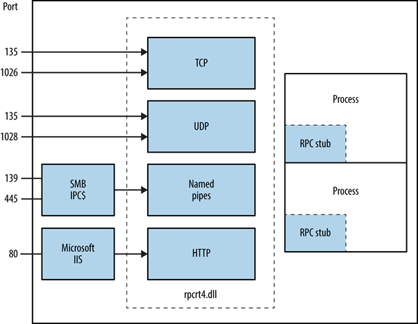
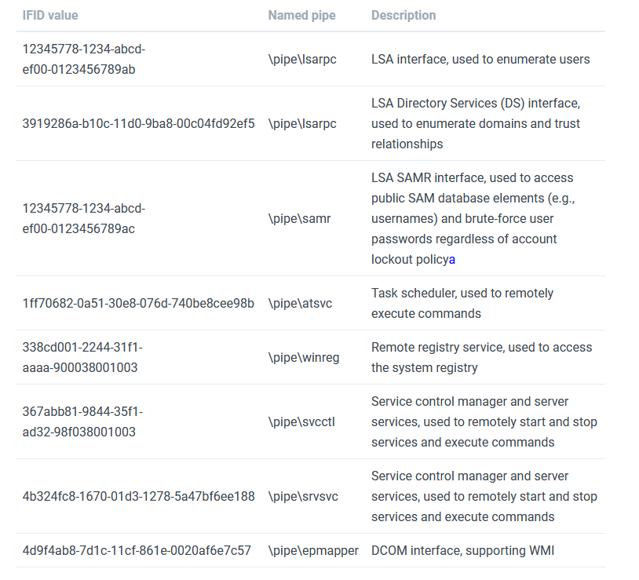

>[!info]
> Microsoft Remote Procedure Call, also known as a function call or a subroutine call, is [a protocol](http://searchmicroservices.techtarget.com/definition/Remote-Procedure-Call-RPC) that uses the client-server model in order to allow one program to request service from a program on another computer without having to understand the details of that computer's network. MSRPC was originally derived from open source software but has been developed further and copyrighted by Microsoft.

Depending on the host configuration, the RPC endpoint mapper can be accessed through TCP and UDP port 135, via SMB with a null or authenticated session (TCP 139 and 445), and as a web service listening on TCP port 593.

# Basic Usage

## How does MSRPC works?

[The MSRPC process begins on the client side](https://technet.microsoft.com/en-us/library/cc738291.aspx), with the client application calling a local stub procedure instead of code implementing the procedure. The client stub code retrieves the required parameters from the client address space and delivers them to the client runtime library, which then translates the parameters into a standard Network Data Representation format to transmit to the server.

The client stub then calls functions in the RPC client runtime library to send the request and parameters to the server. If the server is located remotely, the runtime library specifies an appropriate transport protocol and engine and passes the RPC to the network stack for transport to the server. [^1]

[^1]: https://www.extrahop.com/resources/protocols/msrpc/](https://www.extrahop.com/resources/protocols/msrpc/



---

# Enumeration

- windows (rpcdump)

```powershell
D:\rpctools> rpcdump [-p port] 192.168.189.1
IfId: 5a7b91f8-ff00-11d0-a9b2-00c04fb6e6fc version 1.0
Annotation: Messenger Service
UUID: 00000000-0000-0000-0000-000000000000
Binding: ncadg_ip_udp:192.168.189.1[1028]
```

- [msfconsole (auxiliary modules)](../Tools/msfconsole.md#Auxiliary%20Modules)

```bash
use auxiliary/scanner/dcerpc/endpoint_mapper
use auxiliary/scanner/dcerpc/hidden
use auxiliary/scanner/dcerpc/management
use auxiliary/scanner/dcerpc/tcp_dcerpc_auditor
```

- [NSE (Nmap Scripting Engine)](../Tools/nmap.md#NSE%20(Nmap%20Scripting%20Engine))

```bash
$ rpcinfo -s <ip>
$ rpcinfo -p <ip>
$ nmap -p 135 -sC -sV --script=rpcinfo <IP>
$ rpcdump.py <IP> -p 135
```

- [rpcclient](../Tools/rpcclient.md)

```bash
# Connect to the rpc
rpcclient -U "" -N <IP> #No creds
rpcclient //machine.htb -U domain.local/USERNAME%754d87d42adabcca32bdb34a876cbffb  --pw-nt-hash
# You can use querydispinfo and enumdomusers to query user information
```

- [rpcdump.py](../Tools/impacket.md#rpcdump.py)

```python
# Map possible RPC endpoints
/usr/share/doc/python3-impacket/examples/rpcdump.py -port 135 [[domain/]username[:password]@]<targetName or address>
/usr/share/doc/python3-impacket/examples/rpcdump.py -port 139 [[domain/]username[:password]@]<targetName or address>
/usr/share/doc/python3-impacket/examples/rpcdump.py -port 445 [[domain/]username[:password]@]<targetName or address>
```

- [Enumerate LSARPC and SAMR rpcclient](SMB%20&%20NetBIOS.md#Enumerate%20LSARPC%20and%20SAMR%20rpcclient)


