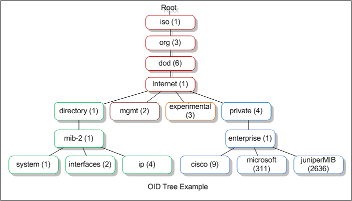

>[!summary]
> **SNMP - Simple Network Management Protocol** is a protocol used to monitor different devices in the network (like routers, switches, printers, IoTs...). Is an Internet Standard protocol for collecting and organizing information about managed devices on IP networks and for modifying that information to change device behaviour. Devices that typically support SNMP include cable modems, routers, switches, servers, workstations, printers, and more.

>[!warning]
>No traffic encryption for:
>- SNMP v1
>- SNMP v2
>- SNMP v2C

# Basic Usage


## MIB Tree - Management Information Base

**MIB** stands for **M**anagement **I**nformation **B**ase and is a **collection of information organized hierarchically**. These are **accessed using** a protocol such as **SNMP**. There are two types of MIBs: **scalar** and **tabular**. Scalar objects define a single object instance whereas tabular objects define multiple related object instances grouped in MIB tables.

## OIDs - Object Identifiers

**OIDs** stands for **O**bject **Id**entifiers. **OIDs uniquely identify managed objects in a MIB hierarchy**. This can be depicted as a tree, the levels of which are assigned by different organizations. Top level MIB object IDs (OIDs) belong to different standard organizations. **Vendors define private branches including managed objects for their own products.**



You can **navigate** through an **OID tree** from the web [here](http://www.oid-info.com/cgi-bin/display?tree=#focus) or **see what a OID means** (like `1.3.6.1.2.1.1`) accessing [http://oid-info.com/get/1.3.6.1.2.1.1](http://oid-info.com/get/1.3.6.1.2.1.1). There are some **well-known OIDs** like the ones inside [1.3.6.1.2.1](http://oid-info.com/get/1.3.6.1.2.1) that references MIB-2 defined Simple Network Management Protocol (SNMP) variables. And from the **OIDs pending from this one** you can obtain some interesting host data (system data, network data, processes data...)

>[!example]
>`1 . 3 . 6 . 1 . 4 . 1 . 1452 . 1 . 2 . 5 . 1 . 3. 21 . 1 . 4 . 7`
>
>Here is a breakdown of this address.
>
>- 1 – this is called the ISO and it establishes that this is an OID. This is why all OIDs start with “1”
>- 3 – this is called ORG and it is used to specify the organization that built the device.
>- 6 – this is the dod or the Department of Defense which is the organization that established the Internet first.
>- 1 – this is the value of the internet to denote that all communications will happen through the Internet.
>- 4 – this value determines that this device is made by a private organization and not a government one.
>- 1 – this value denotes that the device is made by an enterprise or a business entity.
>
>These first six values tend to be the same for all devices and they give you the basic information about them. 
>This sequence of numbers will be the same for all OIDs, except when the device is made by the government.
> 
>Moving on to the next set of numbers.
> 
>- 1452 – gives the name of the organization that manufactured this device.
>- 1 – explains the type of device. In this case, it is an alarm clock.
>- 2 – determines that this device is a remote terminal unit.
> 
> The rest of the values give specific information about the device.
> 
>- 5 – denotes a discrete alarm point.
>- 1 – specific point in the device
>- 3 – port
>- 21 – address of the port
>- 1 – display for the port
>- 4 – point number
>- 7 – state of the point

## MIB Common values

MIB common values
`1.3.6.1.2.1.25.1.6.0`    = System Processes
`1.3.6.1.2.1.25.4.2.1.2`  = Running Programs
`1.3.6.1.2.1.25.4.2.1.4`  = Processes Path
`1.3.6.1.2.1.25.2.3.1.4`  = Storage Units
`1.3.6.1.2.1.25.6.3.1.2`  = Software Name
`1.3.6.1.2.1.77.1.2.25`   = User Accounts
`1.3.6.1.2.1.6.13.1.3`    = TCP Local Ports
`1.3.6.1.4.1.77.1.2.25` = Widows Usernames
`1.3.6.1.2.1.25.4.2.1.2` = Running Windows Processes
`1.3.6.1.2.1.6.13.1.3` = Open TCP Ports
`1.3.6.1.2.1.25.6.3.1.2` = Installed software

## SMB Versions

There are 2 important versions of SNMP:

- **SNMPv1**: Main one, it is still the most frequent, the **authentication is based on a string** (community string) that travels in **plain-text** (all the information travels in plain text). **Version 2 and 2c** send the **traffic in plain text** also and uses a **community string as authentication**.

- **SNMPv3**: Uses a better authentication form and the information travels **encrypted** using (**dictionary attack** could be performed but would be much harder to find the correct creds that inn SNMPv1 and v2).

## Community Strings

In order to access the information saved on the MIB you **need to know the community string on versions 1 and 2/2c** and the **credentials on version 3.** The are **2 types of community strings**:

- `public` mainly **read only** functions
- `private` **Read/Write** in general

Note that **the writability of an OID depends on the community string used**, so **even** if you find that "**public**" is being used, you could be able to **write some values.** Also, there **may** exist objects which are **always "Read Only".** If you try to **write** an object a `noSuchName` **or** `readOnly` **error** is received**.**

In versions 1 and 2/2c if you to use a **bad** community string the server wont **respond**. So, if it responds, a **valid community strings was used**.

## Ports

- The SNMP agent receives requests on UDP port **161**.
- The manager receives notifications ([Traps](https://en.wikipedia.org/wiki/Simple_Network_Management_Protocol#Trap) and [InformRequests](https://en.wikipedia.org/wiki/Simple_Network_Management_Protocol#InformRequest)) on port **162**.
- When used with [Transport Layer Security](https://en.wikipedia.org/wiki/Transport_Layer_Security) or [Datagram Transport Layer Security](https://en.wikipedia.org/wiki/Datagram_Transport_Layer_Security), requests are received on port **10161** and notifications are sent to port **10162**.

---

# Enumeration

## Community string Brute-Force

- [msfconsole (auxiliary modules)](../Tools/msfconsole.md#Auxiliary%20Modules)
- [NSE (Nmap Scripting Engine)](../Tools/nmap.md#NSE%20(Nmap%20Scripting%20Engine))
- [onesixtyone](../Tools/onesixtyone.md)
- [hydra](../Tools/hydra.md#SNMP%20community%20string%20Brute-Force)

```bash
msf> use auxiliary/scanner/snmp/snmp_login
nmap -sU --script snmp-brute <target> [--script-args snmp-brute.communitiesdb=<wordlist> ]
onesixtyone -c /usr/share/metasploit-framework/data/wordlists/snmp_default_pass.txt <IP>
hydra -P /usr/share/seclists/Discovery/SNMP/common-snmp-community-strings.txt target.com snmp
```

## Enumerating SNMP (community string required)

- [snmpwalk](../Tools/snmpwalk.md)
- [snmp-check](../Tools/snmp-check.md)
- [NSE (Nmap Scripting Engine)](../Tools/nmap.md#NSE%20(Nmap%20Scripting%20Engine))

```bash
snmpwalk -v [VERSION_SNMP] -c [COMM_STRING] [DIR_IP]
snmpwalk -v [VERSION_SNMP] -c [COMM_STRING] [DIR_IP] 1.3.6.1.2.1.4.34.1.3 #Get IPv6, needed dec2hex
snmp-check [DIR_IP] -p [PORT] -c [COMM_STRING]
nmap --script "snmp* and not snmp-brute" <target>
```

To see whats does **means** each OID gathered from the device, it is recommended to **install**:

```bash
apt-get install snmp-mibs-downloader
download-mibs
```

And `/etc/snmp/snmp.conf` comment the line `"mibs :"`

>[!tip]
>**It is recommended to install and configure this before launching any SNMP enumeration**. SNMP has a lot of information about the host and things that you may find interesting are: **Network interfaces** (IPv4 and **IPv6** address) and **processes running** (may contain passwords)....

## Massive SNMP

[Braa](https://github.com/mteg/braa) is a mass SNMP scanner. The intended usage of such a tool is, of course, making SNMP queries – but unlike snmpwalk from net-snmp, it is able to query dozens or hundreds of hosts simultaneously, and in a single process. Thus, it consumes very few system resources and does the scanning VERY fast.

Braa implements its OWN snmp stack, so it does NOT need any SNMP libraries like net-snmp.
Syntax: `braa [Community-string]@[IP of SNMP server]:[iso id]`

```
braa ignite123@192.168.1.125:.1.3.6.*
```

So, lets look for the most interesting information [^1]

[^1]: https://blog.rapid7.com/2016/05/05/snmp-data-harvesting-during-penetration-testing/](https://blog.rapid7.com/2016/05/05/snmp-data-harvesting-during-penetration-testing/

---

# Configuration files

```
snmp.conf
snmpd.conf
snmp-config.xml
```