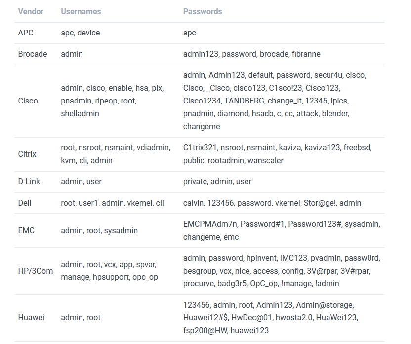
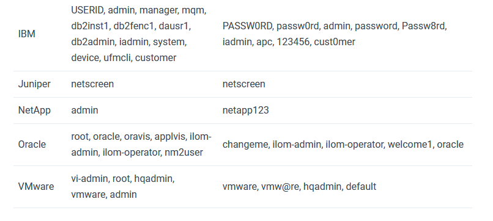

>[!info]
> SSH or Secure Shell or Secure Socket Shell, is a network protocol that gives users a secure way to access a computer over an unsecured network.


# Basic Usage
## SSH servers

- [openSSH](http://www.openssh.org/) – OpenBSD SSH, shipped in BSD, Linux distributions and Windows since Windows 10
- [Dropbear](https://matt.ucc.asn.au/dropbear/dropbear.html) – SSH implementation for environments with low memory and processor resources, shipped in OpenWrt
- [PuTTY](https://www.chiark.greenend.org.uk/~sgtatham/putty/) – SSH implementation for Windows, the client is commonly used but the use of the server is rarer
- [CopSSH](https://www.itefix.net/copssh) – implementation of OpenSSH for Windows

## SSH libraries (implementing server-side)

- [libssh](https://www.libssh.org/) – multiplatform C library implementing the SSHv2 protocol with bindings in [Python](https://github.com/ParallelSSH/ssh-python), [Perl](https://github.com/garnier-quentin/perl-libssh/) and [R](https://github.com/ropensci/ssh); it’s used by KDE for sftp and by GitHub for the git SSH infrastructure
- [wolfSSH](https://www.wolfssl.com/products/wolfssh/) – SSHv2 server library written in ANSI C and targeted for embedded, RTOS, and resource-constrained environments
- [Apache MINA SSHD](https://mina.apache.org/sshd-project/index.html) – Apache SSHD java library is based on Apache MINA
- [paramiko](https://github.com/paramiko/paramiko) – Python SSHv2 protocol library


---

# Enumeration
## Banner Grabbing

- **SSH package version** - Might be able to find the OS and version.
- **SSH key fingerprint** - Has the key been re-used somewhere (Another machine? Same machine, just another port/service?)
	What happens if you see multiple SSH services on different ports which have the same key? What could it mean if they are different? Why would you see the same key on another box? On this subject: A useful resource ~ [https://github.com/rapid7/ssh-badkeys](https://github.com/rapid7/ssh-badkeys)
- **SSH banner** - Any text (if at all) before the password prompt (often get legal warnings about connecting to it)

Tools:

- [netcat](../Tools/netcat.md)

```bash
nc -vn <IP> 22
```

## Automated Enumeration

- ssh-audit

```bash
usage: ssh-audit.py [-1246pbcnjvlt] <host>

   -1,  --ssh1             force ssh version 1 only
   -2,  --ssh2             force ssh version 2 only
   -4,  --ipv4             enable IPv4 (order of precedence)
   -6,  --ipv6             enable IPv6 (order of precedence)
   -p,  --port=<port>      port to connect
   -b,  --batch            batch output
   -c,  --client-audit     starts a server on port 2222 to audit client
                               software config (use -p to change port;
                               use -t to change timeout)
   -n,  --no-colors        disable colors
   -j,  --json             JSON output
   -v,  --verbose          verbose output
   -l,  --level=<level>    minimum output level (info|warn|fail)
   -t,  --timeout=<secs>   timeout (in seconds) for connection and reading
                               (default: 5)
$ python3 ssh-audit <IP>
```

- [NSE (Nmap Scripting Engine)](../Tools/nmap.md#NSE%20(Nmap%20Scripting%20Engine))

## Public SSH key of server

```bash
ssh-keyscan -t rsa <IP> -p <PORT>
```

## Username Enumeration

- [msfconsole (auxiliary modules)](../Tools/msfconsole.md#Auxiliary%20Modules)

```bash
msf> use scanner/ssh/ssh_enumusers
```

---

# Exploitation

## Brute Force

- [hydra](../Tools/hydra.md#SSH%20Brute-Force)
- [medusa](../Tools/medusa.md)

## Private/Public Keys BF

If you know some ssh private key that could be used... lets try it. You can use the nmap script or the msf auxiliary modules:

```bash
https://nmap.org/nsedoc/scripts/ssh-publickey-acceptance.html
msf> use scanner/ssh/ssh_identify_pubkeys
```

## Known SSH-badkeys / OpenSSL Predictable PRNG (CVE-2008-0166)

>[!danger]
>List of badkeys: https://github.com/rapid7/ssh-badkeys/tree/master/authorized

This is a collection of static SSH keys (host and authentication) that have made their way into software and hardware products. This was inspired by the [Little Black Box](https://code.google.com/p/littleblackbox/) project, but focused primarily on SSH (as opposed to TLS) keys.

Keys are split into two categories; authorized keys and host keys. The authorized keys can be used to gain access to a device with this public key. The host keys can be used to conduct a MITM attack against the device, but do not provide direct access.

This collection depends on submissions from researchers to stay relevant. If you are aware of a static key (host or authorized), please open an [Issue](https://github.com/rapid7/ssh-badkeys/issues) or submit a Pull Request. The [Issues](https://github.com/rapid7/ssh-badkeys/issues) list also contains a wishlist of known bad keys that we would like to include.

For additional key types and a broader scope, take a look at the [Kompromat](https://github.com/BenBE/kompromat) project.


## SFTP command execution

Another common SSH misconfiguration is often seen in SFTP configuration. Most of the time when creating a SFTP server the administrator want users to have a SFTP access to share files but not to get a remote shell on the machine. So they think that creating a user, attributing him a placeholder shell (like `/usr/bin/nologin` or `/usr/bin/false`) and chrooting him in a jail is enough to avoid a shell access or abuse on the whole file system. But they are wrong, **a user can ask to execute a command right after authentication before it’s default command or shell is executed**. So to bypass the placeholder shell that will deny shell access, one only has to ask to execute a command (eg. `/bin/bash`) before, just by doing:

```bash
$ ssh -v noraj@192.168.1.94 id
...
Password:
debug1: Authentication succeeded (keyboard-interactive).
Authenticated to 192.168.1.94 ([192.168.1.94]:22).
debug1: channel 0: new [client-session]
debug1: Requesting no-more-sessions@openssh.com
debug1: Entering interactive session.
debug1: pledge: network
debug1: client_input_global_request: rtype hostkeys-00@openssh.com want_reply 0
debug1: Sending command: id
debug1: client_input_channel_req: channel 0 rtype exit-status reply 0
debug1: client_input_channel_req: channel 0 rtype eow@openssh.com reply 0
uid=1000(noraj) gid=100(users) groups=100(users)
debug1: channel 0: free: client-session, nchannels 1
Transferred: sent 2412, received 2480 bytes, in 0.1 seconds
Bytes per second: sent 43133.4, received 44349.5
debug1: Exit status 0

$ ssh noraj@192.168.1.94 /bin/bash
```

---

# Misc

## Default Credentials




## Disable root login

1. Edit SSH server configuration `sudoedit /etc/ssh/sshd_config`
2. Change `#PermitRootLogin yes` into `PermitRootLogin no`
3. Take into account configuration changes: `sudo systemctl daemon-reload`
4. Restart the SSH server `sudo systemctl restart sshd`

## Securing SFTP

This configuration will allow only SFTP: disabling shell access by forcing the start command and disabling TTY access but also disabling all kind of port forwarding or tunneling.

```bash
Match User noraj
        ChrootDirectory %h
        ForceCommand internal-sftp
        AllowTcpForwarding no
        PermitTunnel no
        X11Forwarding no
        PermitTTY no
```

## SSH/SFTP Tunneling

- [SSH Local Port Forwarding](../Web%20&%20Network%20Hacking/Pivoting.md#SSH%20Local%20Port%20Forwarding)
- [SSH Remote Port Forwarding](../Web%20&%20Network%20Hacking/Pivoting.md#SSH%20Remote%20Port%20Forwarding)
- [SSH Dynamic Reverse Tunnel](../Web%20&%20Network%20Hacking/Pivoting.md#SSH%20Dynamic%20Reverse%20Tunnel)

S**ftp** have the command "**symlink**". Therefor, if you have **writable rights** in some folder, you can create **symlinks** of **other folders/files**. As you are probably **trapped** inside a chroot this **won't be specially useful** for you, but, if you can **access** the created **symlink** from a **no-chroot** **service** (for example, if you can access the symlink from the web), you could **open the symlinked files through the web**.

For example, to create a symlink from a new file "froot" to "/":

```bash
sftp> symlink / froot
```

## Authentication methods

On high security environment it’s a common practice to enable only key-based or two factor authentication rather than the simple factor password based authentication. But often the stronger authentication methods are enabled without disabling the weaker ones. A frequent case is enabling `publickey` on openSSH configuration and setting it as the default method but not disabling `password`. So by using the verbose mode of the SSH client an attacker can see that a weaker method is enabled:

```bash
$ ssh -v 192.168.1.94
OpenSSH_8.1p1, OpenSSL 1.1.1d  10 Sep 2019
...
debug1: Authentications that can continue: publickey,password,keyboard-interactive
```

For example if an authentication failure limit is set and you never get the chance to reach the password method, you can use the `PreferredAuthentications` option to force to use this method.

```bash
$ ssh -v 192.168.1.94 -o PreferredAuthentications=password
...
debug1: Next authentication method: password
```

If the host is and older one and supports only legacy ciphers, it is possible to log in using the following methods:

```bash
$ ssh -oKexAlgorithms=+diffie-hellman-group1-sha1 -c 3des-cbc enduser@10.255.252.1
```

## Generate SSH keys

```bash
ssh-keygen -t rsa
```

## Conf files

```
ssh_config
sshd_config
authorized_keys
ssh_known_hosts
known_hosts
id_rsa
```