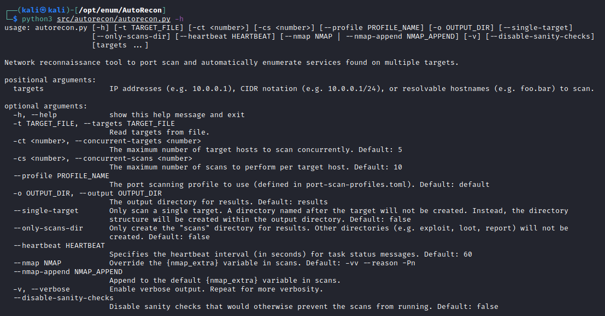

# Usage

```bash
usage: autorecon    [-h] [-t TARGET_FILE] [-ct <number>] [-cs <number>]
[--profile PROFILE_NAME] [-o OUTPUT_DIR] [--single-target]
[--only-scans-dir] [--heartbeat HEARTBEAT]
[--nmap NMAP | --nmap-append NMAP_APPEND] [-v]
[--disable-sanity-checks]
[targets [targets ...]]
```

# Results

```
.
├── exploit/
├── loot/
├── report/
│   ├── local.txt
│   ├── notes.txt
│   ├── proof.txt
│   └── screenshots/
└── scans/
    ├── _commands.log
    ├── _manual_commands.txt
    └── xml/
```