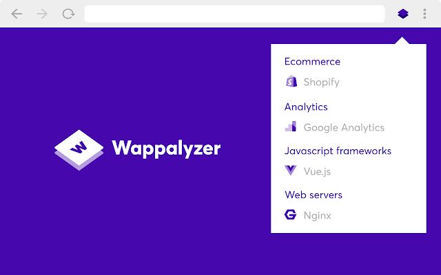
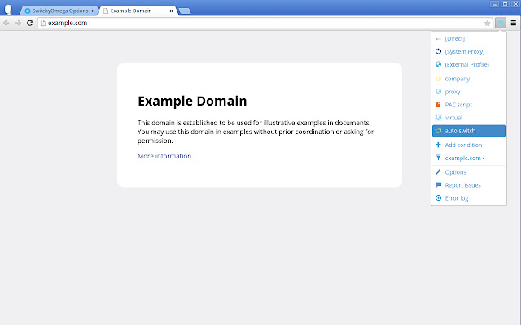
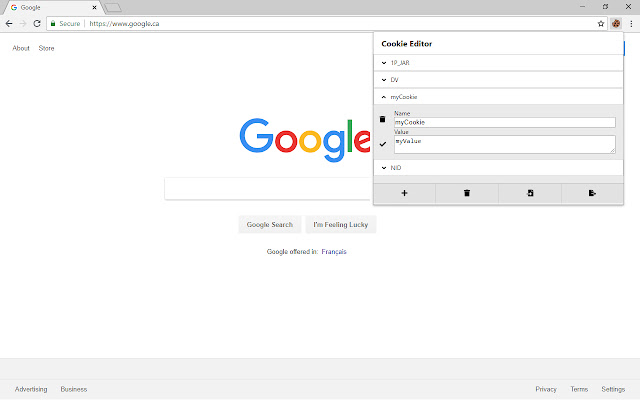
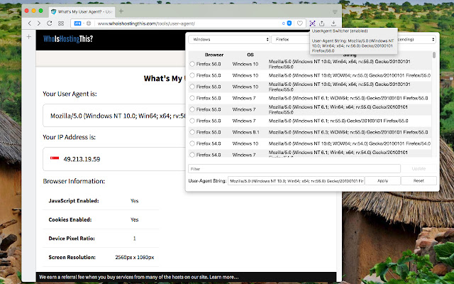
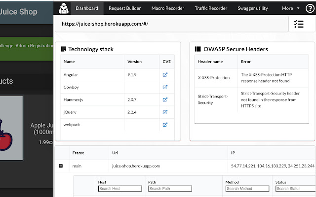
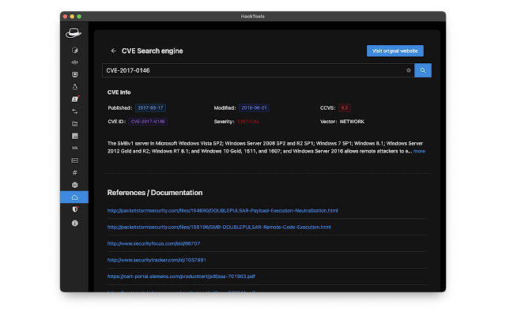
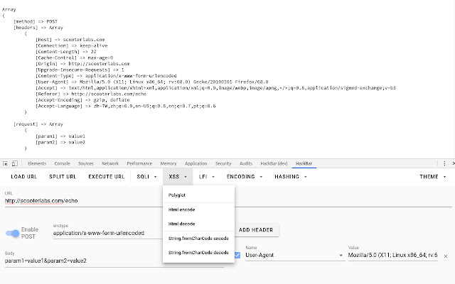
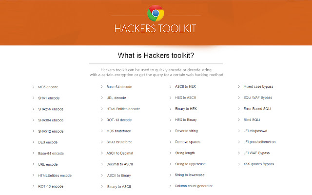

# Wappalyzer

>[!info]
>Wappalyzer is a technology profiler that shows you what websites are built with. Find out what CMS a website is using, as well as any framework, ecommerce platform, JavaScript libraries and many more
>
>Download: [Wappalyzer - Technology profiler](https://chrome.google.com/webstore/detail/wappalyzer-technology-pro/gppongmhjkpfnbhagpmjfkannfbllamg/related)

# Proxy SwitchyOmega

>[!info]
>Manage and switch between multiple proxies quickly & easily.
>
>Download: [Proxy SwitchyOmega](https://chrome.google.com/webstore/detail/proxy-switchyomega/padekgcemlokbadohgkifijomclgjgif/related)

# Cookie-Editor

>[!info]
>Simple yet powerful Cookie Editor that allow you to quickly create, edit and delete cookies without leaving your tab.
>
>Download: [Cookie-Editor](https://chrome.google.com/webstore/detail/cookie-editor/hlkenndednhfkekhgcdicdfddnkalmdm)

# User-Agent Switcher and Manager

>[!info] 
>Spoof websites trying to gather information about your web navigation to deliver distinct content you may not want.
>
>Download: [User-Agent Switcher and Manager](https://chrome.google.com/webstore/detail/user-agent-switcher-and-m/bhchdcejhohfmigjafbampogmaanbfkg)

# Penetration Testing Kit

>[!info] 
>Are you a penetration tester or a member of a Red Team or just an application security practitioner? Need a security insight on an application?  Try the PTK - an extension that makes your browser smarter.
>Based on the Wappalyzer NPM module the PTK provides a piece of insightful information about a technology stack, security headers, crawled links, and domains. A detailed traffic log allows a user to repeat a request in the R-Builder or send for attacking to the R-Attacker and execute XSS, SQL, or OS Command injections on any particular request.
>Decoder/Encoder, Swagger Editor, and much more that helps in day to day application security job.
>
>Download: [Penetration Testing Kit](https://chrome.google.com/webstore/detail/penetration-testing-kit/ojkchikaholjmcnefhjlbohackpeeknd)

# Hack-Tools

>[!info] 
>The all in one Red team extension for web pentester.
>
>Download: [Hack-Tools](https://chrome.google.com/webstore/detail/hack-tools/cmbndhnoonmghfofefkcccljbkdpamhi)

# HackBar

>[!info] 
>HackBar for Chrome
>
>Download: [HackBar](https://chrome.google.com/webstore/detail/hackbar/ginpbkfigcoaokgflihfhhmglmbchinc)

# **Hackers toolkit**

>[!info] 
>Quickly encode or decode string with a certain encryption or get the query for a certain web hacking method.
>
>Download: [Hackers toolkit](https://chrome.google.com/webstore/detail/hackers-toolkit/iebkeiopbbfnmieadmojmocohdmaghmb/related)

