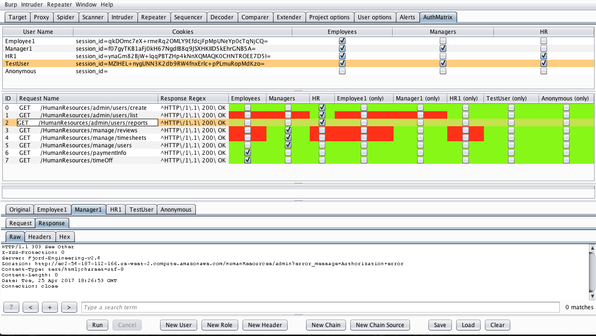
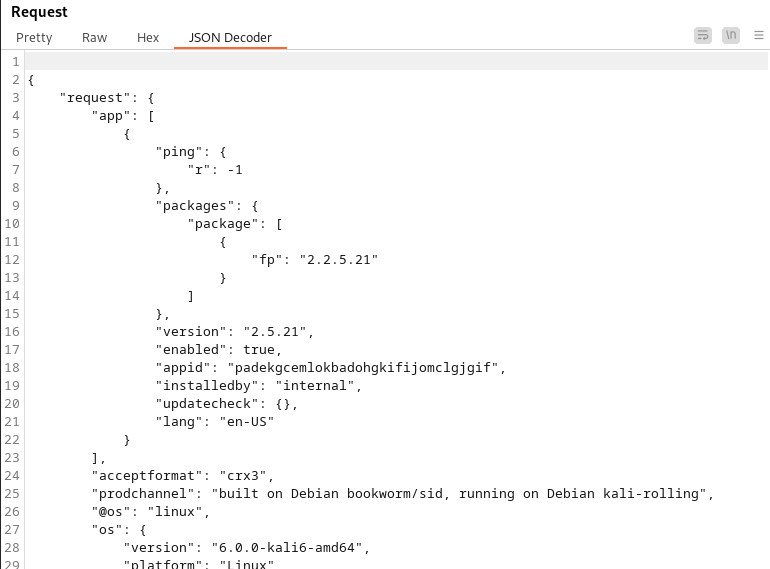
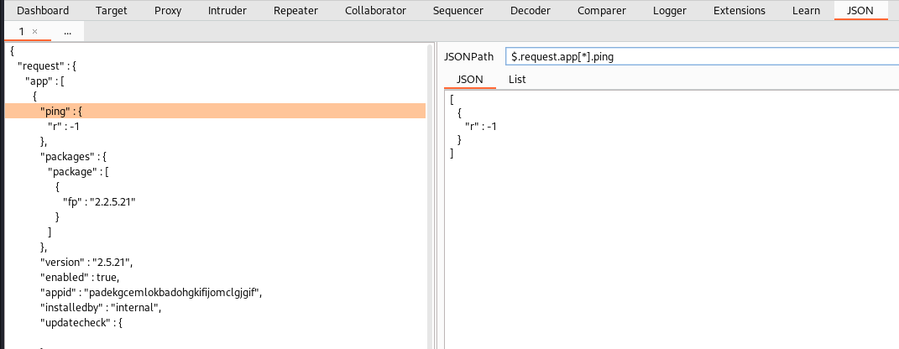

>[!tip] Reuse the same license on multiple devices
>1. Create a user with the same uid, gid and name of the original one (or use root)
>2. Copy the .jar file of burpsuite-pro
>3. Copy the `/root/.java/.userPrefs/burp/prefs.xml` file

# Useful extensions

>[!info]
>The ones marked with a \* are only available for the Pro Version

## Traffic Auditor

### *Retire.js

Integrates Burp with the Retire.js repository to find vulnerable JavaScript libraries. It passively looks at JavaScript files loaded and identifies those which are vulnerable.

### *Software Vulnerability Scanner

Scans for vulnerabilities in detected software versions using the Vulners.com API. It adds a new page where you can analyze all the findings and add your custom regex to inspect for, and it also adds issues to the target page.

### *Software Version Reporter

Passively detects server software version numbers during scanning, spidering etc. It summarizes all the findings within a dedicated tab but it also generates issues within the Target tab.

### *JS Miner

Find interesting stuff inside static files, like secrets, credentials, subdomains, API endpoint, etc. It **can be used both passively (default) or actively** (through the "Extensions" menu).

### *Reflected Parameters

Monitors traffic and looks for request parameter values (longer than 3 characters) that are reflected in the response. **Launch active scans against those parameters** from the apposite tab.

### *CSRF Scanner

Used to passively scan for [Cross-Site Request Forgery (CSRF)](../Web%20&%20Network%20Hacking/Session%20Attacks%20(CSRF,%20session%20stealing,%20etc.).md#Cross-Site%20Request%20Forgery%20(CSRF)). A dedicated tab allows to customize token's names, etc. The scanner send requests passively in background.

### *Error Message Checks

This extension passively reports detailed server error messages. You can configure arbitrary match results from the apposite tab.

### CSP Auditor

This extension provides a **readable view of CSP headers for responses**. It also **includes passive scan rules** to detect weak CSP configurations.

### *CSP-Bypass

This extension is designed to **passively scan for CSP headers** that contain known bypasses as well as other potential weaknesses.

### HTML5 Auditor

This extension checks for usage of HTML5 features that have potential security risks (client side storage, client geo-location, HTML5 client caches, web sockets)

## Active scanner enhancement

### *Active Scan++

ActiveScan++ extends Burp Suite's **active and passive scanning capabilities** with host header attacks, edge side includes, XML attacks, input transofmrations, blind code injection and CVEs. To invoke these checks, **just run a normal active scan**.

### *J2EEScan

Adds more than 80+ unique security test cases and new strategies to discover different kind of J2EE vulnerabilities.

### *Backslash Powered Scanning

This extension **complements Burp's active scanner** by using a novel approach capable of finding and confirming both known and unknown classes of server-side injection vulnerabilities. Evolved from classic manual techniques, this approach reaps many of the benefits of manual testing including casual WAF evasion, a tiny network footprint, and flexibility in the face of input filtering. Run the scan from the `Extension > Backslash Powered Scanner > diff-scan`

### Java Deserialization Scanner

Gives Burp Suite the ability to find Java deserialization vulnerabilities. It **adds checks to both the active and passive scanner** and can also be used in an **"Intruder like" manual mode**, with a dedicated tab.

### *Freddy, Deserialization Bug Finder

Helps with detecting and exploiting serialization libraries/APIs **with passive and active scans**.

### *NoSQL Scanner

This extension provides a way to discover NoSQL injection vulnerabilities. It **adds Passive and Active Scanner checks**.

### *CMS Scanner

**Active scan extension** for Burp that provides supplemental coverage when testing popular content management systems. 

### *NGINX Alias Traversal

Detects NGINX alias traversal due to misconfiguration. The extension implements an **active scanner check**. Simply run a new scan, preferably with an "Audit checks extensions only" configuration, on static resources identified via Burp's crawler.

### *IIS Tilde Enumeration Scanner

**Add an Active Scanner check** for detecting IIS Tilde Enumeration vulnerability and **add a new tab in the Burp UI to manually exploit the vulnerability**.

## Fuzzing & Tiny scan

### *403 Bypasser

Tries different bypass techniques, including method switching, `..;` permutations, different headers, etc. 
The scan can be started from the `Extensions > 403 Bypasser` menu.

### Param Miner

Identifies hidden, unlinked parameters. It's particularly useful for finding web cache poisoning vulnerabilities.

### HTTP Request Smuggler

Supports scanning for Request Smuggling vulnerabilities, and also aids exploitation by handling cumbersome offset-tweaking for you.

### Server-Side Prototype Pollution Scanner

### *Collaborator Everywhere

Augments your in-scope proxy traffic by injecting non-invasive headers designed to reveal backend systems by causing pingbacks to Burp Collaborator.

### *Log4Shell Everywhere

Fork of James Kettle's excellent Collaborator Everywhere, with the injection parameters changed to payloads for the critical log4j CVE-2021-44228 vulnerability.

### *Upload Scanner

Implements most attacks that seem feasible for file uploads. The extension is testing various attacks and is divided into modules. Each module handles several attacks of the same category.

### *CORS, Additional CORS Checks

This extension can be used to test websites for CORS misconfigurations. It can spot trivial misconfigurations like arbitrary origin reflection, but also more sublte ones where a regex is not properly configured. "CORS* Additional CORS Checks" can be run in either **automatic** or **manual mode**.

### Command Injection Attacker

A comprehensive OS command injection payload generator. This extension is a customizable payload generator, suitable for detecting OS command injection flaws during dynamic testing.

## API

### Wsdler

Takes a WSDL request, parses out the operations that are associated with the targeted web service, and generates SOAP requests that can then be sent to the SOAP endpoints.

### OpenAPI Parser

Aimed at streamlining the process of performing web service assessments involving OpenAPI based APIs.

## Authorization

### Autorize

Give to the extension the cookies of a low privileged user and navigate the website with a high privileged user. The extension automatically repeats every request with the session of the low privileged user and detects authorization vulnerabilities.

### Auth Analyzer

Helps you to find authorization bugs. Just navigate through the web application with a high privileged user and let the Auth Analyzer repeat your requests for any defined non-privileged user. With the possibility to define Parameters the Auth Analyzer is able to extract and replace parameter values automatically.

### AuthMatrix

Provides a simple way to test authorization in web applications and web services. Testers focus on thoroughly defining tables of users, roles, and requests for their specific target application upfront. These tables are displayed through the UI in a similar format to that of an access control matrix.

## JSON and JWT analysis

### JSON Web Tokens

JWT4B lets you decode and manipulate JSON web tokens on the fly, check their validity and automate common attacks. Automatic recognition, JWT Editor, Resigning of JWTs, Signature checks, Automated attacks, Validity checks, Automatic tests for security flags in cookie transmitted JWTs.

### JWT Editor

Extension and standalone application for editing, signing, verifying, encrypting and decrypting JSON Web Tokens. Automatic detection and in-line editing of JWTs within HTTP requests/responses, signing and encrypting of tokens and automation of several well-known attacks against JWT implementations.

### JSON Decoder

Adds a new tab to Burp's HTTP message editor, and displays JSON messages in decoded form.

### JSON Query

Parse and beautify JSON responses. Query JSON with JSONPath.

### *GraphQL Raider

The gql query and variables are extracted from the unreadable json body and displayed in separate tabs. Not only the variables are extracted as insertion point for the scanner. Furthermore the values inside the query are also extracted as insertion point for the scanner.

### *InQL Introspection GraphQL Scanner

A full featured framework for enumerating and testing GraphQL.

## Quality of life improvements and feature ehnancments

### Turbo Intruder

Extension for sending large numbers of HTTP requests and analyzing the results. It's intended to complement Burp Intruder by handling attacks that require extreme speed or complexity.

### Content Type Converter

Converts data within JSON2XML, XML2JSON, HTTP2JSON. HTTP2XML

### .NET Beautifier

Beautifies .NET requests to make the body parameters more human readable. Built-in parameters like \_\_VIEWSTATE have their values masked. Form field names have the auto-generated part of their name removed.

### Hackvector

tag-based conversion tool that supports various escapes and encodings.

### Copy As Python-Requests

This extension copies selected request(s) as Python-Requests invocations.

### Request Timer

Captures response times for requests made by all Burp tools. It could be useful in uncovering potential timing attacks.

### Request Highlighter

Provides an automatic way to highlight HTTP requests based on headers content.

### Logger++

Multithreaded logging extension for Burp Suite. In addition to logging requests and responses from all Burp Suite tools, the extension allows advanced filters to be defined to highlight interesting entries or filter logs to only those which match the filter.

