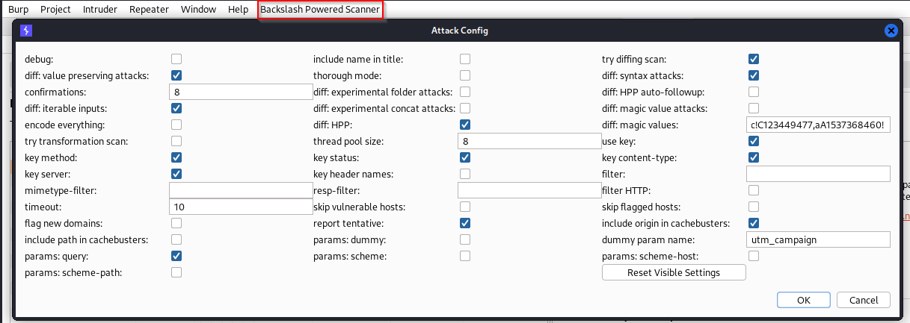

>[!tip] Reuse the same license on multiple devices
>1. Create a user with the same uid, gid and name of the original one (or use root)
>2. Copy the .jar file of burpsuite-pro
>3. Copy the `/root/.java/.userPrefs/burp/prefs.xml` file
>4. Launch the JAR file using the desired parameters [^burp-cmd-param]

[^burp-cmd-param]: [Launching Burp Suite from the command line](https://portswigger.net/burp/documentation/desktop/troubleshooting/launch-from-command-line), portswigger.net

# Tip and tricks

## Fix burpsuite browser not opening

- You need to find the chrome-sandbox binary bundled with your burpsuite : `find ~ -type f -name "chrome-sandbox"`
	- Result should be something like this: `/home/kali/.BurpSuite/burpbrowser/126.0.6478.55/chrome-sandbox`
- then: `sudo chown root:root /home/kali/.BurpSuite/burpbrowser/*/chrome-sandbox && sudo chmod 4755 /home/kali/.BurpSuite/burpbrowser/*/chrome-sandbox`

## Match and replace tricks
### Discover [SSRF](../Web%20&%20Network%20Hacking/Server%20Side%20Request%20Forgery%20(SSRF).md) easier using match and replace for any URL

Set a match & replace rule to match any URL in a request and replace it with your canary token / URL that you control!


### Template in wordlists + match and replace

Typically to find this class of bug, we would use “Fuzzing - path traversal (single file)” then simply replace the `{FILE}` pattern with a file which we know is present on the target system - `/etc/passwd` is usually a good bet. [^match-and-replace-regex] 

```regex
Match [\{FILE\}] replace with [/etc/hosts]
```

[^match-and-replace-regex]: [GitLab Arbitrary File Read (CVE-2023-2825) Analysis](../../Readwise/Articles/Sonny%20-%20GitLab%20Arbitrary%20File%20Read%20(CVE-2023-2825)%20Analysis.md#Highlights)

---

## Develop your custom extensions 
Reference: https://security.humanativaspa.it/tag/montoya-api/
1. [Setting up the environment + Hello World](https://security.humanativaspa.it/extending-burp-suite-for-fun-and-profit-the-montoya-way-part-1/)
2. [Inspecting and tampering HTTP requests and responses](https://security.humanativaspa.it/extending-burp-suite-for-fun-and-profit-the-montoya-way-part-2)
3. [Inspecting and tampering WebSocket messages](https://security.humanativaspa.it/extending-burp-suite-for-fun-and-profit-the-montoya-way-part-3/)
4. [Creating new tabs for processing HTTP requests and responses](https://security.humanativaspa.it/extending-burp-suite-for-fun-and-profit-the-montoya-way-part-4/)
5. [Adding new functionalities to the context menu (accessible by right-clicking)](https://security.humanativaspa.it/extending-burp-suite-for-fun-and-profit-the-montoya-way-part-5/)
6. [Adding new checks to Burp Suite Active and Passive Scanner](https://security.humanativaspa.it/extending-burp-suite-for-fun-and-profit-the-montoya-way-part-6)

# Useful extensions

>[!info]
>The ones marked with a \* are only available for the Pro Version

## Traffic Auditor

### Sensitive Discoverer

SensitiveDiscoverer is a Burp Suite extension to scan for particular pattern or file extensions inside HTTP messages. With this extension you can automatically search for sensitive strings in HTTP messages. It uses a list of Regular Expressions and File Extensions to match for in each message. The plugin is available with a pre-defined set of Regular Expression and File Extensions, but you can also add your custom lists.

Features:
- Multithreaded scan of messages
- Pre-defined set of regex
- Many filters to skip irrelevant messages
- Customizable regexes lists
- Import regexes from CSV/JSON files
- Export results to CSV/JSON files


### *Retire.js 🔝

Integrates Burp with the Retire.js repository to find vulnerable JavaScript libraries. It passively looks at JavaScript files loaded and identifies those which are vulnerable.


### *Software Vulnerability Scanner 🔝

Scans for vulnerabilities in detected software versions using the Vulners.com API. It adds a new page where you can analyze all the findings and add your custom regex to inspect for, and it also adds issues to the target page.


### *Software Version Reporter 🔝

Passively detects server software version numbers during scanning, spidering etc. It summarizes all the findings within a dedicated tab but it also generates issues within the Target tab.


### *JS Miner 🔝

Find interesting stuff inside static files, like secrets, credentials, subdomains, API endpoint, etc. It **can be used both passively (default) or actively** (through the "Extensions" menu).


### *JS Link Finder

Burp Extension for a passively scanning JavaScript files for endpoint links. - Export results the text file - Exclude specific 'js' files e.g. jquery, google-analytics

### *Additional Scanner Check 🔝

This extension provides some additional passive Scanner checks:

- DOM-based XSS (regular expressions are based on those from https://code.google.com/p/domxsswiki/wiki/FindingDOMXSS)
- Missing HTTP headers:
    - Strict-Transport-Security
    - X-Content-Type-Options: nosniff
    - X-XSS-Protection
- Multiple occurrences of the checked headers
- Redirection from HTTP to HTTPS

All checks can be enabled separately in an extension tab and a default config can be stored.

### *Reflected Parameters 🔝

Monitors traffic and looks for request parameter values (longer than 3 characters) that are reflected in the response. **Launch active scans against those parameters** from the apposite tab.


### Paramalyzer 🔝

This extension can improve efficiency of manual parameter analysis for web penetration tests of either complex or numerous applications. This can assist in tasks such as identifying sensitive data, identifying hash algorithms, decoding parameters, and determining which parameters are reflected in the response.

This extension performs an in-depth and intelligent parameter analysis of all in-scope Burp traffic. Results are displayed in an interactive table and can be sent directly to other Burp tools such as Repeater.

See the doc: https://jgillam.github.io/burp-paramalyzer/

### *Detect Dynamic JS

This extension compares JavaScript files with each other to detect dynamically generated content and content that is only accessible when the user is authenticated. This occasionally contains not only code but also _data_ with user or session information. User/session information can then be checked for potential leakage. This extension is supposed to help hunting for exploitable situations.

To trigger the extension, simply launch a passive scan of your JavaScript files that you have requested as authenticated user. Despite being a passive scan, the extension will generate one or sometimes two request per script without cookies to get the non-authenticated version of the script.

If the same script is found to contain differing content, the extension will report an issue in the Target tab.
### *Error Message Checks 🔝

This extension passively reports detailed server error messages. You can configure arbitrary match results from the apposite tab.


### *WAFDetect 🔝

This extension passively detects the presence of a web application firewall (WAF) from HTTP responses.

### CSP Auditor

This extension provides a **readable view of CSP headers for responses**. It also **includes passive scan rules** to detect weak CSP configurations.


### *CSP-Bypass

This extension is designed to **passively scan for CSP headers** that contain known bypasses as well as other potential weaknesses.


### HTML5 Auditor

This extension checks for usage of HTML5 features that have potential security risks (client side storage, client geo-location, HTML5 client caches, web sockets)


### EsPReSSO 🔝

This extension processes and recognizes single sign-on protocols.

**Detecting**

Supported Protocols:

- SAML
- OpenID
- OAuth
- BrowserId
- OpenID Connect
- Facebook Connect
- Microsoft Account

**Attacking**

- WS-Attacker integration while intercepting SAML messages
- DTD-Attacker integration while intercepting SAML messages
- XML-Encryption-Attacker integration while intercepting SAML messages

**Beautifier**

- Syntax Highlight
- Highlight SSO messages in proxy window and display the protocol type
- Show all recognized SSO messages in a history tab
- Context menu for 'Analyze SSO Protocol'

**Editors/Viewers**

- View and edit SAML
- View JSON and JSON Web Token (JWT)

## Active scanner enhancement

### *Active Scan++ 🔝

ActiveScan++ extends Burp Suite's **active and passive scanning capabilities** with host header attacks, edge side includes, XML attacks, input transofmrations, blind code injection and CVEs. To invoke these checks, **just run a normal active scan**.

### *J2EEScan 🔝

Adds more than 80+ unique security test cases and new strategies to discover different kind of J2EE vulnerabilities.

### *Backslash Powered Scanning 🔝

This extension **complements Burp's active scanner** by using a novel approach capable of finding and confirming both known and unknown classes of server-side injection vulnerabilities. Evolved from classic manual techniques, this approach reaps many of the benefits of manual testing including casual WAF evasion, a tiny network footprint, and flexibility in the face of input filtering. Run the scan from the `Extension > Backslash Powered Scanner > diff-scan`




### *URL Fuzzer

Fuzz URLs with all available ASCII characters to identify parser inconsistencies. Based on the work of Rafael da Costa Santos (https://rafa.hashnode.dev/exploiting-http-parsers-inconsistencies) and Orange Tsai (https://youtu.be/28xWcRegncw?si=t6BcScfQsz-2wFap).
Usage
Run an active scan against a target, and view results as issues.
### Java Deserialization Scanner

Gives Burp Suite the ability to find Java deserialization vulnerabilities. It **adds checks to both the active and passive scanner** and can also be used in an **"Intruder like" manual mode**, with a dedicated tab.

The extension allows the user to _discover and exploit_ Java Deserialization Vulnerabilities with different encodings (Raw, Base64, Ascii Hex, GZIP, Base64 GZIP) when the following libraries are loaded in the target JVM:

- Apache Commons Collections 3 (up to 3.2.1), with five different chains
- Apache Commons Collections 4 (up to 4.4.0), with two different chains
- Spring (up to 4.2.2)
- Java 6 and Java 7 (up to Jdk7u21) without any weak library
- Hibernate 5
- JSON
- Rome
- Java 8 (up to Jdk8u20) without any weak library
- Apache Commons BeanUtils
- Javassist/Weld
- JBoss Interceptors
- Mozilla Rhino (two different chains)
- Vaadin


### *Freddy, Deserialization Bug Finder (Java and .NET)

Helps with detecting and exploiting serialization libraries/APIs **with passive and active scans**.

Freddy Features:

- **Passive Scanning** - Freddy can passively detect the use of potentially dangerous serialization libraries and APIs by watching for type specifiers or other signatures in HTTP requests and by monitoring HTTP responses for exceptions issued by the target libraries. For example the library FastJson uses a JSON field $types to specify the type of the serialized object.
- **Active Scanning** - Freddy includes active scanning functionality which attempts to both detect and, where possible, exploit affected libraries.

Active scanning attempts to detect the use of vulnerable libraries using three methods:

- **Exception Based** - In exception-based active scanning, Freddy inserts data into the HTTP request that should trigger a known target-specific exception or error message. If this error message is observed in the application's response then an issue is raised.
- **Time Based** - In some cases time-based payloads can be used for detection because operating system command execution is triggered during deserialization and this action blocks execution until the OS command has finished executing. Freddy uses payloads containing ping [-n|-c] 21 127.0.0.1 in order to induce a time delay in these cases.
- **Collaborator Based** - Collaborator-based payloads work either by issuing a nslookup command to resolve the Burp Suite Collaborator-generated domain name, or by attempting to load remote classes from the domain name into a Java application. Freddy checks for new Collaborator issues every 60 seconds and marks them in the issues list with RCE (Collaborator).

Supported target: **Java** and **.NET**


### *NoSQL Scanner

This extension provides a way to discover NoSQL injection vulnerabilities. It **adds Passive and Active Scanner checks**.

### *CMS Scanner

**Active scan extension** for Burp that provides supplemental coverage when testing popular content management systems. 

### *NGINX Alias Traversal

Detects NGINX alias traversal due to misconfiguration. The extension implements an **active scanner check**. Simply run a new scan, preferably with an "Audit checks extensions only" configuration, on static resources identified via Burp's crawler.


Read [Hunting for Nginx Alias Traversals in the wild](https://labs.hakaioffsec.com/nginx-alias-traversal/) to better understand the vulnerability and how to exploit it

### *IIS Tilde Enumeration Scanner

**Add an Active Scanner check** for detecting IIS Tilde Enumeration vulnerability and **add a new tab in the Burp UI to manually exploit the vulnerability**.


## Fuzzing & Tiny scan

### *403 Bypasser 🔝

Tries different bypass techniques, including method switching, `..;` permutations, different headers, etc. 
The scan can be started from the `Extensions > 403 Bypasser` menu.


### Param Miner 🔝

Identifies hidden, unlinked parameters. It's particularly useful for finding web cache poisoning vulnerabilities.


### HTTP Request Smuggler

Supports scanning for Request Smuggling vulnerabilities, and also aids exploitation by handling cumbersome offset-tweaking for you.


### Server-Side Prototype Pollution Scanner

To use this extension simply right-click on a request, go to the extensions menu then server side prototype pollution and choose one of the scan options:
- Body scan - Scans JSON bodies with the techniques
- Body dot scan - Scans JSON bodies using dots, for example __proto__.x
- Body square scan - Scans JSON bodies using square bracket syntax such as __proto__[x]
- Param scan - Scan JSON inside query parameters and others. Note there has to be existing JSON in the base request.
- Param dot scan - Scans for JSON inside query parameters using the dot syntax.
- Param square scan - Scans for JSON inside query parameters using square bracket syntax.
- Add js property scan - Used to find leaking JavaScript code by adding query parameters such as constructor.
- JS property param scan - Used to find leaking JavaScript code by manipulating parameters with names like constructor.
- Async body scan - Attempts to find prototype pollution asynchronously using the --inspect flag.
- Async param scan - Attempts to find prototype pollution asynchronously using the --inspect flag inside query parameters and others.
- Full scan - Tries to find prototype pollution using all the methods.

Multiple techniques are used to detect prototype pollution and are described in the PortSwigger blog post.
- JSON spaces
- Async
- Status
- Options
- Blitz
- Exposed headers
- Reflection
- Non reflected property

### *Collaborator Everywhere

Augments your in-scope proxy traffic by injecting non-invasive headers designed to reveal backend systems by causing pingbacks to Burp Collaborator.

### *Log4Shell Everywhere

Fork of James Kettle's excellent Collaborator Everywhere, with the injection parameters changed to payloads for the critical log4j CVE-2021-44228 vulnerability.

### *Upload Scanner 🔝

Implements most attacks that seem feasible for file uploads. The extension is testing various attacks and is divided into modules. Each module handles several attacks of the same category.


### *OAuth Scan

This extension provides a way to discover OAUTHv2/OpenID vulnerabilities.

The main features are:
- Add Passive and Active Scanner checks
- Try to identify OAuthv2 issues and common misconfigurations
- Try to identify OpenID issues and common misconfigurations
- Manipulate the standard Insertion Points identified by Burp, in such a way as to reduce user-induced errors.

For more details, source code, bug reporting, etc., please refer to the author github page
### *CORS, Additional CORS Checks

This extension can be used to test websites for CORS misconfigurations. It can spot trivial misconfigurations like arbitrary origin reflection, but also more sublte ones where a regex is not properly configured. "CORS* Additional CORS Checks" can be run in either **automatic** or **manual mode**.


### *CSRF Scanner

Used to passively scan for [Cross-Site Request Forgery (CSRF)](../Web%20&%20Network%20Hacking/Cross-Site%20Request%20Forgery%20(CSRF).md). A dedicated tab allows to customize token's names, etc. The scanner send requests passively in background.


### Additional CSRF Checks 🔝

This extension helps find weak CSRF-protection that can be bypassed. For example, content type based protection for API (Rest API, GraphQL API, etc) or CSRF-protection based on obscure data formats (binary format, etc) are known to be weak. Some tricks to bypass CSRF-protection were presented at [ZeroNights 2017 conference](https://2017.zeronights.org/report/tricks-bypassing-csrf-protection/).

The extension is not a scanner. This extension is a trade-off between manual and fully automatic check. The extension automatically makes changes to POST/PUT/DELETE/PATCH requests and highlights modified requests in the Proxy HTTP history.

The Settings tab provides the following options:

- Enable/disable EasyCSRF extension.
- Modify all or only in-scope requests.
- Remove HTTP headers that are used for CSRF-protection.
- Remove CSRF-token from parameters. URL-encoded, multipart, JSON parameters are supported.
- Change PUT/DELETE/PATCH method to POST.
- Convert URL-encoded body to JSON format.
- Set text/plain value for Content-Type header.
- Change POST/PUT/DELETE/PATCH request to GET request for url-encoded requests.
### Command Injection Attacker 🔝

A comprehensive OS command injection payload generator. This extension is a customizable payload generator, suitable for detecting OS command injection flaws during dynamic testing.


### nowafpls

[nowafpls](https://github.com/assetnote/nowafpls) [^nowafpls] is a simple Burp plugin which will contextually insert this junk data into your HTTP request inside the repeater tab. You can select from a preset amount of junk data you want inserted, or you can insert an arbitrary amount of junk data by selecting the "Custom" option. 

[^nowafpls]: [Bad Sector Labs Blog - Jun 17 2024 Last Week in Security (LWiS) - 2024-06-17](../../Readwise/Articles/Bad%20Sector%20Labs%20Blog%20-%20Jun%2017%202024%20Last%20Week%20in%20Security%20(LWiS)%20-%202024-06-17.md#^88de29)

## API

### Wsdler

Takes a WSDL request, parses out the operations that are associated with the targeted web service, and generates SOAP requests that can then be sent to the SOAP endpoints.


### OpenAPI Parser

Aimed at streamlining the process of performing web service assessments involving OpenAPI based APIs.


## Authorization

### Autorize

Give to the extension the cookies of a low privileged user and navigate the website with a high privileged user. The extension automatically repeats every request with the session of the low privileged user and detects authorization vulnerabilities.


### Auth Analyzer 🔝

Helps you to find authorization bugs. Just navigate through the web application with a high privileged user and let the Auth Analyzer repeat your requests for any defined non-privileged user. With the possibility to define Parameters the Auth Analyzer is able to extract and replace parameter values automatically.


## JSON and JWT analysis

### JSON Web Tokens

JWT4B lets you decode and manipulate JSON web tokens on the fly, check their validity and automate common attacks. Automatic recognition, JWT Editor, Resigning of JWTs, Signature checks, Automated attacks, Validity checks, Automatic tests for security flags in cookie transmitted JWTs.


### JWT Editor 🔝

Extension and standalone application for editing, signing, verifying, encrypting and decrypting JSON Web Tokens. Automatic detection and in-line editing of JWTs within HTTP requests/responses, signing and encrypting of tokens and automation of several well-known attacks against JWT implementations.


### JQ 🔝

Burpsuite integration of [jq](jq.md)
### *GraphQL Raider

The gql query and variables are extracted from the unreadable json body and displayed in separate tabs. Not only the variables are extracted as insertion point for the scanner. Furthermore the values inside the query are also extracted as insertion point for the scanner.


### *InQL Introspection GraphQL Scanner 🔝

A full featured framework for enumerating and testing GraphQL.


## Quality of life improvements and feature enhancements

### Shadow Repeater 🔝

[Shadow Repeater: AI-Enhanced Manual Testing](../../Readwise/Articles/PortSwigger%20Research%20-%20Shadow%20Repeater%20AI-Enhanced%20Manual%20Testing.md): a plugin which enhances your manual testing _with AI-powered, fully automatic variation testing_. Simply use Burp Repeater as you normally would, and behind the scenes Shadow Repeater will monitor your attacks, try permutations, and report any discoveries via Organizer.

### Turbo Intruder 🔝

Extension for sending large numbers of HTTP requests and analyzing the results. It's intended to complement Burp Intruder by handling attacks that require extreme speed or complexity.


To use the single-packet attack in Turbo Intruder:

1. Ensure that the target supports HTTP/2. The single-packet attack is incompatible with HTTP/1.
2. Set the `engine=Engine.BURP2` and `concurrentConnections=1` configuration options for the request engine.
3. When queueing your requests, group them by assigning them to a named gate using the `gate` argument for the `engine.queue()` method.
4. To send all of the requests in a given group, open the respective gate with the `engine.openGate()` method.

```py
def queueRequests(target, wordlists):
    engine = RequestEngine(endpoint=target.endpoint,
                            concurrentConnections=1,
                            engine=Engine.BURP2
                            )
    
    # queue 20 requests in gate '1'
    for i in range(20):
        engine.queue(target.req, gate='1')
    
    # send all requests in gate '1' in parallel
    engine.openGate('1')
```
### Content Type Converter 🔝

Converts data within JSON2XML, XML2JSON, HTTP2JSON. HTTP2XML


### JSON&HTTPP 🔝

Burp Suite Plugin: Convert the json text that returns the body into HTTP request parameters.

https://github.com/gh0stkey/JSONandHTTPP

### .NET Beautifier

Beautifies .NET requests to make the body parameters more human readable. Built-in parameters like \_\_VIEWSTATE have their values masked. Form field names have the auto-generated part of their name removed.

### Hackvector 🔝

tag-based conversion tool that supports various escapes and encodings.


### SignSaboteur 

SignSaboteur [^SignSaboteur] is a Burp Suite extension for editing, signing, verifying, and attacking signed tokens. It supports different types of tokens, including Django, Flask, and Express.

The extension provides automatic detection and in-line editing of tokens within HTTP request / response pairs and WebSocket messages, signing of tokens and automation of brute force attacks. You can modify the signed tokens in the Proxy and Repeater message editors. There are a number of built-in handy editors for JSON, timestamps and HEX strings.

[^SignSaboteur]: [Introducing SignSaboteur: Forge Signed Web Tokens With Ease](../../Readwise/Articles/PortSwigger%20Research%20-%20Introducing%20SignSaboteur%20Forge%20Signed%20Web%20Tokens%20With%20Ease.md), PortSwigger Research
### Copy As Python-Requests 🔝

This extension copies selected request(s) as Python-Requests invocations.

### Copy As a FFUF command 🔝

This extension is for FFUF command generation.
Usage
- Modify the request - place the "FUZZ" keyword in the request
- Right-click and choose the "Copy as FFUF Command" from Context Menu
- The command is copied to your clipboard to be used in other tools

### Request Timer

Captures response times for requests made by all Burp tools. It could be useful in uncovering potential timing attacks.


### Request Highlighter 🔝

Provides an automatic way to highlight HTTP requests based on headers content.


### Response Grepper 🔝

This extension will auto-extract and display values from HTTP Response bodies based on a Regular Expression, similarly to the "Grep - Extract" feature in Burp Intruder but will work on any Responses. This can be helpful when trying to perform manual reconnaissance or building an injection in Burp Repeater, without having to scroll through multiple matches in the Response search results.


### HTTP Mock 🔝

Match and replace under steroids. Set specific responses for specific HTTP requests


### Scalpel 🔝

[Scalpel](../../Readwise/Articles/Noël%20Maccary%20-%20Scalpel%20A%20Burp%20Suite%20Extension%20to%20Edit%20HTTP%20Traffic,%20in%20Python%203.md) is a **Burp extension** for intercepting and rewriting HTTP traffic, either on the fly or in the Repeater, using Python 3 scripts. Basically is a Match-and-Replace feature under steroids.

Install it from GitHub: https://github.com/ambionics/scalpel

### Request Minimizer

This extension performs HTTP request minimization. It deletes parameters that are not relevant such as: random ad cookies, cachebusting nonces, etc.
Two actions are added to the context menu in Repeater: Minimize in current tab and Minimize in new tab.
As each parameter is removed, the extension repeats the request to ensure the response matches. Only parameters that do not affect the response are removed.
### Copier 🔝

[Copier](../../Readwise/Articles/Tib3rius%20-%20My%20NEW%20Burp%20Extension%20Will%20Help%20You%20Write%20Reports!.md) is a Burp Suite extension (compatible with both Community and Professional editions) which allows users to easily copy requests and responses while making automated modifications using custom rules. [^copier]

[^copier]: https://github.com/Tib3rius/Copier

### Socket Sleuth

- WebSocket history
- Websocket intruder
    - JSONRPC method discovery
    - Sniper
        - Simple List
        - Numeric
- Websocket AutoRepeater
    - Similar to AutoRepeater and Autorize but for WebSockets
    - Allows the contents of a source websocket to automatically be replayed in a target socket
    - When setup with two unique sessions, this allows for automated AuthZ testing
- Interception Rules
- Match & Replace Rules
    - Basic string
    - Hex encoded string (useful when working with non string payloads)
    - Regex

### Magic Byte Selector

Burp Suite Extension for inserting a magic byte into a request.

Available magic bytes:
- JPG
- PNG
- JPEG
- GIF89a
- GIF87a
### Logger++ 🔝

Multithreaded logging extension for Burp Suite. In addition to logging requests and responses from all Burp Suite tools, the extension allows advanced filters to be defined to highlight interesting entries or filter logs to only those which match the filter.


# BChecks

One of the biggest benefits of BChecks is that they are much quicker and easier to write than a custom BApp extension.
You can check out Portswigger’s [GitHub repo](https://github.com/PortSwigger/BChecks?ref=danaepp.com) to get a feel for what a BCheck script looks like.


```yaml
metadata:
     language: v1-beta
     name: "Possible missing Authorization header"
     description: "Tests potential API calls that don't have an Authorization header"
     author: "Dana Epp"
     tags: "CWE-864"
```

Every check script must contain a given / then statement containing one of the following:

- given response then – The check runs once for each response audited.
- given request then – The check runs once for each request audited.
- given host then – The check runs once for each host audited.
- given any insertion point then – The check runs once for each insertion point audited. Burp Scanner also uses this default option if you do not specify an insertion point type (i.e. you use given insertion point).
- given query insertion point then – The check runs once for each query audited.
- given header insertion point then – The check runs once for each header audited.
- given body insertion point then – The check runs once for each set of body content audited.
- given cookie insertion point then – The check runs once for each cookie audited.

Final rule:
```yaml
metadata:
     language: v1-beta
     name: "Possible missing Authorization header"
     description: "Tests potential API calls that don't have an Authorization header"
     author: "Dana Epp"
     tags: "CWE-864"

given response then
     if {to_lower(base.response.headers)} matches "application/json" then
          if not ("authorization:" in {to_lower(base.response.headers)}) then
               report issue:
                    severity: medium
                    confidence: firm
                    detail: `Possible API call detected without an Authorization header at {base.request.url}.`
                    remediation: "Check to see if the endpoint requires authorization or not."
          end if
     end if
```

More details on BChecks:
- [Improve your API Security Testing with Burp BCheck Scripts](https://danaepp.com/improve-your-api-security-testing-with-burp-bcheck-scripts)

# Bambdas

Have you heard of Bambdas? They're a unique new way to customize Burp Suite directly from the UI, using only small snippets of Java. [^intro-bambdas] 

[^intro-bambdas]: [PortSwigger Blog - Introducing Bambdas](../../Readwise/Articles/PortSwigger%20Blog%20-%20Introducing%20Bambdas.md)

*Find requests with a specific cookie value*
```java
//Find requests with a specific cookie value
if (requestResponse.request().hasParameter("foo", HttpParameterType.COOKIE)) {
	var cookieValue = requestResponse
		.request()
		.parameter("foo", HttpParameterType.COOKIE)
		.value();

	return cookieValue.contains("1337");
}

return false;
```

*Find JSON responses with wrong Content-Type*
```java
//Find JSON respones with wrong Content-Type
//The content is probably json but the content type is not application/json

var contentType = requestResponse.response().headerValue("Content-Type");

if (contentType != null && !contentType.contains("application/json")) {
 String body = requestResponse.response().bodyToString().trim();
    
 return body.startsWith( "{" ) || body.startsWith( "[" );
}

return false;
```

*Find role within JWT claims*
```java
//Find role within JWT claims
var body = requestResponse.response().bodyToString().trim();

if (requestResponse.response().hasHeader("authorization")) {
    var authValue = requestResponse.response().headerValue("authorization");
    
    if (authValue.startsWith("Bearer ey")) {
        var tokens = authValue.split("\\.");
        
        if (tokens.length == 3) {
            var decodedClaims = utilities().base64Utils().decode(tokens[1],         Base64DecodingOptions.URL).toString();
            
      return decodedClaims.toLowerCase().contains("role");
        }
    }
}

return false;
```

More examples and hints can be found
- Refining your HTTP perspective, with bambdas [^adjusting-your-http-perspective-with-bambdas]
- [PortSwigger Research - Finding That One Weird Endpoint, With Bambdas](../../Readwise/Articles/PortSwigger%20Research%20-%20Finding%20That%20One%20Weird%20Endpoint,%20With%20Bambdas.md)

[^adjusting-your-http-perspective-with-bambdas]: [Refining your HTTP perspective, with bambdas](https://portswigger.net/research/adjusting-your-http-perspective-with-bambdas), James Kettle; portswigger.net

### Custom columns

You can use bambdas also to extract values from responses (eg. graphql operation nomes) and populate custom columns with them. 

Example:
- [Tib3rius - What Are Bambdas and Why Should I Care](../../Readwise/Articles/Tib3rius%20-%20What%20Are%20Bambdas%20and%20Why%20Should%20I%20Care.md)

# Burp AI

- [Welcome to the Next Generation of Burp Suite: Elevate Your Testing With Burp AI](../../Readwise/Articles/PortSwigger%20Blog%20-%20Welcome%20to%20the%20Next%20Generation%20of%20Burp%20Suite%20Elevate%20Your%20Testing%20With%20Burp%20AI.md)
- [PortSwigger Blog - The Future of Security Testing Harness AI-Powered Extensibility in Burp 🚀](../../Readwise/Articles/PortSwigger%20Blog%20-%20The%20Future%20of%20Security%20Testing%20Harness%20AI-Powered%20Extensibility%20in%20Burp%20🚀.md)
- [PortSwigger Blog - Why It's Time for AppSec to Embrace AI How PortSwigger Is Leading the Charge](../../Readwise/Articles/PortSwigger%20Blog%20-%20Why%20It's%20Time%20for%20AppSec%20to%20Embrace%20AI%20How%20PortSwigger%20Is%20Leading%20the%20Charge.md)

# Tools integrating with burpsuite

## Burp collector 

>[!info] Download
>GitHub: https://github.com/sAjibuu/Burp_Collector

A Multi-Processing Tool for collecting and extracting information to an Excel file from a Burp Suite output file.

```bash
pip install -r requirements.txt  
python -m spacy download en_core_web_sm
```

**Usage:**
1. In Burp Suite: Right Click on the domain in the Target Scope — Select “save selected items” and then select “Base64-encode”.
2. In Burp Suite: Navigate to Proxy — HTTP History — Press CTRL + A — Right Click — Select “save selected items” — Leave “Base64-encode” checked.
