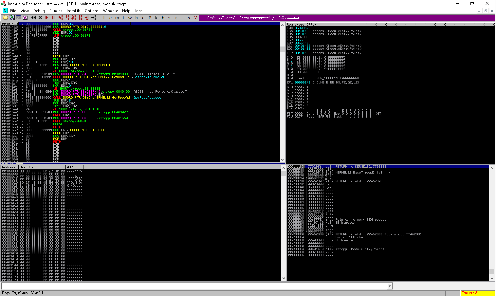
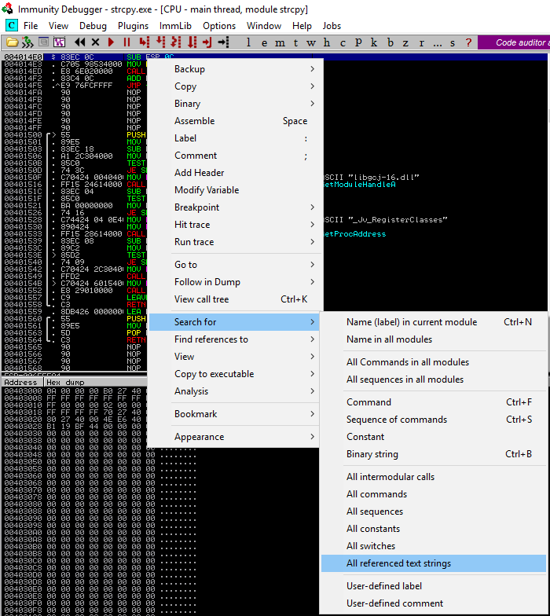
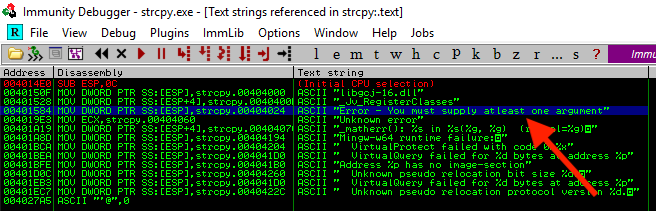
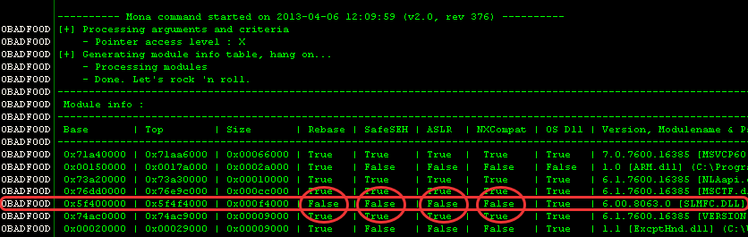
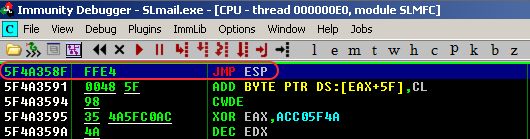
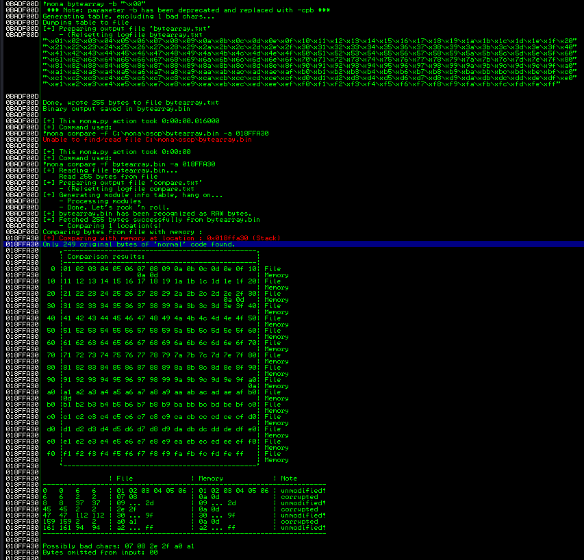
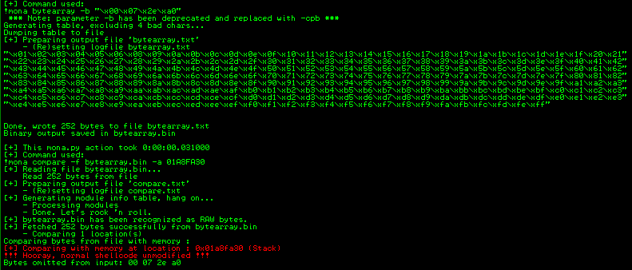

Four windows:

1. **Upper left**: shows the assembly instructions that make up the application. The instruction highlighted in blue is the assembly instruction to be executed next.
2. **Upper right**: contains all the registers
3. **Lower right**: shows the stack and its content which are divided in four columns: a memory address, the hex data residing at that address, an ASCII representation of the data, and a dynamic commentary.
4. **Lower left**: shows the contents of memory at any given address. The structure is similar to the lower right one.

### Search for referenced text strings





## Shortcut

| Command | Shortcut |
| --- | --- |
| Step into | F7 |
| Step over | F8 |
| Set Breakpoint | F2 |
| Run | F9 |
| Run to the end of the function | CTRL + F9 |
| CTRL + B | Find ASCII/HEX values within the memory |
| CTRL + G | Go to a specific memory value |

---

## Mona Script

It s a 3rd part script of ImmunityDBG. It integrates useful [module](https://www.corelan.be/index.php/2011/07/14/mona-py-the-manual/) into the debugger.

### Inspect all the loaded modules

`!mona modules` = show all available modules



It is necessary to take into account the protections implemented in the various modules and the presence of bad-chars in the memory locations where they are loaded.

### Find op-code within modules

Mona provides a fast way to search some specific op-code within the loaded modules. [Metasploit tools](Metasploit%20tools.md) > [NASM Shell](Metasploit%20tools.md) can be used to convert Assembly instruction into op-code, in the same way also `rasm2` can do the same thing as `nasm`.

```
┌──(kali㉿kali)-[~]
└─$ rasm2 -d FFE4
jmp esp

┌──(kali㉿kali)-[~]
└─$ rasm2 -a x86 -b 32 'mov eax, 33'
ffe4

┌──(kali㉿kali)-[~]
└─$ msf-nasm_shell
nasm > jmp esp
00000000  FFE4              jmp esp

```

`!mona find -s "\xff\xe4" -m slmfc.dll`
  




### Global options

`-cm aslr=true,rebase=true,safeseh=false`: apply filters on the following criteria: aslr, rebase, safeseh, nx, os
`-x`: allows you to set the desired access level of the resulting pointers (\*, R, RW, RX, RWX, W, WX, X)
`-cpb '\x00\x0a\x0d'`: allows you to specify bad characters for pointers. This feature will basically skip pointers that contain any of the bad chars specified at the command line.

### Compares bad-chars

Using the `!mona bytearray -b "\x00"` to create an array of bad-chars and then comparing this array with the contents of the stack, though the `!mona compare -f bytearray.bin -a <address>` command.



