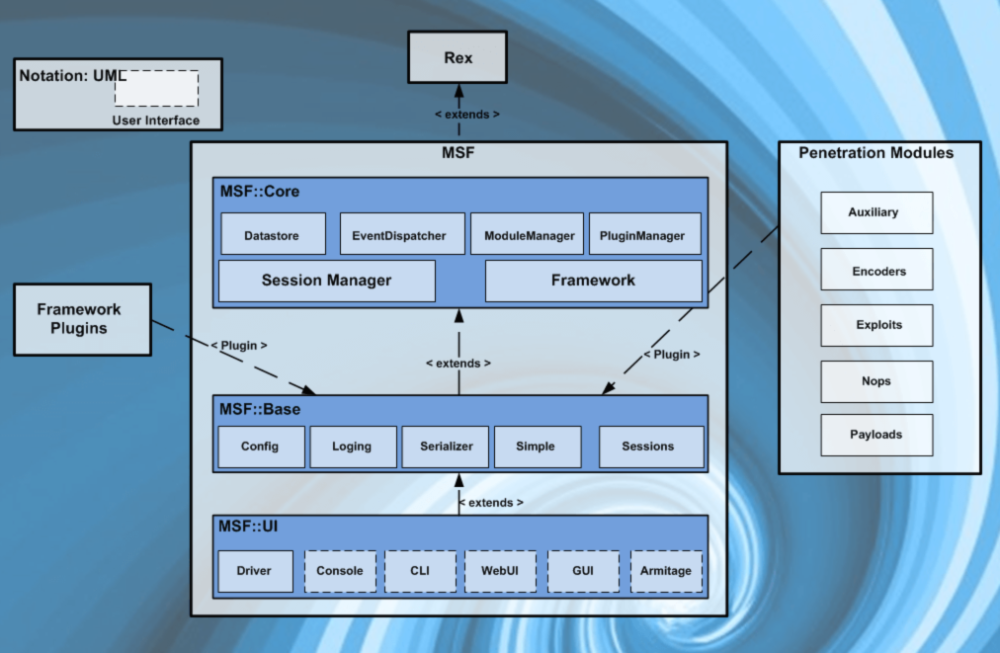

### Architecture of Metasploit

| Library name | Usage |
| --- | --- |
| REX | Manages core functionality (socket, connections, formatting and other raw functionalities) |
| MSF CORE | Provides the API and the framework core |
| MSF BASE | Provides API support for modules |

MSF works with **modules**. Every single modules has a different functionality. There are 5 categories of modules, each one has a different scope.

| Module type | Working |
| --- | --- |
| Payloads | Are used to carry out operations after the exploiting phase. Payloads are executed after the exploit |
| Auxilliary | Performs specific tasks such as scanning, enumeration, fingerprinting ecc. |
| Encoders | Encode payload intending to evade antivirus solution or firewalls |
| NOPs | NOP generators for exploit development |
| Exploits | Actual code that triggers a vulnerability |

### MSF components

- [msfconsole](msfconsole.md)
- [msfvenom](msfvenom.md)
- [Metasploit tools](Metasploit%20tools.md)