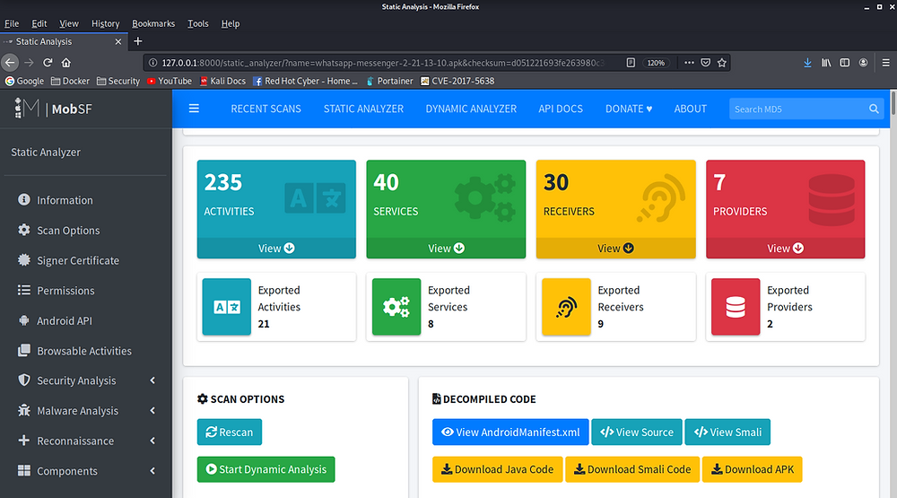

>[!summary]
>Mobile Security Framework (MobSF) is an automated, all-in-one mobile application (Android/iOS/Windows) pen-testing, malware analysis and security assessment framework capable of performing static and dynamic analysis. MobSF support mobile app binaries (APK, XAPK, IPA & APPX) along with zipped source code and provides REST APIs for seamless integration with your CI/CD or DevSecOps pipeline. The Dynamic Analyzer helps you to perform runtime security assessment and interactive instrumented testing.
>
>[Mobile Security Framework - MobSF Documentation](https://mobsf.github.io/docs/#/)

