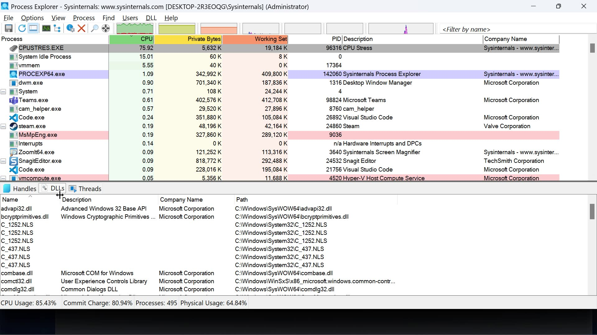

## Process Monitor (procmon.exe)

>[!abstract]
>Process Monitor is an invaluable tool when our goal is to understand how a specific process interacts with the file system and the Windows registry. It’s an excellent tool for identifying flaws such as Registry hijacking, DLL hijacking, and more.


## sigcheck

>[!abstract]
>Allows to inspect the application manifest of every application.

```xml
C:\> cd C:\Tools\privilege_escalation\SysinternalsSuite
C:\Tools\privilege_escalation\SysinternalsSuite> sigcheck.exe -a -m
C:\Windows\System32\fodhelper.exe
c:\windows\system32\fodhelper.exe:
Verified: Signed
Signing date: 4:40 AM 9/29/2017
Publisher: Microsoft Windows
Company: Microsoft Corporation
Description: Features On Demand Helper
Product: Microsoft« Windows« Operating System
Prod version: 10.0.16299.15
File version: 10.0.16299.15 (WinBuild.160101.0800)
MachineType: 32-bit
Binary Version: 10.0.16299.15
Original Name: FodHelper.EXE
Internal Name: FodHelper
Copyright: ® Microsoft Corporation. All rights reserved.
Comments: n/a
Entropy: 6.306
Manifest:
<?xml version="1.0" encoding="UTF-8" standalone="yes"?>
<!-- Copyright (c) Microsoft Corporation -->
<assembly
xmlns="urn:schemas-microsoft-com:asm.v1"
xmlns:asmv3="urn:schemas-microsoft-com:asm.v3"
manifestVersion="1.0">
<assemblyIdentity type="win32" publicKeyToken="6595b64144ccf1df"
name="Microsoft.Windows.FodHelper" version="5.1.0.0"
processorArchitecture="x86"/>
<description>Features On Demand Helper UI</description>
<trustInfo xmlns="urn:schemas-microsoft-com:asm.v3">
<security>
<requestedPrivileges>
<requestedExecutionLevel
level="requireAdministrator"
/>
</requestedPrivileges>
</security>
</trustInfo>
<asmv3:application>
<asmv3:windowsSettings
xmlns="http://schemas.microsoft.com/SMI/2005/WindowsSettings">
<dpiAware>true</dpiAware>
<autoElevate>true</autoElevate>
</asmv3:windowsSettings>
</asmv3:application>
</assembly>
```

## AccessChk

>[!abstract]
>Enumerates permissions dor directories and files

```powershell
c:\Tools\privilege_escalation\SysinternalsSuite>accesschk.exe -uws "Everyone" "C:\Program Files"
Accesschk v6.12 - Reports effective permissions for securable objects
Copyright (C) 2006-2017 Mark Russinovich
Sysinternals - www.sysinternals.com
RW C:\Program Files\TestApplication\testapp.exe
...
```

## PsExec

>[!abstract]
>Execute processes on remote systems.

```powershell
PS C:\Tools\active_directory> .\PsExec.exe \\dc01 cmd.exe
PsExec v2.2 - Execute processes remotely
Copyright (C) 2001-2016 Mark Russinovich
Sysinternals - www.sysinternals.com

C:\Windows\system32> ipconfig
Windows IP Configuration
Ethernet adapter Ethernet0:
Connection-specific DNS Suffix . :
Link-local IPv6 Address . . . . . : fe80::7959:aaad:eec:3969%2
IPv4 Address. . . . . . . . . . . : 192.168.1.110
Subnet Mask . . . . . . . . . . . : 255.255.255.0
Default Gateway . . . . . . . . . : 192.168.1.1
...
```

## AutoRuns

>[!abstract]
>Enumerate all autoruns in registry


## Process Explorer

>[!abstract]
>_Process Explorer_ shows you information about which handles and DLLs processes have opened or loaded.

