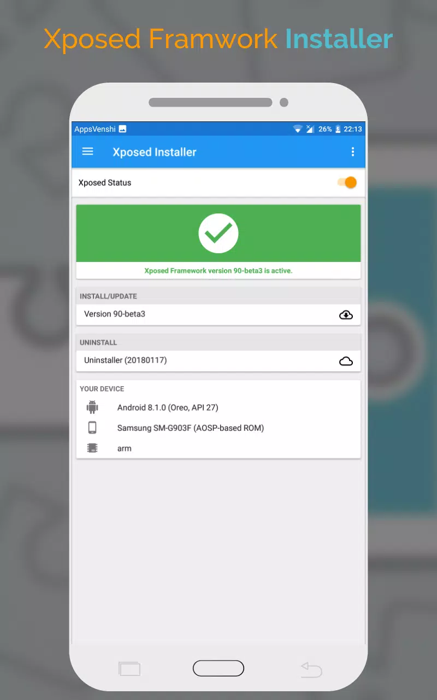

>[!summary]
>Xposed is a framework for modules that can change the behavior of the system and apps without touching any APKs. That's great because it means that modules can work for different versions and even ROMs without any changes (as long as the original code was not changed too much). It's also easy to undo. As all changes are done in the memory, you just need to deactivate the module and reboot to get your original system back. There are many other advantages, but here is just one more: Multiple modules can do changes to the same part of the system or app. With modified APKs, you to decide for one. No way to combine them, unless the author builds multiple APKs with different combinations.

## Modules

### Inspeckage

- [GitHub](https://github.com/ac-pm/Inspeckage)
- [Xposed store](https://repo.xposed.info/module/mobi.acpm.inspeckage)
 
>[!abstract]
>Android Package Inspector - dynamic analysis with api hooks, start un-exported activities and more.

Through the hooks applied to some functions of Android API, we can better understand what an Android application is doing at runtime. Inspeckage will let you interact with some elements of the app, such as activities and providers (even un-exported ones), and apply some settings on Android. How it works? It is a simply application with an internal HTTP server providing a friendly web interface.

### TrustMeAlready

- [GitHub](https://github.com/ViRb3/TrustMeAlready)
- [Xposed store](https://repo.xposed.info/module/com.virb3.trustmealready)

>[!abstract]
>An Xposed module to disable SSL verification and pinning on Android using the excellent technique provided by Mattia Vinci. The effect is system-wide. Useful for various security audits.

### SSLUnpinning - Certificate Pinning Bypass

- [GitHub](https://github.com/ac-pm/SSLUnpinning_Xposed)
- [Xposed store](https://repo.xposed.info/module/mobi.acpm.sslunpinning)

>[!abstract]
>The SSLUnpinning through Xposed Framework, makes several hooks in SSL classes to bypass the certificate verifications for one specific app, then you can intercept all your traffic.

If you need to intercept the traffic from an app which uses certificate pinning, with a tool like Burp Proxy, the SSLUnpinning will help you with this hard work!
