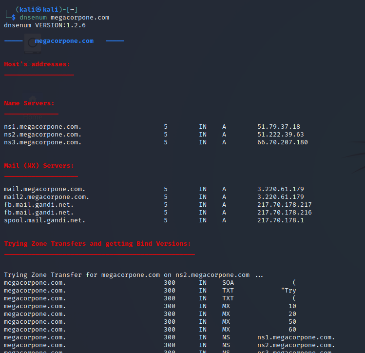

```
┌──(kali㉿kali)-[~]
└─$ dnsenum 
dnsenum VERSION:1.2.6
Usage: dnsenum [Options] <domain>
[Options]:
Note: If no -f tag supplied will default to /usr/share/dnsenum/dns.txt or
the dns.txt file in the same directory as dnsenum.pl
GENERAL OPTIONS:
  --dnsserver   <server>
                        Use this DNS server for A, NS and MX queries.
  --enum                Shortcut option equivalent to --threads 5 -s 15 -w.
  -h, --help            Print this help message.
  --noreverse           Skip the reverse lookup operations.
  --nocolor             Disable ANSIColor output.
  --private             Show and save private ips at the end of the file domain_ips.txt.
  --subfile <file>      Write all valid subdomains to this file.
  -t, --timeout <value> The tcp and udp timeout values in seconds (default: 10s).
  --threads <value>     The number of threads that will perform different queries.
  -v, --verbose         Be verbose: show all the progress and all the error messages.
GOOGLE SCRAPING OPTIONS:
  -p, --pages <value>   The number of google search pages to process when scraping names,
                        the default is 5 pages, the -s switch must be specified.
  -s, --scrap <value>   The maximum number of subdomains that will be scraped from Google (default 15).
BRUTE FORCE OPTIONS:
  -f, --file <file>     Read subdomains from this file to perform brute force. (Takes priority over default dns.txt)
  -u, --update  <a|g|r|z>
                        Update the file specified with the -f switch with valid subdomains.
        a (all)         Update using all results.
        g               Update using only google scraping results.
        r               Update using only reverse lookup results.
        z               Update using only zonetransfer results.
  -r, --recursion       Recursion on subdomains, brute force all discovered subdomains that have an NS record.
WHOIS NETRANGE OPTIONS:
  -d, --delay <value>   The maximum value of seconds to wait between whois queries, the value is defined randomly, default: 3s.
  -w, --whois           Perform the whois queries on c class network ranges.
                         **Warning**: this can generate very large netranges and it will take lot of time to perform reverse lookups.
REVERSE LOOKUP OPTIONS:
  -e, --exclude <regexp>
                        Exclude PTR records that match the regexp expression from reverse lookup results, useful on invalid hostnames.
OUTPUT OPTIONS:
  -o --output <file>    Output in XML format. Can be imported in MagicTree (www.gremwell.com)
```

### DNS Zone Transfer

