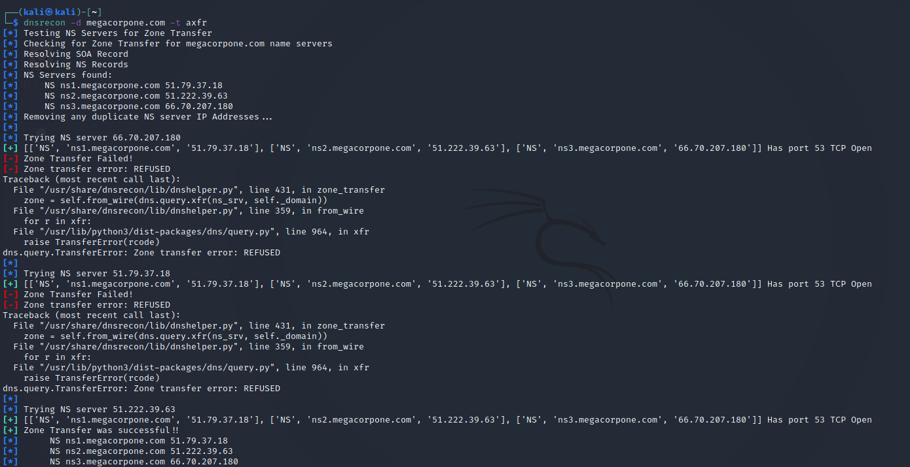

```bash
┌──(kali㉿kali)-[~]
└─$ dnsrecon                
usage: dnsrecon.py [-h] -d DOMAIN [-n NS_SERVER] [-r RANGE] [-D DICTIONARY] [-f] [-a] [-s] [-b] [-y] [-k] [-w] [-z] [--threads THREADS] [--lifetime LIFETIME] [--tcp] [--db DB] [-x XML] [-c CSV] [-j JSON]
                   [--iw] [--disable_check_recursion] [--disable_check_bindversion] [-v] [-t TYPE]
dnsrecon.py: error: the following arguments are required: -d/--domain
```

### DNS Zone Transfers:

```bash
kali@kali:~$ dnsrecon -d megacorpone.com -t axfr
```



### DNS Brute Force Lookup

```bash
kali@kali:~$ dnsrecon -d megacorpone.com -D ~/list.txt -t brt
[*] Performing host and subdomain brute force against megacorpone.com
[*] A router.megacorpone.com 38.100.193.71
[*] A www.megacorpone.com 38.100.193.76
[*] A mail.megacorpone.com 38.100.193.84
[+] 3 Records Found
```