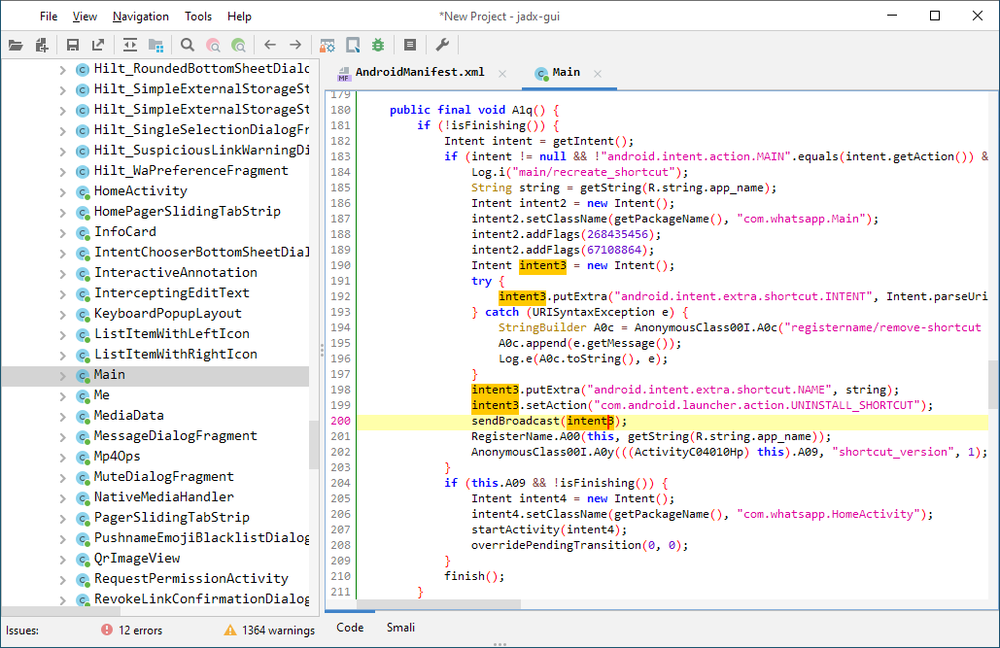

# jadx

```bash
$ jadx[-gui] [options] <input files> (.apk, .dex, .jar, .class, .smali, .zip, .aar, .arsc, .aab)
options:
  -d, --output-dir                    - output directory
  -ds, --output-dir-src               - output directory for sources
  -dr, --output-dir-res               - output directory for resources
  -r, --no-res                        - do not decode resources
  -s, --no-src                        - do not decompile source code
  --single-class                      - decompile a single class, full name, raw or alias
  --single-class-output               - file or dir for write if decompile a single class
  --output-format                     - can be 'java' or 'json', default: java
  -e, --export-gradle                 - save as android gradle project
  -j, --threads-count                 - processing threads count, default: 4
  --show-bad-code                     - show inconsistent code (incorrectly decompiled)
  --no-imports                        - disable use of imports, always write entire package name
  --no-debug-info                     - disable debug info
  --add-debug-lines                   - add comments with debug line numbers if available
  --no-inline-anonymous               - disable anonymous classes inline
  --no-inline-methods                 - disable methods inline
  --no-replace-consts                 - don't replace constant value with matching constant field
  --escape-unicode                    - escape non latin characters in strings (with \u)
  --respect-bytecode-access-modifiers - don't change original access modifiers
  --deobf                             - activate deobfuscation
  --deobf-min                         - min length of name, renamed if shorter, default: 3
  --deobf-max                         - max length of name, renamed if longer, default: 64
  --deobf-cfg-file                    - deobfuscation map file, default: same dir and name as input file with '.jobf' extension
  --deobf-cfg-file-mode               - set mode for handle deobfuscation map file:
                                         'read' - read if found, don't save (default)
                                         'read-or-save' - read if found, save otherwise (don't overwrite)
                                         'overwrite' - don't read, always save
                                         'ignore' - don't read and don't save
  --deobf-rewrite-cfg                 - set '--deobf-cfg-file-mode' to 'overwrite' (deprecated)
  --deobf-use-sourcename              - use source file name as class name alias
  --deobf-parse-kotlin-metadata       - parse kotlin metadata to class and package names
  --use-kotlin-methods-for-var-names  - use kotlin intrinsic methods to rename variables, values: disable, apply, apply-and-hide, default: apply
  --rename-flags                      - fix options (comma-separated list of):
                                         'case' - fix case sensitivity issues (according to --fs-case-sensitive option),
                                         'valid' - rename java identifiers to make them valid,
                                         'printable' - remove non-printable chars from identifiers,
                                        or single 'none' - to disable all renames
                                        or single 'all' - to enable all (default)
  --fs-case-sensitive                 - treat filesystem as case sensitive, false by default
  --cfg                               - save methods control flow graph to dot file
  --raw-cfg                           - save methods control flow graph (use raw instructions)
  -f, --fallback                      - make simple dump (using goto instead of 'if', 'for', etc)
  --use-dx                            - use dx/d8 to convert java bytecode
  --comments-level                    - set code comments level, values: error, warn, info, debug, user-only, none, default: info
  --log-level                         - set log level, values: quiet, progress, error, warn, info, debug, default: progress
  -v, --verbose                       - verbose output (set --log-level to DEBUG)
  -q, --quiet                         - turn off output (set --log-level to QUIET)
  --version                           - print jadx version
  -h, --help                          - print this help

Plugin options (-P<name>=<value>):
  1) dex-input (Load .dex and .apk files)
    -Pdex-input.verify-checksum       - Verify dex file checksum before load, values: [yes, no], default: yes

Examples:
  jadx -d out classes.dex
  jadx --rename-flags "none" classes.dex
  jadx --rename-flags "valid, printable" classes.dex
  jadx --log-level ERROR app.apk
  jadx -Pdex-input.verify-checksum=no app.apk
```

# jadx-gui

